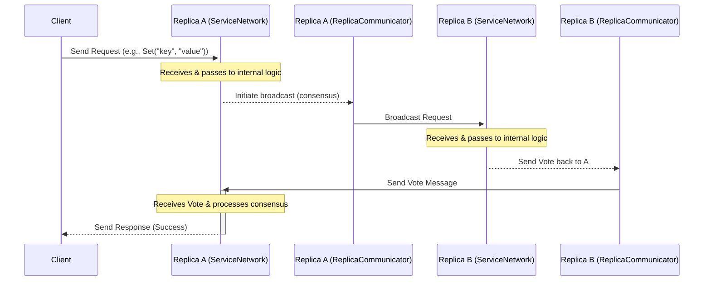

# Chapter 2: Network Communication

In [Chapter 1: Client Interaction](01_client_interaction.md), we learned how you, as a user or application, can talk to ResilientDB using special "Client" tools. You package your request (like storing data) and send it off using something like `KVClient`.

But where does that request _go_? And how do the different computers (replicas) that make up the ResilientDB network talk to _each other_ to process your request and agree on the result?

Welcome to Chapter 2! Here, we'll explore the **Network Communication** layer. This is the backbone that allows all the different parts of ResilientDB to connect and exchange messages.

Think of it like the **postal service and telephone network** combined for ResilientDB:

- **Postal Service:** It needs to reliably send letters (messages like transaction proposals or votes) to the correct addresses (other replicas).
- **Telephone Network:** It needs a way to receive incoming calls (client requests or messages from other replicas) so the system can answer them.

This chapter focuses on two key components:

1.  `ReplicaCommunicator`: Handles sending messages _between_ the ResilientDB replicas. (The Postal Service)
2.  `ServiceNetwork`: Handles listening for and receiving _incoming_ messages, both from clients and other replicas. (The Telephone Network Operator)

## Why is Network Communication Important?

ResilientDB is a _distributed_ system. This means it doesn't run on just one computer. Instead, a team of computers (replicas) work together. To work together, they _must_ communicate constantly over the network.

Imagine you and your friends are trying to decide on a movie to watch tonight.

- You send a message proposing "Let's watch SciFi Movie X!" (like a client sending a transaction).
- Your friends need to receive this message.
- They discuss amongst themselves, sending messages back and forth like "I vote yes for SciFi Movie X!" or "How about Comedy Movie Y?" (like replicas exchanging votes for consensus).
- Eventually, enough friends agree, and someone sends a final message: "Okay, SciFi Movie X it is!" (like a replica sending a response back to the client).

Without a reliable way to send and receive these messages, the group could never agree! ResilientDB needs its own robust communication system for the replicas to coordinate.

## Sending Messages Between Replicas: `ReplicaCommunicator`

The `ReplicaCommunicator` is responsible for sending messages _from_ one replica _to_ other replicas in the network. It's like the postal service handling outgoing mail.

**Key Jobs:**

1.  **Knowing Addresses:** It knows the network addresses (IP and port) of all the other replicas it needs to talk to, based on the system configuration ([ResilientDB Configuration (ResDBConfig)](08_resilientdb_configuration__resdbconfig_.md)).
2.  **Sending Methods:** It provides ways to send messages:
    - **Broadcast:** Send the same message to _all_ other replicas (like sending a party invitation to everyone).
    - **Targeted Send:** Send a message to one _specific_ replica (like sending a private note).
3.  **Reliability (Under the Hood):** It often uses lower-level tools (like `NetChannel` or `AsyncReplicaClient`) to handle the actual network sending, potentially retrying if a message fails to send initially.
4.  **Batching (Optional):** For efficiency, it might collect several small messages going to the same destination and send them together in one larger "package" (`BatchQueue`).

**Analogy:** `ReplicaCommunicator` is the mailroom clerk. You give the clerk a letter (message) and tell them who it's for (one replica or everyone). The clerk figures out the addresses and makes sure the letters get sent out.

**Simplified Usage Example (Conceptual):**

Imagine Replica A needs to tell all other replicas about a new transaction proposal.

```cpp
// Inside Replica A's code (conceptual)
#include "platform/networkstrate/replica_communicator.h"
#include "platform/proto/resdb.pb.h" // Contains message definitions like 'Request'

// Assume 'replica_communicator' is already set up with network info
// Assume 'my_transaction_proposal' is a 'Request' message object

// Broadcast the proposal to all other replicas
replica_communicator->BroadCast(my_transaction_proposal);

// Or, send a specific message just to Replica B (identified by node_id 2)
// Assume 'private_message' is another 'Request' object
replica_communicator->SendMessage(private_message, /* node_id = */ 2);
```

This code shows how simple it is _to use_ the `ReplicaCommunicator`. You create your message (`my_transaction_proposal` or `private_message`) and call either `BroadCast` or `SendMessage`. The communicator handles the rest!

## Listening for Incoming Messages: `ServiceNetwork`

While `ReplicaCommunicator` handles _sending_ messages, `ServiceNetwork` handles _receiving_ them. Each replica runs a `ServiceNetwork` instance that acts like its ear to the world (or network, in this case!).

**Key Jobs:**

1.  **Listening:** It opens a network "port" (like a specific phone number) and listens for incoming network connections.
2.  **Accepting Connections:** When a client or another replica tries to connect and send a message, `ServiceNetwork` accepts the connection.
3.  **Receiving Data:** It reads the incoming message data from the network connection.
4.  **Passing the Message:** Once a complete message is received, it doesn't process the message itself. Instead, it passes the message off to the appropriate internal component (represented by `ServiceInterface`) for actual processing. This processing might involve adding the transaction to a queue ([Message/Transaction Collection (TransactionCollector / MessageManager)](04_message_transaction_collection__transactioncollector___messagemanager_.md)) or handling a consensus vote ([Consensus Management (ConsensusManager)](03_consensus_management__consensusmanager_.md)).

**Analogy:** `ServiceNetwork` is like the central telephone operator for a company (a ResilientDB replica).

- It listens for the phone ringing (incoming network connections).
- It answers the call (accepts the connection).
- It takes the message ("Please connect me to Sales," or the actual transaction data).
- It transfers the call or message to the correct department (`ServiceInterface`).

**Simplified Setup Example:**

Setting up the `ServiceNetwork` usually happens when a ResilientDB replica starts.

```cpp
// Simplified from platform/networkstrate/service_network.cpp
#include "platform/networkstrate/service_network.h"
#include "platform/config/resdb_config.h" // For configuration
#include "platform/networkstrate/service_interface.h" // Interface for processing

// Assume 'config' holds this replica's network info (IP, port)
// Assume 'my_service_handler' is an object implementing ServiceInterface
// (This object knows what to *do* with received messages)
std::unique_ptr<resdb::ServiceInterface> my_service_handler = ...;

// Create the ServiceNetwork
resdb::ServiceNetwork service_network(config, std::move(my_service_handler));

// Start listening in the background
service_network.Run(); // This starts the listening process
```

This code creates the `ServiceNetwork`, telling it _where_ to listen (`config`) and _who_ to pass messages to (`my_service_handler`). Calling `Run()` starts the listening loop.

## How They Work Together: A Simple Flow

Let's trace a _very_ simplified path of a client request:

1.  **Client Sends:** You use `KVClient` (from Chapter 1) to send a `Set("mykey", "myvalue")` request. The client library sends this message over the network to one of the ResilientDB replicas (let's say Replica A).
2.  **Replica A Receives:** Replica A's `ServiceNetwork` is listening. It receives the incoming connection and the `Set` request message.
3.  **Replica A Passes Message:** `ServiceNetwork` passes the `Set` request to its internal `ServiceInterface`. This might trigger the consensus process.
4.  **Replica A Broadcasts:** To get agreement, Replica A's consensus logic uses `ReplicaCommunicator` to _broadcast_ the `Set` request (or a proposal based on it) to Replica B and Replica C.
5.  **Replicas B & C Receive:** The `ServiceNetwork` on Replica B and Replica C receive the broadcasted message from Replica A.
6.  **Replicas B & C Process:** They pass the message to their own `ServiceInterface` handlers to process (e.g., validate the request, prepare to vote).
7.  **Replicas B & C Send Votes:** Replicas B and C use their `ReplicaCommunicator` to send "vote" messages back to Replica A (and possibly others).
8.  **Replica A Receives Votes:** Replica A's `ServiceNetwork` receives the incoming vote messages.
9.  **Replica A Finalizes:** The votes are passed internally. Once enough votes arrive, Replica A knows the request is agreed upon. It might then execute the command ([Transaction Execution (TransactionManager / TransactionExecutor)](05_transaction_execution__transactionmanager___transactionexecutor_.md)) and store the data ([Storage Layer (Storage / LevelDB / MemoryDB)](06_storage_layer__storage___leveldb___memorydb_.md)).
10. **Replica A Responds to Client:** Finally, Replica A might use its network connection (managed potentially via `NetChannel` originating from the initial `ServiceNetwork` interaction) to send a "Success" response back to the original client.



This diagram simplifies heavily, but it shows the interplay: `ServiceNetwork` receives, `ReplicaCommunicator` sends between replicas.

## Under the Hood: Code Glimpses

Let's peek at some simplified code structures.

**1. `ReplicaCommunicator` Sending a Message:**

The `ReplicaCommunicator` might use a helper class like `NetChannel` (which we saw briefly in Chapter 1) or a dedicated `AsyncReplicaClient` to talk to a specific replica.

```cpp
// Simplified from platform/networkstrate/replica_communicator.cpp

// Method to send a message to a list of specific replicas
int ReplicaCommunicator::SendMessageInternal(
    const google::protobuf::Message& message,
    const std::vector<ReplicaInfo>& replicas) {

  int success_count = 0;
  for (const auto& replica : replicas) {
    // Get a network channel/client for the target replica's IP and port
    // This might create a temporary connection or use a persistent one.
    std::unique_ptr<NetChannel> client = GetClient(replica.ip(), replica.port());
    if (client == nullptr) {
      LOG(WARNING) << "Could not create client for " << replica.ip();
      continue;
    }

    // Optionally add a digital signature if configured
    if (verifier_ != nullptr) {
      client->SetSignatureVerifier(verifier_);
    }

    // Use the client/channel to send the message (already formatted)
    if (client->SendRawMessage(message) == 0) { // 0 means success
      success_count++;
    } else {
      LOG(ERROR) << "Failed to send message to " << replica.ip();
    }
    // The client/channel might be closed here if not using long connections
  }
  return success_count;
}
```

This shows `ReplicaCommunicator` iterating through target replicas, getting a communication channel (`NetChannel`) for each, and using that channel's `SendRawMessage` method.

**2. `ServiceNetwork` Receiving a Message:**

`ServiceNetwork` often uses an underlying "Acceptor" component (`Acceptor` or `AsyncAcceptor`) to handle the low-level network listening and connection acceptance.

- **`Acceptor` (Simpler, Blocking Style):** Listens for a connection, accepts it, reads one message, and puts the message (and the connection socket if a reply is needed) onto a queue (`input_queue_`).

```cpp
// Simplified concept from platform/rdbc/acceptor.cpp

void Acceptor::Run() {
  LOG(INFO) << "Acceptor starting...";
  while (IsRunning()) {
    // 1. Wait for and accept a new incoming connection
    // 'socket_' is the main listening socket
    auto client_socket = socket_->Accept();
    if (client_socket == nullptr) {
      continue; // No connection yet, or error
    }

    // 2. Read the data (message) from the connected client
    std::unique_ptr<DataInfo> request_info = std::make_unique<DataInfo>();
    int ret = client_socket->Recv(&request_info->buff, &request_info->data_len);
    if (ret <= 0) {
       // Error reading or client disconnected
       client_socket->Close();
       continue;
    }

    // 3. Package the client socket and the received data
    std::unique_ptr<QueueItem> item = std::make_unique<QueueItem>();
    item->socket = std::move(client_socket); // Keep socket for potential reply
    item->data = std::move(request_info);

    // 4. Push the item onto the input queue for ServiceNetwork's workers
    input_queue_->Push(std::move(item));
  }
}
```

- **`ServiceNetwork` Processing from Queue:** Worker threads in `ServiceNetwork` then pick items from this queue.

```cpp
// Simplified concept from platform/networkstrate/service_network.cpp

void ServiceNetwork::InputProcess() {
  LOG(INFO) << "ServiceNetwork worker starting...";
  while (IsRunning()) {
    // 1. Wait for and pop an item from the input queue
    // (This item was put there by the Acceptor)
    std::unique_ptr<QueueItem> item = input_queue_->Pop(1000); // Wait up to 1s
    if (item == nullptr) {
      continue; // No message received in the timeout period
    }

    // 2. Extract the socket and data
    auto client_socket = (item->socket == nullptr) ? nullptr : std::move(item->socket);
    auto request_data = std::move(item->data);

    // 3. Create a context (includes the client connection info)
    std::unique_ptr<Context> context = std::make_unique<Context>();
    if(client_socket != nullptr) {
       // Wrap the socket in a NetChannel for potential replies
       context->client = std::make_unique<NetChannel>(std::move(client_socket), true);
    }

    // 4. Pass the context and the received data to the actual service logic
    if (request_data) {
       // 'service_' is the ServiceInterface implementation provided during setup
       service_->Process(std::move(context), std::move(request_data));
    }
  }
}
```

This shows the hand-off: `Acceptor` receives raw data and puts it on a queue. `ServiceNetwork`'s worker threads take items from the queue and pass them to the `service_` object (which implements `ServiceInterface`) for actual application-level processing.

- **`AsyncAcceptor` (More Complex, Non-Blocking):** Uses asynchronous I/O (like Boost.Asio) to handle many connections concurrently without blocking threads per connection. When data arrives, it calls a callback function (`AcceptorHandler` in `ServiceNetwork`) which then usually puts the data onto the `input_queue_`. The end result for `InputProcess` is similar.

## Conclusion

You've now seen the vital communication layer of ResilientDB!

- We learned that `ReplicaCommunicator` acts like the **postal service**, responsible for _sending_ messages (like proposals and votes) between the different replica computers. It knows the addresses and can broadcast or send targeted messages.
- We saw that `ServiceNetwork` acts like the **telephone network operator**, responsible for _listening_ for and _receiving_ incoming messages, whether from clients or other replicas. It passes these messages on for processing.
- These two components work together, using lower-level network tools, to allow the distributed replicas of ResilientDB to coordinate effectively.

So, the replicas can now send and receive messages reliably. But what exactly are they saying to each other? How do they use these messages to _agree_ on the order of transactions and the state of the database? That's the magic of **consensus**, and it's the topic of our next chapter!

**Next:** [Chapter 3: Consensus Management](03_consensus_management)

---

Generated by [AI Codebase Knowledge Builder](https://github.com/The-Pocket/Tutorial-Codebase-Knowledge)
