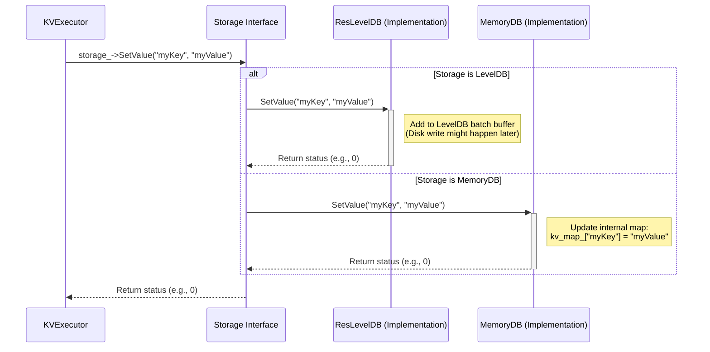

# Chapter 6: Storage Layer

In the previous chapter, [Chapter 5: Transaction Execution](05_transaction_execution.md), we saw how ResilientDB takes agreed-upon transactions and executes them using specialists like `KVExecutor` or `UTXOExecutor`. For example, the `KVExecutor` handles a command like `Set("myKey", "myValue")`.

But where does that `myValue` actually get stored so that it isn't lost when the computer restarts? And how can we retrieve it later using `Get("myKey")`?

Welcome to Chapter 6! We're diving into the **Storage Layer**. This is the component that handles the actual saving and loading of data – the blockchain state and transaction history.

Think of the Storage Layer as the **filing cabinet or hard drive** of ResilientDB. After the committee ([Chapter 3](03_consensus_management__consensusmanager_.md)) agrees on a decision and the specialist ([Chapter 5](05_transaction_execution__transactionmanager___transactionexecutor_.md)) knows _what_ change to make, the Storage Layer is responsible for actually _writing it down_ and putting it in the right place.

## Why Do We Need a Storage Layer?

Imagine you're using ResilientDB as a super-reliable notepad. You tell it to remember "Meeting at 3 PM".

- The command gets sent ([Chapter 1](01_client_interaction__kvclient___utxoclient___contractclient___transactionconstructor_.md)), communicated ([Chapter 2](02_network_communication__replicacommunicator___servicenetwork_.md)), agreed upon ([Chapter 3](03_consensus_management__consensusmanager_.md)), collected ([Chapter 4](04_message_transaction_collection__transactioncollector___messagemanager_.md)), and the execution logic ([Chapter 5](05_transaction_execution__transactionmanager___transactionexecutor_.md)) knows it needs to store this note.
- But if the computer running ResilientDB shuts down, how does it remember "Meeting at 3 PM" when it starts back up?

We need **persistence** – the ability to save data in a way that survives restarts. This usually means writing to a hard disk drive (HDD) or solid-state drive (SSD).

However, sometimes, especially during testing or for specific high-speed scenarios, we might prioritize speed over durability. We might want to store data directly in the computer's fast memory (RAM), even if it gets lost on restart.

The Storage Layer provides an abstraction to handle both needs: reliable disk storage and fast memory storage.

## The Blueprint: The `Storage` Interface

ResilientDB defines a standard "blueprint" for how storage should work, called the `Storage` interface (defined in `chain/storage/storage.h`). This interface lists the basic operations any storage engine must support, like:

- `SetValue(key, value)`: Store a piece of data (value) associated with a name (key).
- `GetValue(key)`: Retrieve the data associated with a key.
- Other operations like getting ranges of data or handling data versions.

**Analogy:** The `Storage` interface is like the job description for a librarian. It says the librarian must be able to check books in (`SetValue`) and check books out (`GetValue`), but it doesn't specify _how_ they organize the shelves or _which_ specific building they work in.

```cpp
// Simplified view from chain/storage/storage.h

namespace resdb {

class Storage {
 public:
  Storage() = default;
  virtual ~Storage() = default; // Virtual destructor is important for interfaces

  // Store the key-value pair. Returns 0 on success.
  virtual int SetValue(const std::string& key, const std::string& value) = 0;

  // Retrieve the value for the given key. Returns empty string if not found.
  virtual std::string GetValue(const std::string& key) = 0;

  // === Other methods omitted for simplicity ===
  // virtual std::string GetAllValues() = 0;
  // virtual std::string GetRange(...) = 0;
  // virtual int SetValueWithVersion(...) = 0;
  // virtual std::pair<std::string, int> GetValueWithVersion(...) = 0;
  // virtual ... GetHistory(...) = 0;
};

} // namespace resdb
```

This code defines the basic contract. Any class that claims to be a `Storage` provider _must_ provide implementations for these `virtual` functions (indicated by `= 0`).

## The Implementations: Different Ways to Store Data

ResilientDB comes with different implementations (librarians who follow the job description) of the `Storage` interface:

1.  **`ResLevelDB` (Disk Storage):**

    - **What it is:** This uses **LevelDB**, a fast key-value storage library developed by Google that writes data to disk.
    - **Analogy:** This is like a traditional library with physical shelves. When you check in a book (`SetValue`), the librarian carefully files it on the correct shelf. It stays there even if the library closes overnight (persistence). Checking out (`GetValue`) involves finding it on the shelf.
    - **Pros:** Data is persistent (survives restarts). Well-suited for production use where durability is crucial.
    - **Cons:** Disk access is slower than memory access.

2.  **`MemoryDB` (Memory Storage):**
    - **What it is:** This stores everything directly in the computer's RAM using standard data structures like maps.
    - **Analogy:** This is like a librarian using only sticky notes on their desk. Checking in (`SetValue`) means writing on a new note and sticking it somewhere. Checking out (`GetValue`) is quick – just glance at the notes. But when the librarian goes home (program stops), the desk is cleared, and all notes are lost (non-persistent).
    - **Pros:** Very fast access because it avoids slow disk operations. Useful for testing or scenarios where data loss on restart is acceptable.
    - **Cons:** Data is lost when the program stops or restarts.

## How is Storage Used? (Example: `KVExecutor`)

Remember the `KVExecutor` from [Chapter 5](05_transaction_execution__transactionmanager___transactionexecutor_.md)? It needs to store the key-value data somewhere. When it's created, it's given an instance of a `Storage` object (which could be `ResLevelDB` or `MemoryDB` depending on the configuration).

```cpp
// Simplified from executor/kv/kv_executor.cpp

#include "executor/kv/kv_executor.h"
#include "chain/storage/storage.h" // Include the Storage interface

// Constructor - takes a Storage object
KVExecutor::KVExecutor(std::unique_ptr<Storage> storage)
    : storage_(std::move(storage)) {} // Store the passed-in storage object

// Method to handle SET command
void KVExecutor::Set(const std::string& key, const std::string& value) {
  // Call the SetValue method ON THE STORAGE OBJECT
  // We don't know or care here if it's LevelDB or MemoryDB!
  storage_->SetValue(key, value);
}

// Method to handle GET command
std::string KVExecutor::Get(const std::string& key) {
  // Call the GetValue method ON THE STORAGE OBJECT
  return storage_->GetValue(key);
}
```

The `KVExecutor` code doesn't need to know the specific _type_ of storage. It just calls the methods defined in the `Storage` interface (`storage_->SetValue`, `storage_->GetValue`). This makes the `KVExecutor` flexible – it can work with any storage backend that follows the `Storage` blueprint.

## Internal Implementation Walkthrough

Let's see what happens when `KVExecutor` calls `storage_->SetValue("myKey", "myValue")`:

1.  **`KVExecutor` Call:** The `KVExecutor` invokes the `SetValue` method on the `storage_` object it holds.
2.  **Polymorphism (Magic Dispatch):** Because `SetValue` is a `virtual` function in the `Storage` base class, the C++ runtime figures out the _actual type_ of the `storage_` object (is it `ResLevelDB` or `MemoryDB`?). It then calls the `SetValue` implementation specific to that type.
3.  **Specific Implementation Executes:**
    - **If `storage_` is `ResLevelDB`:** The `ResLevelDB::SetValue` method is called. This method will interact with the LevelDB library, preparing the data to be written to disk (often using a write batch for efficiency).
    - **If `storage_` is `MemoryDB`:** The `MemoryDB::SetValue` method is called. This method will simply update its internal in-memory map (e.g., `kv_map_["myKey"] = "myValue"`).

**Sequence Diagram:**



This diagram shows how the `KVExecutor` interacts with the abstract `Storage` interface, and how the call is routed to the correct implementation (`ResLevelDB` or `MemoryDB`).

## Diving Deeper into Code

Let's look at simplified versions of the implementations.

**`ResLevelDB` (Disk Storage):**

This class wraps the actual LevelDB library (`leveldb::DB`).

```cpp
// Simplified from chain/storage/leveldb.h and chain/storage/leveldb.cpp

#include "chain/storage/storage.h"
#include "leveldb/db.h" // Include LevelDB's header
#include "leveldb/write_batch.h"

namespace resdb {
namespace storage {

class ResLevelDB : public Storage { // Inherits from Storage interface
 public:
  ResLevelDB(/* ... path, config ... */) {
    // Open the LevelDB database file at the given path
    leveldb::Options options;
    options.create_if_missing = true;
    leveldb::Status status = leveldb::DB::Open(options, path, &db_ptr_);
    // Handle errors...
    db_ = std::unique_ptr<leveldb::DB>(db_ptr_); // Manage DB pointer
  }

  // Implement SetValue using LevelDB
  int SetValue(const std::string& key, const std::string& value) override {
    // Add the operation to a batch for efficiency
    batch_.Put(key, value);
    // Maybe write the batch to disk if it's full enough
    if (batch_.ApproximateSize() >= write_batch_size_) {
       leveldb::Status status = db_->Write(leveldb::WriteOptions(), &batch_);
       // Handle status, clear batch_ on success
       return status.ok() ? 0 : -1;
    }
    return 0; // Success (batched)
  }

  // Implement GetValue using LevelDB
  std::string GetValue(const std::string& key) override {
    std::string value;
    leveldb::Status status = db_->Get(leveldb::ReadOptions(), key, &value);
    return status.ok() ? value : ""; // Return value or empty if not found
  }

 private:
  std::unique_ptr<leveldb::DB> db_; // Pointer to the actual LevelDB object
  leveldb::WriteBatch batch_;      // Buffer for writes
  // ... other members like config ...
};

// Factory function to create a LevelDB storage instance
std::unique_ptr<Storage> NewResLevelDB(const std::string& path, ...) {
  return std::make_unique<ResLevelDB>(path, ...);
}

} // namespace storage
} // namespace resdb
```

This shows `ResLevelDB` implementing `SetValue` and `GetValue` by calling the corresponding methods on the underlying `leveldb::DB` object. It uses a `WriteBatch` to group multiple writes together before sending them to the disk, which is much more efficient.

**`MemoryDB` (Memory Storage):**

This implementation is much simpler, using standard C++ maps.

```cpp
// Simplified from chain/storage/memory_db.h and chain/storage/memory_db.cpp

#include "chain/storage/storage.h"
#include <unordered_map> // Use a hash map for key-value storage
#include <string>
#include <memory>

namespace resdb {
namespace storage {

class MemoryDB : public Storage { // Inherits from Storage interface
 public:
  MemoryDB() {} // Constructor is simple

  // Implement SetValue using an in-memory map
  int SetValue(const std::string& key, const std::string& value) override {
    // Just insert or update the key in the map
    kv_map_[key] = value;
    return 0; // Always succeeds in this simple model
  }

  // Implement GetValue using an in-memory map
  std::string GetValue(const std::string& key) override {
    auto it = kv_map_.find(key); // Search the map
    if (it != kv_map_.end()) {
      return it->second; // Found: return the value
    } else {
      return ""; // Not found: return empty string
    }
  }

 private:
  // The actual storage: a map from string keys to string values
  std::unordered_map<std::string, std::string> kv_map_;
};

// Factory function to create a MemoryDB storage instance
std::unique_ptr<Storage> NewMemoryDB() {
  return std::make_unique<MemoryDB>();
}

} // namespace storage
} // namespace resdb
```

Here, `SetValue` just assigns the value to the key in the `kv_map_`, and `GetValue` looks up the key in the map. It's fast but, crucially, `kv_map_` exists only in RAM and disappears when the program stops.

## Choosing Your Storage

So, which one should you use?

- For **production deployments** where you need your data to be safe and survive restarts, you'll almost always use `ResLevelDB`.
- For **unit testing** components like `KVExecutor`, using `MemoryDB` can make tests much faster as they don't need to read/write from the disk.
- For **performance testing** or specific applications where maximum speed is needed and persistence isn't the top priority, `MemoryDB` might be considered.

How do you tell ResilientDB which storage to use? This is typically done through configuration files, which we'll explore in [Chapter 8: ResilientDB Configuration (ResDBConfig)](08_resilientdb_configuration__resdbconfig_.md).

## Conclusion

You've now learned about the Storage Layer, the foundation where ResilientDB keeps its data!

- We saw that the Storage Layer acts as the **filing cabinet or hard drive**, responsible for saving and retrieving the blockchain state.
- The **`Storage` interface** provides a standard blueprint for storage operations (`SetValue`, `GetValue`).
- **`ResLevelDB`** is an implementation using LevelDB for **persistent disk storage** (durable but slower).
- **`MemoryDB`** is an implementation using in-memory maps for **fast, temporary storage** (quick but data lost on restart).
- Components like `KVExecutor` interact with the `Storage` interface, allowing them to work with either disk or memory storage without changing their own code.

Now that we know how data is stored, how does ResilientDB ensure that even if a replica crashes, it can recover its state correctly? How does it periodically save snapshots of its state to avoid replaying the entire transaction history from the beginning? That's where Checkpointing and Recovery come in, the topic of our next chapter!

**Next:** [Chapter 7: Checkpointing & Recovery (CheckPointManager / Recovery)](07_checkpointing___recovery__checkpointmanager___recovery_.md)

---

Generated by [AI Codebase Knowledge Builder](https://github.com/The-Pocket/Tutorial-Codebase-Knowledge)
