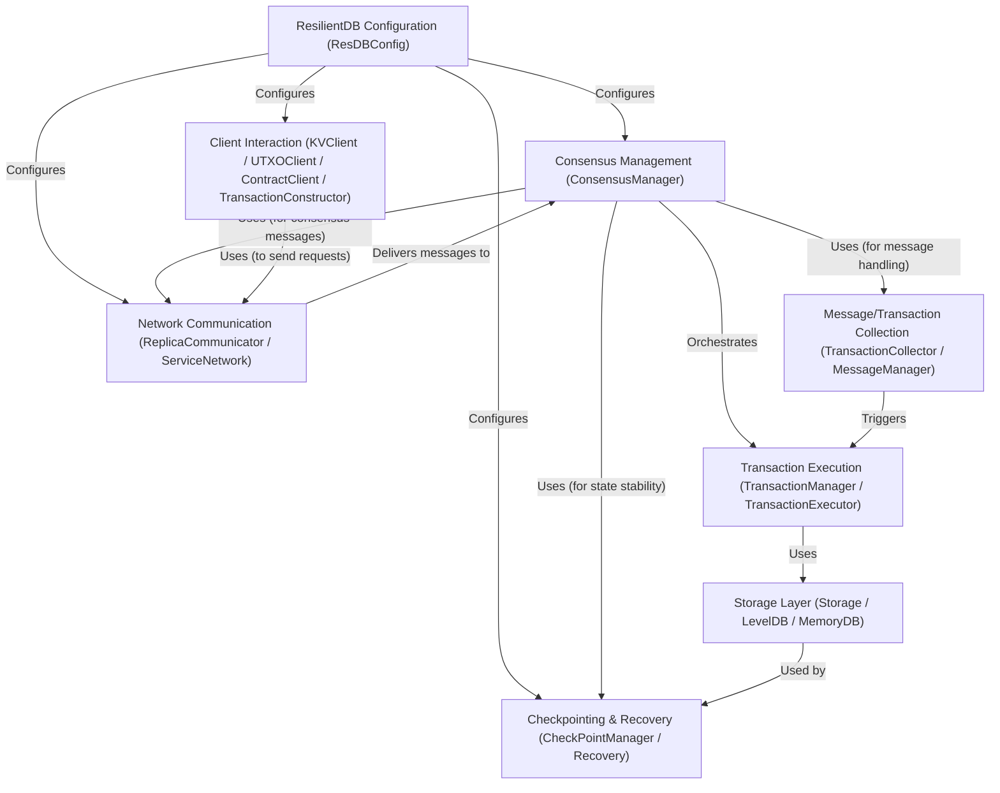

<!--
Licensed to the Apache Software Foundation (ASF) under one
or more contributor license agreements.  See the NOTICE file
distributed with this work for additional information
regarding copyright ownership.  The ASF licenses this file
to you under the Apache License, Version 2.0 (the
"License"); you may not use this file except in compliance
with the License.  You may obtain a copy of the License at

  http://www.apache.org/licenses/LICENSE-2.0

Unless required by applicable law or agreed to in writing,
software distributed under the License is distributed on an
"AS IS" BASIS, WITHOUT WARRANTIES OR CONDITIONS OF ANY
KIND, either express or implied.  See the License for the
specific language governing permissions and limitations
under the License.
-->

import { Callout } from 'nextra/components';

# Overview

ResilientDB (incubator-resilientdb) is a **fault-tolerant** distributed database system.
It uses multiple server copies (_replicas_) that communicate over a network to agree on the correct order of operations (transactions).
This agreement process, called **consensus** (often using PBFT), ensures that the database remains _consistent and available_ even if some replicas crash or behave incorrectly.
External applications interact with the database through **client libraries** to store and retrieve data reliably.

**Source Repository:** [Apache ResilientDB](https://github.com/apache/incubator-resilientdb)

## Chapters

1. [Client Interaction](resilientdb/chapters/01_client_interaction.md)
2. [Network Communication](resilientdb/chapters/02_network_communication.md)
3. [Consensus Management](resilientdb/chapters/03_consensus_management.md)
4. [Message/Transaction Collection](resilientdb/chapters/04_message_transaction_collection.md)
5. [Transaction Execution](resilientdb/chapters/05_transaction_execution.md)
6. [Storage Layer](resilientdb/chapters/06_storage_layer.md)
7. [Checkpointing & Recovery](resilientdb/chapters/07_checkpointing.md)
8. [ResilientDB Configuration](resilientdb/chapters/08_resilientdb_configuration.md)

---

Generated by [AI Codebase Knowledge Builder](https://github.com/The-Pocket/Tutorial-Codebase-Knowledge)
