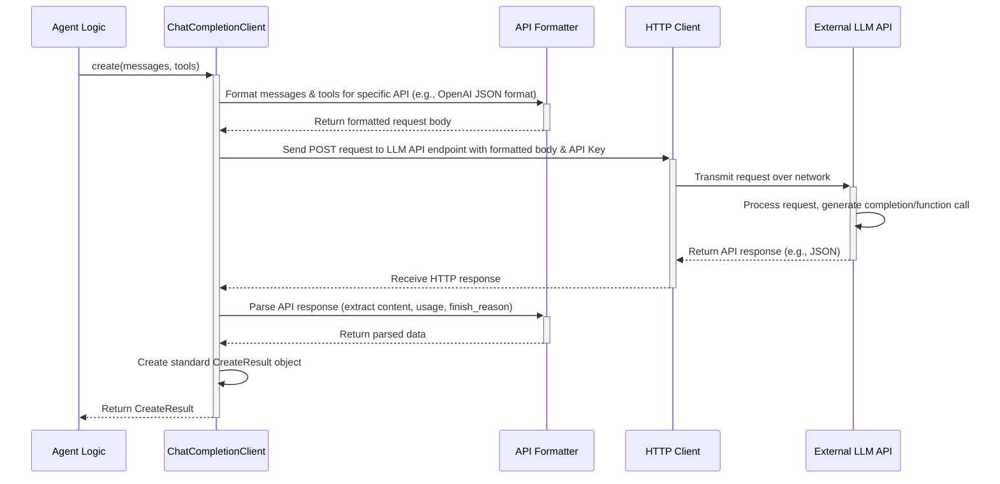

# Chapter 5: ChatCompletionClient - Talking to the Brains

So far, we've learned about:
*   [Agents](01_agent.md): The workers in our system.
*   [Messaging](02_messaging_system__topic___subscription_.md): How agents communicate broadly.
*   [AgentRuntime](03_agentruntime.md): The manager that runs the show.
*   [Tools](04_tool.md): How agents get specific skills.

But how does an agent actually *think* or *generate text*? Many powerful agents rely on Large Language Models (LLMs) – think of models like GPT-4, Claude, or Gemini – as their "brains". How does an agent in AutoGen Core communicate with these external LLM services?

This is where the **`ChatCompletionClient`** comes in. It's the dedicated component for talking to LLMs.

## Motivation: Bridging the Gap to LLMs

Imagine you want to build an agent that can summarize long articles.
1.  You give the agent an article (as a message).
2.  The agent needs to send this article to an LLM (like GPT-4).
3.  It also needs to tell the LLM: "Please summarize this."
4.  The LLM processes the request and generates a summary.
5.  The agent needs to receive this summary back from the LLM.

How does the agent handle the technical details of connecting to the LLM's specific API, formatting the request correctly, sending it over the internet, and understanding the response?

The `ChatCompletionClient` solves this! Think of it as the **standard phone line and translator** connecting your agent to the LLM service. You tell the client *what* to say (the conversation history and instructions), and it handles *how* to say it to the specific LLM and translates the LLM's reply back into a standard format.

## Key Concepts: Understanding the LLM Communicator

Let's break down the `ChatCompletionClient`:

1.  **LLM Communication Bridge:** It's the primary way AutoGen agents interact with external LLM APIs (like OpenAI, Anthropic, Google Gemini, etc.). It hides the complexity of specific API calls.

2.  **Standard Interface (`create` method):** It defines a common way to send requests and receive responses, regardless of the underlying LLM. The core method is `create`. You give it:
    *   `messages`: A list of messages representing the conversation history so far.
    *   Optional `tools`: A list of tools ([Chapter 4](04_tool.md)) the LLM might be able to use.
    *   Other parameters (like `json_output` hints, `cancellation_token`).

3.  **Messages (`LLMMessage`):** The conversation history is passed as a sequence of specific message types defined in `autogen_core.models`:
    *   `SystemMessage`: Instructions for the LLM (e.g., "You are a helpful assistant.").
    *   `UserMessage`: Input from the user or another agent (e.g., the article text).
    *   `AssistantMessage`: Previous responses from the LLM (can include text or requests to call functions/tools).
    *   `FunctionExecutionResultMessage`: The results of executing a tool/function call.

4.  **Tools (`ToolSchema`):** You can provide the schemas of available tools ([Chapter 4](04_tool.md)). The LLM might then respond not with text, but with a request to call one of these tools (`FunctionCall` inside an `AssistantMessage`).

5.  **Response (`CreateResult`):** The `create` method returns a standard `CreateResult` object containing:
    *   `content`: The LLM's generated text or a list of `FunctionCall` requests.
    *   `finish_reason`: Why the LLM stopped generating (e.g., "stop", "length", "function_calls").
    *   `usage`: How many input (`prompt_tokens`) and output (`completion_tokens`) tokens were used.
    *   `cached`: Whether the response came from a cache.

6.  **Token Tracking:** The client automatically tracks token usage (`prompt_tokens`, `completion_tokens`) for each call. You can query the total usage via methods like `total_usage()`. This is vital for monitoring costs, as most LLM APIs charge based on tokens.

## Use Case Example: Summarizing Text with an LLM

Let's build a simplified scenario where we use a `ChatCompletionClient` to ask an LLM to summarize text.

**Goal:** Send text to an LLM via a client and get a summary back.

**Step 1: Prepare the Input Messages**

We need to structure our request as a list of `LLMMessage` objects.

```python
# File: prepare_messages.py
from autogen_core.models import SystemMessage, UserMessage

# Instructions for the LLM
system_prompt = SystemMessage(
    content="You are a helpful assistant designed to summarize text concisely."
)

# The text we want to summarize
article_text = """
AutoGen is a framework that enables the development of LLM applications using multiple agents
that can converse with each other to solve tasks. AutoGen agents are customizable,
conversable, and can seamlessly allow human participation. They can operate in various modes
that employ combinations of LLMs, human inputs, and tools.
"""
user_request = UserMessage(
    content=f"Please summarize the following text in one sentence:\n\n{article_text}",
    source="User" # Indicate who provided this input
)

# Combine into a list for the client
messages_to_send = [system_prompt, user_request]

print("Messages prepared:")
for msg in messages_to_send:
    print(f"- {msg.type}: {msg.content[:50]}...") # Print first 50 chars
```
This code defines the instructions (`SystemMessage`) and the user's request (`UserMessage`) and puts them in a list, ready to be sent.

**Step 2: Use the ChatCompletionClient (Conceptual)**

Now, we need an instance of a `ChatCompletionClient`. In a real application, you'd configure a specific client (like `OpenAIChatCompletionClient` with your API key). For this example, let's imagine we have a pre-configured client called `llm_client`.

```python
# File: call_llm_client.py
import asyncio
from autogen_core.models import CreateResult, RequestUsage
# Assume 'messages_to_send' is from the previous step
# Assume 'llm_client' is a pre-configured ChatCompletionClient instance
# (e.g., llm_client = OpenAIChatCompletionClient(config=...))

async def get_summary(client, messages):
    print("\nSending messages to LLM via ChatCompletionClient...")
    try:
        # The core call: send messages, get structured result
        response: CreateResult = await client.create(
            messages=messages,
            # We aren't providing tools in this simple example
            tools=[]
        )
        print("Received response:")
        print(f"- Finish Reason: {response.finish_reason}")
        print(f"- Content: {response.content}") # This should be the summary
        print(f"- Usage (Tokens): Prompt={response.usage.prompt_tokens}, Completion={response.usage.completion_tokens}")
        print(f"- Cached: {response.cached}")

        # Also, check total usage tracked by the client
        total_usage = client.total_usage()
        print(f"\nClient Total Usage: Prompt={total_usage.prompt_tokens}, Completion={total_usage.completion_tokens}")

    except Exception as e:
        print(f"An error occurred: {e}")

# --- Placeholder for actual client ---
class MockChatCompletionClient: # Simulate a real client
    _total_usage = RequestUsage(prompt_tokens=0, completion_tokens=0)
    async def create(self, messages, tools=[], **kwargs) -> CreateResult:
        # Simulate API call and response
        prompt_len = sum(len(str(m.content)) for m in messages) // 4 # Rough token estimate
        summary = "AutoGen is a multi-agent framework for developing LLM applications."
        completion_len = len(summary) // 4 # Rough token estimate
        usage = RequestUsage(prompt_tokens=prompt_len, completion_tokens=completion_len)
        self._total_usage.prompt_tokens += usage.prompt_tokens
        self._total_usage.completion_tokens += usage.completion_tokens
        return CreateResult(
            finish_reason="stop", content=summary, usage=usage, cached=False
        )
    def total_usage(self) -> RequestUsage: return self._total_usage
    # Other required methods (count_tokens, model_info etc.) omitted for brevity

async def main():
    from prepare_messages import messages_to_send # Get messages from previous step
    mock_client = MockChatCompletionClient()
    await get_summary(mock_client, messages_to_send)

# asyncio.run(main()) # If you run this, it uses the mock client
```
This code shows the essential `client.create(...)` call. We pass our `messages_to_send` and receive a `CreateResult`. We then print the summary (`response.content`) and the token usage reported for that specific call (`response.usage`) and the total tracked by the client (`client.total_usage()`).

**How an Agent Uses It:**
Typically, an agent's logic (e.g., inside its `on_message` handler) would:
1. Receive an incoming message (like the article to summarize).
2. Prepare the list of `LLMMessage` objects (including system prompts, history, and the new request).
3. Access a `ChatCompletionClient` instance (often provided during agent setup or accessed via its context).
4. Call `await client.create(...)`.
5. Process the `CreateResult` (e.g., extract the summary text, check for function calls if tools were provided).
6. Potentially send the result as a new message to another agent or return it.

## Under the Hood: How the Client Talks to the LLM

What happens when you call `await client.create(...)`?

**Conceptual Flow:**



1.  **Prepare:** The `ChatCompletionClient` takes the standard `LLMMessage` list and `ToolSchema` list.
2.  **Format:** It translates these into the specific format required by the target LLM's API (e.g., the JSON structure expected by OpenAI's `/chat/completions` endpoint). This might involve renaming roles (like `SystemMessage` to `system`), formatting tool descriptions, etc.
3.  **Request:** It uses an underlying HTTP client to send a network request (usually a POST request) to the LLM service's API endpoint, including the formatted data and authentication (like an API key).
4.  **Wait & Receive:** It waits for the LLM service to process the request and send back a response over the network.
5.  **Parse:** It receives the raw HTTP response (usually JSON) from the API.
6.  **Standardize:** It parses this specific API response, extracting the generated text or function calls, token usage figures, finish reason, etc.
7.  **Return:** It packages all this information into a standard `CreateResult` object and returns it to the calling agent code.

**Code Glimpse:**

*   **`ChatCompletionClient` Protocol (`models/_model_client.py`):** This is the abstract base class (or protocol) defining the *contract* that all specific clients must follow.

    ```python
    # From: models/_model_client.py (Simplified ABC)
    from abc import ABC, abstractmethod
    from typing import Sequence, Optional, Mapping, Any, AsyncGenerator, Union
    from ._types import LLMMessage, CreateResult, RequestUsage
    from ..tools import Tool, ToolSchema
    from .. import CancellationToken

    class ChatCompletionClient(ABC):
        @abstractmethod
        async def create(
            self, messages: Sequence[LLMMessage], *,
            tools: Sequence[Tool | ToolSchema] = [],
            json_output: Optional[bool] = None, # Hint for JSON mode
            extra_create_args: Mapping[str, Any] = {}, # API-specific args
            cancellation_token: Optional[CancellationToken] = None,
        ) -> CreateResult: ... # The core method

        @abstractmethod
        def create_stream(
            self, # Similar to create, but yields results incrementally
            # ... parameters ...
        ) -> AsyncGenerator[Union[str, CreateResult], None]: ...

        @abstractmethod
        def total_usage(self) -> RequestUsage: ... # Get total tracked usage

        @abstractmethod
        def count_tokens(self, messages: Sequence[LLMMessage], *, tools: Sequence[Tool | ToolSchema] = []) -> int: ... # Estimate token count

        # Other methods like close(), actual_usage(), remaining_tokens(), model_info...
    ```
    Concrete classes like `OpenAIChatCompletionClient`, `AnthropicChatCompletionClient` etc., implement these methods using the specific libraries and API calls for each service.

*   **`LLMMessage` Types (`models/_types.py`):** These define the structure of messages passed *to* the client.

    ```python
    # From: models/_types.py (Simplified)
    from pydantic import BaseModel
    from typing import List, Union, Literal
    from .. import FunctionCall # From Chapter 4 context

    class SystemMessage(BaseModel):
        content: str
        type: Literal["SystemMessage"] = "SystemMessage"

    class UserMessage(BaseModel):
        content: Union[str, List[Union[str, Image]]] # Can include images!
        source: str
        type: Literal["UserMessage"] = "UserMessage"

    class AssistantMessage(BaseModel):
        content: Union[str, List[FunctionCall]] # Can be text or function calls
        source: str
        type: Literal["AssistantMessage"] = "AssistantMessage"

    # FunctionExecutionResultMessage also exists here...
    ```

*   **`CreateResult` (`models/_types.py`):** This defines the structure of the response *from* the client.

    ```python
    # From: models/_types.py (Simplified)
    from pydantic import BaseModel
    from dataclasses import dataclass
    from typing import Union, List, Optional
    from .. import FunctionCall

    @dataclass
    class RequestUsage:
        prompt_tokens: int
        completion_tokens: int

    FinishReasons = Literal["stop", "length", "function_calls", "content_filter", "unknown"]

    class CreateResult(BaseModel):
        finish_reason: FinishReasons
        content: Union[str, List[FunctionCall]] # LLM output
        usage: RequestUsage # Token usage for this call
        cached: bool
        # Optional fields like logprobs, thought...
    ```
    Using these standard types ensures that agent logic can work consistently, even if you switch the underlying LLM service by using a different `ChatCompletionClient` implementation.

## Next Steps

You now understand the role of `ChatCompletionClient` as the crucial link between AutoGen agents and the powerful capabilities of Large Language Models. It provides a standard way to send conversational history and tool definitions, receive generated text or function call requests, and track token usage.

Managing the conversation history (`messages`) sent to the client is very important. How do you ensure the LLM has the right context, especially after tool calls have happened?

*   [Chapter 6: ChatCompletionContext](06_chatcompletioncontext.md): Learn how AutoGen helps manage the conversation history, including adding tool call requests and their results, before sending it to the `ChatCompletionClient`.

---

Generated by [AI Codebase Knowledge Builder](https://github.com/The-Pocket/Tutorial-Codebase-Knowledge)