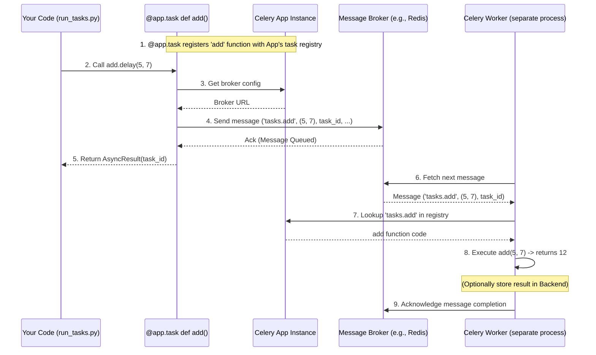

# Chapter 3: Task - The Job Description

In [Chapter 1: The Celery App](01_celery_app.md), we set up our Celery headquarters, and in [Chapter 2: Configuration](02_configuration.md), we learned how to give it instructions. Now, we need to define the *actual work* we want Celery to do. This is where **Tasks** come in.

## What Problem Does a Task Solve?

Imagine you have a specific job that needs doing, like "Resize this image to thumbnail size" or "Send a welcome email to this new user." In Celery, each of these specific jobs is represented by a **Task**.

A Task is like a **job description** or a **recipe**. It contains the exact steps (the code) needed to complete a specific piece of work. You write this recipe once as a Python function, and then you can tell Celery to follow that recipe whenever you need that job done, potentially many times with different inputs (like resizing different images or sending emails to different users).

The key benefit is that you don't run the recipe immediately yourself. You hand the recipe (the Task) and the ingredients (the arguments, like the image file or the user's email) over to Celery. Celery then finds an available helper (a [Worker](05_worker.md)) who knows how to follow that specific recipe and lets them do the work in the background. This keeps your main application free to do other things.

## Defining Your First Task

Defining a task in Celery is surprisingly simple. You just take a regular Python function and "decorate" it using `@app.task`. Remember our `app` object from [Chapter 1](01_celery_app.md)? We use its `task` decorator.

Let's create a file, perhaps named `tasks.py`, to hold our task definitions:

```python
# tasks.py
import time
from celery_app import app # Import the app instance we created

@app.task
def add(x, y):
    """A simple task that adds two numbers."""
    print(f"Task 'add' starting with ({x}, {y})")
    # Simulate some work taking time
    time.sleep(5)
    result = x + y
    print(f"Task 'add' finished with result: {result}")
    return result

@app.task
def send_welcome_email(user_id):
    """A task simulating sending a welcome email."""
    print(f"Task 'send_welcome_email' starting for user {user_id}")
    # Simulate email sending process
    time.sleep(3)
    print(f"Welcome email supposedly sent to user {user_id}")
    return f"Email sent to {user_id}"

# You can have many tasks in one file!
```

**Explanation:**

1.  **`from celery_app import app`**: We import the `Celery` app instance we configured earlier. This instance holds the knowledge about our broker and backend.
2.  **`@app.task`**: This is the magic decorator! When Celery sees this above a function (`add` or `send_welcome_email`), it says, "Ah! This isn't just a regular function; it's a job description that my workers need to know about."
3.  **The Function (`add`, `send_welcome_email`)**: This is the actual Python code that performs the work. It's the core of the task – the steps in the recipe. It can take arguments (like `x`, `y`, or `user_id`) and can return a value.
4.  **Registration**: The `@app.task` decorator automatically *registers* this function with our Celery `app`. Now, `app` knows about a task named `tasks.add` and another named `tasks.send_welcome_email` (Celery creates the name from `module_name.function_name`). Workers connected to this `app` will be able to find and execute this code when requested.

*Self-Host Note:* If you are running this code, make sure you have a `celery_app.py` file containing your Celery app instance as shown in previous chapters, and that the `tasks.py` file can import `app` from it.

## Sending a Task for Execution

Okay, we've written our recipes (`add` and `send_welcome_email`). How do we tell Celery, "Please run the `add` recipe with the numbers 5 and 7"?

We **don't call the function directly** like `add(5, 7)`. If we did that, it would just run immediately in our current program, which defeats the purpose of using Celery!

Instead, we use special methods on the task object itself, most commonly `.delay()` or `.apply_async()`.

Let's try this in a separate Python script or an interactive Python session:

```python
# run_tasks.py
from tasks import add, send_welcome_email

print("Let's send some tasks!")

# --- Using .delay() ---
# Tell Celery to run add(5, 7) in the background
result_promise_add = add.delay(5, 7)
print(f"Sent task add(5, 7). Task ID: {result_promise_add.id}")

# Tell Celery to run send_welcome_email(123) in the background
result_promise_email = send_welcome_email.delay(123)
print(f"Sent task send_welcome_email(123). Task ID: {result_promise_email.id}")


# --- Using .apply_async() ---
# Does the same thing as .delay() but allows more options
result_promise_add_later = add.apply_async(args=(10, 20), countdown=10) # Run after 10s
print(f"Sent task add(10, 20) to run in 10s. Task ID: {result_promise_add_later.id}")

print("Tasks have been sent to the broker!")
print("A Celery worker needs to be running to pick them up.")
```

**Explanation:**

1.  **`from tasks import add, send_welcome_email`**: We import our *task functions*. Because they were decorated with `@app.task`, they are now special Celery Task objects.
2.  **`add.delay(5, 7)`**: This is the simplest way to send a task.
    *   It *doesn't* run `add(5, 7)` right now.
    *   It takes the arguments `(5, 7)`.
    *   It packages them up into a **message** along with the task's name (`tasks.add`).
    *   It sends this message to the **message broker** (like Redis or RabbitMQ) that we configured in our `celery_app.py`. Think of it like dropping a request slip into a mailbox.
3.  **`send_welcome_email.delay(123)`**: Same idea, but for our email task. A message with `tasks.send_welcome_email` and the argument `123` is sent to the broker.
4.  **`add.apply_async(args=(10, 20), countdown=10)`**: This is a more powerful way to send tasks.
    *   It does the same fundamental thing: sends a message to the broker.
    *   It allows for more options, like `args` (positional arguments as a tuple), `kwargs` (keyword arguments as a dict), `countdown` (delay execution by seconds), `eta` (run at a specific future time), and many others.
    *   `.delay(*args, **kwargs)` is just a convenient shortcut for `.apply_async(args=args, kwargs=kwargs)`.
5.  **`result_promise_... = ...`**: Both `.delay()` and `apply_async()` return an `AsyncResult` object immediately. This is *not* the actual result of the task (like `12` for `add(5, 7)`). It's more like a receipt or a tracking number (notice the `.id` attribute). You can use this object later to check if the task finished and what its result was, but only if you've set up a [Result Backend](06_result_backend.md) (Chapter 6).
6.  **The Worker**: Sending the task only puts the message on the queue. A separate process, the Celery [Worker](05_worker.md) (Chapter 5), needs to be running. The worker constantly watches the queue, picks up messages, finds the corresponding task function (using the name like `tasks.add`), and executes it with the provided arguments.

## How It Works Internally (Simplified)

Let's trace the journey of defining and sending our `add` task:

1.  **Definition (`@app.task` in `tasks.py`)**:
    *   Python defines the `add` function.
    *   The `@app.task` decorator sees this function.
    *   It tells the `Celery` instance (`app`) about this function, registering it under the name `tasks.add` in an internal dictionary (`app.tasks`). The `app` instance knows the broker/backend settings.
2.  **Sending (`add.delay(5, 7)` in `run_tasks.py`)**:
    *   You call `.delay()` on the `add` task object.
    *   `.delay()` (or `.apply_async()`) internally uses the `app` the task is bound to.
    *   It asks the `app` for the configured broker URL.
    *   It creates a message containing:
        *   Task Name: `tasks.add`
        *   Arguments: `(5, 7)`
        *   Other options (like a unique Task ID).
    *   It connects to the **Broker** (e.g., Redis) using the broker URL.
    *   It sends the message to a specific queue (usually named 'celery' by default) on the broker.
    *   It returns an `AsyncResult` object referencing the Task ID.
3.  **Waiting**: The message sits in the queue on the broker, waiting.
4.  **Execution (by a [Worker](05_worker.md))**:
    *   A separate Celery Worker process is running, connected to the same broker and `app`.
    *   The Worker fetches the message from the queue.
    *   It reads the task name: `tasks.add`.
    *   It looks up `tasks.add` in its copy of the `app.tasks` registry to find the actual `add` function code.
    *   It calls the `add` function with the arguments from the message: `add(5, 7)`.
    *   The function runs (prints logs, sleeps, calculates `12`).
    *   If a [Result Backend](06_result_backend.md) is configured, the Worker takes the return value (`12`) and stores it in the backend, associated with the Task ID.
    *   The Worker acknowledges the message to the broker, removing it from the queue.



## Code Dive: Task Creation and Sending

*   **Task Definition (`@app.task`)**: This decorator is defined in `celery/app/base.py` within the `Celery` class method `task`. It ultimately calls `_task_from_fun`.

    ```python
    # Simplified from celery/app/base.py
    class Celery:
        # ...
        def task(self, *args, **opts):
            # ... handles decorator arguments ...
            def _create_task_cls(fun):
                # Returns a Task instance or a Proxy that creates one later
                ret = self._task_from_fun(fun, **opts)
                return ret
            return _create_task_cls

        def _task_from_fun(self, fun, name=None, base=None, bind=False, **options):
            # Generate name like 'tasks.add' if not given
            name = name or self.gen_task_name(fun.__name__, fun.__module__)
            base = base or self.Task # The base Task class (from celery.app.task)

            if name not in self._tasks: # If not already registered...
                # Dynamically create a Task class wrapping the function
                task = type(fun.__name__, (base,), {
                    'app': self, # Link task back to this app instance!
                    'name': name,
                    'run': staticmethod(fun), # The actual function to run
                    '__doc__': fun.__doc__,
                    '__module__': fun.__module__,
                    # ... other options ...
                })() # Instantiate the new Task class
                self._tasks[task.name] = task # Add to app's registry!
                task.bind(self) # Perform binding steps
            else:
                task = self._tasks[name] # Task already exists
            return task
    ```
    This shows how the decorator essentially creates a specialized object (an instance of a class derived from `celery.app.task.Task`) that wraps your original function and registers it with the `app` under a specific name.

*   **Task Sending (`.delay`)**: The `.delay()` method is defined on the `Task` class itself in `celery/app/task.py`. It's a simple shortcut.

    ```python
    # Simplified from celery/app/task.py
    class Task:
        # ...
        def delay(self, *args, **kwargs):
            """Shortcut for apply_async(args, kwargs)"""
            return self.apply_async(args, kwargs)

        def apply_async(self, args=None, kwargs=None, ..., **options):
            # ... argument checking, option processing ...

            # Get the app associated with this task instance
            app = self._get_app()

            # If always_eager is set, run locally instead of sending
            if app.conf.task_always_eager:
                return self.apply(args, kwargs, ...) # Runs inline

            # The main path: tell the app to send the task message
            return app.send_task(
                self.name, args, kwargs, task_type=self,
                **options # Includes things like countdown, eta, queue etc.
            )
    ```
    You can see how `.delay` just calls `.apply_async`, which then (usually) delegates the actual message sending to the `app.send_task` method we saw briefly in [Chapter 1](01_celery_app.md). The `app` uses its configuration to know *how* and *where* to send the message.

## Conclusion

You've learned the core concept of a Celery **Task**:

*   It represents a single, well-defined **unit of work** or **job description**.
*   You define a task by decorating a normal Python function with `@app.task`. This **registers** the task with your Celery application.
*   You **send** a task request (not run it directly) using `.delay()` or `.apply_async()`.
*   Sending a task puts a **message** onto a queue managed by a **message broker**.
*   A separate **Worker** process picks up the message and executes the corresponding task function.

Tasks are the fundamental building blocks of work in Celery. Now that you know how to define a task and request its execution, let's look more closely at the crucial component that handles passing these requests around: the message broker.

**Next:** [Chapter 4: Broker Connection (AMQP)](04_broker_connection__amqp_.md)

---

Generated by [AI Codebase Knowledge Builder](https://github.com/The-Pocket/Tutorial-Codebase-Knowledge)