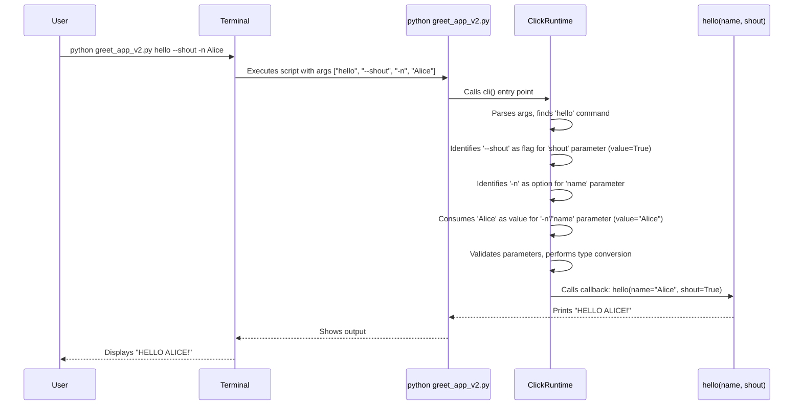

# Chapter 3: Parameter (Option / Argument) - Giving Your Commands Input

In the last chapter, [Decorators](02_decorators.md), we saw how decorators like `@click.command()` and `@click.option()` act like magic wands, transforming our Python functions into CLI commands and adding features like command-line options.

But how do our commands actually *receive* information from the user? If we have a command `greet`, how do we tell it *who* to greet, like `greet --name Alice`? Or if we have a `copy` command, how do we specify the source and destination files, like `copy report.txt backup.txt`?

This is where **Parameters** come in. Parameters define the inputs your commands can accept, just like arguments define the inputs for a regular Python function. Click handles parsing these inputs from the command line, validating them, and making them available to your command function.

There are two main types of parameters in Click:

1.  **Options:** These are usually preceded by flags like `--verbose` or `-f`. They are often optional and can either take a value (like `--name Alice`) or act as simple on/off switches (like `--verbose`). You define them using the `@click.option()` decorator.
2.  **Arguments:** These are typically positional values that come *after* any options. They often represent required inputs, like a filename (`report.txt`). You define them using the `@click.argument()` decorator.

Let's see how to use them!

## Options: The Named Inputs (`@click.option`)

Think of options like keyword arguments in Python functions. In `def greet(name="World"):`, `name` is a keyword argument with a default value. Options serve a similar purpose for your CLI.

Let's modify our `hello` command from the previous chapter to accept a `--name` option.

```python
# greet_app.py
import click

@click.group()
def cli():
  """A simple tool with a greeting command."""
  pass

@cli.command()
@click.option('--name', default='World', help='Who to greet.')
def hello(name): # <-- The 'name' parameter matches the option
  """Greets the person specified by the --name option."""
  print(f"Hello {name}!")

if __name__ == '__main__':
  cli()
```

Let's break down the new parts:

1.  `@click.option('--name', default='World', help='Who to greet.')`: This decorator defines an option.
    *   `'--name'`: This is the primary name of the option on the command line.
    *   `default='World'`: If the user doesn't provide the `--name` option, the value `World` will be used.
    *   `help='Who to greet.'`: This text will appear in the help message for the `hello` command.
2.  `def hello(name):`: Notice how the `hello` function now accepts an argument named `name`. Click cleverly matches the option name (`name`) to the function parameter name and passes the value automatically!

**Try running it!**

First, check the help message for the `hello` command:

```bash
$ python greet_app.py hello --help
Usage: greet_app.py hello [OPTIONS]

  Greets the person specified by the --name option.

Options:
  --name TEXT  Who to greet.  [default: World]
  --help       Show this message and exit.
```

See? Click added our `--name` option to the help screen, including the help text and default value we provided. The `TEXT` part indicates the type of value expected (we'll cover types in [ParamType](04_paramtype.md)).

Now, run it with and without the option:

```bash
$ python greet_app.py hello
Hello World!

$ python greet_app.py hello --name Alice
Hello Alice!
```

It works perfectly! Click parsed the `--name Alice` option and passed `"Alice"` to our `hello` function's `name` parameter. When we didn't provide the option, it used the default value `"World"`.

### Option Flavors: Short Names and Flags

Options can have variations:

*   **Short Names:** You can provide shorter aliases, like `-n` for `--name`.
*   **Flags:** Options that don't take a value but act as switches (e.g., `--verbose`).

Let's add a short name `-n` to our `--name` option and a `--shout` flag to make the greeting uppercase.

```python
# greet_app_v2.py
import click

@click.group()
def cli():
  """A simple tool with a greeting command."""
  pass

@cli.command()
@click.option('--name', '-n', default='World', help='Who to greet.') # Added '-n'
@click.option('--shout', is_flag=True, help='Greet loudly.')        # Added '--shout' flag
def hello(name, shout): # <-- Function now accepts 'shout' too
  """Greets the person, optionally shouting."""
  greeting = f"Hello {name}!"
  if shout:
    greeting = greeting.upper()
  print(greeting)

if __name__ == '__main__':
  cli()
```

Changes:

1.  `@click.option('--name', '-n', ...)`: We added `'-n'` as the second argument to the decorator. Now, both `--name` and `-n` work.
2.  `@click.option('--shout', is_flag=True, ...)`: This defines a flag. `is_flag=True` tells Click this option doesn't take a value; its presence makes the corresponding parameter `True`, otherwise it's `False`.
3.  `def hello(name, shout):`: The function signature is updated to accept the `shout` parameter.

**Run it again!**

```bash
$ python greet_app_v2.py hello -n Bob
Hello Bob!

$ python greet_app_v2.py hello --name Carol --shout
HELLO CAROL!

$ python greet_app_v2.py hello --shout
HELLO WORLD!
```

Flags and short names make your CLI more flexible and conventional!

## Arguments: The Positional Inputs (`@click.argument`)

Arguments are like positional arguments in Python functions. In `def copy(src, dst):`, `src` and `dst` are required positional arguments. Click arguments usually represent mandatory inputs that follow the command and any options.

Let's create a simple command that takes two arguments, `SRC` and `DST`, representing source and destination files (though we'll just print them for now).

```python
# copy_app.py
import click

@click.command()
@click.argument('src')  # Defines the first argument
@click.argument('dst')  # Defines the second argument
def copy(src, dst):     # Function parameters match argument names
  """Copies SRC file to DST."""
  print(f"Pretending to copy '{src}' to '{dst}'")

if __name__ == '__main__':
  copy()
```

What's happening here?

1.  `@click.argument('src')`: Defines a positional argument named `src`. By default, arguments are required. The name `'src'` is used both internally and often capitalized (`SRC`) in help messages by convention.
2.  `@click.argument('dst')`: Defines the second required positional argument.
3.  `def copy(src, dst):`: The function parameters `src` and `dst` receive the values provided on the command line in the order they appear.

**Let's try it!**

First, see what happens if we forget the arguments:

```bash
$ python copy_app.py
Usage: copy_app.py [OPTIONS] SRC DST
Try 'copy_app.py --help' for help.

Error: Missing argument 'SRC'.
```

Click automatically detects the missing argument and gives a helpful error message!

Now, provide the arguments:

```bash
$ python copy_app.py report.txt backup/report.txt
Pretending to copy 'report.txt' to 'backup/report.txt'
```

Click correctly captured the positional arguments and passed them to our `copy` function.

Arguments are essential for inputs that are fundamental to the command's operation, like the files to operate on. Options are better suited for modifying the command's behavior.

*(Note: Arguments can also be made optional or accept variable numbers of inputs, often involving the `required` and `nargs` settings, which tie into concepts we'll explore more in [ParamType](04_paramtype.md).)*

## How Parameters Work Together

When you run a command like `python greet_app_v2.py hello --shout -n Alice`, Click performs a sequence of steps:

1.  **Parsing:** Click looks at the command-line arguments (`sys.argv`) provided by the operating system: `['greet_app_v2.py', 'hello', '--shout', '-n', 'Alice']`.
2.  **Command Identification:** It identifies `hello` as the command to execute.
3.  **Parameter Matching:** It scans the remaining arguments (`['--shout', '-n', 'Alice']`).
    *   It sees `--shout`. It looks up the parameters defined for the `hello` command (using the `@click.option` and `@click.argument` decorators). It finds the `shout` option definition (which has `is_flag=True`). It marks the value for `shout` as `True`.
    *   It sees `-n`. It finds the `name` option definition (which includes `-n` as an alias and expects a value).
    *   It sees `Alice`. Since the previous token (`-n`) expected a value, Click associates `"Alice"` with the `-n` (and thus `--name`) option. It marks the value for `name` as `"Alice"`.
4.  **Validation & Conversion:** Click checks if all required parameters are present (they are). It also performs type conversion (though in this case, the default is string, which matches "Alice"). We'll see more complex conversions in the next chapter.
5.  **Function Call:** Finally, Click calls the command's underlying Python function (`hello`) with the collected values as keyword arguments: `hello(name='Alice', shout=True)`.

Here's a simplified view of the process:



## Under the Hood: Decorators and Parameter Objects

How do `@click.option` and `@click.argument` actually work with `@click.command`?

1.  **Parameter Definition (`decorators.py`, `core.py`):** When you use `@click.option(...)` or `@click.argument(...)`, these functions (defined in `click/decorators.py`) create instances of the `Option` or `Argument` classes (defined in `click/core.py`). These objects store all the configuration you provided (like `--name`, `-n`, `default='World'`, `is_flag=True`, etc.).
2.  **Attaching to Function (`decorators.py`):** Crucially, these decorators don't immediately add the parameters to a command. Instead, they attach the created `Option` or `Argument` object to the function they are decorating. Click uses a helper mechanism (like the internal `_param_memo` function which adds to a `__click_params__` list) to store these parameter objects *on* the function object temporarily.
3.  **Command Creation (`decorators.py`, `core.py`):** The `@click.command()` decorator (or `@group.command()`) runs *after* all the `@option` and `@argument` decorators for that function. It looks for the attached parameter objects (the `__click_params__` list). It gathers these objects and passes them to the constructor of the `Command` (or `Group`) object it creates. The `Command` object stores these parameters in its `params` attribute.
4.  **Parsing (`parser.py`, `core.py`):** When the command is invoked, the `Command` object uses its `params` list to configure an internal parser (historically based on Python's `optparse`, see `click/parser.py`). This parser processes the command-line string (`sys.argv`) according to the rules defined by the `Option` and `Argument` objects in the `params` list.
5.  **Callback Invocation (`core.py`):** After parsing and validation, Click takes the resulting values and calls the original Python function (stored as the `Command.callback`), passing the values as arguments.

So, the decorators work together: `@option`/`@argument` define the parameters and temporarily attach them to the function, while `@command` collects these definitions and builds the final `Command` object, ready for parsing.

## Conclusion

You've learned how to make your Click commands interactive by defining inputs using **Parameters**:

*   **Options (`@click.option`):** Named inputs, often optional, specified with flags (`--name`, `-n`). Great for controlling behavior (like `--verbose`, `--shout`) or providing specific pieces of data (`--output file.txt`).
*   **Arguments (`@click.argument`):** Positional inputs, often required, that follow options (`input.csv`). Ideal for core data the command operates on (like source/destination files).

You saw how Click uses decorators to define these parameters and automatically handles parsing the command line, providing default values, generating help messages, and passing the final values to your Python function.

But what if you want an option to accept only numbers? Or a choice from a predefined list? Or maybe an argument that represents a file path that must exist? Click handles this through **Parameter Types**. Let's explore those next!

Next up: [Chapter 4: ParamType](04_paramtype.md)

---

Generated by [AI Codebase Knowledge Builder](https://github.com/The-Pocket/Tutorial-Codebase-Knowledge)