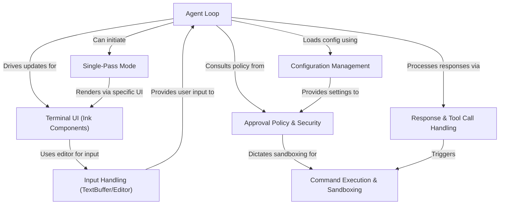

# Tutorial: Codex

> This tutorial is AI-generated! To learn more, check out [AI Codebase Knowledge Builder](https://github.com/The-Pocket/Tutorial-Codebase-Knowledge)

Codex[View Repo](https://github.com/openai/codex) is a command-line interface (CLI) tool that functions as an **AI coding assistant**.
It runs in your terminal, allowing you to chat with an AI model (like *GPT-4o*) to understand, modify, and generate code within your projects.
The tool can read files, apply changes (*patches*), and execute shell commands, prioritizing safety through user **approval policies** and command **sandboxing**. It supports both interactive chat and a non-interactive *single-pass mode* for batch operations.

