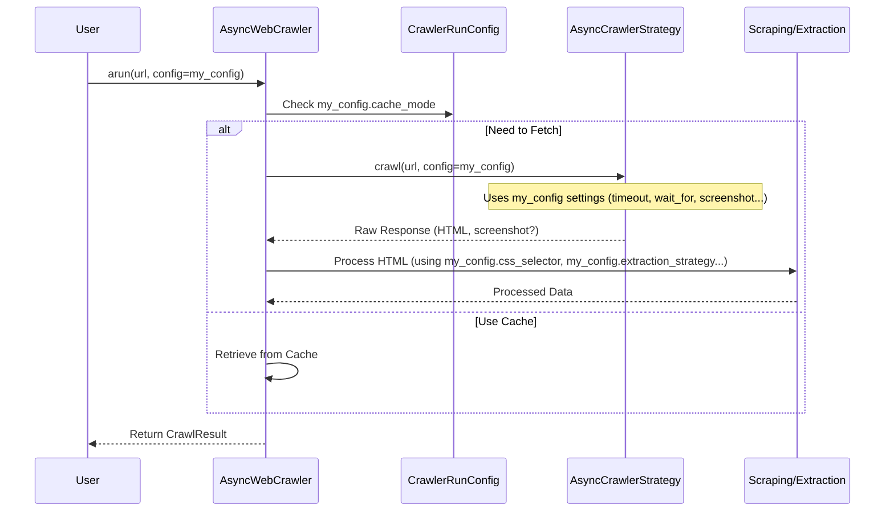

# Chapter 3: Giving Instructions - CrawlerRunConfig

In [Chapter 2: Meet the General Manager - AsyncWebCrawler](02_asyncwebcrawler.md), we met the `AsyncWebCrawler`, the central coordinator for our web crawling tasks. We saw how to tell it *what* URL to crawl using the `arun` method.

But what if we want to tell the crawler *how* to crawl that URL? Maybe we want it to take a picture (screenshot) of the page? Or perhaps we only care about a specific section of the page? Or maybe we want to ignore the cache and get the very latest version?

Passing all these different instructions individually every time we call `arun` could get complicated and messy.

```python
# Imagine doing this every time - it gets long!
# result = await crawler.arun(
#     url="https://example.com",
#     take_screenshot=True,
#     ignore_cache=True,
#     only_look_at_this_part="#main-content",
#     wait_for_this_element="#data-table",
#     # ... maybe many more settings ...
# )
```

That's where `CrawlerRunConfig` comes in!

## What Problem Does `CrawlerRunConfig` Solve?

Think of `CrawlerRunConfig` as the **Instruction Manual** for a *specific* crawl job. Instead of giving the `AsyncWebCrawler` manager lots of separate instructions each time, you bundle them all neatly into a single `CrawlerRunConfig` object.

This object tells the `AsyncWebCrawler` exactly *how* to handle a particular URL or set of URLs for that specific run. It makes your code cleaner and easier to manage.

## What is `CrawlerRunConfig`?

`CrawlerRunConfig` is a configuration class that holds all the settings for a single crawl operation initiated by `AsyncWebCrawler.arun()` or `arun_many()`.

It allows you to customize various aspects of the crawl, such as:

*   **Taking Screenshots:** Should the crawler capture an image of the page? (`screenshot`)
*   **Waiting:** How long should the crawler wait for the page or specific elements to load? (`page_timeout`, `wait_for`)
*   **Focusing Content:** Should the crawler only process a specific part of the page? (`css_selector`)
*   **Extracting Data:** Should the crawler use a specific method to pull out structured data? ([ExtractionStrategy](06_extractionstrategy.md))
*   **Caching:** How should the crawler interact with previously saved results? ([CacheMode](09_cachecontext___cachemode.md))
*   **And much more!** (like handling JavaScript, filtering links, etc.)

## Using `CrawlerRunConfig`

Let's see how to use it. Remember our basic crawl from Chapter 2?

```python
# chapter3_example_1.py
import asyncio
from crawl4ai import AsyncWebCrawler

async def main():
    async with AsyncWebCrawler() as crawler:
        url_to_crawl = "https://httpbin.org/html"
        print(f"Crawling {url_to_crawl} with default settings...")

        # This uses the default behavior (no specific config)
        result = await crawler.arun(url=url_to_crawl)

        if result.success:
            print("Success! Got the content.")
            print(f"Screenshot taken? {'Yes' if result.screenshot else 'No'}") # Likely No
            # We'll learn about CacheMode later, but it defaults to using the cache
        else:
            print(f"Failed: {result.error_message}")

if __name__ == "__main__":
    asyncio.run(main())
```

Now, let's say for this *specific* crawl, we want to bypass the cache (fetch fresh) and also take a screenshot.

We create a `CrawlerRunConfig` instance and pass it to `arun`:

```python
# chapter3_example_2.py
import asyncio
from crawl4ai import AsyncWebCrawler
from crawl4ai import CrawlerRunConfig # 1. Import the config class
from crawl4ai import CacheMode        # Import cache options

async def main():
    async with AsyncWebCrawler() as crawler:
        url_to_crawl = "https://httpbin.org/html"
        print(f"Crawling {url_to_crawl} with custom settings...")

        # 2. Create an instance of CrawlerRunConfig with our desired settings
        my_instructions = CrawlerRunConfig(
            cache_mode=CacheMode.BYPASS, # Don't use the cache, fetch fresh
            screenshot=True              # Take a screenshot
        )
        print("Instructions: Bypass cache, take screenshot.")

        # 3. Pass the config object to arun()
        result = await crawler.arun(
            url=url_to_crawl,
            config=my_instructions # Pass our instruction manual
        )

        if result.success:
            print("\nSuccess! Got the content with custom config.")
            print(f"Screenshot taken? {'Yes' if result.screenshot else 'No'}") # Should be Yes
            # Check if the screenshot file path exists in result.screenshot
            if result.screenshot:
                print(f"Screenshot saved to: {result.screenshot}")
        else:
            print(f"\nFailed: {result.error_message}")

if __name__ == "__main__":
    asyncio.run(main())
```

**Explanation:**

1.  **Import:** We import `CrawlerRunConfig` and `CacheMode`.
2.  **Create Config:** We create an instance: `my_instructions = CrawlerRunConfig(...)`. We set `cache_mode` to `CacheMode.BYPASS` and `screenshot` to `True`. All other settings remain at their defaults.
3.  **Pass Config:** We pass this `my_instructions` object to `crawler.arun` using the `config=` parameter.

Now, when `AsyncWebCrawler` runs this job, it will look inside `my_instructions` and follow those specific settings for *this run only*.

## Some Common `CrawlerRunConfig` Parameters

`CrawlerRunConfig` has many options, but here are a few common ones you might use:

*   **`cache_mode`**: Controls caching behavior.
    *   `CacheMode.ENABLED` (Default): Use the cache if available, otherwise fetch and save.
    *   `CacheMode.BYPASS`: Always fetch fresh, ignoring any cached version (but still save the new result).
    *   `CacheMode.DISABLED`: Never read from or write to the cache.
    *   *(More details in [Chapter 9: Smart Fetching with Caching - CacheContext / CacheMode](09_cachecontext___cachemode.md))*
*   **`screenshot` (bool)**: If `True`, takes a screenshot of the fully rendered page. The path to the screenshot file will be in `CrawlResult.screenshot`. Default: `False`.
*   **`pdf` (bool)**: If `True`, generates a PDF of the page. The path to the PDF file will be in `CrawlResult.pdf`. Default: `False`.
*   **`css_selector` (str)**: If provided (e.g., `"#main-content"` or `.article-body`), the crawler will try to extract *only* the HTML content within the element(s) matching this CSS selector. This is great for focusing on the important part of a page. Default: `None` (process the whole page).
*   **`wait_for` (str)**: A CSS selector (e.g., `"#data-loaded-indicator"`). The crawler will wait until an element matching this selector appears on the page before proceeding. Useful for pages that load content dynamically with JavaScript. Default: `None`.
*   **`page_timeout` (int)**: Maximum time in milliseconds to wait for page navigation or certain operations. Default: `60000` (60 seconds).
*   **`extraction_strategy`**: An object that defines how to extract specific, structured data (like product names and prices) from the page. Default: `None`. *(See [Chapter 6: Getting Specific Data - ExtractionStrategy](06_extractionstrategy.md))*
*   **`scraping_strategy`**: An object defining how the raw HTML is cleaned and basic content (like text and links) is extracted. Default: `WebScrapingStrategy()`. *(See [Chapter 4: Cleaning Up the Mess - ContentScrapingStrategy](04_contentscrapingstrategy.md))*

Let's try combining a few: focus on a specific part of the page and wait for something to appear.

```python
# chapter3_example_3.py
import asyncio
from crawl4ai import AsyncWebCrawler, CrawlerRunConfig

async def main():
    # This example site has a heading 'H1' inside a 'body' tag.
    url_to_crawl = "https://httpbin.org/html"
    async with AsyncWebCrawler() as crawler:
        print(f"Crawling {url_to_crawl}, focusing on the H1 tag...")

        # Instructions: Only get the H1 tag, wait max 10s for it
        specific_config = CrawlerRunConfig(
            css_selector="h1", # Only grab content inside <h1> tags
            page_timeout=10000 # Set page timeout to 10 seconds
            # We could also add wait_for="h1" if needed for dynamic loading
        )

        result = await crawler.arun(url=url_to_crawl, config=specific_config)

        if result.success:
            print("\nSuccess! Focused crawl completed.")
            # The markdown should now ONLY contain the H1 content
            print(f"Markdown content:\n---\n{result.markdown.raw_markdown.strip()}\n---")
        else:
            print(f"\nFailed: {result.error_message}")

if __name__ == "__main__":
    asyncio.run(main())
```

This time, the `result.markdown` should only contain the text from the `<h1>` tag on that page, because we used `css_selector="h1"` in our `CrawlerRunConfig`.

## How `AsyncWebCrawler` Uses the Config (Under the Hood)

You don't need to know the exact internal code, but it helps to understand the flow. When you call `crawler.arun(url, config=my_config)`, the `AsyncWebCrawler` essentially does this:

1.  Receives the `url` and the `my_config` object.
2.  Before fetching, it checks `my_config.cache_mode` to see if it should look in the cache first.
3.  If fetching is needed, it passes `my_config` to the underlying [AsyncCrawlerStrategy](01_asynccrawlerstrategy.md).
4.  The strategy uses settings from `my_config` like `page_timeout`, `wait_for`, and whether to take a `screenshot`.
5.  After getting the raw HTML, `AsyncWebCrawler` uses the `my_config.scraping_strategy` and `my_config.css_selector` to process the content.
6.  If `my_config.extraction_strategy` is set, it uses that to extract structured data.
7.  Finally, it bundles everything into a `CrawlResult` and returns it.

Here's a simplified view:



The `CrawlerRunConfig` acts as a messenger carrying your specific instructions throughout the crawling process.

Inside the `crawl4ai` library, in the file `async_configs.py`, you'll find the definition of the `CrawlerRunConfig` class. It looks something like this (simplified):

```python
# Simplified from crawl4ai/async_configs.py

from .cache_context import CacheMode
from .extraction_strategy import ExtractionStrategy
from .content_scraping_strategy import ContentScrapingStrategy, WebScrapingStrategy
# ... other imports ...

class CrawlerRunConfig():
    """
    Configuration class for controlling how the crawler runs each crawl operation.
    """
    def __init__(
        self,
        # Caching
        cache_mode: CacheMode = CacheMode.BYPASS, # Default behavior if not specified

        # Content Selection / Waiting
        css_selector: str = None,
        wait_for: str = None,
        page_timeout: int = 60000, # 60 seconds

        # Media
        screenshot: bool = False,
        pdf: bool = False,

        # Processing Strategies
        scraping_strategy: ContentScrapingStrategy = None, # Defaults internally if None
        extraction_strategy: ExtractionStrategy = None,

        # ... many other parameters omitted for clarity ...
        **kwargs # Allows for flexibility
    ):
        self.cache_mode = cache_mode
        self.css_selector = css_selector
        self.wait_for = wait_for
        self.page_timeout = page_timeout
        self.screenshot = screenshot
        self.pdf = pdf
        # Assign scraping strategy, ensuring a default if None is provided
        self.scraping_strategy = scraping_strategy or WebScrapingStrategy()
        self.extraction_strategy = extraction_strategy
        # ... initialize other attributes ...

    # Helper methods like 'clone', 'to_dict', 'from_kwargs' might exist too
    # ...
```

The key idea is that it's a class designed to hold various settings together. When you create an instance `CrawlerRunConfig(...)`, you're essentially creating an object that stores your choices for these parameters.

## Conclusion

You've learned about `CrawlerRunConfig`, the "Instruction Manual" for individual crawl jobs in Crawl4AI!

*   It solves the problem of passing many settings individually to `AsyncWebCrawler`.
*   You create an instance of `CrawlerRunConfig` and set the parameters you want to customize (like `cache_mode`, `screenshot`, `css_selector`, `wait_for`).
*   You pass this config object to `crawler.arun(url, config=your_config)`.
*   This makes your code cleaner and gives you fine-grained control over *how* each crawl is performed.

Now that we know how to fetch content ([AsyncCrawlerStrategy](01_asynccrawlerstrategy.md)), manage the overall process ([AsyncWebCrawler](02_asyncwebcrawler.md)), and give specific instructions ([CrawlerRunConfig](03_crawlerrunconfig.md)), let's look at how the raw, messy HTML fetched from the web is initially cleaned up and processed.

**Next:** Let's explore [Chapter 4: Cleaning Up the Mess - ContentScrapingStrategy](04_contentscrapingstrategy.md).

---

Generated by [AI Codebase Knowledge Builder](https://github.com/The-Pocket/Tutorial-Codebase-Knowledge)