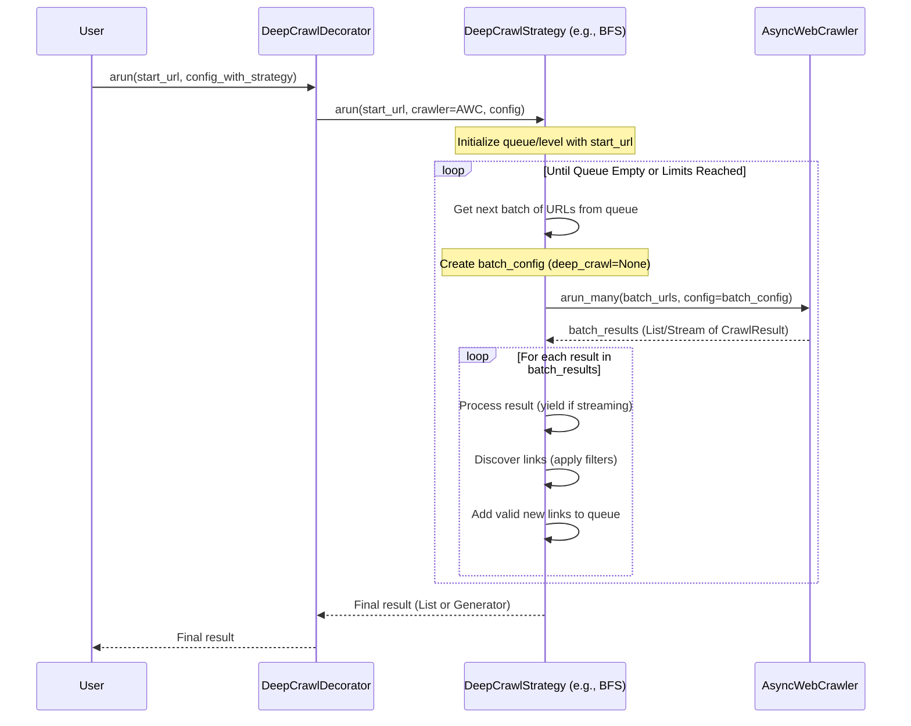

# Chapter 8: Exploring Websites - DeepCrawlStrategy

In [Chapter 7: Understanding the Results - CrawlResult](07_crawlresult.md), we saw the final report (`CrawlResult`) that Crawl4AI gives us after processing a single URL. This report contains cleaned content, links, metadata, and maybe even extracted data.

But what if you want to explore a website *beyond* just the first page? Imagine you land on a blog's homepage. You don't just want the homepage content; you want to automatically discover and crawl all the individual blog posts linked from it. How can you tell Crawl4AI to act like an explorer, following links and venturing deeper into the website?

## What Problem Does `DeepCrawlStrategy` Solve?

Think of the `AsyncWebCrawler.arun()` method we've used so far like visiting just the entrance hall of a vast library. You get information about that specific hall, but you don't automatically explore the adjoining rooms or different floors.

What if you want to systematically explore the library? You need a plan:

*   Do you explore room by room on the current floor before going upstairs? (Level by level)
*   Do you pick one wing and explore all its rooms down to the very end before exploring another wing? (Go deep first)
*   Do you have a map highlighting potentially interesting sections and prioritize visiting those first? (Prioritize promising paths)

`DeepCrawlStrategy` provides this **exploration plan**. It defines the logic for how Crawl4AI should discover and crawl new URLs starting from the initial one(s) by following the links it finds on each page. It turns the crawler from a single-page visitor into a website explorer.

## What is `DeepCrawlStrategy`?

`DeepCrawlStrategy` is a concept (a blueprint) in Crawl4AI that represents the **method or logic used to navigate and crawl multiple pages by following links**. It tells the crawler *which links* to follow and in *what order* to visit them.

It essentially takes over the process when you call `arun()` if a deep crawl is requested, managing a queue or list of URLs to visit and coordinating the crawling of those URLs, potentially up to a certain depth or number of pages.

## Different Exploration Plans: The Strategies

Crawl4AI provides several concrete exploration plans (implementations) for `DeepCrawlStrategy`:

1.  **`BFSDeepCrawlStrategy` (Level-by-Level Explorer):**
    *   **Analogy:** Like ripples spreading in a pond.
    *   **How it works:** It first crawls the starting URL (Level 0). Then, it crawls all the valid links found on that page (Level 1). Then, it crawls all the valid links found on *those* pages (Level 2), and so on. It explores the website layer by layer.
    *   **Good for:** Finding the shortest path to all reachable pages, getting a broad overview quickly near the start page.

2.  **`DFSDeepCrawlStrategy` (Deep Path Explorer):**
    *   **Analogy:** Like exploring one specific corridor in a maze all the way to the end before backtracking and trying another corridor.
    *   **How it works:** It starts at the initial URL, follows one link, then follows a link from *that* page, and continues going deeper down one path as far as possible (or until a specified depth limit). Only when it hits a dead end or the limit does it backtrack and try another path.
    *   **Good for:** Exploring specific branches of a website thoroughly, potentially reaching deeper pages faster than BFS (if the target is down a specific path).

3.  **`BestFirstCrawlingStrategy` (Priority Explorer):**
    *   **Analogy:** Like using a treasure map where some paths are marked as more promising than others.
    *   **How it works:** This strategy uses a **scoring system**. It looks at all the discovered (but not yet visited) links and assigns a score to each one based on how "promising" it seems (e.g., does the URL contain relevant keywords? Is it from a trusted domain?). It then crawls the link with the *best* score first, regardless of its depth.
    *   **Good for:** Focusing the crawl on the most relevant or important pages first, especially useful when you can't crawl the entire site and need to prioritize.

**Guiding the Explorer: Filters and Scorers**

Deep crawl strategies often work together with:

*   **Filters:** Rules that decide *if* a discovered link should even be considered for crawling. Examples:
    *   `DomainFilter`: Only follow links within the starting website's domain.
    *   `URLPatternFilter`: Only follow links matching a specific pattern (e.g., `/blog/posts/...`).
    *   `ContentTypeFilter`: Avoid following links to non-HTML content like PDFs or images.
*   **Scorers:** (Used mainly by `BestFirstCrawlingStrategy`) Rules that assign a score to a potential link to help prioritize it. Examples:
    *   `KeywordRelevanceScorer`: Scores links higher if the URL contains certain keywords.
    *   `PathDepthScorer`: Might score links differently based on how deep they are.

These act like instructions for the explorer: "Only explore rooms on this floor (filter)," "Ignore corridors marked 'Staff Only' (filter)," or "Check rooms marked with a star first (scorer)."

## How to Use a `DeepCrawlStrategy`

You enable deep crawling by adding a `DeepCrawlStrategy` instance to your `CrawlerRunConfig`. Let's try exploring a website layer by layer using `BFSDeepCrawlStrategy`, going only one level deep from the start page.

```python
# chapter8_example_1.py
import asyncio
from crawl4ai import (
    AsyncWebCrawler,
    CrawlerRunConfig,
    BFSDeepCrawlStrategy, # 1. Import the desired strategy
    DomainFilter          # Import a filter to stay on the same site
)

async def main():
    # 2. Create an instance of the strategy
    #    - max_depth=1: Crawl start URL (depth 0) + links found (depth 1)
    #    - filter_chain: Use DomainFilter to only follow links on the same website
    bfs_explorer = BFSDeepCrawlStrategy(
        max_depth=1,
        filter_chain=[DomainFilter()] # Stay within the initial domain
    )
    print(f"Strategy: BFS, Max Depth: {bfs_explorer.max_depth}")

    # 3. Create CrawlerRunConfig and set the deep_crawl_strategy
    #    Also set stream=True to get results as they come in.
    run_config = CrawlerRunConfig(
        deep_crawl_strategy=bfs_explorer,
        stream=True # Get results one by one using async for
    )

    # 4. Run the crawl - arun now handles the deep crawl!
    async with AsyncWebCrawler() as crawler:
        start_url = "https://httpbin.org/links/10/0" # A page with 10 internal links
        print(f"\nStarting deep crawl from: {start_url}...")

        crawl_results_generator = await crawler.arun(url=start_url, config=run_config)

        crawled_count = 0
        # Iterate over the results as they are yielded
        async for result in crawl_results_generator:
            crawled_count += 1
            status = "✅" if result.success else "❌"
            depth = result.metadata.get("depth", "N/A")
            parent = result.metadata.get("parent_url", "Start")
            url_short = result.url.split('/')[-1] # Show last part of URL
            print(f"  {status} Crawled: {url_short:<6} (Depth: {depth})")

        print(f"\nFinished deep crawl. Total pages processed: {crawled_count}")
        # Expecting 1 (start URL) + 10 (links) = 11 results

if __name__ == "__main__":
    asyncio.run(main())
```

**Explanation:**

1.  **Import:** We import `AsyncWebCrawler`, `CrawlerRunConfig`, `BFSDeepCrawlStrategy`, and `DomainFilter`.
2.  **Instantiate Strategy:** We create `BFSDeepCrawlStrategy`.
    *   `max_depth=1`: We tell it to crawl the starting URL (depth 0) and any valid links it finds on that page (depth 1), but not to go any further.
    *   `filter_chain=[DomainFilter()]`: We provide a list containing `DomainFilter`. This tells the strategy to only consider following links that point to the same domain as the `start_url`. Links to external sites will be ignored.
3.  **Configure Run:** We create a `CrawlerRunConfig` and pass our `bfs_explorer` instance to the `deep_crawl_strategy` parameter. We also set `stream=True` so we can process results as soon as they are ready, rather than waiting for the entire crawl to finish.
4.  **Crawl:** We call `await crawler.arun(url=start_url, config=run_config)`. Because the config contains a `deep_crawl_strategy`, `arun` doesn't just crawl the single `start_url`. Instead, it activates the deep crawl logic defined by `BFSDeepCrawlStrategy`.
5.  **Process Results:** Since we used `stream=True`, the return value is an asynchronous generator. We use `async for result in crawl_results_generator:` to loop through the `CrawlResult` objects as they are produced by the deep crawl. For each result, we print its status and depth.

You'll see the output showing the crawl starting, then processing the initial page (`links/10/0` at depth 0), followed by the 10 linked pages (e.g., `9`, `8`, ... `0` at depth 1).

## How It Works (Under the Hood)

How does simply putting a strategy in the config change `arun`'s behavior? It involves a bit of Python magic called a **decorator**.

1.  **Decorator:** When you create an `AsyncWebCrawler`, its `arun` method is automatically wrapped by a `DeepCrawlDecorator`.
2.  **Check Config:** When you call `await crawler.arun(url=..., config=...)`, this decorator checks if `config.deep_crawl_strategy` is set.
3.  **Delegate or Run Original:**
    *   If a strategy **is set**, the decorator *doesn't* run the original single-page crawl logic. Instead, it calls the `arun` method of your chosen `DeepCrawlStrategy` instance (e.g., `bfs_explorer.arun(...)`), passing it the `crawler` itself, the `start_url`, and the `config`.
    *   If no strategy is set, the decorator simply calls the original `arun` logic to crawl the single page.
4.  **Strategy Takes Over:** The `DeepCrawlStrategy`'s `arun` method now manages the crawl.
    *   It maintains a list or queue of URLs to visit (e.g., `current_level` in BFS, a stack in DFS, a priority queue in BestFirst).
    *   It repeatedly takes batches of URLs from its list/queue.
    *   For each batch, it calls `crawler.arun_many(urls=batch_urls, config=batch_config)` (with deep crawling disabled in `batch_config` to avoid infinite loops!).
    *   As results come back from `arun_many`, the strategy processes them:
        *   It yields the `CrawlResult` if running in stream mode.
        *   It extracts links using its `link_discovery` method.
        *   `link_discovery` uses `can_process_url` (which applies filters) to validate links.
        *   Valid new links are added to the list/queue for future crawling.
    *   This continues until the list/queue is empty, the max depth/pages limit is reached, or it's cancelled.



## Code Glimpse

Let's peek at the simplified structure:

**1. The Decorator (`deep_crawling/base_strategy.py`)**

```python
# Simplified from deep_crawling/base_strategy.py
from contextvars import ContextVar
from functools import wraps
# ... other imports

class DeepCrawlDecorator:
    deep_crawl_active = ContextVar("deep_crawl_active", default=False)

    def __init__(self, crawler: AsyncWebCrawler):
        self.crawler = crawler

    def __call__(self, original_arun):
        @wraps(original_arun)
        async def wrapped_arun(url: str, config: CrawlerRunConfig = None, **kwargs):
            # Is a strategy present AND not already inside a deep crawl?
            if config and config.deep_crawl_strategy and not self.deep_crawl_active.get():
                # Mark that we are starting a deep crawl
                token = self.deep_crawl_active.set(True)
                try:
                    # Call the STRATEGY's arun method instead of the original
                    strategy_result = await config.deep_crawl_strategy.arun(
                        crawler=self.crawler,
                        start_url=url,
                        config=config
                    )
                    # Handle streaming if needed
                    if config.stream:
                        # Return an async generator that resets the context var on exit
                        async def result_wrapper():
                            try:
                                async for result in strategy_result: yield result
                            finally: self.deep_crawl_active.reset(token)
                        return result_wrapper()
                    else:
                        return strategy_result # Return the list of results directly
                finally:
                    # Reset the context var if not streaming (or handled in wrapper)
                    if not config.stream: self.deep_crawl_active.reset(token)
            else:
                # No strategy or already deep crawling, call the original single-page arun
                return await original_arun(url, config=config, **kwargs)
        return wrapped_arun
```

**2. The Strategy Blueprint (`deep_crawling/base_strategy.py`)**

```python
# Simplified from deep_crawling/base_strategy.py
from abc import ABC, abstractmethod
# ... other imports

class DeepCrawlStrategy(ABC):

    @abstractmethod
    async def _arun_batch(self, start_url, crawler, config) -> List[CrawlResult]:
        # Implementation for non-streaming mode
        pass

    @abstractmethod
    async def _arun_stream(self, start_url, crawler, config) -> AsyncGenerator[CrawlResult, None]:
        # Implementation for streaming mode
        pass

    async def arun(self, start_url, crawler, config) -> RunManyReturn:
        # Decides whether to call _arun_batch or _arun_stream
        if config.stream:
            return self._arun_stream(start_url, crawler, config)
        else:
            return await self._arun_batch(start_url, crawler, config)

    @abstractmethod
    async def can_process_url(self, url: str, depth: int) -> bool:
        # Applies filters to decide if a URL is valid to crawl
        pass

    @abstractmethod
    async def link_discovery(self, result, source_url, current_depth, visited, next_level, depths):
        # Extracts, validates, and prepares links for the next step
        pass

    @abstractmethod
    async def shutdown(self):
        # Cleanup logic
        pass
```

**3. Example: BFS Implementation (`deep_crawling/bfs_strategy.py`)**

```python
# Simplified from deep_crawling/bfs_strategy.py
# ... imports ...
from .base_strategy import DeepCrawlStrategy # Import the base class

class BFSDeepCrawlStrategy(DeepCrawlStrategy):
    def __init__(self, max_depth, filter_chain=None, url_scorer=None, ...):
        self.max_depth = max_depth
        self.filter_chain = filter_chain or FilterChain() # Use default if none
        self.url_scorer = url_scorer
        # ... other init ...
        self._pages_crawled = 0

    async def can_process_url(self, url: str, depth: int) -> bool:
        # ... (validation logic using self.filter_chain) ...
        is_valid = True # Placeholder
        if depth != 0 and not await self.filter_chain.apply(url):
            is_valid = False
        return is_valid

    async def link_discovery(self, result, source_url, current_depth, visited, next_level, depths):
        # ... (logic to get links from result.links) ...
        links = result.links.get("internal", []) # Example: only internal
        for link_data in links:
            url = link_data.get("href")
            if url and url not in visited:
                if await self.can_process_url(url, current_depth + 1):
                    # Check scoring, max_pages limit etc.
                    depths[url] = current_depth + 1
                    next_level.append((url, source_url)) # Add (url, parent) tuple

    async def _arun_batch(self, start_url, crawler, config) -> List[CrawlResult]:
        visited = set()
        current_level = [(start_url, None)] # List of (url, parent_url)
        depths = {start_url: 0}
        all_results = []

        while current_level: # While there are pages in the current level
            next_level = []
            urls_in_level = [url for url, parent in current_level]
            visited.update(urls_in_level)

            # Create config for this batch (no deep crawl recursion)
            batch_config = config.clone(deep_crawl_strategy=None, stream=False)
            # Crawl all URLs in the current level
            batch_results = await crawler.arun_many(urls=urls_in_level, config=batch_config)

            for result in batch_results:
                # Add metadata (depth, parent)
                depth = depths.get(result.url, 0)
                result.metadata = result.metadata or {}
                result.metadata["depth"] = depth
                # ... find parent ...
                all_results.append(result)
                # Discover links for the *next* level
                if result.success:
                     await self.link_discovery(result, result.url, depth, visited, next_level, depths)

            current_level = next_level # Move to the next level

        return all_results

    async def _arun_stream(self, start_url, crawler, config) -> AsyncGenerator[CrawlResult, None]:
        # Similar logic to _arun_batch, but uses 'yield result'
        # and processes results as they come from arun_many stream
        visited = set()
        current_level = [(start_url, None)] # List of (url, parent_url)
        depths = {start_url: 0}

        while current_level:
             next_level = []
             urls_in_level = [url for url, parent in current_level]
             visited.update(urls_in_level)

             # Use stream=True for arun_many
             batch_config = config.clone(deep_crawl_strategy=None, stream=True)
             batch_results_gen = await crawler.arun_many(urls=urls_in_level, config=batch_config)

             async for result in batch_results_gen:
                  # Add metadata
                  depth = depths.get(result.url, 0)
                  result.metadata = result.metadata or {}
                  result.metadata["depth"] = depth
                  # ... find parent ...
                  yield result # Yield result immediately
                  # Discover links for the next level
                  if result.success:
                      await self.link_discovery(result, result.url, depth, visited, next_level, depths)

             current_level = next_level
    # ... shutdown method ...
```

## Conclusion

You've learned about `DeepCrawlStrategy`, the component that turns Crawl4AI into a website explorer!

*   It solves the problem of crawling beyond a single starting page by following links.
*   It defines the **exploration plan**:
    *   `BFSDeepCrawlStrategy`: Level by level.
    *   `DFSDeepCrawlStrategy`: Deep paths first.
    *   `BestFirstCrawlingStrategy`: Prioritized by score.
*   **Filters** and **Scorers** help guide the exploration.
*   You enable it by setting `deep_crawl_strategy` in the `CrawlerRunConfig`.
*   A decorator mechanism intercepts `arun` calls to activate the strategy.
*   The strategy manages the queue of URLs and uses `crawler.arun_many` to crawl them in batches.

Deep crawling allows you to gather information from multiple related pages automatically. But how does Crawl4AI avoid re-fetching the same page over and over again, especially during these deeper crawls? The answer lies in caching.

**Next:** Let's explore how Crawl4AI smartly caches results with [Chapter 9: Smart Fetching with Caching - CacheContext / CacheMode](09_cachecontext___cachemode.md).

---

Generated by [AI Codebase Knowledge Builder](https://github.com/The-Pocket/Tutorial-Codebase-Knowledge)