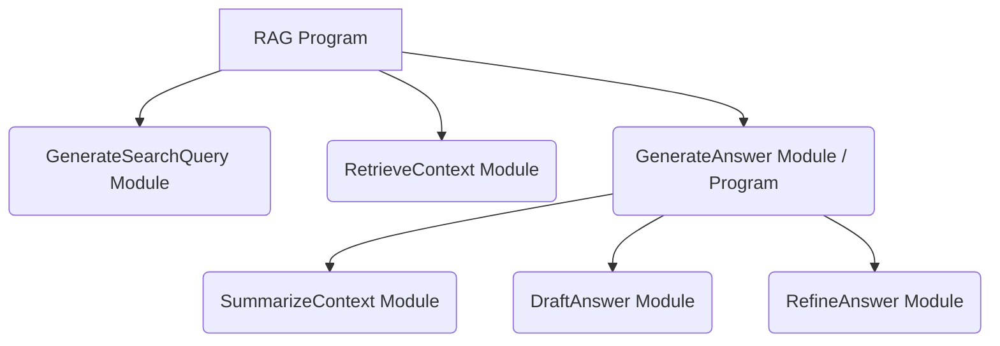
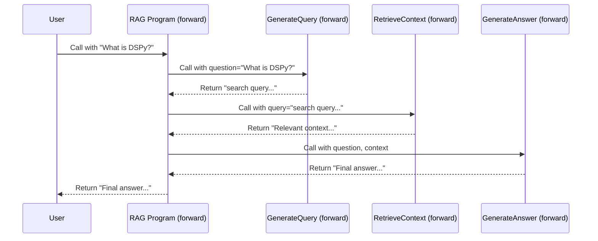

# Chapter 1: Modules and Programs: Building Blocks of DSPy

Welcome to the first chapter of our journey into DSPy! We're excited to have you here.

Imagine you want to build something cool with AI, like a smart assistant that can answer questions based on your documents. This involves several steps: understanding the question, finding the right information in the documents, and then crafting a clear answer. How do you organize all these steps in your code?

That's where **Modules** and **Programs** come in! They are the fundamental building blocks in DSPy, helping you structure your AI applications cleanly and effectively.

Think of it like building with **Lego bricks**:

*   A **`Module`** is like a single Lego brick. It's a basic unit that performs a specific, small task.
*   A **`Program`** is like your final Lego creation (a car, a house). It's built by combining several Lego bricks (`Module`s) together in a specific way to achieve a bigger goal.

In this chapter, we'll learn:

*   What a `Module` is and what it does.
*   How `Program`s use `Module`s to solve complex tasks.
*   How they create structure and manage the flow of information.

Let's start building!

## What is a `Module`?

A `dspy.Module` is the most basic building block in DSPy. Think of it as:

*   **A Function:** Like a function in Python, it takes some input, does something, and produces an output.
*   **A Lego Brick:** It performs one specific job.
*   **A Specialist:** It often specializes in one task, frequently involving interaction with a powerful AI model like a Language Model ([LM](05_lm__language_model_client_.md)) or a Retrieval Model ([RM](06_rm__retrieval_model_client_.md)). We'll learn more about LMs and RMs later!

The key idea is **encapsulation**. A `Module` bundles a piece of logic together, hiding the internal complexity. You just need to know what it does, not necessarily *every single detail* of how it does it.

Every `Module` has two main parts:

1.  `__init__`: This is where you set up the module, like defining any internal components or settings it needs.
2.  `forward`: This is where the main logic happens. It defines *what the module does* when you call it with some input.

Let's look at a conceptual example. DSPy provides pre-built modules. One common one is `dspy.Predict`, which is designed to call a Language Model to generate an output based on some input, following specific instructions.

```python
import dspy

# Conceptual structure of a simple Module like dspy.Predict
class BasicPredict(dspy.Module): # Inherits from dspy.Module
    def __init__(self, instructions):
        super().__init__() # Important initialization
        self.instructions = instructions
        # In a real DSPy module, we'd set up LM connection here
        # self.lm = ... (connect to language model)

    def forward(self, input_data):
        # 1. Combine instructions and input_data
        prompt = self.instructions + "\nInput: " + input_data + "\nOutput:"

        # 2. Call the Language Model (LM) with the prompt
        # lm_output = self.lm(prompt) # Simplified call
        lm_output = f"Generated answer for '{input_data}' based on instructions." # Dummy output

        # 3. Return the result
        return lm_output

# How you might use it (conceptual)
# predictor = BasicPredict(instructions="Translate the input to French.")
# french_text = predictor(input_data="Hello")
# print(french_text) # Might output: "Generated answer for 'Hello' based on instructions."
```

In this simplified view:

*   `BasicPredict` inherits from `dspy.Module`. All your custom modules will do this.
*   `__init__` stores the `instructions`. Real DSPy modules might initialize connections to LMs or load settings here.
*   `forward` defines the core task: combining instructions and input, (conceptually) calling an LM, and returning the result.

Don't worry about the LM details yet! The key takeaway is that a `Module` wraps a specific piece of work, defined in its `forward` method. DSPy provides useful pre-built modules like `dspy.Predict` and `dspy.ChainOfThought` (which encourages step-by-step reasoning), and you can also build your own.

## What is a `Program`?

Now, what if your task is more complex than a single LM call? For instance, answering a question based on documents might involve:

1.  Understanding the `question`.
2.  Generating search queries based on the `question`.
3.  Using a Retrieval Model ([RM](06_rm__retrieval_model_client_.md)) to find relevant `context` documents using the queries.
4.  Using a Language Model ([LM](05_lm__language_model_client_.md)) to generate the final `answer` based on the `question` and `context`.

This is too much for a single simple `Module`. We need to combine multiple modules!

This is where a `Program` comes in. **Technically, a `Program` in DSPy is also just a `dspy.Module`!** The difference is in how we use it: a `Program` is typically a `Module` that *contains and coordinates other `Module`s*.

Think back to the Lego analogy:

*   Small `Module`s are like bricks for the engine, wheels, and chassis.
*   The `Program` is the main `Module` representing the whole car, defining how the engine, wheels, and chassis bricks connect and work together in its `forward` method.

A `Program` defines the **data flow** between its sub-modules. It orchestrates the sequence of operations.

Let's sketch out a simple `Program` for our question-answering example:

```python
import dspy

# Assume we have these pre-built or custom Modules (simplified)
class GenerateSearchQuery(dspy.Module):
    def forward(self, question):
        # Logic to create search queries from the question
        print(f"Generating query for: {question}")
        return f"search query for '{question}'"

class RetrieveContext(dspy.Module):
    def forward(self, query):
        # Logic to find documents using the query
        print(f"Retrieving context for: {query}")
        return f"Relevant context document about '{query}'"

class GenerateAnswer(dspy.Module):
    def forward(self, question, context):
        # Logic to generate answer using question and context
        print(f"Generating answer for: {question} using context: {context}")
        return f"Final answer about '{question}' based on context."

# Now, let's build the Program (which is also a Module!)
class RAG(dspy.Module): # RAG = Retrieval-Augmented Generation
    def __init__(self):
        super().__init__()
        # Initialize the sub-modules it will use
        self.generate_query = GenerateSearchQuery()
        self.retrieve = RetrieveContext()
        self.generate_answer = GenerateAnswer()

    def forward(self, question):
        # Define the flow of data through the sub-modules
        print("\n--- RAG Program Start ---")
        search_query = self.generate_query(question=question)
        context = self.retrieve(query=search_query)
        answer = self.generate_answer(question=question, context=context)
        print("--- RAG Program End ---")
        return answer

# How to use the Program
rag_program = RAG()
final_answer = rag_program(question="What is DSPy?")
print(f"\nFinal Output: {final_answer}")
```

If you run this conceptual code, you'd see output like:

```
--- RAG Program Start ---
Generating query for: What is DSPy?
Retrieving context for: search query for 'What is DSPy?'
Generating answer for: What is DSPy? using context: Relevant context document about 'search query for 'What is DSPy?''
--- RAG Program End ---

Final Output: Final answer about 'What is DSPy?' based on context.
```

See how the `RAG` program works?

1.  In `__init__`, it creates instances of the smaller modules it needs (`GenerateSearchQuery`, `RetrieveContext`, `GenerateAnswer`).
2.  In `forward`, it calls these modules *in order*, passing the output of one as the input to the next. It defines the workflow!

## Hierarchical Structure

Modules can contain other modules, which can contain *even more* modules! This allows you to build complex systems by breaking them down into manageable, hierarchical parts.

Imagine our `GenerateAnswer` module was actually quite complex. Maybe it first summarizes the context, then drafts an answer, then refines it. We could implement `GenerateAnswer` as *another* program containing these sub-modules!



This diagram shows how the `RAG` program uses `GenerateAnswer`, which itself could be composed of smaller modules like `SummarizeContext`, `DraftAnswer`, and `RefineAnswer`. This nesting makes complex systems easier to design, understand, and debug.

## How It Works Under the Hood (A Tiny Peek)

You don't need to know the deep internals right now, but it's helpful to have a basic mental model.

1.  **Foundation:** All DSPy modules, whether simple bricks or complex programs, inherit from a base class (`dspy.primitives.module.BaseModule`). This provides common functionality like saving, loading, and finding internal parameters (we'll touch on saving/loading later).
2.  **Execution:** When you call a module (e.g., `rag_program(question="...")`), Python executes its `__call__` method. In DSPy, this typically just calls the `forward` method you defined.
3.  **Orchestration:** If a module's `forward` method calls other modules (like in our `RAG` example), it simply executes their `forward` methods in turn, passing the data as defined in the code.

Here's a simplified sequence of what happens when we call `rag_program("What is DSPy?")`:



The core files involved are:

*   `primitives/module.py`: Defines the `BaseModule` class, the ancestor of all modules.
*   `primitives/program.py`: Defines the `Module` class (which you inherit from) itself, adding core methods like `__call__` that invokes `forward`.

You can see from the code snippets provided earlier (like `ChainOfThought` or `Predict`) that they inherit from `dspy.Module` and define `__init__` and `forward`, just like our examples.

```python
# Snippet from dspy/primitives/program.py (Simplified)
from dspy.primitives.module import BaseModule

class Module(BaseModule): # Inherits from BaseModule
    def __init__(self):
        super()._base_init()
        # ... initialization ...

    def forward(self, *args, **kwargs):
        # This is where the main logic of the module goes.
        # Users override this method in their own modules.
        raise NotImplementedError # Needs to be implemented by subclasses

    def __call__(self, *args, **kwargs):
        # When you call module_instance(), this runs...
        # ...and typically calls self.forward()
        return self.forward(*args, **kwargs)

# You write classes like this:
class MyModule(dspy.Module):
    def __init__(self):
        super().__init__()
        # Your setup

    def forward(self, input_data):
        # Your logic
        result = ...
        return result
```

The important part is the pattern: inherit from `dspy.Module`, set things up in `__init__`, and define the core logic in `forward`.

## Conclusion

Congratulations! You've learned about the fundamental organizing principle in DSPy: **Modules** and **Programs**.

*   **Modules** are the basic building blocks, like Lego bricks, often handling a specific task (maybe calling an [LM](05_lm__language_model_client_.md) or [RM](06_rm__retrieval_model_client_.md)).
*   **Programs** are also Modules, but they typically combine *other* modules to orchestrate a more complex workflow, defining how data flows between them.
*   The `forward` method is key – it contains the logic of what a module *does*.
*   This structure allows you to build complex AI systems in a clear, manageable, and hierarchical way.

Now that we understand how modules provide structure, how do they know what kind of input data they expect and what kind of output data they should produce? That's where **Signatures** come in!

Let's dive into that next!

**Next:** [Chapter 2: Signature](02_signature.md)

---

Generated by [AI Codebase Knowledge Builder](https://github.com/The-Pocket/Tutorial-Codebase-Knowledge)