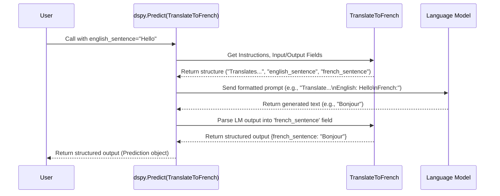

# Chapter 2: Signatures - Defining the Task

In [Chapter 1: Modules and Programs](01_module___program.md), we learned that `Module`s are like Lego bricks that perform specific tasks, often using Language Models ([LM](05_lm__language_model_client_.md)). We saw how `Program`s combine these modules.

But how does a `Module`, especially one using an LM like `dspy.Predict`, know *exactly* what job to do?

Imagine you ask a chef (our LM) to cook something. Just saying "cook" isn't enough! You need to tell them:
1.  **What ingredients to use** (the inputs).
2.  **What dish to make** (the outputs).
3.  **The recipe or instructions** (how to make it).

This is precisely what a **`Signature`** does in DSPy!

A `Signature` acts like a clear recipe or contract for a DSPy `Module`. It defines:

*   **Input Fields:** What information the module needs to start its work.
*   **Output Fields:** What information the module is expected to produce.
*   **Instructions:** Natural language guidance (like a recipe!) telling the underlying LM *how* to transform the inputs into the outputs.

Think of it as specifying the 'shape' and 'purpose' of a module, making sure everyone (you, DSPy, and the LM) understands the task.

## Why Do We Need Signatures?

Without a clear definition, how would a module like `dspy.Predict` know what to ask the LM?

Let's say we want a module to translate English text to French. We need to tell it:
*   It needs an `english_sentence` as input.
*   It should produce a `french_sentence` as output.
*   The *task* is to translate the input sentence into French.

A `Signature` bundles all this information together neatly.

## Defining a Signature: The Recipe Card

The most common way to define a Signature is by creating a Python class that inherits from `dspy.Signature`.

Let's create our English-to-French translation signature:

```python
import dspy
from dspy.signatures.field import InputField, OutputField

class TranslateToFrench(dspy.Signature):
    """Translates English text to French.""" # <-- These are the Instructions!

    # Define the Input Field the module expects
    english_sentence = dspy.InputField(desc="The original sentence in English")

    # Define the Output Field the module should produce
    french_sentence = dspy.OutputField(desc="The translated sentence in French")

```

Let's break this down:

1.  **`class TranslateToFrench(dspy.Signature):`**: We declare a new class named `TranslateToFrench` that inherits from `dspy.Signature`. This tells DSPy it's a signature definition.
2.  **`"""Translates English text to French."""`**: This is the **docstring**. It's crucial! DSPy uses this docstring as the natural language **Instructions** for the LM. It tells the LM the *goal* of the task.
3.  **`english_sentence = dspy.InputField(...)`**: We define an input field named `english_sentence`. `dspy.InputField` marks this as required input. The `desc` provides a helpful description (good for documentation and potentially useful for the LM later).
4.  **`french_sentence = dspy.OutputField(...)`**: We define an output field named `french_sentence`. `dspy.OutputField` marks this as the expected output. The `desc` describes what this field should contain.

That's it! We've created a reusable "recipe card" that clearly defines our translation task.

## How Modules Use Signatures

Now, how does a `Module` like `dspy.Predict` use this `TranslateToFrench` signature?

`dspy.Predict` is a pre-built module designed to take a signature and use an LM to generate the output fields based on the input fields and instructions.

Here's how you might use our signature with `dspy.Predict` (we'll cover `dspy.Predict` in detail in [Chapter 4](04_predict.md)):

```python
# Assume 'lm' is a configured Language Model client (more in Chapter 5)
# lm = dspy.OpenAI(model='gpt-3.5-turbo')
# dspy.settings.configure(lm=lm)

# Create an instance of dspy.Predict, giving it our Signature
translator = dspy.Predict(TranslateToFrench)

# Call the predictor with the required input field
english = "Hello, how are you?"
result = translator(english_sentence=english)

# The result object will contain the output field defined in the signature
print(f"English: {english}")
# Assuming the LM works correctly, it might print:
# print(f"French: {result.french_sentence}") # => French: Bonjour, comment ça va?
```

In this (slightly simplified) example:

1.  `translator = dspy.Predict(TranslateToFrench)`: We create a `Predict` module. Crucially, we pass our `TranslateToFrench` **class** itself to it. `dspy.Predict` now knows the input/output fields and the instructions from the signature.
2.  `result = translator(english_sentence=english)`: When we call the `translator`, we provide the input data using the exact name defined in our signature (`english_sentence`).
3.  `result.french_sentence`: `dspy.Predict` uses the LM, guided by the signature's instructions and fields, to generate the output. It then returns an object where you can access the generated French text using the output field name (`french_sentence`).

The `Signature` acts as the bridge, ensuring the `Predict` module knows its job specification.

## How It Works Under the Hood (A Peek)

You don't need to memorize this, but understanding the flow helps! When a module like `dspy.Predict` uses a `Signature`:

1.  **Inspection:** The module looks at the `Signature` class (`TranslateToFrench` in our case).
2.  **Extract Info:** It identifies the `InputField`s (`english_sentence`), `OutputField`s (`french_sentence`), and the `Instructions` (the docstring: `"Translates English text to French."`).
3.  **Prompt Formatting:** When you call the module (e.g., `translator(english_sentence="Hello")`), it uses this information to build a prompt for the [LM](05_lm__language_model_client_.md). This prompt typically includes:
    *   The **Instructions**.
    *   Clearly labeled **Input Fields** and their values.
    *   Clearly labeled **Output Fields** (often just the names, indicating what the LM should generate).
4.  **LM Call:** The formatted prompt is sent to the configured LM.
5.  **Parsing Output:** The LM's response is received. DSPy tries to parse this response to extract the values for the defined `OutputField`s (like `french_sentence`).
6.  **Return Result:** A structured result object containing the parsed outputs is returned.

Let's visualize this flow:



The core logic for defining signatures resides in:

*   `dspy/signatures/signature.py`: Defines the base `Signature` class and the logic for handling instructions and fields.
*   `dspy/signatures/field.py`: Defines `InputField` and `OutputField`.

Modules like `dspy.Predict` (in `dspy/predict/predict.py`) contain the code to *read* these Signatures and interact with LMs accordingly.

```python
# Simplified view inside dspy/signatures/signature.py
from pydantic import BaseModel
from pydantic.fields import FieldInfo
# ... other imports ...

class SignatureMeta(type(BaseModel)):
    # Metaclass magic to handle fields and docstring
    def __new__(mcs, name, bases, namespace, **kwargs):
        # ... logic to find fields, handle docstring ...
        cls = super().__new__(mcs, name, bases, namespace, **kwargs)
        cls.__doc__ = cls.__doc__ or _default_instructions(cls) # Default instructions if none provided
        # ... logic to validate fields ...
        return cls

    @property
    def instructions(cls) -> str:
        # Retrieves the docstring as instructions
        return inspect.cleandoc(getattr(cls, "__doc__", ""))

    @property
    def input_fields(cls) -> dict[str, FieldInfo]:
        # Finds fields marked as input
        return cls._get_fields_with_type("input")

    @property
    def output_fields(cls) -> dict[str, FieldInfo]:
        # Finds fields marked as output
        return cls._get_fields_with_type("output")

class Signature(BaseModel, metaclass=SignatureMeta):
    # The base class you inherit from
    pass

# Simplified view inside dspy/signatures/field.py
import pydantic

def InputField(**kwargs):
    # Creates a Pydantic field marked as input for DSPy
    return pydantic.Field(**move_kwargs(**kwargs, __dspy_field_type="input"))

def OutputField(**kwargs):
    # Creates a Pydantic field marked as output for DSPy
    return pydantic.Field(**move_kwargs(**kwargs, __dspy_field_type="output"))

```

The key takeaway is that the `Signature` class structure (using `InputField`, `OutputField`, and the docstring) provides a standardized way for modules to understand the task specification.

## Conclusion

You've now learned about `Signatures`, the essential component for defining *what* a DSPy module should do!

*   A `Signature` specifies the **Inputs**, **Outputs**, and **Instructions** for a task.
*   It acts like a contract or recipe card for modules, especially those using LMs.
*   You typically define them by subclassing `dspy.Signature`, using `InputField`, `OutputField`, and a descriptive **docstring** for instructions.
*   Modules like `dspy.Predict` use Signatures to understand the task and generate appropriate prompts for the LM.

Signatures bring clarity and structure to LM interactions. But how do we provide concrete examples to help the LM learn or perform better? That's where `Examples` come in!

**Next:** [Chapter 3: Example](03_example.md)

---

Generated by [AI Codebase Knowledge Builder](https://github.com/The-Pocket/Tutorial-Codebase-Knowledge)