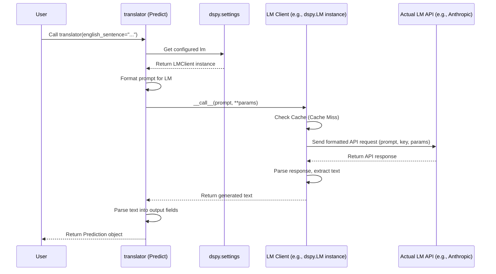

# Chapter 5: LM (Language Model Client) - The Engine Room

In [Chapter 4: Predict](04_predict.md), we saw how `dspy.Predict` takes a [Signature](02_signature.md) and input data to magically generate an output. We used our `translator` example:

```python
# translator = dspy.Predict(TranslateToFrench)
# result = translator(english_sentence="Hello, how are you?")
# print(result.french_sentence) # --> Bonjour, comment ça va?
```

But wait... how did `dspy.Predict` *actually* produce that French sentence? It didn't just invent it! It needed to talk to a powerful Language Model (LM) like GPT-3.5, GPT-4, Claude, Llama, or some other AI brain.

How does DSPy connect your program (`dspy.Predict` in this case) to these external AI brains? That's the job of the **LM (Language Model Client)** abstraction!

Think of the LM Client as:

*   **The Engine:** It's the core component that provides the "thinking" power to your DSPy modules.
*   **The Translator:** It speaks the specific language (API calls, parameters) required by different LM providers (like OpenAI, Anthropic, Cohere, Hugging Face, or models running locally).
*   **The Connection:** It bridges the gap between your abstract DSPy code and the concrete LM service.

In this chapter, you'll learn:

*   What the LM Client does and why it's crucial.
*   How to tell DSPy which Language Model to use.
*   How this setup lets you easily switch between different LMs.
*   A peek under the hood at how the connection works.

Let's connect our program to an AI brain!

## What Does the LM Client Do?

When a module like `dspy.Predict` needs an LM to generate text, it doesn't make the raw API call itself. Instead, it relies on the configured **LM Client**. The LM Client handles several important tasks:

1.  **API Interaction:** It knows how to format the request (the prompt, parameters like `temperature`, `max_tokens`) in the exact way the target LM provider expects. It then makes the actual network call to the provider's API (or interacts with a local model).
2.  **Parameter Management:** You can set standard parameters like `temperature` (controlling randomness) or `max_tokens` (limiting output length) when you configure the LM Client. It ensures these are sent correctly with each request.
3.  **Authentication:** It usually handles sending your API keys securely (often by reading them from environment variables).
4.  **Retries:** If an API call fails due to a temporary issue (like a network glitch or the LM service being busy), the LM Client often automatically retries the request a few times.
5.  **Standard Interface:** It provides a consistent way for DSPy modules (`Predict`, `ChainOfThought`, etc.) to interact with *any* supported LM. This means you can swap the underlying LM without changing your module code.
6.  **Caching:** To save time and money, the LM Client usually caches responses. If you make the exact same request again, it can return the saved result instantly instead of calling the LM API again.

Essentially, the LM Client abstracts away all the messy details of talking to different AI models, giving your DSPy program a clean and consistent engine to rely on.

## Configuring Which LM to Use

So, how do you tell DSPy *which* LM engine to use? You do this using `dspy.settings.configure`.

First, you need to import and create an instance of the specific client for your desired LM provider. DSPy integrates with many models primarily through the `litellm` library, but also provides direct wrappers for common ones like OpenAI.

**Example: Configuring OpenAI's GPT-3.5 Turbo**

Let's say you want to use OpenAI's `gpt-3.5-turbo` model.

1.  **Import the client:**
    ```python
    import dspy
    ```
    *(Note: For many common providers like OpenAI, Anthropic, Cohere, etc., you can use the general `dspy.LM` client which leverages `litellm`)*

2.  **Create an instance:** You specify the model name. API keys are typically picked up automatically from environment variables (e.g., `OPENAI_API_KEY`). You can also set default parameters here.

    ```python
    # Use the generic dspy.LM for LiteLLM integration
    # Model name follows 'provider/model_name' format for many models
    turbo = dspy.LM(model='openai/gpt-3.5-turbo', max_tokens=100)

    # Or, if you prefer the dedicated OpenAI client wrapper (functionally similar for basic use)
    # from dspy.models.openai import OpenAI
    # turbo = OpenAI(model='gpt-3.5-turbo', max_tokens=100)
    ```
    This creates an object `turbo` that knows how to talk to the `gpt-3.5-turbo` model via OpenAI's API (using `litellm`'s connection logic) and will limit responses to 100 tokens by default.

3.  **Configure DSPy settings:** You tell DSPy globally that this is the LM engine to use for subsequent calls.

    ```python
    dspy.settings.configure(lm=turbo)
    ```
    That's it! Now, any DSPy module (like `dspy.Predict`) that needs to call an LM will automatically use the `turbo` instance we just configured.

**Using Other Models (via `dspy.LM` and LiteLLM)**

The `dspy.LM` client is very powerful because it uses `litellm` under the hood, which supports a vast numberk of models from providers like Anthropic, Cohere, Google, Hugging Face, Ollama (for local models), and more. You generally just need to change the `model` string.

```python
# Example: Configure Anthropic's Claude 3 Haiku
# (Assumes ANTHROPIC_API_KEY environment variable is set)
# Note: Provider prefix 'anthropic/' is often optional if model name is unique
claude_haiku = dspy.LM(model='anthropic/claude-3-haiku-20240307', max_tokens=200)
dspy.settings.configure(lm=claude_haiku)

# Now DSPy modules will use Claude 3 Haiku

# Example: Configure a local model served via Ollama
# (Assumes Ollama server is running and has the 'llama3' model)
local_llama = dspy.LM(model='ollama/llama3', max_tokens=500, temperature=0.7)
dspy.settings.configure(lm=local_llama)

# Now DSPy modules will use the local Llama 3 model via Ollama
```

You only need to configure the LM **once** (usually at the start of your script).

## How Modules Use the Configured LM

Remember our `translator` module from [Chapter 4: Predict](04_predict.md)?

```python
# Define signature (same as before)
class TranslateToFrench(dspy.Signature):
    """Translates English text to French."""
    english_sentence = dspy.InputField()
    french_sentence = dspy.OutputField()

# Configure the LM (e.g., using OpenAI)
# turbo = dspy.LM(model='openai/gpt-3.5-turbo', max_tokens=100)
# dspy.settings.configure(lm=turbo)

# Create the Predict module
translator = dspy.Predict(TranslateToFrench)

# Use the module - NO need to pass the LM here!
result = translator(english_sentence="Hello, how are you?")
print(result.french_sentence)
```

Notice that we didn't pass `turbo` or `claude_haiku` or `local_llama` directly to `dspy.Predict`. When `translator(...)` is called, `dspy.Predict` internally asks `dspy.settings` for the currently configured `lm`. It then uses that client object to handle the actual LM interaction.

## The Power of Swapping LMs

This setup makes it incredibly easy to experiment with different language models. Want to see if Claude does a better job at translation than GPT-3.5? Just change the configuration!

```python
# --- Experiment 1: Using GPT-3.5 Turbo ---
print("Testing with GPT-3.5 Turbo...")
turbo = dspy.LM(model='openai/gpt-3.5-turbo', max_tokens=100)
dspy.settings.configure(lm=turbo)

translator = dspy.Predict(TranslateToFrench)
result_turbo = translator(english_sentence="Where is the library?")
print(f"GPT-3.5: {result_turbo.french_sentence}")


# --- Experiment 2: Using Claude 3 Haiku ---
print("\nTesting with Claude 3 Haiku...")
claude_haiku = dspy.LM(model='anthropic/claude-3-haiku-20240307', max_tokens=100)
dspy.settings.configure(lm=claude_haiku)

# We can reuse the SAME translator object, or create a new one
# It will pick up the NEWLY configured LM from settings
result_claude = translator(english_sentence="Where is the library?")
print(f"Claude 3 Haiku: {result_claude.french_sentence}")
```

**Expected Output:**

```
Testing with GPT-3.5 Turbo...
GPT-3.5: Où est la bibliothèque?

Testing with Claude 3 Haiku...
Claude 3 Haiku: Où se trouve la bibliothèque ?
```

Look at that! We changed the underlying AI brain just by modifying the `dspy.settings.configure` call. The core logic of our `translator` module remained untouched. This flexibility is a key advantage of DSPy.

## How It Works Under the Hood (A Peek)

Let's trace what happens when `translator(english_sentence=...)` runs:

1.  **Module Execution:** The `forward` method of the `dspy.Predict` module (`translator`) starts executing.
2.  **Get LM Client:** Inside its logic, `Predict` needs to call an LM. It accesses `dspy.settings.lm`. This returns the currently configured LM client object (e.g., the `claude_haiku` instance we set).
3.  **Format Prompt:** `Predict` uses the [Signature](02_signature.md) and the input (`english_sentence`) to prepare the text prompt.
4.  **LM Client Call:** `Predict` calls the LM client object, passing the formatted prompt and any necessary parameters (like `max_tokens` which might come from the client's defaults or be overridden). Let's say it calls `claude_haiku(prompt, max_tokens=100, ...)`.
5.  **API Interaction (Inside LM Client):**
    *   The `claude_haiku` object (an instance of `dspy.LM`) checks its cache first. If the same request was made recently, it might return the cached response directly.
    *   If not cached, it constructs the specific API request for Anthropic's Claude 3 Haiku model (using `litellm`). This includes setting headers, API keys, and formatting the prompt/parameters correctly for Anthropic.
    *   It makes the HTTPS request to the Anthropic API endpoint.
    *   It handles potential retries if the API returns specific errors.
    *   It receives the raw response from the API.
6.  **Parse Response (Inside LM Client):** The client extracts the generated text content from the API response structure.
7.  **Return to Module:** The LM client returns the generated text (e.g., `"Où se trouve la bibliothèque ?"`) back to the `dspy.Predict` module.
8.  **Module Finishes:** `Predict` takes this text, parses it according to the `OutputField` (`french_sentence`) in the signature, and returns the final `Prediction` object.

Here's a simplified sequence diagram:



**Relevant Code Files:**

*   `dspy/clients/lm.py`: Defines the main `dspy.LM` class which uses `litellm` for broad compatibility. It handles caching (in-memory and disk via `litellm`), retries, parameter mapping, and calling the appropriate `litellm` functions.
*   `dspy/clients/base_lm.py`: Defines the `BaseLM` abstract base class that all LM clients inherit from. It includes the basic `__call__` structure, history tracking, and requires subclasses to implement the core `forward` method for making the actual API call. It also defines `inspect_history`.
*   `dspy/models/openai.py` (and others like `anthropic.py`, `cohere.py` - though `dspy.LM` is often preferred now): Specific client implementations (often inheriting from `BaseLM` or using `dspy.LM` internally).
*   `dspy/dsp/utils/settings.py`: Defines the `Settings` singleton object where the configured `lm` (and other components like `rm`) are stored and accessed globally or via thread-local context.

```python
# Simplified structure from dspy/clients/base_lm.py
class BaseLM:
    def __init__(self, model, **kwargs):
        self.model = model
        self.kwargs = kwargs # Default params like temp, max_tokens
        self.history = [] # Stores records of calls

    @with_callbacks # Handles logging, potential custom hooks
    def __call__(self, prompt=None, messages=None, **kwargs):
        # 1. Call the actual request logic (implemented by subclasses)
        response = self.forward(prompt=prompt, messages=messages, **kwargs)

        # 2. Extract the output text(s)
        outputs = [choice.message.content for choice in response.choices] # Simplified

        # 3. Log the interaction (prompt, response, cost, etc.)
        #    (self.history.append(...))

        # 4. Return the list of generated texts
        return outputs

    def forward(self, prompt=None, messages=None, **kwargs):
        # Subclasses MUST implement this method to make the actual API call
        # It should return an object similar to OpenAI's API response structure
        raise NotImplementedError

# Simplified structure from dspy/clients/lm.py
import litellm

class LM(BaseLM): # Inherits from BaseLM
    def __init__(self, model, model_type="chat", ..., num_retries=8, **kwargs):
        super().__init__(model=model, **kwargs)
        self.model_type = model_type
        self.num_retries = num_retries
        # ... other setup ...

    def forward(self, prompt=None, messages=None, **kwargs):
        # Combine default and call-specific kwargs
        request_kwargs = {**self.kwargs, **kwargs}
        messages = messages or [{"role": "user", "content": prompt}]

        # Use litellm to make the call, handles different providers
        # Simplified - handles caching, retries, model types under the hood
        if self.model_type == "chat":
            response = litellm.completion(
                model=self.model,
                messages=messages,
                # Pass combined parameters
                **request_kwargs,
                # Configure retries and caching via litellm
                num_retries=self.num_retries,
                # cache=...
            )
        else: # Text completion model type
             response = litellm.text_completion(...) # Simplified

        # LiteLLM returns an object compatible with BaseLM's expectations
        return response

# Simplified Usage in a Module (like Predict)
# from dspy.dsp.utils import settings

# Inside Predict's forward method:
# lm_client = settings.lm # Get the globally configured client
# prompt_text = self._generate_prompt(...) # Format the prompt
# parameters = self.config # Get parameters specific to this Predict instance
# generated_texts = lm_client(prompt_text, **parameters) # Call the LM Client!
# output_text = generated_texts[0]
# parsed_result = self._parse_output(output_text) # Parse based on signature
# return Prediction(**parsed_result)
```

The key is that modules interact with the standard `BaseLM` interface (primarily its `__call__` method), and the specific LM client implementation handles the rest.

## Conclusion

You've now demystified the **LM (Language Model Client)**! It's the essential engine connecting your DSPy programs to the power of large language models.

*   The LM Client acts as a **translator** and **engine**, handling API calls, parameters, retries, and caching.
*   You configure which LM to use **globally** via `dspy.settings.configure(lm=...)`, usually using `dspy.LM` for broad compatibility via `litellm`.
*   DSPy modules like `dspy.Predict` automatically **use the configured LM** without needing it passed explicitly.
*   This makes it easy to **swap out different LMs** (like GPT-4, Claude, Llama) with minimal code changes, facilitating experimentation.

Now that we know how to connect to the "brain" (LM), what about connecting to external knowledge sources like databases or document collections? That's where the **RM (Retrieval Model Client)** comes in.

**Next:** [Chapter 6: RM (Retrieval Model Client)](06_rm__retrieval_model_client_.md)

---

Generated by [AI Codebase Knowledge Builder](https://github.com/The-Pocket/Tutorial-Codebase-Knowledge)