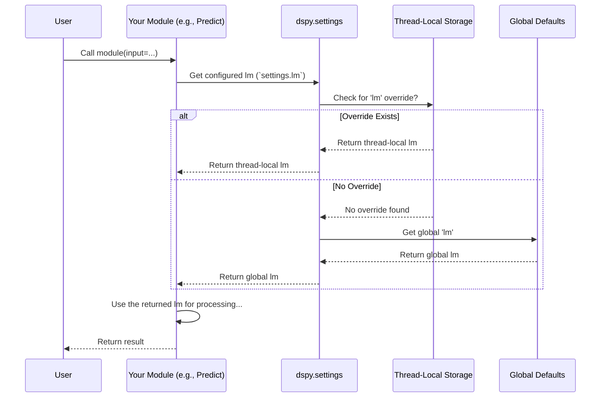

# Chapter 10: Settings - Your Program's Control Panel

Welcome to the final chapter of our introductory DSPy tutorial! In [Chapter 9: Adapter](09_adapter.md), we saw how Adapters act as translators, allowing our DSPy programs to communicate seamlessly with different types of Language Models (LMs).

Throughout the previous chapters, we've seen snippets like `dspy.settings.configure(lm=...)` and `dspy.settings.configure(rm=...)`. We mentioned that modules like `dspy.Predict` or `dspy.Retrieve` automatically find and use these configured components. But how does this central configuration work? How do we manage these important defaults for our entire project?

That's where **`dspy.settings`** comes in! It's the central control panel for your DSPy project.

Think of `dspy.settings` like the **Defaults menu** in a software application:
*   You set your preferred font, theme, or language once in the settings.
*   The entire application then uses these defaults unless you specifically choose something different for a particular document or window.

`dspy.settings` does the same for your DSPy programs. It holds the default [LM (Language Model Client)](05_lm__language_model_client_.md), [RM (Retrieval Model Client)](06_rm__retrieval_model_client_.md), and [Adapter](09_adapter.md) that your modules will use.

In this chapter, you'll learn:

*   Why a central settings object is useful.
*   How to configure global defaults using `dspy.settings.configure`.
*   How modules automatically use these settings.
*   How to temporarily override settings for specific parts of your code using `dspy.context`.

Let's learn how to manage our program's defaults!

## Why Use `dspy.settings`?

Imagine building a complex DSPy [Program](01_module___program.md) with many sub-modules that need to call an LM or an RM. Without a central settings object, you might have to pass the LM and RM instances explicitly to every single module during initialization or when calling them. This would be tedious and make your code harder to manage.

```python
# --- WITHOUT dspy.settings (Conceptual - DON'T DO THIS) ---
import dspy

# Assume lm_instance and rm_instance are created somewhere

class GenerateSearchQuery(dspy.Module):
    def __init__(self, lm): # Needs LM passed in
        self.predictor = dspy.Predict('question -> query', lm=lm) # Pass LM to Predict
    # ... forward ...

class RetrieveContext(dspy.Module):
    def __init__(self, rm): # Needs RM passed in
        self.retriever = dspy.Retrieve(rm=rm, k=3) # Pass RM to Retrieve
    # ... forward ...

# ... other modules needing lm or rm ...

class ComplexRAG(dspy.Module):
    def __init__(self, lm, rm): # Needs LM and RM passed in
        self.gen_query = GenerateSearchQuery(lm=lm) # Pass LM down
        self.retrieve = RetrieveContext(rm=rm)    # Pass RM down
        # ... other sub-modules needing lm or rm ...

    def forward(self, question, lm=None, rm=None): # Maybe pass them here too? Messy!
        # ... use sub-modules ...
```
This gets complicated quickly!

`dspy.settings` solves this by providing a single, global place to store these configurations. You configure it once, and all DSPy modules can access the defaults they need automatically.

## Configuring Global Defaults

The primary way to set defaults is using the `dspy.settings.configure` method. You typically do this once near the beginning of your script or application.

Let's set up a default LM and RM:

```python
import dspy

# 1. Create your LM and RM instances (as seen in Chapters 5 & 6)
# Example using OpenAI and a dummy RM
try:
    # Assumes OPENAI_API_KEY is set
    turbo = dspy.LM(model='openai/gpt-3.5-turbo-instruct', max_tokens=100)
except ImportError:
    print("Note: dspy[openai] not installed. Using dummy LM.")
    # Define a dummy LM if OpenAI isn't available
    class DummyLM(dspy.LM):
        def __init__(self): super().__init__(model="dummy")
        def basic_request(self, prompt, **kwargs): return {"choices": [{"text": "Dummy LM Response"}]}
        def __call__(self, prompt, **kwargs): return ["Dummy LM Response"]
    turbo = DummyLM()


# Dummy RM for demonstration
class DummyRM(dspy.Retrieve):
     def __init__(self, k=3): super().__init__(k=k)
     def forward(self, query, k=None):
         k = k if k is not None else self.k
         return dspy.Prediction(passages=[f"Dummy passage {i+1} for '{query}'" for i in range(k)])
my_rm = DummyRM(k=3)

# 2. Configure dspy.settings with these instances
dspy.settings.configure(lm=turbo, rm=my_rm)

# That's it! Defaults are now set globally.
print(f"Default LM: {dspy.settings.lm}")
print(f"Default RM: {dspy.settings.rm}")
```

**Output (example):**

```text
Default LM: LM(model='openai/gpt-3.5-turbo-instruct', temperature=0.0, max_tokens=100, ...) # Or DummyLM
Default RM: Retrieve(k=3) # Or DummyRM
```

Now, any `dspy.Predict`, `dspy.ChainOfThought`, or `dspy.Retrieve` module created *after* this configuration will automatically use `turbo` as the LM and `my_rm` as the RM, unless told otherwise explicitly.

## How Modules Use the Settings

Modules like `dspy.Predict` and `dspy.Retrieve` are designed to look for their required components (LM or RM) in `dspy.settings` if they aren't provided directly.

Consider `dspy.Predict`:

```python
import dspy
# Assume settings were configured as above

# Create a Predict module WITHOUT passing 'lm' explicitly
simple_predictor = dspy.Predict('input -> output')

# When we call it, it will automatically use dspy.settings.lm
result = simple_predictor(input="Tell me a fact.")
print(result.output)
```

**Output (using DummyLM):**

```text
Dummy LM Response
```

Inside its `forward` method, `dspy.Predict` essentially does this (simplified):

```python
# Simplified internal logic of dspy.Predict.forward()
def forward(self, **kwargs):
  # ... get signature, demos, config ...

  # Get the LM: Use 'lm' passed in kwargs, OR self.lm (if set), OR dspy.settings.lm
  lm_to_use = kwargs.pop("lm", self.lm) or dspy.settings.lm
  assert lm_to_use is not None, "No LM configured!"

  # ... format prompt using signature/demos/inputs ...
  # ... call lm_to_use(prompt, ...) ...
  # ... parse output ...
  # ... return Prediction ...
```

Similarly, `dspy.Retrieve` looks for `dspy.settings.rm`:

```python
import dspy
# Assume settings were configured as above

# Create a Retrieve module WITHOUT passing 'rm' explicitly
retriever = dspy.Retrieve() # Uses default k=3 from DummyRM initialization

# When called, it uses dspy.settings.rm
results = retriever(query="DSPy benefits")
print(results.passages)
```

**Output (using DummyRM):**

```text
["Dummy passage 1 for 'DSPy benefits'", "Dummy passage 2 for 'DSPy benefits'", "Dummy passage 3 for 'DSPy benefits'"]
```

This automatic lookup makes your program code much cleaner, as you don't need to thread the `lm` and `rm` objects through every part of your application.

## Temporary Overrides with `dspy.context`

Sometimes, you might want to use a *different* LM or RM for just a specific part of your code, without changing the global default. For example, maybe you want to use a more powerful (and expensive) LM like GPT-4 for a critical reasoning step, while using a cheaper LM like GPT-3.5 for the rest of the program.

You can achieve this using the `dspy.settings.context` context manager. Changes made inside a `with dspy.settings.context(...)` block are **thread-local** and only last until the block exits.

```python
import dspy

# Assume global settings have 'turbo' (GPT-3.5 or Dummy) as the LM
# dspy.settings.configure(lm=turbo, rm=my_rm)

print(f"Outside context: {dspy.settings.lm}")

# Let's create a more powerful (dummy) LM for demonstration
class DummyGPT4(dspy.LM):
    def __init__(self): super().__init__(model="dummy-gpt4")
    def basic_request(self, prompt, **kwargs): return {"choices": [{"text": "GPT-4 Dummy Response"}]}
    def __call__(self, prompt, **kwargs): return ["GPT-4 Dummy Response"]
gpt4_dummy = DummyGPT4()

# Use dspy.context to temporarily switch the LM
with dspy.settings.context(lm=gpt4_dummy, rm=None): # Temporarily set lm, unset rm
    print(f"Inside context: {dspy.settings.lm}")
    print(f"Inside context (RM): {dspy.settings.rm}")

    # Modules used inside this block will use the temporary settings
    predictor_in_context = dspy.Predict('input -> output')
    result_in_context = predictor_in_context(input="Complex reasoning task")
    print(f"Prediction in context: {result_in_context.output}")

    # Trying to use RM here would fail as it's None in this context
    # retriever_in_context = dspy.Retrieve()
    # retriever_in_context(query="something") # This would raise an error

# Settings revert back automatically outside the block
print(f"Outside context again: {dspy.settings.lm}")
print(f"Outside context again (RM): {dspy.settings.rm}")
```

**Output (example):**

```text
Outside context: LM(model='openai/gpt-3.5-turbo-instruct', ...) # Or DummyLM
Inside context: LM(model='dummy-gpt4', ...)
Inside context (RM): None
Prediction in context: GPT-4 Dummy Response
Outside context again: LM(model='openai/gpt-3.5-turbo-instruct', ...) # Or DummyLM
Outside context again (RM): Retrieve(k=3) # Or DummyRM
```

Inside the `with` block, `dspy.settings.lm` temporarily pointed to `gpt4_dummy`, and `dspy.settings.rm` was temporarily `None`. The `predictor_in_context` used the temporary LM. Once the block ended, the settings automatically reverted to the global defaults.

This is crucial for writing clean code where different parts might need different configurations, and also essential for how DSPy's optimizers ([Chapter 8: Teleprompter / Optimizer](08_teleprompter___optimizer.md)) work internally to manage different model configurations during optimization.

## How It Works Under the Hood

`dspy.settings` uses a combination of global variables and thread-local storage to manage configurations.

1.  **Global Defaults:** There's a primary configuration dictionary (`main_thread_config`) that holds the settings configured by `dspy.settings.configure()`.
2.  **Ownership:** To prevent race conditions in multi-threaded applications, only the *first* thread that calls `configure` becomes the "owner" and is allowed to make further global changes using `configure`.
3.  **Thread-Local Overrides:** `dspy.settings.context()` uses Python's `threading.local` storage. When you enter a `with dspy.settings.context(...)` block, it stores the specified overrides (`lm=gpt4_dummy`, etc.) in a place specific to the current thread.
4.  **Attribute Access:** When code accesses `dspy.settings.lm`, the `Settings` object first checks if there's an override for `lm` in the current thread's local storage.
    *   If yes, it returns the thread-local override.
    *   If no, it returns the value from the global `main_thread_config`.
5.  **Context Exit:** When the `with` block finishes, the `context` manager restores the thread-local storage to its state *before* the block was entered, effectively removing the temporary overrides for that thread.

**Sequence Diagram: Module Accessing Settings**



This mechanism ensures that global settings are the default, but thread-specific overrides via `dspy.context` take precedence when active, providing both convenience and flexibility.

**Relevant Code Files:**

*   `dspy/dsp/utils/settings.py`: Defines the `Settings` class, the `DEFAULT_CONFIG`, manages global state (`main_thread_config`, `config_owner_thread_id`), uses `threading.local` for overrides, and implements the `configure` method and the `context` context manager.

```python
# Simplified view from dspy/dsp/utils/settings.py
import copy
import threading
from contextlib import contextmanager
# from dspy.dsp.utils.utils import dotdict # Simplified as dict

DEFAULT_CONFIG = dict(lm=None, rm=None, adapter=None, ...) # Default values

# Global state
main_thread_config = copy.deepcopy(DEFAULT_CONFIG)
config_owner_thread_id = None
global_lock = threading.Lock()

# Thread-local storage for overrides
class ThreadLocalOverrides(threading.local):
    def __init__(self):
        self.overrides = {}
thread_local_overrides = ThreadLocalOverrides()

class Settings:
    _instance = None
    def __new__(cls): # Singleton pattern
        if cls._instance is None: cls._instance = super().__new__(cls)
        return cls._instance

    # When you access settings.lm or settings['lm']
    def __getattr__(self, name):
        # Check thread-local overrides first
        overrides = getattr(thread_local_overrides, "overrides", {})
        if name in overrides: return overrides[name]
        # Fall back to global config
        elif name in main_thread_config: return main_thread_config[name]
        else: raise AttributeError(f"'Settings' object has no attribute '{name}'")

    def __getitem__(self, key): return self.__getattr__(key)

    # dspy.settings.configure(...)
    def configure(self, **kwargs):
        global main_thread_config, config_owner_thread_id
        current_thread_id = threading.get_ident()

        with global_lock: # Ensure thread safety for configuration
            if config_owner_thread_id is None: config_owner_thread_id = current_thread_id
            elif config_owner_thread_id != current_thread_id:
                raise RuntimeError("dspy.settings can only be changed by the thread that initially configured it.")

        # Update global config
        for k, v in kwargs.items(): main_thread_config[k] = v

    # with dspy.settings.context(...)
    @contextmanager
    def context(self, **kwargs):
        # Save current overrides
        original_overrides = getattr(thread_local_overrides, "overrides", {}).copy()
        # Create new overrides for this context (combining global + old local + new)
        new_overrides = {**main_thread_config, **original_overrides, **kwargs}
        # Apply new overrides to thread-local storage
        thread_local_overrides.overrides = new_overrides
        try:
            yield # Code inside the 'with' block runs here
        finally:
            # Restore original overrides when exiting the block
            thread_local_overrides.overrides = original_overrides

# The global instance you use
settings = Settings()
```

This structure elegantly handles both global defaults and safe, temporary, thread-specific overrides.

## Conclusion

Congratulations! You've reached the end of this introductory DSPy tutorial and learned about `dspy.settings`, the central control panel.

*   `dspy.settings` holds **global default configurations** like the [LM](05_lm__language_model_client_.md), [RM](06_rm__retrieval_model_client_.md), and [Adapter](09_adapter.md).
*   You configure it **once** using `dspy.settings.configure(lm=..., rm=...)`.
*   DSPy modules like `dspy.Predict` and `dspy.Retrieve` automatically **use these defaults**, simplifying your code.
*   `dspy.context` allows for **temporary, thread-local overrides**, providing flexibility without affecting the global state.

By mastering these 10 chapters, you've gained a solid foundation in the core concepts of DSPy:

1.  Structuring programs with [Modules and Programs](01_module___program.md).
2.  Defining tasks with [Signatures](02_signature.md).
3.  Representing data with [Examples](03_example.md).
4.  Making basic LM calls with [Predict](04_predict.md).
5.  Connecting to AI brains with [LM Clients](05_lm__language_model_client_.md).
6.  Accessing external knowledge with [RM Clients](06_rm__retrieval_model_client_.md).
7.  Measuring performance with [Evaluate](07_evaluate.md).
8.  Automating optimization with [Teleprompters](08_teleprompter___optimizer.md).
9.  Ensuring compatibility with [Adapters](09_adapter.md).
10. Managing configuration with [Settings](10_settings.md).

You're now equipped to start building, evaluating, and optimizing your own sophisticated language model pipelines with DSPy. Happy programming!

---

Generated by [AI Codebase Knowledge Builder](https://github.com/The-Pocket/Tutorial-Codebase-Knowledge)