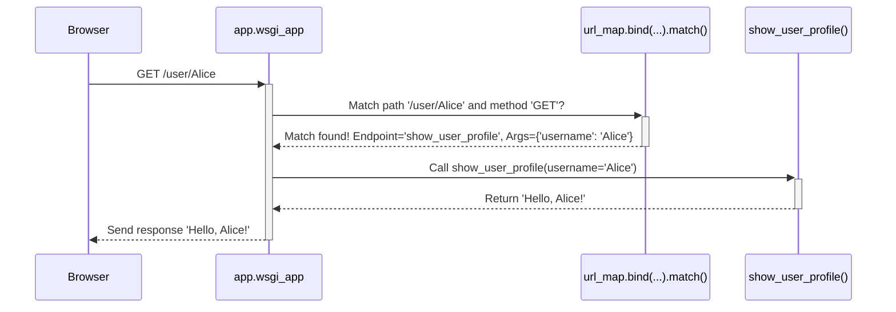

# Chapter 2: Routing System

Welcome back! In [Chapter 1: Application Object (`Flask`)](01_application_object___flask__.md), we learned how to create the central `app` object, the control tower for our Flask application. We even added a simple "Hello, World!" page using `@app.route('/')`.

But how did Flask know that visiting the homepage (`/`) should run our `index()` function? And how can we create more pages, like an "About Us" page at `/about`? That's where the **Routing System** comes in.

## What Problem Does It Solve? The Need for Directions

Imagine you have a website with multiple pages: a homepage, an about page, a contact page, maybe even pages for individual user profiles. When a user types a URL like `http://yourwebsite.com/about` into their browser, how does your Flask application know *which* piece of Python code should handle this request and generate the "About Us" content?

You need a system to map these incoming URLs to the specific Python functions that generate the response for each page. Think of it like a city map's index:

*   **URL:** The street address you want to find (e.g., `/about`).
*   **Routing System:** The index in the map book.
*   **View Function:** The specific page number in the map book that shows the details for that address.

Flask's routing system, largely powered by a library called Werkzeug, acts as this index. It lets you define URL patterns (like `/` or `/about` or `/user/<username>`) and connect them to your Python functions (called **view functions**).

## Defining Routes with `@app.route()`

In Flask, the most common way to define these URL-to-function mappings is using the `@app.route()` decorator, which we briefly saw in Chapter 1.

Let's revisit our `hello.py` and add an "About" page.

1.  We keep the route for the homepage (`/`).
2.  We add a *new* route for `/about`.

```python
# hello.py

from flask import Flask

# Create the application object from Chapter 1
app = Flask(__name__)

# Route for the homepage
@app.route('/')
def index():
  return 'Welcome to the Homepage!'

# NEW: Route for the about page
@app.route('/about')
def about():
  return 'This is the About Us page.'

# Code to run the app (from Chapter 1)
if __name__ == '__main__':
  app.run(debug=True)
```

**Explanation:**

*   `@app.route('/')`: This tells Flask: "If a request comes in for the URL path `/`, execute the function directly below (`index`)."
*   `@app.route('/about')`: This tells Flask: "If a request comes in for the URL path `/about`, execute the function directly below (`about`)."
*   `def index(): ...` and `def about(): ...`: These are our **view functions**. They contain the Python code that runs for their respective routes and must return the response to send back to the browser.

**Running this:**

1.  Save the code as `hello.py`.
2.  Run `python hello.py` in your terminal.
3.  Visit `http://127.0.0.1:5000/` in your browser. You should see "Welcome to the Homepage!".
4.  Visit `http://127.0.0.1:5000/about`. You should see "This is the About Us page.".

See? The routing system directed each URL to the correct view function!

## Dynamic Routes: Using Variables in URLs

What if you want pages that change based on the URL? For example, a profile page for different users like `/user/alice` and `/user/bob`. You don't want to write a new view function for every single user!

Flask allows you to define *variable parts* in your URL rules using angle brackets `< >`.

Let's create a dynamic route to greet users:

```python
# hello.py (continued)

# ... (keep Flask import, app creation, index, and about routes) ...

# NEW: Dynamic route for user profiles
@app.route('/user/<username>')
def show_user_profile(username):
  # The 'username' variable from the URL is passed to the function!
  return f'Hello, {username}!'

# ... (keep the if __name__ == '__main__': block) ...
```

**Explanation:**

*   `@app.route('/user/<username>')`:
    *   The `/user/` part is fixed.
    *   `<username>` is a **variable placeholder**. Flask will match any text here (like `alice`, `bob`, `123`) and capture it.
*   `def show_user_profile(username):`:
    *   Notice the function now accepts an argument named `username`. This **must match** the variable name used in the angle brackets in the route.
    *   Flask automatically passes the value captured from the URL to this argument.
*   `return f'Hello, {username}!'`: We use an f-string to include the captured username in the response.

**Running this:**

1.  Save the updated `hello.py` (make sure `debug=True` is still set so the server restarts).
2.  Visit `http://127.0.0.1:5000/user/Alice`. You should see "Hello, Alice!".
3.  Visit `http://127.0.0.1:5000/user/Bob`. You should see "Hello, Bob!".

Flask's routing system matched both URLs to the same rule (`/user/<username>`) and passed the different usernames (`'Alice'`, `'Bob'`) to the `show_user_profile` function.

## Specifying Data Types: Converters

By default, variables captured from the URL are treated as strings. But what if you need a number? For example, displaying blog post number 5 at `/post/5`. You might want Flask to ensure that only numbers are accepted for that part of the URL.

You can specify a **converter** inside the angle brackets using `<converter:variable_name>`.

Let's add a route for blog posts using the `int` converter:

```python
# hello.py (continued)

# ... (keep previous code) ...

# NEW: Route for displaying a specific blog post by ID
@app.route('/post/<int:post_id>')
def show_post(post_id):
  # Flask ensures post_id is an integer and passes it here
  # Note: We are just showing the ID, not actually fetching a post
  return f'Showing Post Number: {post_id} (Type: {type(post_id).__name__})'

# ... (keep the if __name__ == '__main__': block) ...
```

**Explanation:**

*   `@app.route('/post/<int:post_id>')`:
    *   `<int:post_id>` tells Flask: "Match this part of the URL, but only if it looks like an integer. Convert it to an integer and pass it as the `post_id` variable."
*   `def show_post(post_id):`: The `post_id` argument will now receive an actual Python `int`.

**Running this:**

1.  Save the updated `hello.py`.
2.  Visit `http://127.0.0.1:5000/post/123`. You should see "Showing Post Number: 123 (Type: int)".
3.  Visit `http://127.0.0.1:5000/post/abc`. You'll get a "Not Found" error! Why? Because `abc` doesn't match the `int` converter, so Flask doesn't consider this URL to match the rule.

Common converters include:

*   `string`: (Default) Accepts any text without a slash.
*   `int`: Accepts positive integers.
*   `float`: Accepts positive floating-point values.
*   `path`: Like `string` but also accepts slashes (useful for matching file paths).
*   `uuid`: Accepts UUID strings.

## Under the Hood: How Does Routing Work?

You don't *need* to know the deep internals, but understanding the basics helps.

When you define routes using `@app.route()`, Flask doesn't immediately check URLs. Instead, it builds a map, like pre-compiling that map index we talked about.

1.  **Building the Map:**
    *   When you create your `app = Flask(__name__)` ([Chapter 1](01_application_object___flask__.md)), Flask initializes an empty `URLMap` object (from the Werkzeug library, stored in `app.url_map`). See `Flask.__init__` in `app.py` which calls `super().__init__` in `sansio/app.py`, which creates the `self.url_map`.
    *   Each time you use `@app.route('/some/rule', ...)` or directly call `app.add_url_rule(...)` (see `sansio/scaffold.py`), Flask creates a `Rule` object (like `Rule('/user/<username>')`) describing the pattern, the allowed HTTP methods (GET, POST, etc.), the endpoint name (usually the function name), and any converters.
    *   This `Rule` object is added to the `app.url_map`.

2.  **Matching a Request:**
    *   When a request like `GET /user/Alice` arrives, Flask's `wsgi_app` method (in `app.py`) gets called.
    *   It uses the `app.url_map` and the incoming request environment (URL path, HTTP method) to find a matching `Rule`. Werkzeug's `MapAdapter.match()` method (created via `app.create_url_adapter` which calls `url_map.bind_to_environ`) does the heavy lifting here.
    *   If a match is found for `/user/<username>`, `match()` returns the endpoint name (e.g., `'show_user_profile'`) and a dictionary of the extracted variables (e.g., `{'username': 'Alice'}`). These get stored on the `request` object ([Chapter 3](03_request_and_response_objects.md)) as `request.url_rule` and `request.view_args`.
    *   If no rule matches, a "Not Found" (404) error is raised.

3.  **Dispatching to the View Function:**
    *   Flask's `app.dispatch_request()` method (in `app.py`) takes the endpoint name from `request.url_rule.endpoint`.
    *   It looks up the actual Python view function associated with that endpoint name in the `app.view_functions` dictionary (which `@app.route` also populated).
    *   It calls the view function, passing the extracted variables from `request.view_args` as keyword arguments (e.g., `show_user_profile(username='Alice')`).
    *   The return value of the view function becomes the response.

Here's a simplified diagram of the matching process:



The key takeaway is that `@app.route` builds a map upfront, and Werkzeug efficiently searches this map for each incoming request to find the right function and extract any variable parts.

## Conclusion

You've learned how Flask's **Routing System** acts as a map between URLs and the Python functions (view functions) that handle them.

*   We use the `@app.route()` decorator to define URL rules.
*   We can create static routes (like `/about`) and dynamic routes using variables (`/user/<username>`).
*   Converters (`<int:post_id>`) allow us to specify the expected data type for URL variables, providing automatic validation and conversion.
*   Under the hood, Flask and Werkzeug build a `URLMap` from these rules and use it to efficiently dispatch incoming requests to the correct view function.

Now that we know how to direct requests to the right functions, what information comes *with* a request (like form data or query parameters)? And how do we properly format the data we send *back*? That's where the Request and Response objects come in.

Let's dive into [Chapter 3: Request and Response Objects](03_request_and_response_objects.md).

---

Generated by [AI Codebase Knowledge Builder](https://github.com/The-Pocket/Tutorial-Codebase-Knowledge)