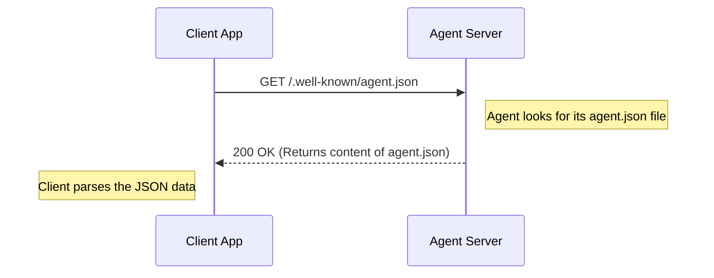

# Chapter 1: Agent Card - The AI's Business Card

Welcome to the Google Agent-to-Agent (A2A) Protocol tutorial! Imagine a world full of helpful AI assistants, or "agents." Maybe one agent is great at translating languages, another excels at summarizing long documents, and a third can book appointments. How do these agents, potentially built by different companies using different technologies, find each other and figure out how to work together?

That's where the **Agent Card** comes in. It solves the problem of **discovery** – how one agent or application can learn about another agent's existence, capabilities, and how to communicate with it.

Think of it like this:

*   **You want to hire a plumber.** How do you find one? You might look them up online, find their website, or get their business card. This tells you their name, what services they offer (fixing leaks, installing pipes), and how to contact them (phone number, address).
*   **An application (or another agent) wants to use an AI agent.** How does it find one? It looks for the agent's **Agent Card**.

## What is an Agent Card?

An **Agent Card** is a small, standardized file, usually named `agent.json`, that acts like a public profile or digital business card for an AI agent. It's typically hosted by the agent itself at a predictable web address.

This card contains essential information:

1.  **Who is the agent?** (Name, description, version, who made it)
2.  **What can it do?** (List of skills, like "translate_text" or "summarize_document")
3.  **How do I talk to it?** (The agent's web address/URL, what kind of inputs it understands - text, files, structured data?)
4.  **Does it have special features?** (Like supporting real-time updates via streaming?)

By reading this card, other agents or applications can quickly understand if this agent is the right one for a job and exactly how to start a conversation (or, in technical terms, initiate a [Task](02_task.md)).

## Finding and Reading the Card (Discovery)

Just like many websites have a standard `robots.txt` file to tell search engines what to do, A2A agents typically make their Agent Card available at a standard path: `/.well-known/agent.json`.

So, if an agent lives at `http://my-translator-agent.com`, its Agent Card would likely be found at `http://my-translator-agent.com/.well-known/agent.json`.

Let's see how a client application might fetch this card using Python.

```python
# File: demo/ui/utils/agent_card.py (simplified)
import requests # A library to make web requests
from common.types import AgentCard # A helper to understand the card's structure

def get_agent_card(remote_agent_address: str) -> AgentCard:
  """Gets the agent card from the agent's address."""
  agent_card_url = f"{remote_agent_address}/.well-known/agent.json"
  print(f"Fetching card from: {agent_card_url}")
  # Make a web request to get the file
  response = requests.get(agent_card_url)
  response.raise_for_status() # Check if the request was successful
  # Parse the JSON file content into an AgentCard object
  return AgentCard(**response.json())

# Example Usage:
agent_address = "http://example-agent.com" # Assume our agent is here
try:
  card = get_agent_card(agent_address)
  print(f"Got card for agent: {card.name}")
except requests.exceptions.RequestException as e:
  print(f"Could not fetch card: {e}")
```

**Explanation:**

1.  We define the `agent_address` where the agent lives.
2.  The function builds the full URL to the standard `agent.json` path.
3.  It uses the `requests` library to make an HTTP GET request, just like your web browser does when you visit a page.
4.  If the request is successful (HTTP status 200 OK), it takes the JSON text returned by the server and parses it into a structured `AgentCard` object that the program can easily use.

### Example `agent.json`

Here's a simplified example of what the `agent.json` file might look like:

```json
// File: /.well-known/agent.json (Example)
{
  "name": "Text Summarizer Bot",
  "description": "Summarizes long text documents.",
  "version": "1.0.0",
  "url": "http://example-agent.com/a2a", // Where to send tasks
  "capabilities": {
    "streaming": false // Doesn't support real-time updates
  },
  "defaultInputModes": ["text"], // Primarily accepts text
  "defaultOutputModes": ["text"], // Primarily outputs text
  "skills": [
    {
      "id": "summarize",
      "name": "Summarize Text",
      "description": "Provide text, get a short summary."
    }
  ],
  "provider": {
    "organization": "AI Helpers Inc."
  }
}
```

**Explanation:**

*   `name`, `description`, `version`, `provider`: Basic identification info.
*   `url`: The specific endpoint *within* the agent's server where A2A communication happens (we'll use this later when sending a [Task](02_task.md)).
*   `capabilities`: Tells us if it supports advanced features like `streaming`. This one doesn't.
*   `defaultInputModes`/`defaultOutputModes`: What kind of data it generally works with (here, just plain `text`).
*   `skills`: A list of specific things this agent can do. This one has a "summarize" skill.

## Under the Hood: The Discovery Flow

How does fetching the Agent Card actually work between the client and the agent (server)? It's a simple web request:



**Steps:**

1.  **Client Request:** The client application (e.g., our Python script) sends an HTTP GET request to the agent's base URL + `/.well-known/agent.json`.
2.  **Server Response:** The agent's server receives the request, finds its `agent.json` file, and sends its content back to the client with a success status (like `200 OK`).
3.  **Client Processing:** The client receives the JSON data and processes it to understand the agent's capabilities.

The provided sample code includes helper classes to make this easier:

*   **Python:** The `A2ACardResolver` class (`samples/python/common/client/card_resolver.py`) handles fetching and parsing the card.
*   **JavaScript:** The `cli.ts` sample (`samples/js/src/cli.ts`) uses the standard `fetch` API to get the card directly.

```typescript
// File: samples/js/src/cli.ts (Relevant Snippet)
async function fetchAndDisplayAgentCard() {
  const wellKnownUrl = new URL("/.well-known/agent.json", serverUrl).toString();
  console.log(`Attempting to fetch agent card from: ${wellKnownUrl}`);
  try {
    // Use browser's fetch to get the card
    const response = await fetch(wellKnownUrl);
    if (response.ok) {
      const card: AgentCard = await response.json(); // Parse JSON
      agentName = card.name || "Agent";
      console.log(`✓ Agent Card Found: ${agentName}`);
      // ... display other card info ...
    } else {
      console.log(`⚠️ Could not fetch agent card (Status: ${response.status})`);
    }
  } catch (error: any) {
    console.log(`⚠️ Error fetching agent card: ${error.message}`);
  }
}
```

This JavaScript code does essentially the same thing as the Python example: builds the URL, fetches the content, and parses the JSON if successful.

## Conclusion

The Agent Card is the cornerstone of discovery in the A2A protocol. It's the agent's public announcement, telling the world who it is, what it can do, and how to interact with it. By fetching and reading this simple `agent.json` file, clients can dynamically discover and prepare to communicate with diverse AI agents.

Now that we understand how to *find* an agent and learn its basic properties using the Agent Card, we need to learn how to actually *give it work* to do. This brings us to the concept of a **Task**.

Ready to learn how to ask an agent to perform an action? Let's move on to the next chapter!

**Next:** [Chapter 2: Task](02_task.md)

---

Generated by [AI Codebase Knowledge Builder](https://github.com/The-Pocket/Tutorial-Codebase-Knowledge)