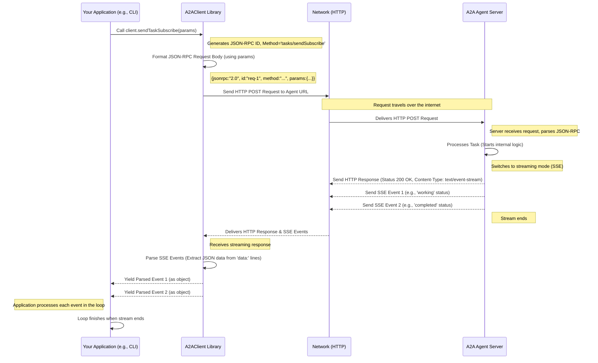

# Chapter 5: A2A Client Implementation

In the [previous chapter](04_a2a_server_implementation.md), we learned how to build the "embassy" for our AI agent – the **A2A Server**. This server listens for incoming requests, acting as the official entry point for our agent according to the A2A protocol rules.

But how does someone actually *visit* this embassy and make a request? If you build a fantastic translation agent server, how does your chat application, or another AI agent, actually *use* it to translate text?

This chapter tackles that problem: **How do we build the component that *initiates* communication with an A2A agent server?**

This is the job of the **A2A Client Implementation**.

## What is an A2A Client? The Agent's Customer

Think about how you use the web:

*   You want to visit a website (like `google.com`).
*   You open your **web browser** (like Chrome or Firefox).
*   You type the website's address into the browser.
*   The browser sends a request to the website's server.
*   The server sends back the webpage content.
*   Your browser receives the content and displays it to you.

In this scenario, your **web browser** is the **client**. It *starts* the conversation, knows how to format the request (using HTTP), sends it to the right address, and understands the server's response.

Similarly, an **A2A Client** is the software component that acts like that web browser, but specifically for talking to A2A agents:

1.  **Knows the Agent's Address:** It needs the URL of the agent's A2A server (which it might get from the agent's [Agent Card](01_agent_card.md)).
2.  **Speaks the Language:** It knows how to format requests according to the [A2A Protocol & Core Types](03_a2a_protocol___core_types.md), using JSON-RPC for commands like `tasks/send`.
3.  **Initiates the Call:** It sends these requests over the network (usually via HTTP POST) to the agent's server.
4.  **Understands the Reply:** It receives the server's JSON-RPC response, checks for success or errors, and parses the results (like the initial `Task` object or streaming updates).

Essentially, the A2A Client is the part of your application (or another agent) that *consumes* the services offered by an A2A agent server.

## Why Do We Need It?

Your application's core logic (e.g., the chat interface, the document summarizer UI) shouldn't need to worry about the messy details of JSON-RPC formatting, HTTP headers, or handling network connections.

The A2A Client acts as an **intermediary** or **adapter**. It provides a cleaner, simpler way for your application code to interact with a remote A2A agent. Your application can just say, "Client, please send this message to the agent," and the client handles all the protocol details.

## Using an A2A Client Library

Just like we used `A2AServer` libraries to simplify building the server in [Chapter 4](04_a2a_server_implementation.md), the `Google A2A` project provides `A2AClient` libraries to make building the client side easier.

Let's see how we might use these libraries in JavaScript and Python to talk to the "Echo Agent" server we discussed previously.

### JavaScript Example (using `A2AClient` from the library)

Imagine we're building a simple command-line tool (`cli.ts`) that lets a user chat with our Echo Agent running at `http://localhost:4000`.

```typescript
// File: samples/js/src/cli.ts (Simplified Snippet)
import { A2AClient } from "./client/client.js"; // The client library
import { TaskSendParams } from "./schema.js"; // Types for request parameters
import crypto from "node:crypto"; // To generate IDs

// Agent's address (replace with your agent's URL)
const serverUrl = "http://localhost:4000";

// 1. Create a client instance pointing to the agent's server
const client = new A2AClient(serverUrl);

// User input from the command line
const userInput = "Hello Echo Agent!";

// 2. Prepare the parameters for the 'tasks/sendSubscribe' request
const taskId = crypto.randomUUID(); // Generate a unique ID for this task
const params: TaskSendParams = {
  id: taskId,
  message: {
    role: "user",
    parts: [{ type: "text", text: userInput }], // The user's message
  },
};

// 3. Send the request and handle the streaming response
async function sendMessage() {
  console.log(`Sending task ${taskId} to ${serverUrl}...`);
  try {
    // Use sendTaskSubscribe for agents that support streaming
    const stream = client.sendTaskSubscribe(params);

    // Loop through the events received from the server
    for await (const event of stream) {
      console.log("Received Agent Event:", event);
      // (In a real app, you'd parse 'event' which could be
      // TaskStatusUpdateEvent or TaskArtifactUpdateEvent)
    }
    console.log("Agent stream finished.");

  } catch (error: any) {
    console.error("Error talking to agent:", error.message || error);
  }
}

sendMessage();
```

**Explanation:**

1.  **Create Client:** We import `A2AClient` and create an instance, telling it the URL of the agent server we want to talk to.
2.  **Prepare Request:** We gather the necessary information for our request: a unique `taskId` and the `message` containing the user's input, formatted according to the A2A `TaskSendParams` structure ([Chapter 3](03_a2a_protocol___core_types.md)).
3.  **Send & Handle Stream:** We call `client.sendTaskSubscribe(params)`. This method handles formatting the JSON-RPC request, sending the HTTP POST, and processing the Server-Sent Events (SSE) stream from the server ([Chapter 7: Streaming Communication (SSE)](07_streaming_communication__sse_.md)). We use a `for await...of` loop to process each event as it arrives from the agent.

**Example Output (Conceptual):**

```
Sending task abc-123 to http://localhost:4000...
Received Agent Event: { status: { state: 'working', message: { role: 'agent', parts: [ { text: 'Echoing...' } ] } } }
Received Agent Event: { status: { state: 'completed', message: { role: 'agent', parts: [ { text: 'You said: Hello Echo Agent!' } ] } } }
Agent stream finished.
```

The client library takes care of the underlying network communication and event parsing.

### Python Example (using `A2AClient` from the library)

Let's create a similar command-line tool in Python (`cli/__main__.py`) talking to an agent at `http://localhost:5000`.

```python
# File: samples/python/hosts/cli/__main__.py (Simplified Snippet)
import asyncio
from uuid import uuid4
from common.client import A2AClient # The client library
# Assume 'card' is the AgentCard fetched previously (see Chapter 1)
# card = A2ACardResolver("http://localhost:5000").get_agent_card()

# 1. Create a client instance using the agent's card or URL
# client = A2AClient(agent_card=card)
client = A2AClient(url="http://localhost:5000") # Or directly use URL

# User input
user_input = "Hi Python Agent!"

# 2. Prepare the payload (parameters) for the request
task_id = uuid4().hex # Generate a unique Task ID
payload = {
    "id": task_id,
    "message": {
        "role": "user",
        "parts": [{"type": "text", "text": user_input}],
    },
}

# 3. Send the request and handle the response
async def send_message():
    print(f"Sending task {task_id} to {client.url}...")
    try:
        # Use send_task_streaming if agent supports it (check card.capabilities.streaming)
        # Assuming streaming is supported here:
        response_stream = client.send_task_streaming(payload)
        async for result in response_stream:
             # result is already parsed SendTaskStreamingResponse object
            print(f"Received Agent Event: {result.model_dump_json(exclude_none=True)}")

        print("Agent stream finished.")

        # If NOT streaming, you'd use send_task:
        # task_result = await client.send_task(payload)
        # print(f"Received Agent Response: {task_result.model_dump_json(exclude_none=True)}")

    except Exception as e:
        print(f"Error talking to agent: {e}")

asyncio.run(send_message())
```

**Explanation:**

1.  **Create Client:** We import `A2AClient` and create an instance, providing the agent's `url`.
2.  **Prepare Payload:** We create a Python dictionary `payload` containing the `id` and `message` parameters for the `tasks/send` or `tasks/sendSubscribe` method.
3.  **Send & Handle Stream:** We call `client.send_task_streaming(payload)`. Similar to the JS version, this handles the JSON-RPC formatting, HTTP POST, and returns an asynchronous iterator. We loop through it using `async for` to get parsed response objects (like `SendTaskStreamingResponse`) for each event. The library hides the complexity of parsing the SSE stream. If the agent didn't support streaming, we would call `client.send_task(payload)` instead, which would return the final `Task` object directly after the agent finishes.

**Example Output (Conceptual, streaming):**

```
Sending task def-456 to http://localhost:5000...
Received Agent Event: {"jsonrpc": "2.0", "result": {"status": {"state": "working", "message": {"role": "agent", "parts": [{"type": "text", "text": "Echoing..."}]}}}}
Received Agent Event: {"jsonrpc": "2.0", "result": {"status": {"state": "completed", "message": {"role": "agent", "parts": [{"type": "text", "text": "You said: Hi Python Agent!"}]}}}}
Agent stream finished.
```

In both examples, the `A2AClient` library provides a high-level interface (`sendTaskSubscribe`, `send_task_streaming`, `sendTask`, `send_task`) that simplifies the process of communicating with an A2A server.

## Under the Hood: How the Client Works

What's happening inside the `A2AClient` library when you call a method like `sendTaskSubscribe`?



**Steps:**

1.  **Application Call:** Your code calls a method on the `A2AClient` instance (e.g., `sendTaskSubscribe`).
2.  **Format Request:** The library takes your parameters (`params`), generates a unique request ID, and constructs the full JSON-RPC request payload (a JSON object).
3.  **Send HTTP Request:** The library uses an underlying HTTP client (like `fetch` in browsers/Node.js or `httpx` in Python) to send an HTTP POST request to the agent server's URL. It sets the correct headers (`Content-Type: application/json`, `Accept: text/event-stream` for streaming).
4.  **Server Processing:** The A2A server receives the request, processes it (as described in [Chapter 4](04_a2a_server_implementation.md)), and starts sending back a response. For streaming, this is an HTTP response with a `text/event-stream` content type, followed by individual Server-Sent Events (SSE).
5.  **Receive Response:** The client library's HTTP client receives the response.
6.  **Parse Response/Stream:**
    *   **Non-streaming (`sendTask`):** It waits for the full response, parses the JSON body, checks for JSON-RPC level errors, and extracts the `result` field (e.g., the final `Task` object).
    *   **Streaming (`sendTaskSubscribe`):** It processes the incoming SSE stream, parsing the `data:` lines from each event, converting the JSON text into objects, and yielding these objects back to your application code via the async iterator.
7.  **Return/Yield Result:** The library returns the parsed result (for non-streaming) or yields the parsed events (for streaming) to your application code.

The client libraries (like `samples/js/src/client/client.ts` and `samples/python/common/client/client.py`) contain internal helper functions (e.g., `_makeHttpRequest`, `_handleJsonResponse`, `_handleStreamingResponse` in the JS client; `_send_request` in the Python client) to manage these steps.

## Conclusion

The **A2A Client** is the component that *initiates* conversations with A2A agent servers. It acts on behalf of your application or another agent, translating simple method calls (like "send this message") into correctly formatted A2A protocol requests (JSON-RPC over HTTP).

It handles the complexities of:

*   Knowing the agent's address (`url`).
*   Formatting requests (`tasks/send`, `tasks/sendSubscribe`).
*   Sending them over the network.
*   Parsing responses (JSON results or streaming SSE events).
*   Handling errors.

By using the provided `A2AClient` libraries, you can easily integrate A2A communication into your applications without needing deep knowledge of the underlying protocol mechanics. You create a client, prepare your data, and call the appropriate method.

Now that we've seen both the server ([Chapter 4](04_a2a_server_implementation.md)) and the client side of the A2A interaction, let's dive deeper into how the *server* actually processes the tasks it receives from the client.

**Next:** [Chapter 6: Task Handling Logic (Server-side)](06_task_handling_logic__server_side_.md)

---

Generated by [AI Codebase Knowledge Builder](https://github.com/The-Pocket/Tutorial-Codebase-Knowledge)