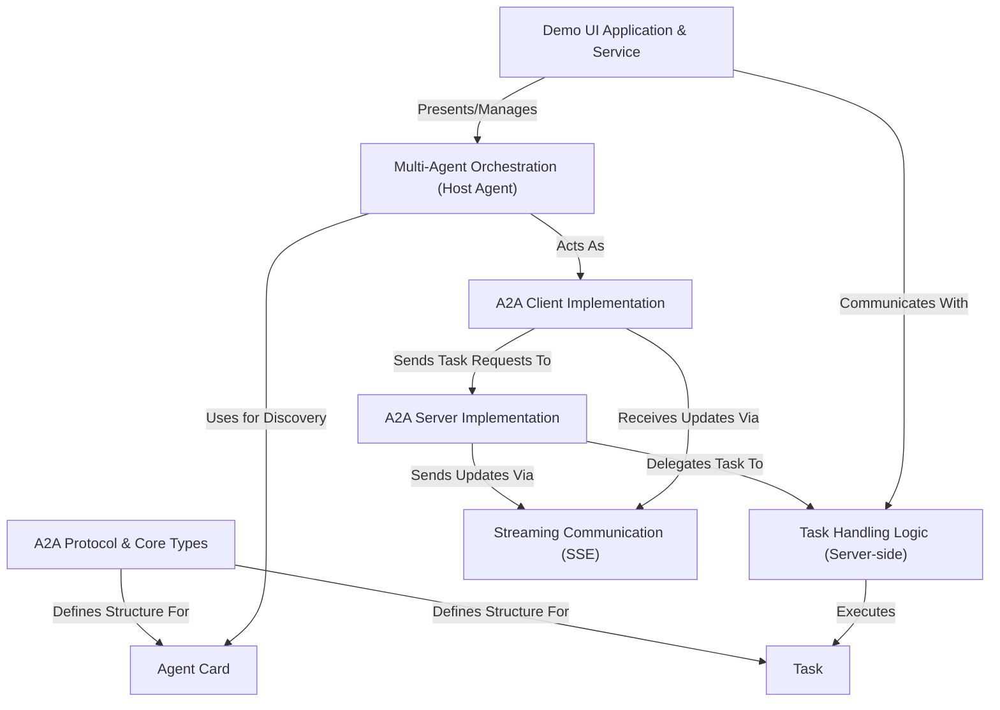

# Tutorial: Google A2A

> This tutorial is AI-generated! To learn more, check out [AI Codebase Knowledge Builder](https://github.com/The-Pocket/Tutorial-Codebase-Knowledge)

The **Google A2A (Agent-to-Agent)**[View Repo](https://github.com/google/A2A) project defines an *open protocol* enabling different AI agents, possibly built with different technologies, to communicate and work together.
Think of it as a common language (*A2A Protocol*) agents use to discover each other (*Agent Card*), assign work (*Task*), and exchange results, even providing real-time updates (*Streaming*).
The project includes sample *client* and *server* implementations, example agents using frameworks like LangGraph or CrewAI, and a *demo UI* showcasing multi-agent interactions.

