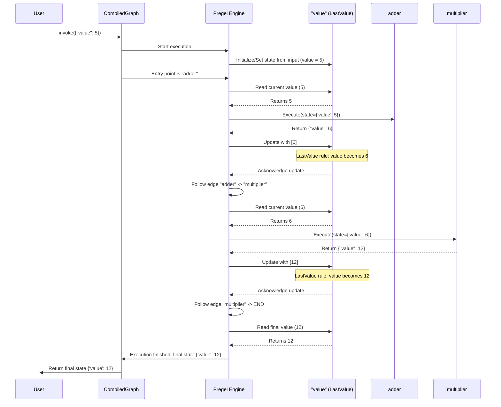

# Chapter 3: Channels - The Communication System

In [Chapter 1: Graph / StateGraph](01_graph___stategraph.md), we learned about the `StateGraph` as the blueprint for our application, holding the shared "whiteboard" or state. In [Chapter 2: Nodes (`PregelNode`)](02_nodes___pregelnode__.md), we met the "workers" or Nodes that perform tasks and read/write to this whiteboard.

But how does this "whiteboard" *actually* work? How does the information written by one node reliably get seen by the next? What happens if multiple nodes try to write to the *same part* of the whiteboard at roughly the same time?

This is where **Channels** come in. They are the fundamental mechanism for communication and state management within a `StateGraph`.

## What Problem Do Channels Solve?

Imagine our simple graph from Chapter 1:

```python
# State: {'value': int}
# Node 1: adder (reads 'value', returns {'value': value + 1})
# Node 2: multiplier (reads 'value', returns {'value': value * 2})
# Flow: START -> adder -> multiplier -> END
```

When `adder` runs with `{'value': 5}`, it returns `{'value': 6}`. How does this update the central state so that `multiplier` receives `{'value': 6}` and not the original `{'value': 5}`?

Furthermore, what if we had a more complex graph where two different nodes, say `node_A` and `node_B`, both finished their work and *both* wanted to update the `value` key in the same step? Should the final `value` be the one from `node_A`, the one from `node_B`, their sum, or something else?

**Channels** solve these problems by defining:

1.  **Storage:** How the value for a specific key in the state is stored.
2.  **Update Logic:** How incoming updates for that key are combined or processed.

## Channels: Mailboxes for Your State

Think of the shared state (our "whiteboard") not as one big surface, but as a collection of **mailboxes**.

*   **Each key in your state dictionary (`MyState`) gets its own dedicated mailbox.** In our example, there's a mailbox labeled `"value"`.
*   When a Node finishes and returns a dictionary (like `{'value': 6}`), the [Pregel Execution Engine](05_pregel_execution_engine.md) acts like a mail carrier. It takes the value `6` and puts it into the mailbox labeled `"value"`.
*   When another Node needs to read the state, the engine goes to the relevant mailboxes (like `"value"`) and gets the current contents.

This mailbox concept ensures that updates intended for `"value"` only affect `"value"`, and updates for another key (say, `"messages"`) would go into *its* own separate mailbox.

**Crucially, each mailbox (Channel) has specific rules about how incoming mail (updates) is handled.** Does the new mail replace the old one? Is it added to a list? Is it mathematically combined with the previous value? These rules are defined by the **Channel Type**.

## How Channels Work: The Update Cycle

Here's a step-by-step view of how channels manage state during graph execution:

1.  **Node Returns Update:** A node (e.g., `adder`) finishes and returns a dictionary (e.g., `{'value': 6}`).
2.  **Engine Routes Update:** The [Pregel Execution Engine](05_pregel_execution_engine.md) sees the key `"value"` and routes the update `6` to the Channel associated with `"value"`.
3.  **Channel Receives Update(s):** The `"value"` Channel receives `6`. If other nodes also returned updates for `"value"` in the same step, the Channel would receive all of them in a sequence (e.g., `[6, maybe_another_update]`).
4.  **Channel Applies Update Logic:** The Channel uses its specific rule (its type) to process the incoming update(s). For example, a `LastValue` channel would just keep the *last* update it received in the sequence. A `BinaryOperatorAggregate` channel might *sum* all the updates with its current value.
5.  **State is Updated:** The Channel now holds the new, processed value.
6.  **Node Reads State:** When the next node (e.g., `multiplier`) needs the state, the Engine queries the relevant Channels (e.g., the `"value"` Channel).
7.  **Channel Provides Value:** The Channel provides its current stored value (e.g., `6`) to the Engine, which passes it to the node.

This ensures that state updates are handled consistently according to predefined rules for each piece of state.

## Common Channel Types: Defining the Rules

LangGraph provides several types of Channels, each with different update logic. You usually define which channel type to use for a state key when you define your state `TypedDict`, often using `typing.Annotated`.

Here are the most common ones:

1.  **`LastValue[T]`** (The Default Overwriter)
    *   **Rule:** Keeps only the **last** value it received. If multiple updates arrive in the same step, the final value is simply the last one in the sequence processed by the engine.
    *   **Analogy:** Like a standard variable assignment (`my_variable = new_value`). The old value is discarded.
    *   **When to Use:** This is the **default** for keys in your `TypedDict` state unless you specify otherwise with `Annotated`. It's perfect for state values that should be replaced entirely, like the current step's result or a user's latest query.
    *   **Code:** `langgraph.channels.LastValue` (from `channels/last_value.py`)

    ```python
    # channels/last_value.py (Simplified)
    class LastValue(Generic[Value], BaseChannel[Value, Value, Value]):
        # ... (initializer, etc.)
        value: Any = MISSING # Stores the single, last value

        def update(self, values: Sequence[Value]) -> bool:
            if len(values) == 0: # No updates this step
                return False
            # If multiple updates in one step, only the last one matters!
            # Example: if values = [update1, update2], self.value becomes update2
            self.value = values[-1]
            return True

        def get(self) -> Value:
            if self.value is MISSING:
                raise EmptyChannelError()
            return self.value # Return the currently stored last value
    ```
    *   **How to Use (Implicitly):**
        ```python
        from typing import TypedDict

        class MyState(TypedDict):
             # Because we didn't use Annotated, LangGraph defaults to LastValue[int]
             value: int
             user_query: str # Also defaults to LastValue[str]
        ```

2.  **`BinaryOperatorAggregate[T]`** (The Combiner)
    *   **Rule:** Takes an initial "identity" value (like `0` for addition, `1` for multiplication) and a **binary operator** function (e.g., `+`, `*`, `operator.add`). When it receives updates, it applies the operator between its current value and each new update, accumulating the result.
    *   **Analogy:** Like a running total (`total += new_number`).
    *   **When to Use:** Useful for accumulating scores, counts, or combining numerical results.
    *   **Code:** `langgraph.channels.BinaryOperatorAggregate` (from `channels/binop.py`)

    ```python
    # channels/binop.py (Simplified)
    import operator
    from typing import Callable

    class BinaryOperatorAggregate(Generic[Value], BaseChannel[Value, Value, Value]):
        # ... (initializer stores the operator and identity value)
        value: Any = MISSING
        operator: Callable[[Value, Value], Value]

        def update(self, values: Sequence[Value]) -> bool:
            if not values:
                return False
            # Start with the first value if the channel was empty
            if self.value is MISSING:
                self.value = values[0]
                values = values[1:]
            # Apply the operator for all subsequent values
            for val in values:
                self.value = self.operator(self.value, val)
            return True

        def get(self) -> Value:
            # ... (return self.value, handling MISSING)
    ```
    *   **How to Use (Explicitly with `Annotated`):**
        ```python
        import operator
        from typing import TypedDict, Annotated
        from langgraph.channels import BinaryOperatorAggregate

        class AgentState(TypedDict):
            # Use Annotated to specify the channel type and operator
            total_score: Annotated[int, BinaryOperatorAggregate(int, operator.add)]
            # ^^^ state key 'total_score' will use BinaryOperatorAggregate with addition
        ```

3.  **`Topic[T]`** (The Collector)
    *   **Rule:** Collects all updates it receives into a **list**. By default (`accumulate=False`), it clears the list after each step, so `get()` returns only the updates from the *immediately preceding* step. If `accumulate=True`, it keeps adding to the list across multiple steps.
    *   **Analogy:** Like appending to a log file or a list (`my_list.append(new_item)`).
    *   **When to Use:** Great for gathering messages in a conversation (`MessageGraph` uses this internally!), collecting events, or tracking a sequence of results.
    *   **Code:** `langgraph.channels.Topic` (from `channels/topic.py`)

    ```python
    # channels/topic.py (Simplified)
    from typing import Sequence, List, Union

    class Topic(Generic[Value], BaseChannel[Sequence[Value], Union[Value, list[Value]], list[Value]]):
        # ... (initializer sets accumulate flag)
        values: list[Value]
        accumulate: bool

        def update(self, updates: Sequence[Union[Value, list[Value]]]) -> bool:
            old_len = len(self.values)
            # Clear list if not accumulating
            if not self.accumulate:
                self.values = []
            # Flatten and extend the list with new updates
            new_values = list(flatten(updates)) # flatten handles list-of-lists
            self.values.extend(new_values)
            return len(self.values) != old_len # Return True if list changed

        def get(self) -> Sequence[Value]:
            # ... (return list(self.values), handling empty)
    ```
    *   **How to Use (Explicitly with `Annotated`):**
        ```python
        from typing import TypedDict, Annotated, List
        from langgraph.channels import Topic

        class ChatState(TypedDict):
            # Use Annotated to specify the Topic channel
            # The final type hint for the state is List[str]
            chat_history: Annotated[List[str], Topic(str, accumulate=True)]
            # ^^^ state key 'chat_history' will use Topic to accumulate strings
        ```

There are other specialized channels like `EphemeralValue` (clears after reading) and `Context` (allows passing values down without modifying state), but `LastValue`, `BinaryOperatorAggregate`, and `Topic` are the most fundamental.

## Channels in Action: Our Simple Graph Revisited

Let's trace our `adder` -> `multiplier` graph again, focusing on the implicit `LastValue` channel for the `"value"` key:

```python
from typing import TypedDict
from langgraph.graph import StateGraph, END, START

# State uses implicit LastValue[int] for 'value'
class MyState(TypedDict):
    value: int

# Nodes (same as before)
def add_one(state: MyState) -> dict:
    return {"value": state['value'] + 1}

def multiply_by_two(state: MyState) -> dict:
    return {"value": state['value'] * 2}

# Graph setup (same as before)
workflow = StateGraph(MyState)
workflow.add_node("adder", add_one)
workflow.add_node("multiplier", multiply_by_two)
workflow.set_entry_point("adder")
workflow.add_edge("adder", "multiplier")
workflow.add_edge("multiplier", END)
app = workflow.compile()

# Execution with initial state {"value": 5}
initial_state = {"value": 5}
final_state = app.invoke(initial_state)
```

Here's the flow with the Channel involved:



The `LastValue` channel ensures that the output of `adder` correctly overwrites the initial state before `multiplier` reads it.

## Example: Using `BinaryOperatorAggregate` Explicitly

Let's modify the state to *sum* values instead of overwriting them.

```python
import operator
from typing import TypedDict, Annotated
from langgraph.graph import StateGraph, END, START
# Import the channel type
from langgraph.channels import BinaryOperatorAggregate

# Define state with an explicitly configured channel
class SummingState(TypedDict):
    # Use Annotated to specify the channel and its operator (addition)
    value: Annotated[int, BinaryOperatorAggregate(int, operator.add)]

# Node 1: Returns 5 to be ADDED to the current value
def add_five(state: SummingState) -> dict:
    print(f"--- Running Adder Node 1 (current value: {state.get('value', 0)}) ---")
    # Note: We return the *increment*, not the new total
    return {"value": 5}

# Node 2: Returns 10 to be ADDED to the current value
def add_ten(state: SummingState) -> dict:
    print(f"--- Running Adder Node 2 (current value: {state['value']}) ---")
     # Note: We return the *increment*, not the new total
    return {"value": 10}

# Create graph
workflow = StateGraph(SummingState)
workflow.add_node("adder1", add_five)
workflow.add_node("adder2", add_ten)
workflow.set_entry_point("adder1")
workflow.add_edge("adder1", "adder2")
workflow.add_edge("adder2", END)

app = workflow.compile()

# Run with initial state value = 0 (BinaryOperatorAggregate defaults int to 0)
print("Invoking graph...")
# You could also provide an initial value: app.invoke({"value": 100})
final_state = app.invoke({})

print("\n--- Final State ---")
print(final_state)
```

**Expected Output:**

```text
Invoking graph...
--- Running Adder Node 1 (current value: 0) ---
--- Running Adder Node 2 (current value: 5) ---

--- Final State ---
{'value': 15}
```

Because we used `Annotated[int, BinaryOperatorAggregate(int, operator.add)]`, the `"value"` channel now *adds* incoming updates (`5` then `10`) to its current state, resulting in a final sum of `15`.

## How `StateGraph` Finds the Right Channel

You might wonder how `StateGraph` knows whether to use `LastValue` or something else. When you initialize `StateGraph(MyState)`, it inspects your state schema (`MyState`).

*   It uses Python's `get_type_hints(MyState, include_extras=True)` to look at each field (like `value`).
*   If a field has `Annotated[SomeType, SomeChannelConfig]`, it uses `SomeChannelConfig` (e.g., `BinaryOperatorAggregate(...)`, `Topic(...)`) to create the channel for that key.
*   If a field is just `SomeType` (like `value: int`), it defaults to creating a `LastValue[SomeType]` channel for that key.

This logic is primarily handled within the `StateGraph._add_schema` method, which calls internal helpers like `_get_channels`.

```python
# graph/state.py (Simplified view of channel detection)

def _get_channels(schema: Type[dict]) -> tuple[...]:
    # ... gets type hints including Annotated metadata ...
    type_hints = get_type_hints(schema, include_extras=True)
    all_keys = {}
    for name, typ in type_hints.items():
         # Checks if the annotation specifies a channel or binop
        if channel := _is_field_channel(typ) or _is_field_binop(typ):
             channel.key = name
             all_keys[name] = channel
        else:
             # Default case: Use LastValue
             fallback = LastValue(typ)
             fallback.key = name
             all_keys[name] = fallback
    # ... separate BaseChannel instances from ManagedValueSpec ...
    return channels, managed_values, type_hints

def _is_field_channel(typ: Type[Any]) -> Optional[BaseChannel]:
    # Checks if Annotated metadata contains a BaseChannel instance or class
    if hasattr(typ, "__metadata__"):
        meta = typ.__metadata__
        if len(meta) >= 1 and isinstance(meta[-1], BaseChannel):
            return meta[-1] # Return the channel instance directly
        # ... (handle channel classes too) ...
    return None

def _is_field_binop(typ: Type[Any]) -> Optional[BinaryOperatorAggregate]:
    # Checks if Annotated metadata contains a callable (the reducer function)
    if hasattr(typ, "__metadata__"):
        meta = typ.__metadata__
        if len(meta) >= 1 and callable(meta[-1]):
            # ... (validate function signature) ...
            return BinaryOperatorAggregate(typ, meta[-1]) # Create binop channel
    return None

# --- In StateGraph.__init__ ---
# self._add_schema(state_schema) # This calls _get_channels
```

## Under the Hood: `BaseChannel`

All channel types inherit from a base class called `BaseChannel`. This class defines the common interface that the [Pregel Execution Engine](05_pregel_execution_engine.md) uses to interact with any channel.

```python
# channels/base.py (Simplified Abstract Base Class)
from abc import ABC, abstractmethod
from typing import Generic, Sequence, TypeVar

Value = TypeVar("Value") # The type of the stored state
Update = TypeVar("Update") # The type of incoming updates
Checkpoint = TypeVar("Checkpoint") # The type of saved state

class BaseChannel(Generic[Value, Update, Checkpoint], ABC):
    # ... (init, type properties) ...

    @abstractmethod
    def update(self, values: Sequence[Update]) -> bool:
        """Combines the sequence of updates with the current channel value."""
        # Must be implemented by subclasses (like LastValue, Topic)
        pass

    @abstractmethod
    def get(self) -> Value:
        """Returns the current value of the channel."""
        # Must be implemented by subclasses
        pass

    @abstractmethod
    def checkpoint(self) -> Checkpoint:
        """Returns a serializable representation of the channel's state."""
        # Used by the Checkpointer
        pass

    @abstractmethod
    def from_checkpoint(self, checkpoint: Checkpoint) -> Self:
        """Creates a new channel instance from a saved checkpoint."""
        # Used by the Checkpointer
        pass
```

The specific logic for `LastValue`, `Topic`, `BinaryOperatorAggregate`, etc., is implemented within their respective `update` and `get` methods, adhering to this common interface. The `checkpoint` and `from_checkpoint` methods are crucial for saving and loading the graph's state, which we'll explore more in [Chapter 6: Checkpointer (`BaseCheckpointSaver`)](06_checkpointer___basecheckpointsaver__.md).

## Conclusion

You've learned about **Channels**, the crucial communication and state management system within LangGraph's `StateGraph`.

*   Channels act like **mailboxes** for each key in your graph's state.
*   They define **how updates are combined** when nodes write to the state.
*   The default channel is **`LastValue`**, which overwrites the previous value.
*   You can use `typing.Annotated` in your state definition to specify other channel types like **`BinaryOperatorAggregate`** (for combining values, e.g., summing) or **`Topic`** (for collecting updates into a list).
*   `StateGraph` automatically creates the correct channel for each state key based on your type hints.

Understanding channels helps you control precisely how information flows and accumulates in your stateful applications.

Now that we know how the state is managed (Channels) and how work gets done (Nodes), how do we control the *flow* of execution? What if we want to go to different nodes based on the current state? That's where conditional logic comes in.

Let's move on to [Chapter 4: Control Flow Primitives (`Branch`, `Send`, `Interrupt`)](04_control_flow_primitives___branch____send____interrupt__.md) to learn how to direct the traffic within our graph.

---

Generated by [AI Codebase Knowledge Builder](https://github.com/The-Pocket/Tutorial-Codebase-Knowledge)