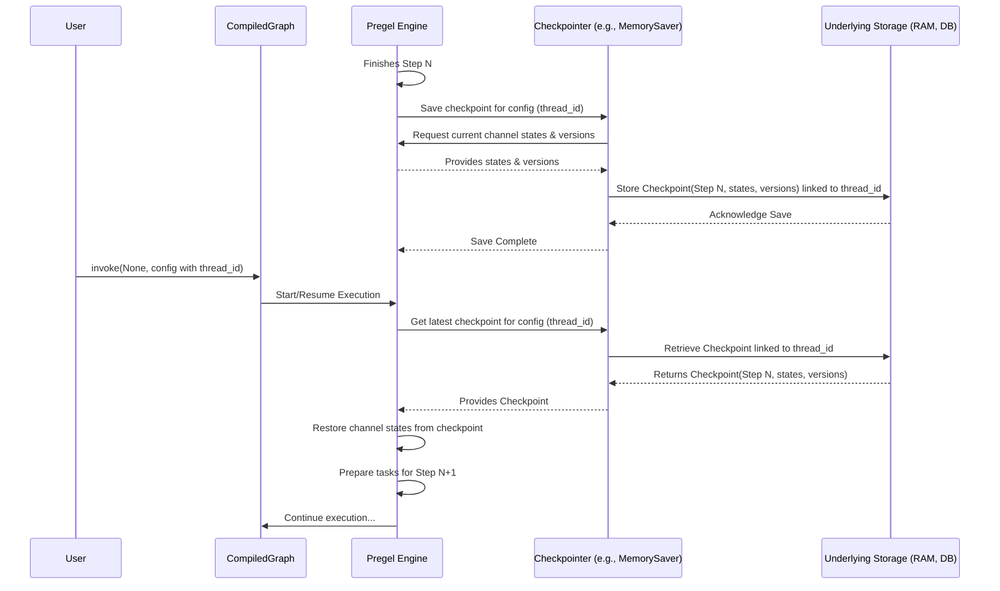

# Chapter 6: Checkpointer (`BaseCheckpointSaver`) - Saving Your Progress

In [Chapter 5: Pregel Execution Engine](05_pregel_execution_engine.md), we saw how the engine runs our graph step-by-step. But what happens if a graph takes hours to run, or if it needs to pause and wait for a human? If the program crashes or we need to stop it, do we lose all the progress?

That's where **Checkpointers** come to the rescue!

## What Problem Do Checkpointers Solve?

Imagine you're playing a long video game. You wouldn't want to start from the very beginning every time you stop playing, right? Games have save points or checkpoints that record your progress.

LangGraph's **Checkpointer** does the same thing for your graph execution. It automatically saves the graph's state at certain points, usually after each step completed by the [Pregel Execution Engine](05_pregel_execution_engine.md).

This is incredibly useful for:

1.  **Long-Running Processes:** If your graph involves many steps or calls to slow tools/LLMs, you can stop it and resume later without losing work.
2.  **Resilience:** If your program crashes unexpectedly, you can restart it from the last saved checkpoint.
3.  **Human-in-the-Loop (HITL):** As we saw with `Interrupt` in [Chapter 4: Control Flow Primitives](04_control_flow_primitives___branch____send____interrupt__.md), pausing the graph requires saving its state so it can be perfectly restored when the human provides input. Checkpointers are essential for this.

**Analogy:** Think of a checkpointer as an automatic "Save" button for your graph's progress. It takes snapshots of the shared "whiteboard" ([Channels](03_channels.md)) so you can always pick up where you left off.

## Key Concepts

1.  **What is Saved?** The checkpointer saves the current value and version of every [Channel](03_channels.md) in your graph's state. It also keeps track of which step the graph was on and any pending tasks (like those created by `Send`).
2.  **When is it Saved?** The [Pregel Execution Engine](05_pregel_execution_engine.md) typically triggers the checkpointer to save after each "superstep" (a round of node executions and state updates).
3.  **Where is it Saved?** This depends on the specific checkpointer implementation you choose. LangGraph provides several:
    *   `MemorySaver`: Stores checkpoints in your computer's RAM. Simple for testing, but **lost when your script ends**.
    *   `SqliteSaver`: Stores checkpoints in a local SQLite database file, making them persistent across script runs.
    *   Other savers might store checkpoints in cloud databases or other persistent storage.
4.  **`thread_id` (The Save Slot Name):** To save and load progress correctly, you need a way to identify *which* specific run of the graph you want to work with. Think of this like naming your save file in a game. In LangGraph, this identifier is called the `thread_id`. You provide it in the `config` when you run the graph. Each unique `thread_id` represents an independent "conversation" or execution history.

## How to Use a Checkpointer

Using a checkpointer is straightforward. You just need to tell LangGraph *which* checkpointer to use when you compile your graph.

**Step 1: Import a Checkpointer**

Let's start with the simplest one, `MemorySaver`.

```python
# Import the simplest checkpointer
from langgraph.checkpoint.memory import MemorySaver
```

**Step 2: Instantiate the Checkpointer**

```python
# Create an instance of the memory checkpointer
memory_saver = MemorySaver()
```

**Step 3: Compile Your Graph with the Checkpointer**

Let's reuse our simple `adder -> multiplier` graph. The graph definition itself doesn't change.

```python
# --- Define State and Nodes (same as Chapter 1) ---
from typing import TypedDict
from langgraph.graph import StateGraph, END, START

class MyState(TypedDict):
    value: int

def add_one(state: MyState) -> dict:
    print(f"Adder: Adding 1 to {state['value']}")
    return {"value": state['value'] + 1}

def multiply_by_two(state: MyState) -> dict:
    print(f"Multiplier: Doubling {state['value']}")
    return {"value": state['value'] * 2}

# --- Build the Graph (same as Chapter 1) ---
workflow = StateGraph(MyState)
workflow.add_node("adder", add_one)
workflow.add_node("multiplier", multiply_by_two)
workflow.set_entry_point("adder")
workflow.add_edge("adder", "multiplier")
workflow.add_edge("multiplier", END)

# --- Compile WITH the checkpointer ---
# Pass the checkpointer instance to the compile method
app = workflow.compile(checkpointer=memory_saver)
```

That's it! By passing `checkpointer=memory_saver` to `compile()`, you've enabled automatic checkpointing for this graph.

**Step 4: Run with a `thread_id`**

To use the checkpointer, you need to provide a configuration dictionary (`config`) containing a unique identifier for this specific execution thread.

```python
import uuid

# Create a unique ID for this run
thread_id = str(uuid.uuid4())
config = {"configurable": {"thread_id": thread_id}}

# Define the initial state
initial_state = {"value": 5}

print("--- Running Graph (First Time) ---")
# Run the graph with the config
final_state = app.invoke(initial_state, config=config)

print("\n--- Final State (First Run) ---")
print(final_state)
```

**Expected Output (First Run):**

```text
--- Running Graph (First Time) ---
Adder: Adding 1 to 5
Multiplier: Doubling 6

--- Final State (First Run) ---
{'value': 12}
```

Behind the scenes, `MemorySaver` saved the state after the `adder` step and after the `multiplier` step, associating it with the `thread_id` you provided.

**Step 5: Resume the Graph**

Now, let's imagine we stopped the process. If we run the *same graph* with the *same `thread_id`*, the checkpointer allows the [Pregel Execution Engine](05_pregel_execution_engine.md) to load the last saved state and continue. Since the first run finished completely, running `invoke` again will just load the final state.

```python
print("\n--- Running Graph Again with SAME thread_id ---")
# Use the SAME config (containing the same thread_id)
# Provide NO initial state, as it will be loaded from the checkpoint
resumed_state = app.invoke(None, config=config)

print("\n--- Final State (Resumed Run) ---")
print(resumed_state)

# Let's check the saved states using the checkpointer directly
print("\n--- Checkpoints Saved ---")
for checkpoint in memory_saver.list(config):
    print(checkpoint)
```

**Expected Output (Second Run):**

```text
--- Running Graph Again with SAME thread_id ---
# Notice: No node printouts because the graph already finished!
# It just loads the final saved state.

--- Final State (Resumed Run) ---
{'value': 12}

--- Checkpoints Saved ---
# You'll see checkpoint objects representing saved states
CheckpointTuple(config={'configurable': {'thread_id': '...'}}, checkpoint={'v': 1, 'ts': '...', 'id': '...', 'channel_values': {'value': 6}, 'channel_versions': {'adder': 1}, 'versions_seen': {'adder': {}}}, metadata={'source': 'loop', 'step': 1, ...}, ...)
CheckpointTuple(config={'configurable': {'thread_id': '...'}}, checkpoint={'v': 1, 'ts': '...', 'id': '...', 'channel_values': {'value': 12}, 'channel_versions': {'adder': 1, 'multiplier': 2}, 'versions_seen': {'adder': {}, 'multiplier': {'adder': 1}}}, metadata={'source': 'loop', 'step': 2, ...}, ...)
CheckpointTuple(config={'configurable': {'thread_id': '...'}}, checkpoint={'v': 1, 'ts': '...', 'id': '...', 'channel_values': {'value': 12}, 'channel_versions': {'adder': 1, 'multiplier': 2}, 'versions_seen': {'adder': {}, 'multiplier': {'adder': 1}}}, metadata={'source': 'loop', 'step': 3, ...}, ...)
```

The checkpointer successfully loaded the final state (`{'value': 12}`) associated with that `thread_id`.

**Checkpointers and `Interrupt` (Human-in-the-Loop)**

Remember the `Interrupt` example from [Chapter 4](04_control_flow_primitives___branch____send____interrupt__.md)?

```python
# (Simplified HITL example from Chapter 4)
from langgraph.types import interrupt, Command
# ... (State, Nodes: create_plan, request_approval, execute_plan) ...

# Compile WITH checkpointer (REQUIRED for interrupt)
memory_saver_hitl = MemorySaver()
app_hitl = workflow.compile(checkpointer=memory_saver_hitl)

# Run, get interrupted
config_hitl = {"configurable": {"thread_id": str(uuid.uuid4())}}
for chunk in app_hitl.stream({"plan": ""}, config=config_hitl):
    # ... (detect interrupt) ...
    print("Graph interrupted!")
    break

# Resume after human decision
human_decision = "Approved"
for chunk in app_hitl.stream(Command(resume=human_decision), config=config_hitl):
     # ... (process remaining steps) ...
     print("Graph resumed and finished!")
```

When `interrupt()` was called inside the `request_approval` node, the [Pregel Execution Engine](05_pregel_execution_engine.md) automatically used the `memory_saver_hitl` checkpointer to save the *exact state* of the graph at that moment (including the plan). When we called `stream` again with `Command(resume=...)` and the *same* `config_hitl`, the engine loaded that saved state using the checkpointer, allowing the graph to continue exactly where it left off, now with the human's feedback.

**Without a checkpointer, `Interrupt` cannot work.**

## How Checkpointing Works Internally

What happens behind the scenes when a checkpointer is configured?

**Saving:**

1.  **Step Complete:** The [Pregel Execution Engine](05_pregel_execution_engine.md) finishes a step (e.g., after running the `adder` node and updating the state).
2.  **Signal Checkpointer:** The engine tells the configured checkpointer (`MemorySaver` in our example) that it's time to save.
3.  **Gather State:** The checkpointer (or the engine on its behalf) accesses all the active [Channels](03_channels.md).
4.  **Serialize State:** For each channel, it calls the channel's internal `checkpoint()` method to get a serializable representation of its current value (e.g., the number `6` for the `"value"` channel).
5.  **Store Checkpoint:** The checkpointer bundles the serialized channel values, their versions, the current step number, and other metadata into a `Checkpoint` object. It then stores this `Checkpoint` associated with the current `thread_id` provided in the `config`. `MemorySaver` stores it in a dictionary in RAM; `SqliteSaver` writes it to a database table.

**Loading (Resuming):**

1.  **Invoke with `thread_id`:** You call `app.invoke(None, config=config)` where `config` contains a `thread_id` that has been previously saved.
2.  **Request Checkpoint:** The [Pregel Execution Engine](05_pregel_execution_engine.md) asks the checkpointer to load the latest checkpoint for the given `thread_id`.
3.  **Retrieve Checkpoint:** The checkpointer retrieves the saved `Checkpoint` object (e.g., from its memory dictionary or the database).
4.  **Restore State:** The engine takes the saved channel values from the checkpoint. For each channel, it calls the channel's `from_checkpoint()` method (or similar internal logic) to restore its state. The "whiteboard" ([Channels](03_channels.md)) is now exactly as it was when the checkpoint was saved.
5.  **Continue Execution:** The engine looks at the saved step number and metadata to figure out where to resume execution, typically by preparing the tasks for the *next* step.

Here's a simplified view of the interaction:



## A Peek at the Code (`checkpoint/base.py`, `checkpoint/memory.py`, `pregel/loop.py`)

Let's look at the core components:

*   **`BaseCheckpointSaver` (`checkpoint/base.py`)**: This is the abstract base class (like a template) that all checkpointers must implement. It defines the essential methods the engine needs.

    ```python
    # checkpoint/base.py (Highly Simplified)
    from abc import ABC, abstractmethod
    from typing import Any, Mapping, Optional, Sequence, Tuple, TypedDict

    # Represents a saved checkpoint
    class Checkpoint(TypedDict):
        channel_values: Mapping[str, Any] # Saved state of channels
        channel_versions: Mapping[str, int] # Internal versions
        versions_seen: Mapping[str, Mapping[str, int]] # Tracking for node execution
        # ... other metadata like v, ts, id, pending_sends ...

    # Represents the checkpoint tuple retrieved from storage
    class CheckpointTuple(NamedTuple):
        config: dict # The config used (includes thread_id)
        checkpoint: Checkpoint
        metadata: dict
        # ... other fields like parent_config, pending_writes ...

    class BaseCheckpointSaver(ABC):
        # --- Sync Methods ---
        @abstractmethod
        def get_tuple(self, config: dict) -> Optional[CheckpointTuple]:
            """Load the checkpoint tuple for the given config."""
            ...

        @abstractmethod
        def put(self, config: dict, checkpoint: Checkpoint, metadata: dict) -> dict:
            """Save a checkpoint."""
            ...

        # --- Async Methods (similar structure) ---
        @abstractmethod
        async def aget_tuple(self, config: dict) -> Optional[CheckpointTuple]:
            """Async load the checkpoint tuple."""
            ...

        @abstractmethod
        async def aput(self, config: dict, checkpoint: Checkpoint, metadata: dict) -> dict:
            """Async save a checkpoint."""
            ...

        # --- Other methods (list, put_writes) omitted for brevity ---
    ```
    The key methods are `get_tuple` (to load) and `put` (to save), along with their async counterparts (`aget_tuple`, `aput`). Any specific checkpointer (like `MemorySaver`, `SqliteSaver`) must provide concrete implementations for these methods.

*   **`MemorySaver` (`checkpoint/memory.py`)**: A simple implementation that uses an in-memory dictionary.

    ```python
    # checkpoint/memory.py (Highly Simplified)
    import threading
    from collections import defaultdict

    class MemorySaver(BaseCheckpointSaver):
        def __init__(self):
            # Use a dictionary to store checkpoints in RAM
            # Key: thread_id, Value: List of CheckpointTuples
            self._checkpoints: defaultdict[str, list[CheckpointTuple]] = defaultdict(list)
            self._lock = threading.RLock() # To handle multiple threads safely

        def get_tuple(self, config: dict) -> Optional[CheckpointTuple]:
            thread_id = config["configurable"]["thread_id"]
            with self._lock:
                if checkpoints := self._checkpoints.get(thread_id):
                    # Return the latest checkpoint for this thread_id
                    return checkpoints[-1]
                return None

        def put(self, config: dict, checkpoint: Checkpoint, metadata: dict) -> dict:
            thread_id = config["configurable"]["thread_id"]
            with self._lock:
                # Append the new checkpoint to the list for this thread_id
                self._checkpoints[thread_id].append(
                    CheckpointTuple(config, checkpoint, metadata)
                )
            return {"configurable": {"thread_id": thread_id}}

        # ... async methods (aget_tuple, aput) are similar using the same dict ...
        # ... list method iterates through the dictionary ...
    ```
    As you can see, `MemorySaver` just uses a standard Python dictionary (`self._checkpoints`) to store the `CheckpointTuple` for each `thread_id`. This is simple but not persistent.

*   **Integration (`pregel/loop.py`)**: The [Pregel Execution Engine](05_pregel_execution_engine.md) (`PregelLoop` classes) interacts with the checkpointer during its execution cycle.

    ```python
    # pregel/loop.py (Conceptual Snippets)

    class PregelLoop: # Base class for Sync/Async loops
        def __init__(self, ..., checkpointer: Optional[BaseCheckpointSaver], ...):
            self.checkpointer = checkpointer
            # ... other init ...

        def _put_checkpoint(self, metadata: CheckpointMetadata) -> None:
            # Called by the loop after a step or input processing
            if self.checkpointer:
                # 1. Create the Checkpoint object from current channels/state
                checkpoint_data = create_checkpoint(self.checkpoint, self.channels, ...)

                # 2. Call the checkpointer's put method (sync or async)
                #    (Uses self.submit to potentially run in background)
                self.submit(self.checkpointer.put, self.checkpoint_config, checkpoint_data, metadata)

                # 3. Update internal config with the new checkpoint ID
                self.checkpoint_config = {"configurable": {"thread_id": ..., "checkpoint_id": checkpoint_data["id"]}}

        def __enter__(self): # Or __aenter__ for async
            # Called when the loop starts
            if self.checkpointer:
                # 1. Try to load an existing checkpoint tuple
                saved = self.checkpointer.get_tuple(self.checkpoint_config)
            else:
                saved = None

            if saved:
                # 2. Restore state from the loaded checkpoint
                self.checkpoint = saved.checkpoint
                self.checkpoint_config = saved.config
                # ... restore channels from saved.checkpoint['channel_values'] ...
            else:
                # Initialize with an empty checkpoint
                self.checkpoint = empty_checkpoint()

            # ... setup channels based on restored or empty checkpoint ...
            return self
    ```
    The `PregelLoop` uses the checkpointer's `get_tuple` method when it starts (in `__enter__` or `__aenter__`) to load any existing state. It uses the `put` method (inside `_put_checkpoint`) during execution to save progress.

## Conclusion

You've learned about **Checkpointers (`BaseCheckpointSaver`)**, the mechanism that gives your LangGraph applications memory and resilience.

*   Checkpointers **save** the state of your graph's [Channels](03_channels.md) periodically.
*   They **load** saved states to resume execution.
*   This is crucial for **long-running graphs**, **human-in-the-loop** workflows (using `Interrupt`), and **recovering from failures**.
*   You enable checkpointing by passing a `checkpointer` instance (like `MemorySaver` or `SqliteSaver`) to `graph.compile()`.
*   You manage different execution histories using a unique `thread_id` in the `config`.
*   `MemorySaver` is simple for testing but lost when the script ends; use database savers (like `SqliteSaver`) for true persistence.

This chapter concludes our tour of the core concepts in LangGraph! You now understand the fundamental building blocks: the blueprint ([`StateGraph`](01_graph___stategraph.md)), the workers ([`Nodes`](02_nodes___pregelnode__.md)), the communication system ([`Channels`](03_channels.md)), the traffic signals ([Control Flow Primitives](04_control_flow_primitives___branch____send____interrupt__.md)), the engine room ([Pregel Execution Engine](05_pregel_execution_engine.md)), and the save system ([Checkpointer](06_checkpointer___basecheckpointsaver__.md)).

With these concepts, you're well-equipped to start building your own sophisticated, stateful applications with LangGraph! Explore the documentation for more examples, advanced patterns, and different checkpointer implementations. Happy building!

---

Generated by [AI Codebase Knowledge Builder](https://github.com/The-Pocket/Tutorial-Codebase-Knowledge)