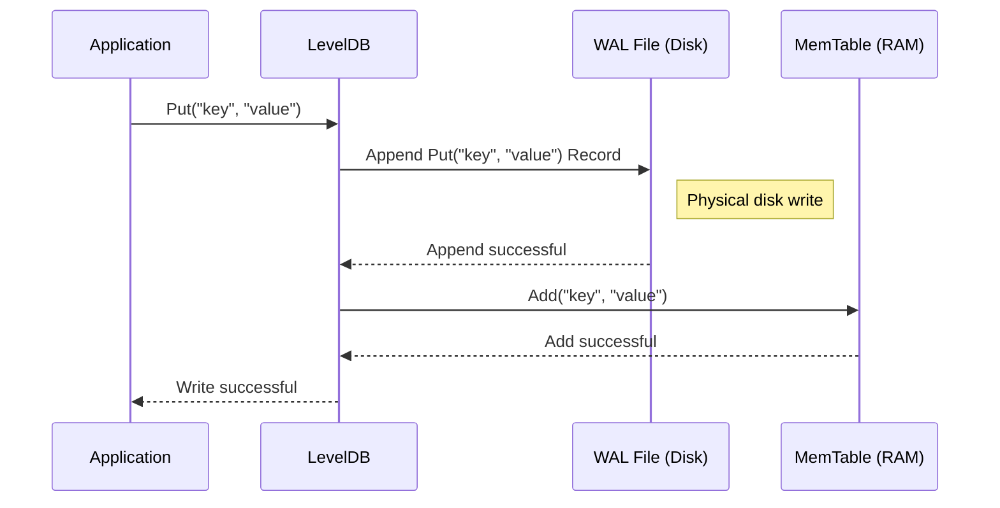
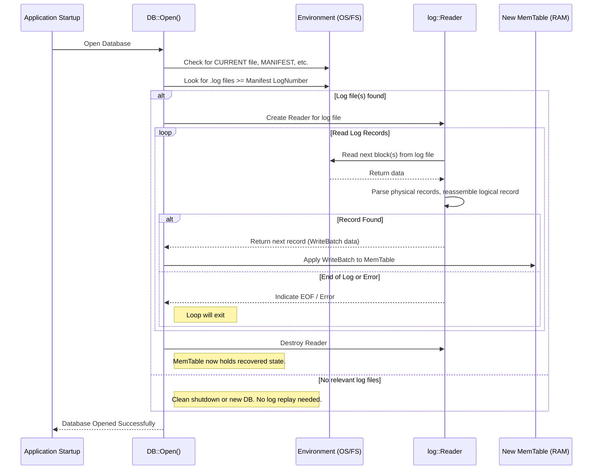

# Chapter 3: Write-Ahead Log (WAL) & LogWriter/LogReader

In [Chapter 2: MemTable](02_memtable.md), we saw how LevelDB uses an in-memory `MemTable` (like a fast notepad) to quickly accept new writes (`Put` or `Delete`) before they are eventually flushed to an [SSTable](01_table___sstable___tablecache.md) file on disk.

This is great for speed! But what if the unthinkable happens? Imagine you've just written some important data. It's sitting safely in the `MemTable` in RAM, but *before* LevelDB gets a chance to write it to a permanent SSTable file, the power cord gets kicked out, or the server crashes!

Uh oh. Since RAM is volatile, anything in the `MemTable` that hadn't been saved to disk is **gone** forever when the power goes out. That's not very reliable for a database!

## What's the Problem? Losing Data on Crashes

How can LevelDB make sure that once your write operation *returns successfully*, the data is safe, even if the system crashes immediately afterwards? Relying only on the `MemTable` isn't enough because it lives in volatile RAM. We need a way to make writes durable (permanent) much sooner.

## Write-Ahead Log (WAL): The Database's Safety Journal

LevelDB's solution is the **Write-Ahead Log (WAL)**, often just called the **log**.

Think of the WAL as a **ship's logbook** or a **court reporter's transcript**.

1.  **Write First:** Before the captain takes any significant action (like changing course), they write it down in the logbook *first*. Similarly, before LevelDB modifies the `MemTable` (which is in RAM), it **first appends** a description of the change (e.g., "Put key 'user1' with value 'dataA'") to a special file on disk – the WAL file.
2.  **Append-Only:** Like a logbook, entries are just added sequentially to the end. LevelDB doesn't go back and modify old entries in the current WAL file. This makes writing very fast – it's just adding to the end of a file.
3.  **On Disk:** Crucially, this WAL file lives on the persistent disk (HDD or SSD), not just in volatile RAM.
4.  **Durability:** By writing to the WAL *before* acknowledging a write to the user, LevelDB ensures that even if the server crashes immediately after, the record of the operation is safely stored on disk in the log.

So, the write process looks like this:

*Your Application* -> `Put("user123", "data")` -> **1. Append to WAL file (Disk)** -> **2. Add to MemTable (RAM)** -> *Return Success*



This "write-ahead" step ensures durability.

## What Happens During Recovery? Replaying the Logbook

Now, let's say the server crashes and restarts. LevelDB needs to recover its state. How does the WAL help?

1.  **Check for Log:** When LevelDB starts up, it looks for a WAL file.
2.  **Read the Log:** If a WAL file exists, it means the database might not have shut down cleanly, and the last `MemTable`'s contents (which were only in RAM) were lost. LevelDB creates a `LogReader` to read through the WAL file from beginning to end.
3.  **Rebuild MemTable:** For each operation record found in the WAL (like "Put key 'user1' value 'dataA'", "Delete key 'user2'"), LevelDB re-applies that operation to a *new*, empty `MemTable` in memory. It's like rereading the ship's logbook to reconstruct what happened right before the incident.
4.  **Recovery Complete:** Once the entire WAL is replayed, the `MemTable` is back to the state it was in right before the crash. LevelDB can now continue operating normally, accepting new reads and writes. The data from the WAL is now safely in the new `MemTable`, ready to be flushed to an SSTable later.

The WAL file essentially acts as a temporary backup for the `MemTable` until the `MemTable`'s contents are permanently stored in an SSTable. Once a `MemTable` is successfully flushed to an SSTable, the corresponding WAL file is no longer needed and can be deleted.

## LogWriter: Appending to the Log

The component responsible for writing records to the WAL file is `log::Writer`. Think of it as the dedicated writer making entries in our ship's logbook.

When LevelDB processes a write operation (often coming from a [WriteBatch](05_writebatch.md), which we'll see later), it serializes the batch of changes into a single chunk of data (a `Slice`) and asks the `log::Writer` to add it to the current log file.

```c++
// --- Simplified from db/db_impl.cc ---
// Inside DBImpl::Write(...) after preparing the batch:

Status status = log_->AddRecord(WriteBatchInternal::Contents(write_batch));
// ... check status ...
if (status.ok() && options.sync) {
  // Optionally ensure the data hits the physical disk
  status = logfile_->Sync();
}
if (status.ok()) {
  // Only if WAL write succeeded, apply to MemTable
  status = WriteBatchInternal::InsertInto(write_batch, mem_);
}
// ... handle status ...
```

**Explanation:**

1.  `WriteBatchInternal::Contents(write_batch)`: Gets the serialized representation of the write operations (like one or more Puts/Deletes).
2.  `log_->AddRecord(...)`: Calls the `log::Writer` instance (`log_`) to append this serialized data as a single record to the current WAL file (`logfile_`).
3.  `logfile_->Sync()`: If the `sync` option is set (which is the default for ensuring durability), this command tells the operating system to *really* make sure the data written to the log file has reached the physical disk platters/flash, not just sitting in some OS buffer. This is crucial for surviving power loss.
4.  `WriteBatchInternal::InsertInto(write_batch, mem_)`: Only *after* the log write is confirmed (and synced, if requested) does LevelDB apply the changes to the in-memory `MemTable`.

The `log::Writer` itself handles the details of how records are actually formatted within the log file. Log files are composed of fixed-size blocks (e.g., 32KB). A single record from `AddRecord` might be small enough to fit entirely within the remaining space in the current block, or it might be large and need to be split (fragmented) across multiple physical records spanning block boundaries.

```c++
// --- Simplified from db/log_writer.cc ---

Status Writer::AddRecord(const Slice& slice) {
  const char* ptr = slice.data();
  size_t left = slice.size(); // How much data is left to write?
  Status s;
  bool begin = true; // Is this the first fragment of this record?

  do {
    const int leftover = kBlockSize - block_offset_; // Space left in current block
    // ... if leftover < kHeaderSize, fill trailer and start new block ...

    // Calculate how much of the data can fit in this block
    const size_t avail = kBlockSize - block_offset_ - kHeaderSize;
    const size_t fragment_length = (left < avail) ? left : avail;

    // Determine the type of this physical record (fragment)
    RecordType type;
    const bool end = (left == fragment_length); // Is this the last fragment?
    if (begin && end) {
      type = kFullType;     // Fits entirely in one piece
    } else if (begin) {
      type = kFirstType;    // First piece of a multi-piece record
    } else if (end) {
      type = kLastType;     // Last piece of a multi-piece record
    } else {
      type = kMiddleType;   // Middle piece of a multi-piece record
    }

    // Write this physical record (header + data fragment) to the file
    s = EmitPhysicalRecord(type, ptr, fragment_length);

    // Advance pointers and update remaining size
    ptr += fragment_length;
    left -= fragment_length;
    begin = false; // Subsequent fragments are not the 'begin' fragment

  } while (s.ok() && left > 0); // Loop until all data is written or error
  return s;
}

// Simplified - Writes header (checksum, length, type) and payload
Status Writer::EmitPhysicalRecord(RecordType t, const char* ptr, size_t length) {
  // ... format header (buf) with checksum, length, type ...
  // ... compute checksum ...
  // ... Encode checksum into header ...

  // Write header and payload fragment
  Status s = dest_->Append(Slice(buf, kHeaderSize));
  if (s.ok()) {
    s = dest_->Append(Slice(ptr, length));
    // LevelDB might Flush() here or let the caller Sync() later
  }
  block_offset_ += kHeaderSize + length; // Update position in current block
  return s;
}
```

**Explanation:**

*   The `AddRecord` method takes the user's data (`slice`) and potentially breaks it into smaller `fragment_length` chunks.
*   Each chunk is written as a "physical record" using `EmitPhysicalRecord`.
*   `EmitPhysicalRecord` prepends a small header (`kHeaderSize`, 7 bytes) containing a checksum (for detecting corruption), the length of this fragment, and the `RecordType` (`kFullType`, `kFirstType`, `kMiddleType`, or `kLastType`).
*   The `RecordType` tells the `LogReader` later how to reassemble these fragments back into the original complete record.

## LogReader: Reading the Log for Recovery

The counterpart to `LogWriter` is `log::Reader`. This is the component used during database startup (recovery) to read the records back from a WAL file. Think of it as the person carefully reading the ship's logbook after an incident.

The `log::Reader` reads the log file sequentially, block by block. It parses the physical record headers, verifies checksums, and pieces together the fragments (`kFirstType`, `kMiddleType`, `kLastType`) to reconstruct the original data records that were passed to `AddRecord`.

```c++
// --- Simplified from db/db_impl.cc ---
// Inside DBImpl::RecoverLogFile(...)

// Create the log reader for the specific log file number
std::string fname = LogFileName(dbname_, log_number);
SequentialFile* file;
Status status = env_->NewSequentialFile(fname, &file);
// ... check status ...

// Set up reporter for corruption errors
log::Reader::Reporter reporter;
// ... initialize reporter ...
log::Reader reader(file, &reporter, true /*checksum*/, 0 /*initial_offset*/);

// Read records one by one and apply them to a temporary MemTable
std::string scratch;
Slice record;
WriteBatch batch;
MemTable* mem = new MemTable(internal_comparator_);
mem->Ref();

while (reader.ReadRecord(&record, &scratch) && status.ok()) {
  // record now holds a complete record originally passed to AddRecord

  // Parse the record back into a WriteBatch
  WriteBatchInternal::SetContents(&batch, record);

  // Apply the operations from the batch to the MemTable
  status = WriteBatchInternal::InsertInto(&batch, mem);
  // ... check status ...

  // Update the max sequence number seen
  const SequenceNumber last_seq = /* ... get from batch ... */;
  if (last_seq > *max_sequence) {
    *max_sequence = last_seq;
  }

  // Optional: If MemTable gets too big during recovery, flush it
  if (mem->ApproximateMemoryUsage() > options_.write_buffer_size) {
    status = WriteLevel0Table(mem, edit, nullptr); // Flush to SSTable
    mem->Unref();
    mem = new MemTable(internal_comparator_);
    mem->Ref();
    // ... check status ...
  }
}

delete file; // Close the log file
// ... handle final MemTable (mem) if not null ...
```

**Explanation:**

1.  A `log::Reader` is created, pointing to the WAL file (`.log`) that needs recovery.
2.  The code loops using `reader.ReadRecord(&record, &scratch)`.
    *   `record`: This `Slice` will point to the reassembled data of the next complete logical record found in the log.
    *   `scratch`: A temporary string buffer the reader might use if a record spans multiple blocks.
3.  Inside the loop:
    *   The `record` (which contains a serialized `WriteBatch`) is parsed back into a `WriteBatch` object.
    *   `WriteBatchInternal::InsertInto(&batch, mem)` applies the operations (Puts/Deletes) from the recovered batch to the in-memory `MemTable` (`mem`).
    *   The code keeps track of the latest sequence number encountered.
    *   Optionally, if the `MemTable` fills up *during* recovery, it can be flushed to an SSTable just like during normal operation.
4.  This continues until `ReadRecord` returns `false` (end of log file) or an error occurs.

The `log::Reader::ReadRecord` implementation handles the details of reading blocks, finding headers, checking checksums, and combining `kFirstType`, `kMiddleType`, `kLastType` fragments.

```c++
// --- Simplified from db/log_reader.cc ---

// Reads the next complete logical record. Returns true if successful.
bool Reader::ReadRecord(Slice* record, std::string* scratch) {
  // ... skip records before initial_offset if necessary ...

  scratch->clear();
  record->clear();
  bool in_fragmented_record = false;

  Slice fragment; // To hold data from one physical record
  while (true) {
    // Reads the next physical record (header + data fragment) from the file blocks.
    // Handles reading across block boundaries internally.
    const unsigned int record_type = ReadPhysicalRecord(&fragment);

    // ... handle resyncing logic after seeking ...

    switch (record_type) {
      case kFullType:
        // ... sanity check for unexpected fragments ...
        *record = fragment; // Got a complete record in one piece
        return true;

      case kFirstType:
        // ... sanity check for unexpected fragments ...
        scratch->assign(fragment.data(), fragment.size()); // Start of a new fragmented record
        in_fragmented_record = true;
        break;

      case kMiddleType:
        if (!in_fragmented_record) { /* Report corruption */ }
        else { scratch->append(fragment.data(), fragment.size()); } // Append middle piece
        break;

      case kLastType:
        if (!in_fragmented_record) { /* Report corruption */ }
        else {
          scratch->append(fragment.data(), fragment.size()); // Append final piece
          *record = Slice(*scratch); // Reassembled record is complete
          return true;
        }
        break;

      case kEof:
        return false; // End of log file

      case kBadRecord:
        // ... report corruption, clear state ...
        in_fragmented_record = false;
        scratch->clear();
        break; // Try to find the next valid record

      default:
        // ... report corruption ...
        in_fragmented_record = false;
        scratch->clear();
        break; // Try to find the next valid record
    }
  }
}
```

**Explanation:**

*   `ReadRecord` calls `ReadPhysicalRecord` repeatedly in a loop.
*   `ReadPhysicalRecord` (internal helper, not shown in full) reads from the file, parses the 7-byte header, checks the CRC, and returns the type and the data fragment (`result`). It handles skipping block trailers and reading new blocks as needed.
*   Based on the `record_type`, `ReadRecord` either returns the complete record (`kFullType`), starts assembling fragments (`kFirstType`), appends fragments (`kMiddleType`), or finishes assembling and returns the record (`kLastType`).
*   It manages the `scratch` buffer to hold the fragments being assembled.

## Recovery Process Diagram

Here's how the WAL is used during database startup if a crash occurred:



## Conclusion

The **Write-Ahead Log (WAL)** is a critical component for ensuring **durability** in LevelDB. By writing every operation to an append-only log file on disk *before* applying it to the in-memory `MemTable` and acknowledging the write, LevelDB guarantees that no acknowledged data is lost even if the server crashes.

*   The `log::Writer` handles appending records to the current WAL file, dealing with block formatting and fragmentation.
*   The `log::Reader` handles reading records back from the WAL file during recovery, verifying checksums and reassembling fragmented records.
*   This recovery process replays the logged operations to rebuild the `MemTable` state that was lost in the crash.

The WAL, MemTable, and SSTables work together: WAL provides fast durability for recent writes, MemTable provides fast access to those recent writes in memory, and SSTables provide persistent, sorted storage for the bulk of the data.

Now that we understand the core storage structures (SSTables, MemTable, WAL), we can start looking at how they are managed and coordinated.

Next up: [Chapter 4: DBImpl](04_dbimpl.md)

---

Generated by [AI Codebase Knowledge Builder](https://github.com/The-Pocket/Tutorial-Codebase-Knowledge)
