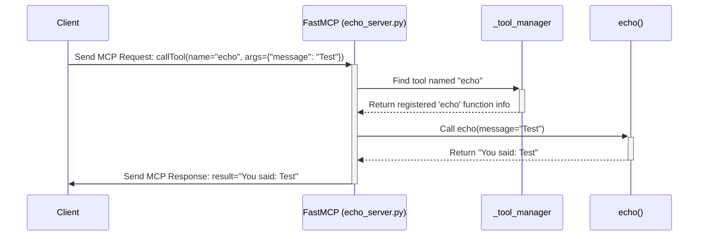

# Chapter 2: Easier Server Building with `FastMCP`

In [Chapter 1: Your Control Panel - The `mcp` Command-Line Interface](01_cli___mcp__command_.md), we learned how to use the `mcp` command to run, test, and install MCP servers. We even saw a tiny example of a server file. But how do we *build* that server code without getting lost in complex details?

Imagine you want to build a simple AI assistant that can just echo back whatever you type. Writing all the code to handle connections, interpret messages according to the MCP protocol, manage capabilities – it sounds like a lot of work just for an echo!

This is where `FastMCP` comes in. It's designed to make building MCP servers much, much easier.

## What is `FastMCP`?

Think of the low-level parts of the MCP protocol like individual kitchen tools: a pot, a pan, a knife, a whisk. You *could* use them all individually to cook a meal, but you'd need to know exactly when and how to use each one.

`FastMCP` is like a fancy **kitchen multi-cooker**. It bundles many common functions together in an easy-to-use package. You provide the ingredients (your Python functions and data) and press simple buttons (special markers called **decorators** like `@tool`, `@resource`, `@prompt`), and `FastMCP` handles the complex cooking process (managing the low-level MCP details) for you.

**Key benefits of using `FastMCP`:**

*   **Simplicity:** Hides a lot of the complex MCP protocol details.
*   **Developer-Friendly:** Uses familiar Python concepts like functions and decorators.
*   **Less Boilerplate:** Reduces the amount of repetitive setup code you need to write.
*   **Built-in Features:** Includes easy ways to manage settings, automatically tell clients what your server can do (capability generation), and handle common tasks.

## Your First `FastMCP` Server: The Foundation

Let's start with the absolute minimum needed to create a `FastMCP` server.

**File: `my_simple_server.py`**

```python
# 1. Import the FastMCP class
from mcp.server.fastmcp import FastMCP

# 2. Create an instance of the FastMCP server
#    Give it a name clients might see.
#    Optionally, provide general instructions.
server = FastMCP(
    name="MySimpleServer",
    instructions="This is a very simple example server."
)

# 3. Add the standard Python block to run the server
#    when the script is executed directly.
if __name__ == "__main__":
    print(f"Starting {server.name}...")
    # This tells FastMCP to start listening for connections
    server.run()
    print(f"{server.name} finished.") # Usually only seen after stopping (Ctrl+C)
```

**Explanation:**

1.  **`from mcp.server.fastmcp import FastMCP`**: We import the main `FastMCP` class from the SDK.
2.  **`server = FastMCP(...)`**: We create our "multi-cooker" object.
    *   `name="MySimpleServer"`: This is a human-readable name for your server. Clients might display this name.
    *   `instructions="..."`: This provides a general description or purpose for the server. Clients can use this to understand what the server does.
3.  **`if __name__ == "__main__":`**: This is a standard Python pattern. The code inside this block only runs when you execute the script directly (e.g., using `python my_simple_server.py` or `mcp run my_simple_server.py`).
4.  **`server.run()`**: This is the command that actually starts the server. It tells `FastMCP` to begin listening for incoming connections and handling MCP messages. By default, it uses the "stdio" transport (reading/writing from the terminal), which we discussed briefly in Chapter 1.

If you save this code as `my_simple_server.py` and run it using `mcp run my_simple_server.py` (as learned in Chapter 1), it will start! It won't *do* much yet, because we haven't added any specific capabilities, but it's a functioning MCP server.

## Adding Features with Decorators: The "Buttons"

Our multi-cooker (`FastMCP`) is running, but it doesn't have any cooking programs yet. How do we add features, like our "echo" tool? We use **decorators**.

Decorators in Python are special markers starting with `@` that you place above a function definition. They modify or enhance the function in some way. `FastMCP` uses decorators like `@server.tool()`, `@server.resource()`, and `@server.prompt()` to easily register your Python functions as capabilities that clients can use.

Let's add an "echo" tool using the `@server.tool()` decorator.

**File: `echo_server.py` (Simpler Version)**

```python
from mcp.server.fastmcp import FastMCP

# 1. Create the server instance
server = FastMCP(name="EchoServer")

# 2. Define the tool using the @server.tool decorator
@server.tool(name="echo", description="Repeats the input message back.")
def echo(message: str) -> str:
  """
  This function is now registered as the 'echo' tool.
  'message: str' tells FastMCP the tool expects one argument
  named 'message' which should be a string.
  '-> str' tells FastMCP the tool will return a string.
  """
  print(f"Tool 'echo' called with message: {message}") # Server-side log
  # 3. The function's logic directly implements the tool
  return f"You said: {message}"

# 4. Standard run block
if __name__ == "__main__":
    print(f"Starting {server.name}...")
    server.run() # Start listening
    print(f"{server.name} finished.")
```

**Explanation:**

1.  **`server = FastMCP(...)`**: Same as before, creates our server object.
2.  **`@server.tool(...)`**: This is the magic!
    *   We use the `@tool()` method of our `server` object as a decorator.
    *   `name="echo"`: We explicitly tell `FastMCP` that this tool should be called `echo` by clients. If we omitted this, it would default to the function name (`echo`).
    *   `description="..."`: A helpful description for clients.
3.  **`def echo(message: str) -> str:`**: This is a standard Python function.
    *   `message: str`: This is a **type hint**. It tells `FastMCP` (and other tools) that this function expects one argument named `message`, and that argument should be a string. `FastMCP` uses this information to automatically validate input from clients and generate documentation.
    *   `-> str`: This type hint indicates that the function will return a string. `FastMCP` uses this to know what kind of output to expect.
    *   The function body contains the logic for our tool.
4.  **`server.run()`**: Starts the server, which now knows about the `echo` tool thanks to the decorator.

Now, if you run `mcp run echo_server.py`, the server will start and will be capable of responding to requests for the `echo` tool! A client could send a "callTool" request with the name "echo" and an argument `{"message": "Hello!"}`, and `FastMCP` would automatically run your `echo` function and send back the result `"You said: Hello!"`.

We'll explore `@server.resource()` and `@server.prompt()` in later chapters:
*   [Chapter 3: FastMCP Resources (`Resource`, `ResourceManager`)](03_fastmcp_resources___resource____resourcemanager__.md)
*   [Chapter 5: FastMCP Prompts (`Prompt`, `PromptManager`)](05_fastmcp_prompts___prompt____promptmanager__.md)

## How `FastMCP` Works Under the Hood (Simplified)

It feels simple to use, but what's `FastMCP` actually doing?

1.  **Initialization:** When you create `FastMCP()`, it sets up internal managers for tools, resources, and prompts (like `_tool_manager`, `_resource_manager`, `_prompt_manager`).
2.  **Registration:** When Python encounters `@server.tool(...)` above your `echo` function, it calls the `server.tool()` method. This method takes your `echo` function and its details (name, description, parameter types from hints) and registers it with the internal `_tool_manager`.
3.  **Running:** When you call `server.run()`, `FastMCP` starts the underlying low-level MCP server machinery. This machinery listens for incoming connections (e.g., via stdio or web protocols).
4.  **Handling Requests:** When a client connects and sends an MCP message like `{"method": "callTool", "params": {"name": "echo", "arguments": {"message": "Test"}}}`:
    *   The low-level server receives the raw message.
    *   `FastMCP`'s core logic takes over. It sees it's a `callTool` request for the tool named `echo`.
    *   It asks its `_tool_manager` if it knows about a tool named `echo`.
    *   The `_tool_manager` finds the registered `echo` function.
    *   `FastMCP` extracts the `arguments` (`{"message": "Test"}`) from the request.
    *   It validates these arguments against the function's signature (`message: str`).
    *   It calls your actual Python `echo` function, passing `"Test"` as the `message` argument.
    *   Your function runs and returns `"You said: Test"`.
    *   `FastMCP` takes this return value, packages it into a valid MCP `callTool` response message, and sends it back to the client via the low-level machinery.

**Sequence Diagram:**



**Looking at the Code (Briefly):**

You don't need to understand every line, but seeing where things happen can be helpful.

**Inside `server/fastmcp/server.py` (Simplified `FastMCP.__init__`):**

```python
# (...) imports (...)
from .tools import ToolManager
from .resources import ResourceManager
from .prompts import PromptManager

class FastMCP:
    def __init__(
        self, name: str | None = None, instructions: str | None = None, **settings: Any
    ):
        # Stores settings like debug mode, log level etc.
        self.settings = Settings(**settings)

        # Creates the underlying low-level MCP server
        self._mcp_server = MCPServer(
            name=name or "FastMCP",
            instructions=instructions,
            # ... other low-level setup ...
        )
        # Creates the managers to keep track of registered items
        self._tool_manager = ToolManager(
            warn_on_duplicate_tools=self.settings.warn_on_duplicate_tools
        )
        self._resource_manager = ResourceManager(
            # ...
        )
        self._prompt_manager = PromptManager(
            # ...
        )

        # Connects MCP requests (like 'callTool') to FastMCP methods
        self._setup_handlers()
        # (...)
```

This shows that `FastMCP` creates helper objects (`_tool_manager`, etc.) to organize the tools, resources, and prompts you register.

**Inside `server/fastmcp/server.py` (Simplified `FastMCP.tool` decorator):**

```python
# (...) imports (...)
from mcp.types import AnyFunction # Represents any kind of Python function

class FastMCP:
    # (...) other methods (...)

    def tool(
        self, name: str | None = None, description: str | None = None
    ) -> Callable[[AnyFunction], AnyFunction]:
        """Decorator to register a tool."""
        # (...) error checking (...)

        # This is the actual function that gets applied to your 'echo' function
        def decorator(fn: AnyFunction) -> AnyFunction:
            # Tells the tool manager to remember this function 'fn'
            # associating it with the given name and description.
            # It also inspects 'fn' to figure out its parameters (like 'message: str')
            self.add_tool(fn, name=name, description=description)
            return fn # Returns the original function unchanged

        return decorator # Returns the 'decorator' function

    def add_tool(
        self,
        fn: AnyFunction,
        name: str | None = None,
        description: str | None = None,
    ) -> None:
        """Add a tool to the server."""
        # This passes the function and its info to the ToolManager
        self._tool_manager.add_tool(fn, name=name, description=description)

```

This shows how the `@server.tool()` decorator ultimately calls `self._tool_manager.add_tool()` to register your function.

**Inside `server/fastmcp/server.py` (Simplified `FastMCP.call_tool` handler):**

```python
# (...) imports (...)

class FastMCP:
    # (...) other methods (...)

    async def call_tool(
        self, name: str, arguments: dict[str, Any]
    ) -> Sequence[TextContent | ImageContent | EmbeddedResource]:
        """Call a tool by name with arguments."""
        # Gets a 'Context' object (more on this later!)
        context = self.get_context()
        # Asks the ToolManager to find and execute the tool
        # The ToolManager handles finding your 'echo' function,
        # validating arguments, and calling it.
        result = await self._tool_manager.call_tool(name, arguments, context=context)
        # Converts the function's return value (e.g., "You said: Test")
        # into the format MCP expects for the response.
        converted_result = _convert_to_content(result)
        return converted_result

    def _setup_handlers(self) -> None:
        """Set up core MCP protocol handlers."""
        # This line connects the low-level 'callTool' message
        # to the 'self.call_tool' method shown above.
        self._mcp_server.call_tool()(self.call_tool)
        # (...) other handlers for listTools, readResource etc. (...)
```

This shows how an incoming `callTool` message gets routed to the `call_tool` method, which then uses the `_tool_manager` to run your registered function.

## Conclusion

You've now seen how `FastMCP` provides a much simpler way to build MCP servers compared to handling the low-level protocol directly. Like a multi-cooker, it offers convenient "buttons" (decorators like `@server.tool()`) to add features (like tools) to your server using standard Python functions. It handles the underlying complexity of receiving requests, calling your code, and sending responses.

You learned how to:
*   Create a basic `FastMCP` server instance.
*   Define a Python function that performs a task.
*   Use the `@server.tool()` decorator to register that function as a tool clients can call.
*   Understand the basic flow of how `FastMCP` handles a tool call request using its internal managers.

While our `echo` tool was simple, `FastMCP` provides the foundation for building much more complex and powerful AI agents and tools.

In the next chapters, we'll explore the other "buttons" on our multi-cooker, starting with how to provide data and files using `@server.resource()` in [Chapter 3: FastMCP Resources (`Resource`, `ResourceManager`)](03_fastmcp_resources___resource____resourcemanager__.md).

---

Generated by [AI Codebase Knowledge Builder](https://github.com/The-Pocket/Tutorial-Codebase-Knowledge)
