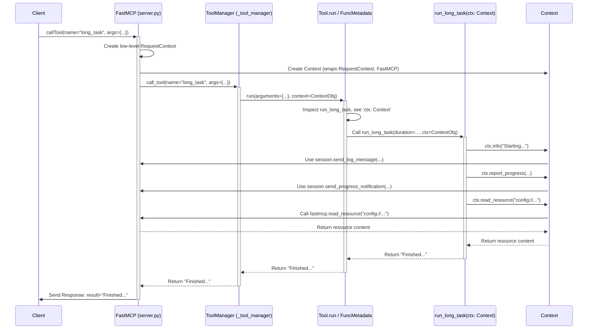

# Chapter 6: Talking Back - FastMCP Context (`Context`)

In [Chapter 5: Reusable Chat Starters - FastMCP Prompts (`Prompt`, `PromptManager`)](05_fastmcp_prompts___prompt____promptmanager__.md), we learned how to create reusable message templates for interacting with AI models. We've seen how to build servers with data resources ([Chapter 3](03_fastmcp_resources___resource____resourcemanager__.md)) and action tools ([Chapter 4](04_fastmcp_tools___tool____toolmanager__.md)).

But imagine you have a tool that takes a while to run, like processing a large file or making a complex calculation. How does your tool communicate back to the user *while* it's running? How can it say "I'm 50% done!" or log important steps? Or what if a tool needs to read some data from one of the server's resources to do its job?

This is where the **`Context`** object comes in. It's like giving your tool function a temporary **backstage pass** for the specific request it's handling. This pass grants it access to special features like sending logs, reporting progress, or accessing other parts of the server environment related to that request.

## What is `Context`?

The `Context` object is a special helper object provided by the `FastMCP` framework. If you define a tool function (or a resource function) that includes a parameter specifically typed as `Context`, `FastMCP` will automatically create and pass this object to your function when it's called.

Think of it this way:
*   Each client request (like `callTool` or `readResource`) is like a separate event.
*   For that specific event, `FastMCP` can provide a `Context` object.
*   This `Context` object holds information about *that specific request* (like its unique ID).
*   It also provides methods (functions) to interact with the ongoing session, such as:
    *   Sending log messages back to the client (`ctx.info`, `ctx.debug`, etc.).
    *   Reporting progress updates (`ctx.report_progress`).
    *   Reading data from other resources defined on the server (`ctx.read_resource`).

It's your function's way of communicating out or accessing shared server capabilities during its execution for a particular request.

## Getting Access: Asking for the `Context`

How do you tell `FastMCP` that your function needs this backstage pass? You simply add a parameter to your function definition and use a **type hint** to mark it as `Context`.

Let's create a tool that simulates a long-running task and uses `Context` to report progress and log messages.

**File: `long_task_server.py`**

```python
import anyio # For simulating delay with sleep
from mcp.server.fastmcp import FastMCP
# 1. Import the Context type
from mcp.server.fastmcp.server import Context

# Create the server instance
server = FastMCP(name="LongTaskServer")

# Define our tool function
# 2. Add a parameter (e.g., 'ctx') and type hint it as 'Context'
@server.tool(name="long_task", description="Simulates a task that takes time.")
async def run_long_task(duration_seconds: int, ctx: Context) -> str:
  """
  Simulates a task, reporting progress and logging using Context.
  """
  # 3. Use the context object!
  await ctx.info(f"Starting long task for {duration_seconds} seconds.")

  total_steps = 5
  for i in range(total_steps):
      step = i + 1
      await ctx.debug(f"Working on step {step}/{total_steps}...")
      # Simulate work
      await anyio.sleep(duration_seconds / total_steps)
      # Report progress (current step, total steps)
      await ctx.report_progress(step, total_steps)

  await ctx.info("Long task completed!")
  return f"Finished simulated task of {duration_seconds} seconds."

# Standard run block
if __name__ == "__main__":
    print(f"Starting {server.name}...")
    server.run()
    print(f"{server.name} finished.")
```

**Explanation:**

1.  **`from mcp.server.fastmcp.server import Context`**: We import the necessary `Context` class.
2.  **`async def run_long_task(duration_seconds: int, ctx: Context)`**:
    *   We define our tool function as usual.
    *   Crucially, we add a parameter named `ctx`. You can name it anything (like `context`, `req_ctx`), but `ctx` is common.
    *   We add the type hint `: Context` after the parameter name. This is the signal to `FastMCP` to inject the context object here.
3.  **Using `ctx`**: Inside the function, we can now use the methods provided by the `ctx` object:
    *   `await ctx.info(...)`: Sends an informational log message back to the client connected to this session.
    *   `await ctx.debug(...)`: Sends a debug-level log message. There are also `warning` and `error` methods.
    *   `await ctx.report_progress(step, total_steps)`: Sends a progress update to the client. The client application might display this in a progress bar.

When a client calls the `long_task` tool, `FastMCP` will:
1.  See the `ctx: Context` parameter.
2.  Create a `Context` object specific to this request.
3.  Call your `run_long_task` function, passing the duration and the newly created `ctx` object.
4.  Your function runs, and calls like `ctx.info` or `ctx.report_progress` send messages back to the client *during* the execution of the tool.

## Using `Context` to Access Resources

The `Context` object isn't just for sending information *out*; it can also be used to access other parts of the server, like reading resources defined using `@server.resource`.

Let's modify our example. Imagine our long task needs some configuration data stored in a resource.

**File: `long_task_server_with_resource.py`**

```python
import anyio
from mcp.server.fastmcp import FastMCP
from mcp.server.fastmcp.server import Context

# Create the server instance
server = FastMCP(name="LongTaskServer")

# Define a simple resource that holds some config data
@server.resource(uri="config://task_settings", description="Settings for the long task.")
def get_task_settings() -> str:
  """Returns task settings as a simple string."""
  # In a real app, this might load from a file or database
  print("Resource 'config://task_settings' was read!")
  return "Default speed: Normal" # Simple example setting

# Define our tool function
@server.tool(name="long_task", description="Simulates a task using config resource.")
async def run_long_task(duration_seconds: int, ctx: Context) -> str:
  """
  Simulates a task, reads config via Context, reports progress.
  """
  await ctx.info(f"Starting long task for {duration_seconds} seconds.")

  # 1. Use context to read the resource
  try:
      # read_resource returns a list of content chunks
      resource_contents = await ctx.read_resource("config://task_settings")
      # Assuming simple text content for this example
      settings = ""
      for content_part in resource_contents:
          if hasattr(content_part, 'content') and isinstance(content_part.content, str):
              settings = content_part.content
              break
      await ctx.info(f"Loaded settings: {settings}")
  except Exception as e:
      await ctx.warning(f"Could not read task settings: {e}")


  total_steps = 5
  for i in range(total_steps):
      step = i + 1
      await ctx.debug(f"Working on step {step}/{total_steps}...")
      await anyio.sleep(duration_seconds / total_steps)
      await ctx.report_progress(step, total_steps)

  await ctx.info("Long task completed!")
  return f"Finished simulated task of {duration_seconds} seconds using settings."

# Standard run block
if __name__ == "__main__":
    print(f"Starting {server.name}...")
    server.run()
    print(f"{server.name} finished.")
```

**Explanation:**

1.  **`@server.resource(...)`**: We added a simple resource named `config://task_settings` that just returns a string.
2.  **`resource_contents = await ctx.read_resource("config://task_settings")`**: Inside our `run_long_task` tool, we now use `ctx.read_resource()` to fetch the content of our configuration resource. This allows the tool to dynamically access data managed by the server without having direct access to the resource's implementation function (`get_task_settings`).
3.  **Processing Content**: The `read_resource` method returns an iterable of `ReadResourceContents` objects (often just one). We extracted the string content to use it.

Now, our tool can both communicate outwards (logs, progress) and interact inwards (read resources) using the same `Context` object, all within the scope of the single request it's handling.

## How `Context` Works Under the Hood

It feels like magic that just adding `: Context` gives your function these powers, but it's a well-defined process within `FastMCP`.

1.  **Request Arrives:** A client sends a request, for example, `callTool` for our `long_task`.
2.  **Low-Level Handling:** The underlying `MCPServer` receives the request and creates a `RequestContext` object. This low-level context holds the raw request details, a reference to the current `ServerSession`, and the request ID.
3.  **`FastMCP` Takes Over:** The request is routed to the appropriate `FastMCP` handler method (e.g., `FastMCP.call_tool`).
4.  **Context Creation:** Before calling the actual tool function, `FastMCP` calls its internal `get_context()` method. This method creates the high-level `Context` object we use. It wraps the low-level `RequestContext` and also adds a reference to the `FastMCP` server instance itself.
5.  **Function Inspection:** The `ToolManager` (when asked to run the tool) inspects the signature of your target function (`run_long_task`). It sees the `ctx: Context` parameter.
6.  **Injection:** The `ToolManager` (specifically the `Tool.run` method which uses `FuncMetadata.call_fn_with_arg_validation`) knows it needs to provide a `Context` object. It takes the `Context` created in step 4 and passes it as the argument for the `ctx` parameter when calling your `run_long_task` function.
7.  **Execution:** Your function runs. When you call `ctx.info("...")`, the `Context` object uses its reference to the underlying `RequestContext` and `ServerSession` to send the appropriate log message back to the client via the session. Similarly, `ctx.report_progress` uses the session, and `ctx.read_resource` uses the reference to the `FastMCP` instance to call its `read_resource` method.

**Simplified Sequence Diagram (`callTool` with `Context`):**



**Looking at the Code (Briefly):**

*   **Context Creation (`server/fastmcp/server.py`)**: The `FastMCP.get_context` method is responsible for creating the `Context` object when needed, typically just before calling a tool or resource handler. It grabs the low-level context and wraps it.

    ```python
    # Inside server/fastmcp/server.py (Simplified FastMCP.get_context)
    from mcp.shared.context import RequestContext # Low-level context

    class FastMCP:
        # ... (other methods) ...

        def get_context(self) -> Context[ServerSession, object]:
            """Returns a Context object."""
            try:
                # Get the low-level context for the current request
                request_context: RequestContext | None = self._mcp_server.request_context
            except LookupError:
                request_context = None # Not available outside a request

            # Create our high-level Context, passing the low-level one
            # and a reference to this FastMCP instance ('self')
            return Context(request_context=request_context, fastmcp=self)
    ```

*   **Context Injection (`server/fastmcp/tools/base.py`)**: The `Tool.from_function` method inspects the function signature to see if a `Context` parameter exists and stores its name (`context_kwarg`). Later, `Tool.run` uses this information (via `FuncMetadata`) to pass the context object when calling your function.

    ```python
    # Inside server/fastmcp/tools/base.py (Simplified Tool.from_function)
    class Tool(BaseModel):
        # ... fields ...
        context_kwarg: str | None = Field(...)

        @classmethod
        def from_function(cls, fn, ...) -> Tool:
            # ... other inspection ...
            context_param_name = None
            sig = inspect.signature(fn)
            for param_name, param in sig.parameters.items():
                # Check if the type hint is Context
                if param.annotation is Context:
                    context_param_name = param_name
                    break
            # ... create FuncMetadata, skipping context arg ...
            return cls(
                # ...,
                context_kwarg=context_param_name,
                # ...
            )

    # Inside Tool.run (simplified concept)
    async def run(self, arguments, context=None):
        # ... validate args ...
        kwargs_for_fn = validated_args
        if self.context_kwarg and context:
             # Add the context object to the arguments passed to the function
            kwargs_for_fn[self.context_kwarg] = context

        # Call the original function (self.fn)
        result = await self.fn(**kwargs_for_fn) # Or sync call
        return result
    ```

*   **Context Implementation (`server/fastmcp/server.py`)**: The `Context` class itself implements methods like `info`, `report_progress`, `read_resource` by calling methods on the stored `_request_context.session` or `_fastmcp` instance.

    ```python
    # Inside server/fastmcp/server.py (Simplified Context methods)
    class Context(BaseModel, Generic[ServerSessionT, LifespanContextT]):
        _request_context: RequestContext[...] | None
        _fastmcp: FastMCP | None
        # ... (init, properties) ...

        async def report_progress(self, progress, total=None):
            # Get progress token from low-level context meta if available
            progress_token = self.request_context.meta.progressToken if self.request_context.meta else None
            if progress_token:
                # Use the session object from the low-level context
                await self.request_context.session.send_progress_notification(...)

        async def read_resource(self, uri):
            # Use the stored FastMCP instance
            assert self._fastmcp is not None
            return await self._fastmcp.read_resource(uri)

        async def log(self, level, message, ...):
             # Use the session object from the low-level context
            await self.request_context.session.send_log_message(...)

        async def info(self, message, **extra):
            await self.log("info", message, **extra)
        # ... (debug, warning, error methods) ...
    ```

## Conclusion

You've learned about the `Context` object in `FastMCP` – your function's essential backstage pass during a request.

*   `Context` provides access to request-specific information and server capabilities.
*   You gain access by adding a parameter type-hinted as `Context` to your tool or resource function definition.
*   It allows your functions to:
    *   Send log messages (`ctx.info`, `ctx.debug`, etc.).
    *   Report progress (`ctx.report_progress`).
    *   Read server resources (`ctx.read_resource`).
    *   Access request details (`ctx.request_id`).
*   `FastMCP` automatically creates and injects the `Context` object when your function is called for a specific request.

The `Context` object is key to building more interactive and communicative tools and resources that can provide feedback to the user and interact with their environment during execution.

So far, we've focused on the high-level abstractions `FastMCP` provides (`Tool`, `Resource`, `Prompt`, `Context`). In the next chapter, we'll take a step back and look at the fundamental data structures defined by the MCP specification itself: [Chapter 7: MCP Protocol Types](07_mcp_protocol_types.md). Understanding these types helps clarify the data being exchanged between clients and servers under the hood.

---

Generated by [AI Codebase Knowledge Builder](https://github.com/The-Pocket/Tutorial-Codebase-Knowledge)