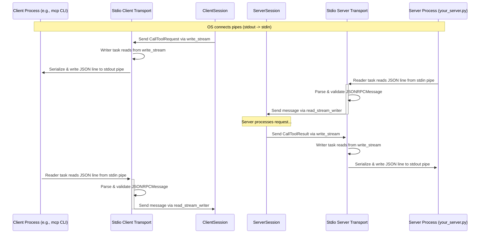

# Chapter 9: Communication Transports (Stdio, SSE, WebSocket, Memory)

Welcome to the final chapter of our introductory journey into the `MCP Python SDK`! In [Chapter 8: Client/Server Sessions (`ClientSession`, `ServerSession`)](08_client_server_sessions___clientsession____serversession__.md), we learned how `Session` objects manage the ongoing conversation and state for a single connection between a client and a server, like dedicated phone operators handling a call.

But how do the messages actually *travel* over that phone line? If the client and server are different programs, possibly on different computers, what's the physical wire or digital equivalent carrying the signals?

Imagine our standardized MCP messages ([Chapter 7: MCP Protocol Types](07_mcp_protocol_types.md)) are like perfectly formatted letters. We need a delivery service to actually move these letters between the sender and receiver. This is where **Communication Transports** come in.

## What are Communication Transports? The Delivery Service

Communication Transports define the **actual mechanisms** used to send the serialized MCP messages (those structured JSON strings) back and forth between the client and server processes.

Think of them as different **delivery services** you can choose from:

1.  **`stdio` (Standard Input/Output): Postal Mail for Processes**
    *   **Mechanism:** Uses the standard input (`stdin`) and standard output (`stdout`) streams of the processes. One process writes messages (as lines of text) to its `stdout`, and the other reads them from its `stdin`.
    *   **Use Case:** Very common for command-line tools or when one process directly starts another (like when `mcp run` executes your server script). It's simple and works well when the client and server are running on the same machine and have a parent-child relationship.

2.  **`sse` (Server-Sent Events): One-Way Radio Broadcast (Server -> Client)**
    *   **Mechanism:** Uses standard web protocols (HTTP). The client makes an initial HTTP request, and the server keeps the connection open, sending messages (events) *to* the client whenever it wants. Client-to-server communication usually happens via separate HTTP POST requests.
    *   **Use Case:** Good for web applications where the server needs to push updates (like notifications, progress) to the client (a web browser) efficiently.

3.  **`websocket`: Dedicated Two-Way Phone Line (Web)**
    *   **Mechanism:** Uses the WebSocket protocol, which provides a persistent, full-duplex (two-way) communication channel over a single TCP connection, typically initiated via an HTTP handshake.
    *   **Use Case:** Ideal for highly interactive web applications (like chat apps, real-time dashboards, or the MCP Inspector) where both the client and server need to send messages to each other at any time with low latency.

4.  **`memory`: Internal Office Courier**
    *   **Mechanism:** Uses in-memory queues within a *single* Python process. Messages are passed directly between the client and server components without going through external pipes or network connections.
    *   **Use Case:** Primarily used for **testing**. It allows you to run both the client and server parts of your code in the same test script and have them communicate directly, making tests faster and self-contained.

These transports are the concrete implementations that bridge the gap between the abstract `Session` objects (which manage the *conversation*) and the physical reality of sending bytes (the *delivery*).

## How Transports are Used (Often Indirectly)

The good news is that if you're using `FastMCP` ([Chapter 2](02_fastmcp_server___fastmcp__.md)) and the `mcp` command-line tool ([Chapter 1](01_cli___mcp__command_.md)), you often **don't need to worry about explicitly choosing or configuring the transport**. The tools handle it for common scenarios:

*   **`mcp run your_server.py`**: By default, this command uses the **`stdio`** transport. It starts your Python script as a child process and communicates with it using `stdin` and `stdout`.
*   **`mcp dev your_server.py`**: This command also typically runs your server using **`stdio`**. The *MCP Inspector* web application it launches then connects to your server (potentially via a WebSocket proxy managed by the dev tool) to monitor the `stdio` communication.
*   **`mcp install ...` (for Claude Desktop)**: This usually configures Claude to launch your server using `uv run ... mcp run your_server.py`, again defaulting to **`stdio`** communication between Claude and your server process.

So, for many typical development and integration tasks, `stdio` is the default and works behind the scenes.

## Using Transports Programmatically (A Glimpse)

While `mcp run` handles `stdio` automatically, what if you wanted to build a *custom* server application that listens over WebSockets? Or write tests using the `memory` transport? The SDK provides tools for this.

You typically use an `async context manager` provided by the SDK for the specific transport. These managers handle setting up the communication channel and yield a pair of streams (`read_stream`, `write_stream`) that the `ClientSession` or `ServerSession` can use.

**Conceptual Server using Stdio (like `mcp run`)**

```python
# Conceptual code showing how stdio_server might be used
import anyio
from mcp.server.stdio import stdio_server # Import the stdio transport
from mcp.server.mcp_server import MCPServer # Low-level server

# Assume 'my_actual_server' is your MCPServer instance
my_actual_server = MCPServer(name="MyStdioServer")

async def main():
    print("Server: Waiting for client over stdio...")
    # 1. Use the stdio_server context manager
    async with stdio_server() as (read_stream, write_stream):
        # 2. It yields streams connected to stdin/stdout
        print("Server: Stdio streams acquired. Running server logic.")
        # 3. Pass streams to the server's run method
        await my_actual_server.run(
            read_stream,
            write_stream,
            my_actual_server.create_initialization_options()
        )
    print("Server: Stdio streams closed.")

if __name__ == "__main__":
    try:
        anyio.run(main)
    except KeyboardInterrupt:
        print("Server: Exiting.")
```

**Explanation:**
The `stdio_server()` context manager handles wrapping the process's standard input and output. It provides the `read_stream` (to get messages *from* stdin) and `write_stream` (to send messages *to* stdout) that the underlying `MCPServer` (and thus `FastMCP`) needs to communicate.

**Conceptual Server using WebSocket (within a web framework)**

```python
# Conceptual code using Starlette web framework
from starlette.applications import Starlette
from starlette.routing import WebSocketRoute
from starlette.websockets import WebSocket
from mcp.server.websocket import websocket_server # Import WS transport
from mcp.server.mcp_server import MCPServer # Low-level server

my_actual_server = MCPServer(name="MyWebSocketServer")

# Define the WebSocket endpoint handler
async def websocket_endpoint(websocket: WebSocket):
    # 1. Use the websocket_server context manager
    async with websocket_server(
        websocket.scope, websocket.receive, websocket.send
    ) as (read_stream, write_stream):
        # 2. It yields streams connected to this specific WebSocket
        print(f"Server: WebSocket client connected. Running server logic.")
        # 3. Pass streams to the server's run method
        await my_actual_server.run(
            read_stream,
            write_stream,
            my_actual_server.create_initialization_options()
        )
    print("Server: WebSocket client disconnected.")

# Set up the web application routes
routes = [
    WebSocketRoute("/mcp", endpoint=websocket_endpoint)
]
app = Starlette(routes=routes)

# To run this, you'd use an ASGI server like uvicorn:
# uvicorn your_module:app --host 0.0.0.0 --port 8000
```

**Explanation:**
Here, `websocket_server()` adapts the WebSocket connection provided by the web framework (Starlette) into the `read_stream` and `write_stream` expected by the MCP server. Each connecting client gets its own session handled through this endpoint.

**Conceptual Test using Memory Transport**

```python
import anyio
import pytest # Using pytest testing framework
from mcp.client.session import ClientSession
from mcp.server.fastmcp import FastMCP # Using FastMCP for the server part
from mcp.shared.memory import create_client_server_memory_streams

# Define a simple FastMCP server for the test
test_server = FastMCP(name="TestServer")
@test_server.tool()
def ping() -> str:
    return "pong"

@pytest.mark.anyio # Mark test to be run with anyio
async def test_memory_transport():
    # 1. Use the memory stream generator
    async with create_client_server_memory_streams() as (
        (client_read, client_write), # Client perspective
        (server_read, server_write)  # Server perspective
    ):
        print("Test: Memory streams created.")
        # Run server and client concurrently
        async with anyio.create_task_group() as tg:
            # 2. Start the server using its streams
            tg.start_soon(
                test_server.run, server_read, server_write,
                test_server.create_initialization_options()
            )
            print("Test: Server started in background task.")

            # 3. Create and run client using its streams
            async with ClientSession(client_read, client_write) as client:
                print("Test: Client session created. Initializing...")
                await client.initialize()
                print("Test: Client initialized. Calling 'ping' tool...")
                result = await client.call_tool("ping")
                print(f"Test: Client received result: {result}")
                # Assert the result is correct
                assert result.content[0].text == "pong"

            # Cancel server task when client is done (optional)
            tg.cancel_scope.cancel()
        print("Test: Finished.")

```

**Explanation:**
`create_client_server_memory_streams()` creates pairs of connected in-memory queues. The server writes to `server_write`, which sends messages to `client_read`. The client writes to `client_write`, which sends messages to `server_read`. This allows direct, in-process communication for testing without actual pipes or network sockets.

## How Transports Work Under the Hood (Stdio Example)

Let's focus on the simplest case: `stdio`. How does the `stdio_server` context manager actually work?

1.  **Process Startup:** When you run `mcp run your_server.py`, the `mcp` command starts your `your_server.py` script as a new process. The operating system connects the `stdout` of your server process to the `stdin` of the `mcp` process (or vice versa, depending on perspective, but essentially creating pipes between them).
2.  **Context Manager:** Inside your server script (when it calls `stdio_server()`), the context manager gets asynchronous wrappers around the process's standard input (`sys.stdin.buffer`) and standard output (`sys.stdout.buffer`), ensuring they handle text encoding (like UTF-8) correctly.
3.  **Internal Streams:** The context manager also creates internal `anyio` memory streams: `read_stream_writer` / `read_stream` and `write_stream_reader` / `write_stream`. It yields `read_stream` and `write_stream` to your server code.
4.  **Reader Task (`stdin_reader`)**: The context manager starts a background task that continuously reads lines from the process's actual `stdin`.
    *   For each line received:
        *   It tries to parse the line as a JSON string.
        *   It validates the JSON against the `JSONRPCMessage` Pydantic model ([Chapter 7](07_mcp_protocol_types.md)).
        *   If valid, it puts the `JSONRPCMessage` object onto the `read_stream_writer` (which sends it to the `read_stream` your server is listening on).
        *   If invalid, it might send an `Exception` object instead.
5.  **Writer Task (`stdout_writer`)**: It starts another background task that continuously reads `JSONRPCMessage` objects from the `write_stream_reader` (which receives messages your server sends to the `write_stream`).
    *   For each message received:
        *   It serializes the `JSONRPCMessage` object back into a JSON string.
        *   It adds a newline character (`\n`) because `stdio` communication is typically line-based.
        *   It writes the resulting string to the process's actual `stdout`.
6.  **Server Interaction:** Your `MCPServer` (or `FastMCP`) interacts *only* with the yielded `read_stream` and `write_stream`. It doesn't know about `stdin` or `stdout` directly. The transport handles the translation between these memory streams and the actual process I/O.
7.  **Cleanup:** When the `async with stdio_server()...` block finishes, the background reader/writer tasks are stopped, and the streams are closed.

**Simplified Sequence Diagram (Stdio Transport during `callTool`)**



This shows how the transport layers (`ClientStdio`, `ServerStdio`) act as intermediaries, translating between the Session's memory streams and the actual process I/O pipes (`stdin`/`stdout`). The other transports (SSE, WebSocket, Memory) perform analogous translation tasks for their respective communication mechanisms.

## Diving into the Code (Briefly!)

Let's look at the structure inside the transport files.

**`server/stdio.py` (Simplified `stdio_server`)**

```python
@asynccontextmanager
async def stdio_server(stdin=None, stdout=None):
    # ... (wrap sys.stdin/stdout if needed) ...

    # Create the internal memory streams
    read_stream_writer, read_stream = anyio.create_memory_object_stream(0)
    write_stream, write_stream_reader = anyio.create_memory_object_stream(0)

    async def stdin_reader(): # Reads from actual stdin
        try:
            async with read_stream_writer:
                async for line in stdin: # Read line from process stdin
                    try:
                        # Validate and parse
                        message = types.JSONRPCMessage.model_validate_json(line)
                    except Exception as exc:
                        await read_stream_writer.send(exc) # Send error upstream
                        continue
                    # Send valid message to the session via internal stream
                    await read_stream_writer.send(message)
        # ... (error/close handling) ...

    async def stdout_writer(): # Writes to actual stdout
        try:
            async with write_stream_reader:
                # Read message from the session via internal stream
                async for message in write_stream_reader:
                    # Serialize to JSON string
                    json_str = message.model_dump_json(...)
                    # Write line to process stdout
                    await stdout.write(json_str + "\n")
                    await stdout.flush()
        # ... (error/close handling) ...

    # Start reader/writer tasks in the background
    async with anyio.create_task_group() as tg:
        tg.start_soon(stdin_reader)
        tg.start_soon(stdout_writer)
        # Yield the streams the session will use
        yield read_stream, write_stream
        # Context manager exit cleans up tasks
```

**`shared/memory.py` (Simplified `create_client_server_memory_streams`)**

```python
@asynccontextmanager
async def create_client_server_memory_streams():
    # Create two pairs of connected memory streams
    server_to_client_send, server_to_client_receive = anyio.create_memory_object_stream(...)
    client_to_server_send, client_to_server_receive = anyio.create_memory_object_stream(...)

    # Define the streams from each perspective
    client_streams = (server_to_client_receive, client_to_server_send)
    server_streams = (client_to_server_receive, server_to_client_send)

    # Use async context manager to ensure streams are closed properly
    async with server_to_client_receive, client_to_server_send, \
               client_to_server_receive, server_to_client_send:
        # Yield the pairs of streams
        yield client_streams, server_streams
    # Streams are automatically closed on exit
```

These snippets illustrate the pattern: set up the external communication (or fake it with memory streams), create internal memory streams for the Session, start background tasks to bridge the two, and yield the internal streams.

## Conclusion

Congratulations on reaching the end of this introductory series! You've learned about Communication Transports – the crucial delivery services that move MCP messages between clients and servers.

*   Transports are the **mechanisms** for sending/receiving serialized messages (e.g., `stdio`, `sse`, `websocket`, `memory`).
*   Each transport suits different scenarios (command-line, web, testing).
*   Frameworks like `FastMCP` and tools like `mcp run` often handle the **default transport (`stdio`) automatically**.
*   Transports work by **bridging** the gap between the `Session`'s internal communication streams and the actual external I/O (pipes, sockets, queues).

Understanding transports completes the picture of how MCP components fit together, from high-level abstractions like `FastMCP` down to the way messages are physically exchanged.

You now have a solid foundation in the core concepts of the `MCP Python SDK`. From here, you can delve deeper into specific features, explore more complex examples, or start building your own powerful AI tools and integrations! Good luck!

---

Generated by [AI Codebase Knowledge Builder](https://github.com/The-Pocket/Tutorial-Codebase-Knowledge)