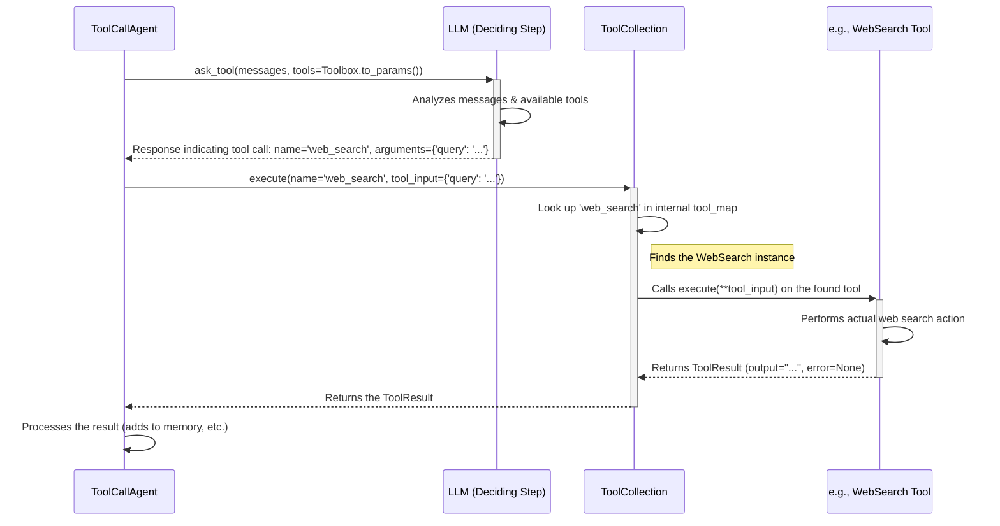

# Chapter 4: Tool / ToolCollection - Giving Your Agent Skills

In [Chapter 3: BaseAgent - The Agent Blueprint](03_baseagent.md), we learned how `BaseAgent` provides the standard structure for our agents, including a brain ([LLM](01_llm.md)) and memory ([Message / Memory](02_message___memory.md)). But what if we want our agent to do more than just *think* and *remember*? What if we want it to *act* in the world – like searching the web, running code, or editing files?

This is where **Tools** come in!

## What Problem Do They Solve?

Imagine an agent trying to answer the question: "What's the weather like in Tokyo *right now*?"

The agent's LLM brain has a lot of general knowledge, but it doesn't have *real-time* access to the internet. It can't check the current weather. It needs a specific **capability** or **skill** to do that.

Similarly, if you ask an agent to "Write a python script that prints 'hello world' and save it to a file named `hello.py`," the agent needs the ability to:
1.  Understand the request (using its LLM).
2.  Write the code (using its LLM).
3.  Actually *execute* code to create and write to a file.

Steps 1 and 2 are handled by the LLM, but step 3 requires interacting with the computer's file system – something the LLM can't do directly.

**Tools** give agents these specific, actionable skills. A `ToolCollection` organizes these skills so the agent knows what it can do.

**Use Case:** Let's build towards an agent that can:
1.  Search the web for today's date.
2.  Tell the user the date.

This agent needs a "Web Search" tool.

## Key Concepts: Tools and Toolboxes

Let's break down the two main ideas:

### 1. `BaseTool`: The Blueprint for a Skill

Think of `BaseTool` (`app/tool/base.py`) as the *template* or *design specification* for any tool. It doesn't *do* anything itself, but it defines what every tool needs to have:

*   **`name` (str):** A short, descriptive name for the tool (e.g., `web_search`, `file_writer`, `code_runner`). This is how the agent (or LLM) identifies the tool.
*   **`description` (str):** A clear explanation of what the tool does, what it's good for, and when to use it. This is crucial for the LLM to decide *which* tool to use for a given task.
*   **`parameters` (dict):** A definition of the inputs the tool expects. For example, a `web_search` tool needs a `query` input, and a `file_writer` needs a `path` and `content`. This is defined using a standard format called JSON Schema.
*   **`execute` method:** An **abstract** method. This means `BaseTool` says "every tool *must* have an execute method", but each specific tool needs to provide its *own* instructions for how to actually perform the action.

You almost never use `BaseTool` directly. You use it as a starting point to create *actual*, usable tools.

### 2. Concrete Tools: The Actual Skills

These are specific classes that *inherit* from `BaseTool` and provide the real implementation for the `execute` method. OpenManus comes with several pre-built tools:

*   **`WebSearch` (`app/tool/web_search.py`):** Searches the web using engines like Google, Bing, etc.
*   **`Bash` (`app/tool/bash.py`):** Executes shell commands (like `ls`, `pwd`, `python script.py`).
*   **`StrReplaceEditor` (`app/tool/str_replace_editor.py`):** Views, creates, and edits files by replacing text.
*   **`BrowserUseTool` (`app/tool/browser_use_tool.py`):** Interacts with web pages like a user (clicking, filling forms, etc.).
*   **`Terminate` (`app/tool/terminate.py`):** A special tool used by agents to signal they have finished their task.

Each of these defines its specific `name`, `description`, `parameters`, and implements the `execute` method to perform its unique action.

### 3. `ToolCollection`: The Agent's Toolbox

Think of a handyman. They don't just carry one tool; they have a toolbox filled with hammers, screwdrivers, wrenches, etc.

A `ToolCollection` (`app/tool/tool_collection.py`) is like that toolbox for an agent.

*   It holds a list of specific tool instances (like `WebSearch`, `Bash`).
*   It allows the agent (and its LLM) to see all the available tools and their descriptions.
*   It provides a way to execute a specific tool by its name.

When an agent needs to perform an action, its LLM can look at the `ToolCollection`, read the descriptions of the available tools, choose the best one for the job, figure out the necessary inputs based on the tool's `parameters`, and then ask the `ToolCollection` to execute that tool with those inputs.

## How Do We Use Them?

Let's see how we can equip an agent with a simple tool. We'll create a basic "EchoTool" first.

**1. Creating a Concrete Tool (Inheriting from `BaseTool`):**

```python
# Import the necessary base class
from app.tool.base import BaseTool, ToolResult

# Define our simple tool
class EchoTool(BaseTool):
    """A simple tool that echoes the input text."""

    name: str = "echo_message"
    description: str = "Repeats back the text provided in the 'message' parameter."
    parameters: dict = {
        "type": "object",
        "properties": {
            "message": {
                "type": "string",
                "description": "The text to be echoed back.",
            },
        },
        "required": ["message"], # Tells the LLM 'message' must be provided
    }

    # Implement the actual action
    async def execute(self, message: str) -> ToolResult:
        """Takes a message and returns it."""
        print(f"EchoTool executing with message: '{message}'")
        # ToolResult is a standard way to return tool output
        return ToolResult(output=f"You said: {message}")

# Create an instance of our tool
echo_tool_instance = EchoTool()

print(f"Tool Name: {echo_tool_instance.name}")
print(f"Tool Description: {echo_tool_instance.description}")
```

**Explanation:**

*   We import `BaseTool` and `ToolResult` (a standard object for wrapping tool outputs).
*   `class EchoTool(BaseTool):` declares that our `EchoTool` *is a type of* `BaseTool`.
*   We define the `name`, `description`, and `parameters` according to the `BaseTool` template. The `parameters` structure tells the LLM what input is expected (`message` as a string) and that it's required.
*   We implement `async def execute(self, message: str) -> ToolResult:`. This is the *specific* logic for our tool. It takes the `message` input and returns it wrapped in a `ToolResult`.

**Example Output:**

```
Tool Name: echo_message
Tool Description: Repeats back the text provided in the 'message' parameter.
```

**2. Creating a ToolCollection:**

Now, let's put our `EchoTool` and the built-in `WebSearch` tool into a toolbox.

```python
# Import ToolCollection and the tools we want
from app.tool import ToolCollection, WebSearch
# Assume EchoTool class is defined as above
# from your_module import EchoTool # Or wherever EchoTool is defined

# Create instances of the tools
echo_tool = EchoTool()
web_search_tool = WebSearch() # Uses default settings

# Create a ToolCollection containing these tools
my_toolbox = ToolCollection(echo_tool, web_search_tool)

# See the names of the tools in the collection
tool_names = [tool.name for tool in my_toolbox]
print(f"Tools in the toolbox: {tool_names}")

# Get the parameters needed for the LLM
tool_params_for_llm = my_toolbox.to_params()
print(f"\nParameters for LLM (showing first tool):")
import json
print(json.dumps(tool_params_for_llm[0], indent=2))
```

**Explanation:**

*   We import `ToolCollection` and the specific tools (`WebSearch`, `EchoTool`).
*   We create instances of the tools we need.
*   `my_toolbox = ToolCollection(echo_tool, web_search_tool)` creates the collection, holding our tool instances.
*   We can access the tools inside using `my_toolbox.tools` or iterate over `my_toolbox`.
*   `my_toolbox.to_params()` is a crucial method. It formats the `name`, `description`, and `parameters` of *all* tools in the collection into a list of dictionaries. This specific format is exactly what the agent's [LLM](01_llm.md) needs (when using its `ask_tool` method) to understand which tools are available and how to use them.

**Example Output:**

```
Tools in the toolbox: ['echo_message', 'web_search']

Parameters for LLM (showing first tool):
{
  "type": "function",
  "function": {
    "name": "echo_message",
    "description": "Repeats back the text provided in the 'message' parameter.",
    "parameters": {
      "type": "object",
      "properties": {
        "message": {
          "type": "string",
          "description": "The text to be echoed back."
        }
      },
      "required": [
        "message"
      ]
    }
  }
}
```

**3. Agent Using the ToolCollection:**

Now, how does an agent like `ToolCallAgent` (a specific type of [BaseAgent](03_baseagent.md)) use this?

Conceptually (the real agent code is more complex):

1.  The agent is configured with a `ToolCollection` (like `my_toolbox`).
2.  When the agent needs to figure out the next step, it calls its LLM's `ask_tool` method.
3.  It passes the conversation history ([Message / Memory](02_message___memory.md)) AND the output of `my_toolbox.to_params()` to the LLM.
4.  The LLM looks at the conversation and the list of available tools (from `to_params()`). It reads the `description` of each tool to understand what it does.
5.  If the LLM decides a tool is needed (e.g., the user asked "What's today's date?", the LLM sees the `web_search` tool is available and appropriate), it will generate a special response indicating:
    *   The `name` of the tool to use (e.g., `"web_search"`).
    *   The `arguments` (inputs) for the tool, based on its `parameters` (e.g., `{"query": "today's date"}`).
6.  The agent receives this response from the LLM.
7.  The agent then uses the `ToolCollection`'s `execute` method: `await my_toolbox.execute(name="web_search", tool_input={"query": "today's date"})`.
8.  The `ToolCollection` finds the `WebSearch` tool instance in its internal `tool_map` and calls *its* `execute` method with the provided input.
9.  The `WebSearch` tool runs, performs the actual web search, and returns the results (as a `ToolResult` or similar).
10. The agent takes this result, formats it as a `tool` message, adds it to its memory, and continues its thinking process (often asking the LLM again, now with the tool's result as context).

The `ToolCollection` acts as the crucial bridge between the LLM's *decision* to use a tool and the *actual execution* of that tool's code.

## Under the Hood: How `ToolCollection.execute` Works

Let's trace the flow when an agent asks its `ToolCollection` to run a tool:



**Code Glimpse:**

Let's look at the `ToolCollection` itself in `app/tool/tool_collection.py`:

```python
# Simplified snippet from app/tool/tool_collection.py
from typing import Any, Dict, List, Tuple
from app.tool.base import BaseTool, ToolResult, ToolFailure
from app.exceptions import ToolError

class ToolCollection:
    # ... (Config class) ...

    tools: Tuple[BaseTool, ...] # Holds the tool instances
    tool_map: Dict[str, BaseTool] # Maps name to tool instance for quick lookup

    def __init__(self, *tools: BaseTool):
        """Initializes with a sequence of tools."""
        self.tools = tools
        # Create the map for easy lookup by name
        self.tool_map = {tool.name: tool for tool in tools}

    def to_params(self) -> List[Dict[str, Any]]:
        """Formats tools for the LLM API."""
        # Calls the 'to_param()' method on each tool
        return [tool.to_param() for tool in self.tools]

    async def execute(
        self, *, name: str, tool_input: Dict[str, Any] = None
    ) -> ToolResult:
        """Finds a tool by name and executes it."""
        # 1. Find the tool instance using the name
        tool = self.tool_map.get(name)
        if not tool:
            # Return a standard failure result if tool not found
            return ToolFailure(error=f"Tool {name} is invalid")

        # 2. Execute the tool's specific method
        try:
            # The 'tool(**tool_input)' calls the tool instance's __call__ method,
            # which in BaseTool, calls the tool's 'execute' method.
            # The ** unpacks the dictionary into keyword arguments.
            result = await tool(**(tool_input or {}))
            # Ensure the result is a ToolResult (or subclass)
            return result if isinstance(result, ToolResult) else ToolResult(output=str(result))
        except ToolError as e:
             # Handle errors specific to tools
            return ToolFailure(error=e.message)
        except Exception as e:
             # Handle unexpected errors during execution
            return ToolFailure(error=f"Unexpected error executing tool {name}: {e}")

    # ... other methods like add_tool, __iter__ ...
```

**Explanation:**

*   The `__init__` method takes tool instances and stores them in `self.tools` (a tuple) and `self.tool_map` (a dictionary mapping name to instance).
*   `to_params` iterates through `self.tools` and calls each tool's `to_param()` method (defined in `BaseTool`) to get the LLM-compatible format.
*   `execute` is the core method used by agents:
    *   It uses `self.tool_map.get(name)` to quickly find the correct tool instance based on the requested name.
    *   If found, it calls `await tool(**(tool_input or {}))`. The `**` unpacks the `tool_input` dictionary into keyword arguments for the tool's `execute` method (e.g., `message="hello"` for our `EchoTool`, or `query="today's date"` for `WebSearch`).
    *   It wraps the execution in `try...except` blocks to catch errors and return a standardized `ToolFailure` result if anything goes wrong.

## Wrapping Up Chapter 4

We've learned how **Tools** give agents specific skills beyond basic language understanding.
*   `BaseTool` is the abstract blueprint defining a tool's `name`, `description`, and expected `parameters`.
*   Concrete tools (like `WebSearch`, `Bash`, or our custom `EchoTool`) inherit from `BaseTool` and implement the actual `execute` logic.
*   `ToolCollection` acts as the agent's toolbox, holding various tools and providing methods (`to_params`, `execute`) for the agent (often guided by its [LLM](01_llm.md)) to discover and use these capabilities.

With tools, agents can interact with external systems, run code, access real-time data, and perform complex actions, making them much more powerful.

But how do we coordinate multiple agents, potentially using different tools, to work together on a larger task? That's where Flows come in.

Let's move on to [Chapter 5: BaseFlow](05_baseflow.md) to see how we orchestrate complex workflows involving multiple agents and steps.

---

Generated by [AI Codebase Knowledge Builder](https://github.com/The-Pocket/Tutorial-Codebase-Knowledge)