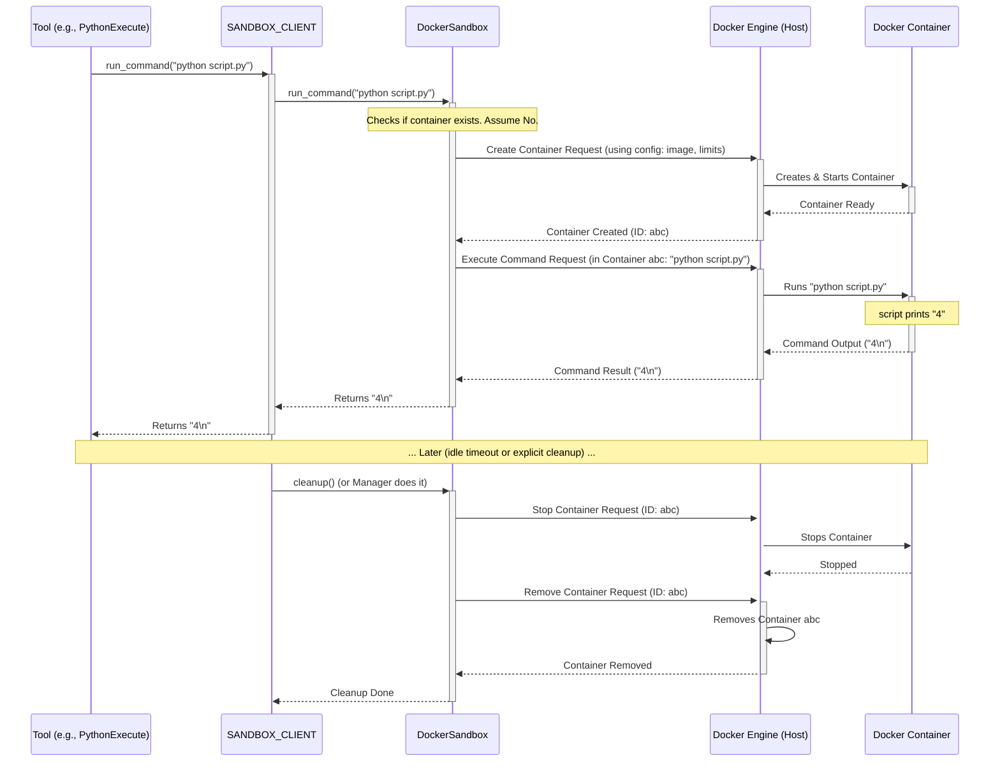

# Chapter 8: DockerSandbox - A Safe Play Area for Code

Welcome to Chapter 8! In [Chapter 7: Configuration (Config)](07_configuration__config_.md), we learned how OpenManus manages settings using the `config.toml` file and the `Config` object. We saw settings for the [LLM](01_llm.md), search tools, and something called `[sandbox]`. Now, let's dive into what that sandbox is!

## What Problem Does `DockerSandbox` Solve?

Imagine our agent, powered by a smart [LLM](01_llm.md), needs to test a piece of code it just wrote, or run a shell command to check something on the system. For example, the user asks: "Write a Python script that calculates 2 plus 2 and run it."

The agent might generate the code `print(2 + 2)`. But where should it run this code?

Running code generated by an AI, especially one connected to the internet, directly on your own computer is **risky**! What if the AI accidentally (or if tricked) generates harmful code like `delete_all_my_files()`? That would be disastrous!

We need a safe, isolated place to run potentially untrusted commands or code – a place where even if something goes wrong, it doesn't affect our main system.

**This is exactly what the `DockerSandbox` provides.** Think of it as a **secure laboratory sandbox** or a disposable, locked room. Inside this room, the agent can perform potentially messy or dangerous experiments (like running code) without any risk to the outside environment (your computer).

**Use Case:** Our agent needs to execute the Python code `print(2 + 2)`. Instead of running it directly, it will ask the `DockerSandbox` to run it inside a secure container. The sandbox will execute the code, capture the output ("4"), and report it back, all without giving the code access to the host machine's files or settings.

## Key Concepts: Secure Execution with Docker

1.  **Isolation via Docker:** `DockerSandbox` uses **Docker containers** to achieve isolation. Docker is a technology that allows packaging applications and their dependencies into lightweight, self-contained units called containers. Crucially, these containers run isolated from the host system and each other. They have their own restricted view of files, network, and processes. It's like giving the code its own mini-computer to run on, completely separate from yours.
2.  **The Sandbox Container:** When needed, the `DockerSandbox` system creates a specific Docker container based on settings in your `config.toml`. This container is the actual "sandbox" environment.
3.  **Lifecycle Management:** The `DockerSandbox` system handles the entire life of the container:
    *   **Creation:** Starting up a fresh container when needed.
    *   **Command Execution:** Running commands (like `python script.py` or `ls`) inside the container.
    *   **File Transfers:** Safely copying files into or out of the container if needed (e.g., putting a script file in, getting a result file out).
    *   **Cleanup:** Stopping and removing the container automatically when it's no longer needed or after a period of inactivity, ensuring no resources are wasted.
4.  **Configuration (`config.toml`):** As we saw in the [previous chapter](07_configuration__config_.md), the `[sandbox]` section in `config.toml` controls how the sandbox behaves:
    *   `use_sandbox = true`: Turns the sandbox feature on. If `false`, code might run directly on the host (less safe!).
    *   `image = "python:3.12-slim"`: Specifies which Docker base image to use (e.g., a minimal Python environment).
    *   `memory_limit = "512m"`: Restricts how much memory the container can use.
    *   `cpu_limit = 1.0`: Restricts how much CPU power the container can use.
    *   `timeout = 300`: Sets a default time limit (in seconds) for commands.
    *   `network_enabled = false`: Controls whether the container can access the internet (often disabled for extra security).

## How Do We Use It? (Via Tools and Clients)

Typically, you don't interact with the `DockerSandbox` class directly. Instead, [Tools](04_tool___toolcollection.md) that need to execute code, like `Bash` (`app/tool/bash.py`) or `PythonExecute` (`app/tool/python_execute.py`), often use a helper called a **Sandbox Client** to interact with the sandbox environment *if* it's enabled in the configuration.

OpenManus provides a ready-to-use client instance: `SANDBOX_CLIENT` (from `app/sandbox/client.py`).

Let's see conceptually how a tool might use `SANDBOX_CLIENT` to run our `print(2 + 2)` example safely.

**1. Check Configuration:**
First, the system checks if the sandbox is enabled.

```python
# Check the configuration loaded in Chapter 7
from app.config import config

if config.sandbox and config.sandbox.use_sandbox:
    print("Sandbox is ENABLED. Code will run inside a container.")
    # Proceed with using the sandbox client...
else:
    print("Sandbox is DISABLED. Code might run directly on the host (potentially unsafe).")
    # Fallback or raise an error...
```

**Explanation:**
*   We import the global `config` object.
*   We check `config.sandbox` (to see if the section exists) and `config.sandbox.use_sandbox`. This value comes directly from your `config.toml` file.

**2. Use the Sandbox Client:**
If the sandbox is enabled, a tool would use the shared `SANDBOX_CLIENT` to execute the command.

```python
# Example of using the sandbox client (simplified)
from app.sandbox.client import SANDBOX_CLIENT
import asyncio

# Assume sandbox is enabled based on the config check above

# The Python code our agent wants to run
python_code = "print(2 + 2)"

# Create a temporary script file content
# We wrap the code to make it executable via 'python script.py'
script_content = f"{python_code}"
script_name = "temp_script.py"

# Define the command to run inside the sandbox
command_to_run = f"python {script_name}"

async def run_in_sandbox():
    try:
        print(f"Asking sandbox to run: {command_to_run}")

        # 1. Create the sandbox container (if not already running)
        # The client handles this automatically based on config
        # (Simplified: Actual creation might be handled by a manager)
        # await SANDBOX_CLIENT.create(config=config.sandbox) # Often implicit

        # 2. Write the script file into the sandbox
        await SANDBOX_CLIENT.write_file(script_name, script_content)
        print(f"Wrote '{script_name}' to sandbox.")

        # 3. Execute the command inside the sandbox
        output = await SANDBOX_CLIENT.run_command(command_to_run)
        print(f"Sandbox execution output: {output}")

    except Exception as e:
        print(f"An error occurred: {e}")
    # finally:
        # 4. Cleanup (often handled automatically by a manager or context)
        # await SANDBOX_CLIENT.cleanup()
        # print("Sandbox cleaned up.")

# Run the async function
# asyncio.run(run_in_sandbox()) # Uncomment to run
```

**Explanation:**

1.  We import the pre-configured `SANDBOX_CLIENT`.
2.  We define the Python code and the command (`python temp_script.py`) needed to execute it.
3.  `SANDBOX_CLIENT.write_file(script_name, script_content)`: This copies our Python code into a file *inside* the isolated container. The path `script_name` refers to a path *within* the sandbox.
4.  `SANDBOX_CLIENT.run_command(command_to_run)`: This is the core step! It tells the Docker container to execute `python temp_script.py`. The client waits for the command to finish and captures its output (stdout).
5.  The `output` variable receives the result ("4\n" in this case).
6.  **Crucially**, the actual container creation and cleanup might be managed automatically in the background (by the `SandboxManager`, see `app/sandbox/core/manager.py`) or handled when the client is used within a specific context, so explicit `create()` and `cleanup()` calls might not always be needed directly in the tool's code.

**Expected Output (High Level):**

```
Sandbox is ENABLED. Code will run inside a container.
Asking sandbox to run: python temp_script.py
Wrote 'temp_script.py' to sandbox.
Sandbox execution output: 4

# (Cleanup messages might appear depending on implementation)
```

The important part is that `print(2 + 2)` was executed securely *inside* the Docker container, managed by the sandbox system, without exposing the host machine.

## Under the Hood: How Sandbox Execution Works

Let's trace the simplified journey when a tool uses `SANDBOX_CLIENT.run_command("python script.py")`:

1.  **Request:** The tool (e.g., `PythonExecute`) calls `SANDBOX_CLIENT.run_command(...)`.
2.  **Check/Create Container:** The `SANDBOX_CLIENT` (likely using `DockerSandbox` internally, possibly managed by `SandboxManager`) checks if a suitable sandbox container is already running. If not, it creates one based on the `SandboxSettings` from the `config` object (pulling the image, setting resource limits, etc.). This uses the Docker engine installed on your host machine.
3.  **Execute Command:** The client sends the command (`python script.py`) to the running Docker container for execution.
4.  **Docker Runs Command:** The Docker engine runs the command *inside* the isolated container environment. The script executes.
5.  **Capture Output:** The `DockerSandbox` infrastructure captures the standard output (stdout) and standard error (stderr) produced by the command within the container.
6.  **Return Result:** The captured output is sent back to the `SANDBOX_CLIENT`.
7.  **Client Returns:** The `SANDBOX_CLIENT` returns the output string to the calling tool.
8.  **(Later) Cleanup:** The `SandboxManager` or context eventually decides to stop and remove the idle container to free up resources.

**Sequence Diagram:**



## Code Glimpse: Sandbox Components

Let's look at simplified snippets of the key parts.

**1. `SandboxSettings` in `app/config.py`:**
This Pydantic model defines the structure for the `[sandbox]` section in `config.toml`.

```python
# Simplified snippet from app/config.py
from pydantic import BaseModel, Field

class SandboxSettings(BaseModel):
    """Configuration for the execution sandbox"""
    use_sandbox: bool = Field(False, description="Whether to use the sandbox")
    image: str = Field("python:3.12-slim", description="Base image")
    work_dir: str = Field("/workspace", description="Container working directory")
    memory_limit: str = Field("512m", description="Memory limit")
    cpu_limit: float = Field(1.0, description="CPU limit")
    timeout: int = Field(300, description="Default command timeout (seconds)")
    network_enabled: bool = Field(False, description="Whether network access is allowed")
```

**Explanation:** This defines the expected settings and their types, which `Config` uses to validate `config.toml`.

**2. `LocalSandboxClient` in `app/sandbox/client.py`:**
This class provides a convenient interface to the underlying `DockerSandbox`.

```python
# Simplified snippet from app/sandbox/client.py
from app.config import SandboxSettings
from app.sandbox.core.sandbox import DockerSandbox
from typing import Optional

class LocalSandboxClient: # Implements BaseSandboxClient
    def __init__(self):
        self.sandbox: Optional[DockerSandbox] = None

    async def create(self, config: Optional[SandboxSettings] = None, ...):
        """Creates a sandbox if one doesn't exist."""
        if not self.sandbox:
            # Create the actual DockerSandbox instance
            self.sandbox = DockerSandbox(config, ...)
            await self.sandbox.create() # Start the container

    async def run_command(self, command: str, timeout: Optional[int] = None) -> str:
        """Runs command in the sandbox."""
        if not self.sandbox:
            # Simplified: In reality, might auto-create or raise error
            await self.create() # Ensure sandbox exists

        # Delegate the command execution to the DockerSandbox instance
        return await self.sandbox.run_command(command, timeout)

    async def write_file(self, path: str, content: str) -> None:
        """Writes file to the sandbox."""
        if not self.sandbox: await self.create()
        # Delegate writing to the DockerSandbox instance
        await self.sandbox.write_file(path, content)

    async def cleanup(self) -> None:
        """Cleans up the sandbox resources."""
        if self.sandbox:
            await self.sandbox.cleanup() # Tell DockerSandbox to stop/remove container
            self.sandbox = None

# Create the shared instance used by tools
SANDBOX_CLIENT = LocalSandboxClient()
```

**Explanation:** The client acts as a middleman. It holds a `DockerSandbox` instance and forwards calls like `run_command` or `write_file` to it, potentially handling creation/cleanup implicitly.

**3. `DockerSandbox` in `app/sandbox/core/sandbox.py`:**
This class interacts directly with the Docker engine.

```python
# Simplified snippet from app/sandbox/core/sandbox.py
import docker
import asyncio
from app.config import SandboxSettings
from app.sandbox.core.terminal import AsyncDockerizedTerminal # For running commands

class DockerSandbox:
    def __init__(self, config: Optional[SandboxSettings] = None, ...):
        self.config = config or SandboxSettings()
        self.client = docker.from_env() # Connect to Docker engine
        self.container: Optional[docker.models.containers.Container] = None
        self.terminal: Optional[AsyncDockerizedTerminal] = None

    async def create(self) -> "DockerSandbox":
        """Creates and starts the Docker container."""
        try:
            # 1. Prepare container settings (image, limits, etc.) from self.config
            container_config = {...} # Simplified

            # 2. Use Docker client to create the container
            container_data = await asyncio.to_thread(
                self.client.api.create_container, **container_config
            )
            self.container = self.client.containers.get(container_data["Id"])

            # 3. Start the container
            await asyncio.to_thread(self.container.start)

            # 4. Initialize a terminal interface to run commands inside
            self.terminal = AsyncDockerizedTerminal(container_data["Id"], ...)
            await self.terminal.init()
            return self
        except Exception as e:
            await self.cleanup() # Cleanup on failure
            raise RuntimeError(f"Failed to create sandbox: {e}")

    async def run_command(self, cmd: str, timeout: Optional[int] = None) -> str:
        """Runs a command using the container's terminal."""
        if not self.terminal: raise RuntimeError("Sandbox not initialized")
        # Use the terminal helper to execute the command and get output
        return await self.terminal.run_command(
            cmd, timeout=timeout or self.config.timeout
        )

    async def write_file(self, path: str, content: str) -> None:
        """Writes content to a file inside the container."""
        if not self.container: raise RuntimeError("Sandbox not initialized")
        try:
            # Simplified: Creates a temporary tar archive with the file
            # and uses Docker's put_archive to copy it into the container
            tar_stream = await self._create_tar_stream(...) # Helper method
            await asyncio.to_thread(
                self.container.put_archive, "/", tar_stream
            )
        except Exception as e:
            raise RuntimeError(f"Failed to write file: {e}")

    async def cleanup(self) -> None:
        """Stops and removes the Docker container."""
        if self.terminal: await self.terminal.close()
        if self.container:
            try:
                await asyncio.to_thread(self.container.stop, timeout=5)
            except Exception: pass # Ignore errors on stop
            try:
                await asyncio.to_thread(self.container.remove, force=True)
            except Exception: pass # Ignore errors on remove
            self.container = None
```

**Explanation:** This class contains the low-level logic to interact with Docker's API (via the `docker` Python library) to create, start, stop, and remove containers, as well as execute commands and transfer files using Docker's mechanisms.

## Wrapping Up Chapter 8

You've learned about the `DockerSandbox`, a critical security feature in OpenManus. It provides an isolated Docker container environment where agents can safely execute potentially untrusted code or commands generated by the [LLM](01_llm.md), using tools like `Bash` or `PythonExecute`. By isolating execution, the sandbox protects your host system from accidental or malicious harm. Its behavior is configured in `config.toml`, and it's typically used via the `SANDBOX_CLIENT` interface.

Now that we understand the core components – LLMs, Memory, Agents, Tools, Flows, Schemas, Config, and the Sandbox – how does information, especially structured data and context, flow between the user, the agent, and external models or tools in a standardized way?

Let's move on to the final core concept in [Chapter 9: MCP (Model Context Protocol)](09_mcp__model_context_protocol_.md) to explore how OpenManus defines a protocol for rich context exchange.

---

Generated by [AI Codebase Knowledge Builder](https://github.com/The-Pocket/Tutorial-Codebase-Knowledge)