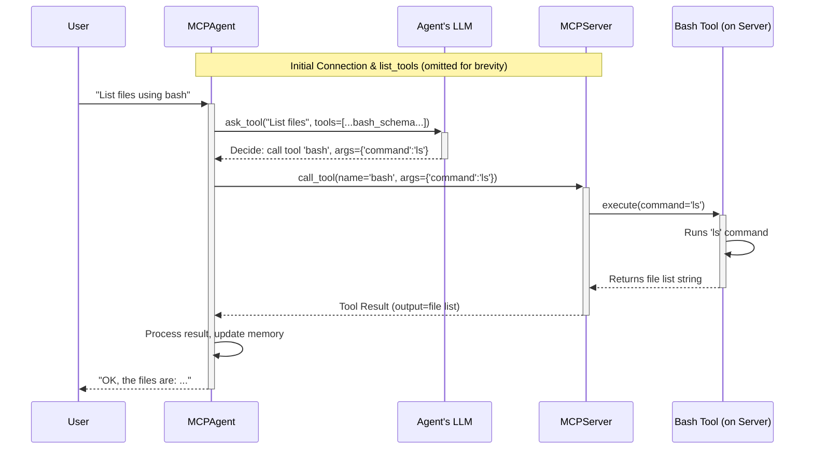

# Chapter 9: MCP (Model Context Protocol)

Welcome to the final chapter of our core concepts tutorial! In [Chapter 8: DockerSandbox](08_dockersandbox.md), we saw how OpenManus can safely run code in an isolated environment. Now, let's explore a powerful way to extend your agent's capabilities *without* changing its internal code: the **Model Context Protocol (MCP)**.

## What Problem Does MCP Solve?

Imagine you have an agent running smoothly. Suddenly, you realize you need it to perform a new, specialized task – maybe interacting with a custom company database or using a complex scientific calculation library.

Normally, you might have to:
1.  Stop the agent.
2.  Write new code for the [Tool](04_tool___toolcollection.md) that performs this task.
3.  Add this tool to the agent's code or configuration.
4.  Restart the agent.

This process can be cumbersome, especially if you want to add or update tools frequently, or if different people are managing different tools.

What if there was a way for the agent to **dynamically discover and use tools** provided by a completely separate service? Like plugging in a new USB device, and your computer automatically recognizes and uses it?

**This is what MCP enables!** It defines a standard way for an OpenManus agent (`MCPAgent`) to connect to an external **MCP Server**. This server advertises the tools it offers, and the agent can call these tools remotely as if they were built-in.

**Use Case:** Let's say we want our agent to be able to run basic shell commands (like `ls` or `pwd`) using the `Bash` tool. Instead of building the `Bash` tool directly into the agent, we can run an `MCPServer` that *offers* the `Bash` tool. Our `MCPAgent` can connect to this server, discover the `Bash` tool, and use it when needed, all without having the `Bash` tool's code inside the agent itself. If we later update the `Bash` tool on the server, the agent automatically gets the new version without needing changes.

## Key Concepts: The Agent, The Server, and The Rules

MCP involves a few key players working together:

1.  **`MCPServer` (The Tool Provider):**
    *   Think of this as a separate application, like a dedicated "Tool Shop" running independently from your agent.
    *   It holds one or more [Tools](04_tool___toolcollection.md) (like `Bash`, `BrowserUseTool`, `StrReplaceEditor`, or custom ones).
    *   It "advertises" these tools, meaning it can tell connected clients (agents) which tools are available, what they do, and how to use them.
    *   When asked, it executes a tool and sends the result back.
    *   In OpenManus, `app/mcp/server.py` provides an implementation of this server.

2.  **`MCPAgent` (The Tool User):**
    *   This is a specialized type of [BaseAgent](03_baseagent.md) designed specifically to talk to an `MCPServer`.
    *   When it starts, it connects to the specified `MCPServer`.
    *   It asks the server: "What tools do you have?"
    *   It treats the server's tools as its own available `ToolCollection`.
    *   When its [LLM](01_llm.md) decides to use one of these tools, the `MCPAgent` sends a request to the `MCPServer` to execute it.
    *   It can even periodically check if the server has added or removed tools and update its capabilities accordingly!

3.  **The Protocol (The Rules of Communication):**
    *   MCP defines the exact format of messages exchanged between the `MCPAgent` and `MCPServer`. How does the agent ask for the tool list? How does it request a tool execution? How is the result formatted?
    *   OpenManus supports two main ways (transports) for this communication:
        *   **stdio (Standard Input/Output):** The agent starts the server process directly and communicates with it using standard text streams (like typing commands in a terminal). This is simpler for local setups.
        *   **SSE (Server-Sent Events):** The agent connects to a running server over the network (using HTTP). This is more suitable if the server is running elsewhere.

*Analogy:* Imagine the `MCPServer` is a smart TV's App Store, offering apps (tools) like Netflix or YouTube. The `MCPAgent` is a universal remote control. MCP is the protocol that lets the remote connect to the TV, see the available apps, and tell the TV "Launch Netflix" or "Play this video on YouTube". The actual app logic runs on the TV (the server), not the remote (the agent).

## How Do We Use It?

Let's see how to run the server and connect an agent using the simple `stdio` method.

**1. Run the MCPServer:**

The server needs to be running first. OpenManus provides a script to run a server that includes standard tools like `Bash`, `Browser`, and `Editor`.

Open a terminal and run:

```bash
# Make sure you are in the root directory of the OpenManus project
# Use python to run the server module
python -m app.mcp.server --transport stdio
```

**Expected Output (in the server terminal):**

```
INFO:root:Registered tool: bash
INFO:root:Registered tool: browser
INFO:root:Registered tool: editor
INFO:root:Registered tool: terminate
INFO:root:Starting OpenManus server (stdio mode)
# --- The server is now running and waiting for a connection ---
```

**Explanation:**
*   `python -m app.mcp.server` tells Python to run the server code located in `app/mcp/server.py`.
*   `--transport stdio` specifies that it should listen for connections via standard input/output.
*   It registers the built-in tools and waits.

**2. Run the MCPAgent (connecting to the server):**

Now, open a *separate* terminal. We'll run a script that starts the `MCPAgent` and tells it how to connect to the server we just started.

```bash
# In a NEW terminal, in the root directory of OpenManus
# Run the MCP agent runner script
python run_mcp.py --connection stdio --interactive
```

**Expected Output (in the agent terminal):**

```
INFO:app.config:Configuration loaded successfully from .../config/config.toml
INFO:app.agent.mcp:Initializing MCPAgent with stdio connection...
# ... (potential logs about connecting) ...
INFO:app.tool.mcp:Connected to server with tools: ['bash', 'browser', 'editor', 'terminate']
INFO:app.agent.mcp:Connected to MCP server via stdio

MCP Agent Interactive Mode (type 'exit' to quit)

Enter your request:
```

**Explanation:**
*   `python run_mcp.py` runs the agent launcher script.
*   `--connection stdio` tells the agent to connect using standard input/output. The script (`run_mcp.py`) knows how to start the server process (`python -m app.mcp.server`) for this mode.
*   `--interactive` puts the agent in a mode where you can chat with it.
*   The agent connects, asks the server for its tools (`list_tools`), and logs the tools it found (`bash`, `browser`, etc.). It's now ready for your requests!

**3. Interact with the Agent (Using a Server Tool):**

Now, in the agent's interactive prompt, ask it to do something that requires a tool provided by the server, like listing files using `bash`:

```text
# In the agent's terminal
Enter your request: Use the bash tool to list the files in the current directory.
```

**What Happens:**

1.  The `MCPAgent` receives your request.
2.  Its [LLM](01_llm.md) analyzes the request and decides the `bash` tool is needed, with the command `ls`.
3.  The agent sees that `bash` is a tool provided by the connected `MCPServer`.
4.  The agent sends a `call_tool` request over `stdio` to the server: "Please run `bash` with `command='ls'`".
5.  The `MCPServer` receives the request, finds its `Bash` tool, and executes `ls`.
6.  The server captures the output (the list of files).
7.  The server sends the result back to the agent.
8.  The agent receives the result, adds it to its [Memory](02_message___memory.md), and might use its LLM again to formulate a user-friendly response based on the tool's output.

**Expected Output (in the agent terminal, may vary):**

```text
# ... (Potential LLM thinking logs) ...
INFO:app.agent.mcp:Executing tool: bash with input {'command': 'ls'}
# ... (Server logs might show execution in its own terminal) ...

Agent: The bash tool executed the 'ls' command and returned the following output:
[List of files/directories in the project root, e.g.,]
README.md
app
config
run_mcp.py
... etc ...
```

Success! The agent used a tool (`bash`) that wasn't part of its own code, but was provided dynamically by the external `MCPServer` via the Model Context Protocol. If you added a *new* tool to the `MCPServer` code and restarted the server, the agent could potentially discover and use it without needing any changes itself (it periodically refreshes the tool list).

Type `exit` in the agent's terminal to stop it, then stop the server (usually Ctrl+C in its terminal).

## Under the Hood: How MCP Communication Flows

Let's trace the simplified steps when the agent uses a server tool:

1.  **Connect & List:** Agent starts, connects to Server (`stdio` or `SSE`). Agent sends `list_tools` request. Server replies with list of tools (`name`, `description`, `parameters`). Agent stores these.
2.  **User Request:** User asks agent to do something (e.g., "list files").
3.  **LLM Decides:** Agent's LLM decides to use `bash` tool with `command='ls'`.
4.  **Agent Request:** Agent finds `bash` in its list of server tools. Sends `call_tool` request to Server (containing tool name `bash` and arguments `{'command': 'ls'}`).
5.  **Server Executes:** Server receives request. Finds its internal `Bash` tool. Calls the tool's `execute(command='ls')` method. The tool runs `ls`.
6.  **Server Response:** Server gets the result from the tool (e.g., "README.md\napp\n..."). Sends this result back to the Agent.
7.  **Agent Processes:** Agent receives the result. Updates its memory. Presents the answer to the user.

**Sequence Diagram:**



## Code Glimpse: Key MCP Components

Let's look at simplified parts of the relevant files.

**1. `MCPServer` (`app/mcp/server.py`): Registering Tools**
The server uses the `fastmcp` library to handle the protocol details. It needs to register the tools it wants to offer.

```python
# Simplified snippet from app/mcp/server.py
from mcp.server.fastmcp import FastMCP
from app.tool.base import BaseTool
from app.tool.bash import Bash # Import the tool to offer
from app.logger import logger
import json

class MCPServer:
    def __init__(self, name: str = "openmanus"):
        self.server = FastMCP(name) # The underlying MCP server library
        self.tools: Dict[str, BaseTool] = {}
        # Add tools to offer
        self.tools["bash"] = Bash()
        # ... add other tools like Browser, Editor ...

    def register_tool(self, tool: BaseTool) -> None:
        """Registers a tool's execute method with the FastMCP server."""
        tool_name = tool.name
        tool_param = tool.to_param() # Get schema for the LLM
        tool_function = tool_param["function"]

        # Define the function that the MCP server will expose
        async def tool_method(**kwargs):
            logger.info(f"Executing {tool_name} via MCP: {kwargs}")
            # Call the actual tool's execute method
            result = await tool.execute(**kwargs)
            logger.info(f"Result of {tool_name}: {result}")
            # Return result (often needs conversion, e.g., to JSON)
            return json.dumps(result.model_dump()) if hasattr(result, "model_dump") else str(result)

        # Attach metadata (name, description, parameters) for discovery
        tool_method.__name__ = tool_name
        tool_method.__doc__ = self._build_docstring(tool_function)
        tool_method.__signature__ = self._build_signature(tool_function)

        # Register with the FastMCP library instance
        self.server.tool()(tool_method)
        logger.info(f"Registered tool for MCP: {tool_name}")

    def register_all_tools(self):
        for tool in self.tools.values():
            self.register_tool(tool)

    def run(self, transport: str = "stdio"):
        self.register_all_tools()
        logger.info(f"Starting MCP server ({transport} mode)")
        self.server.run(transport=transport) # Start listening

# Command-line execution part:
# if __name__ == "__main__":
#    server = MCPServer()
#    server.run(transport="stdio") # Or based on args
```

**Explanation:** The `MCPServer` creates instances of tools (`Bash`, etc.) and then uses `register_tool` to wrap each tool's `execute` method into a format the `fastmcp` library understands. This allows the server to advertise the tool (with its name, description, parameters) and call the correct function when the agent makes a `call_tool` request.

**2. `MCPClients` (`app/tool/mcp.py`): Client-Side Tool Representation**
The `MCPAgent` uses this class, which acts like a `ToolCollection`, but its tools are proxies that make calls to the remote server.

```python
# Simplified snippet from app/tool/mcp.py
from mcp import ClientSession # MCP library for client-side communication
from mcp.client.stdio import stdio_client # Specific transport handler
from mcp.types import TextContent
from app.tool.base import BaseTool, ToolResult
from app.tool.tool_collection import ToolCollection
from contextlib import AsyncExitStack

# Represents a single tool on the server, callable from the client
class MCPClientTool(BaseTool):
    session: Optional[ClientSession] = None # Holds the connection

    async def execute(self, **kwargs) -> ToolResult:
        """Execute by calling the remote tool via the MCP session."""
        if not self.session: return ToolResult(error="Not connected")
        try:
            # Make the actual remote call
            result = await self.session.call_tool(self.name, kwargs)
            # Extract text output from the response
            content = ", ".join(
                item.text for item in result.content if isinstance(item, TextContent)
            )
            return ToolResult(output=content or "No output.")
        except Exception as e:
            return ToolResult(error=f"MCP tool error: {e}")

# The collection holding the proxy tools
class MCPClients(ToolCollection):
    session: Optional[ClientSession] = None
    exit_stack: AsyncExitStack = None # Manages connection resources

    async def connect_stdio(self, command: str, args: List[str]):
        """Connect using stdio."""
        if self.session: await self.disconnect()
        self.exit_stack = AsyncExitStack()

        # Set up stdio connection using MCP library helper
        server_params = {"command": command, "args": args} # Simplified
        streams = await self.exit_stack.enter_async_context(
            stdio_client(server_params)
        )
        # Establish the MCP session over the connection
        self.session = await self.exit_stack.enter_async_context(
            ClientSession(*streams)
        )
        await self._initialize_and_list_tools() # Get tool list from server

    async def _initialize_and_list_tools(self):
        """Fetch tools from server and create proxy objects."""
        await self.session.initialize()
        response = await self.session.list_tools() # Ask server for tools

        self.tool_map = {}
        for tool_info in response.tools:
            # Create an MCPClientTool instance for each server tool
            proxy_tool = MCPClientTool(
                name=tool_info.name,
                description=tool_info.description,
                parameters=tool_info.inputSchema, # Use schema from server
                session=self.session, # Pass the active session
            )
            self.tool_map[tool_info.name] = proxy_tool
        self.tools = tuple(self.tool_map.values())
        logger.info(f"MCP Client found tools: {list(self.tool_map.keys())}")

    async def disconnect(self):
        if self.session and self.exit_stack:
            await self.exit_stack.aclose() # Clean up connection
            # ... reset state ...
```

**Explanation:** `MCPClients` handles the connection (`connect_stdio`). When connected, it calls `list_tools` on the server. For each tool reported by the server, it creates a local `MCPClientTool` proxy object. This proxy object looks like a normal `BaseTool` (with name, description, parameters), but its `execute` method doesn't run code locally – instead, it uses the active `ClientSession` to send a `call_tool` request back to the server.

**3. `MCPAgent` (`app/agent/mcp.py`): Using MCPClients**
The agent integrates the `MCPClients` collection.

```python
# Simplified snippet from app/agent/mcp.py
from app.agent.toolcall import ToolCallAgent
from app.tool.mcp import MCPClients

class MCPAgent(ToolCallAgent):
    # Use MCPClients as the tool collection
    mcp_clients: MCPClients = Field(default_factory=MCPClients)
    available_tools: MCPClients = None # Will point to mcp_clients

    connection_type: str = "stdio"
    # ... other fields ...

    async def initialize(
        self, command: Optional[str] = None, args: Optional[List[str]] = None, ...
    ):
        """Initialize by connecting the MCPClients instance."""
        if self.connection_type == "stdio":
            # Tell mcp_clients to connect
            await self.mcp_clients.connect_stdio(command=command, args=args or [])
        # elif self.connection_type == "sse": ...

        # The agent's tools are now the tools provided by the server
        self.available_tools = self.mcp_clients

        # Store initial tool schemas for detecting changes later
        self.tool_schemas = {t.name: t.parameters for t in self.available_tools}

        # Add system message about tools...

    async def _refresh_tools(self):
        """Periodically check the server for tool updates."""
        if not self.mcp_clients.session: return

        # Ask the server for its current list of tools
        response = await self.mcp_clients.session.list_tools()
        current_tools = {t.name: t.inputSchema for t in response.tools}

        # Compare with stored schemas (self.tool_schemas)
        # Detect added/removed tools and update self.tool_schemas
        # Add system messages to memory if tools change
        # ... logic to detect and log changes ...

    async def think(self) -> bool:
        """Agent's thinking step."""
        # Refresh tools periodically
        if self.current_step % self._refresh_tools_interval == 0:
            await self._refresh_tools()
            # Stop if server seems gone (no tools left)
            if not self.mcp_clients.tool_map: return False

        # Use parent class's think method, which uses self.available_tools
        # (which points to self.mcp_clients) for tool decisions/calls
        return await super().think()

    async def cleanup(self):
        """Disconnect the MCP session when the agent finishes."""
        if self.mcp_clients.session:
            await self.mcp_clients.disconnect()
```

**Explanation:** The `MCPAgent` holds an instance of `MCPClients`. In `initialize`, it tells `MCPClients` to connect to the server. It sets its own `available_tools` to point to the `MCPClients` instance. When the agent's `think` method (inherited from `ToolCallAgent`) needs to consider or execute tools, it uses `self.available_tools`. Because this *is* the `MCPClients` object, any tool execution results in a remote call to the `MCPServer` via the proxy tools. The agent also adds logic to periodically `_refresh_tools` and `cleanup` the connection.

## Wrapping Up Chapter 9

Congratulations on completing the core concepts tutorial!

In this final chapter, we explored the **Model Context Protocol (MCP)**. You learned how MCP allows an `MCPAgent` to connect to an external `MCPServer` and dynamically discover and use tools hosted by that server. This provides a powerful way to extend agent capabilities with specialized tools without modifying the agent's core code, enabling a flexible, plug-and-play architecture for agent skills.

You've journeyed through the essential building blocks of OpenManus:
*   The "brain" ([LLM](01_llm.md))
*   Conversation history ([Message / Memory](02_message___memory.md))
*   The agent structure ([BaseAgent](03_baseagent.md))
*   Agent skills ([Tool / ToolCollection](04_tool___toolcollection.md))
*   Multi-step task orchestration ([BaseFlow](05_baseflow.md))
*   Data structure definitions ([Schema](06_schema.md))
*   Settings management ([Configuration (Config)](07_configuration__config_.md))
*   Secure code execution ([DockerSandbox](08_dockersandbox.md))
*   And dynamic external tools ([MCP](09_mcp__model_context_protocol_.md))

Armed with this knowledge, you're now well-equipped to start exploring the OpenManus codebase, experimenting with different agents and tools, and building your own intelligent applications! Good luck!

---

Generated by [AI Codebase Knowledge Builder](https://github.com/The-Pocket/Tutorial-Codebase-Knowledge)