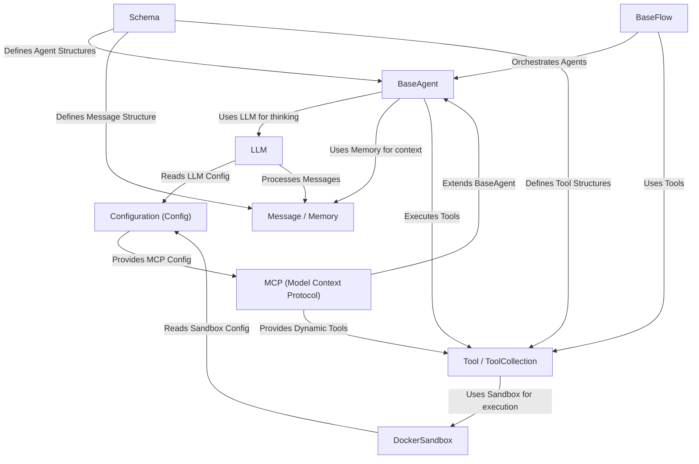

# Tutorial: OpenManus

> This tutorial is AI-generated! To learn more, check out [AI Codebase Knowledge Builder](https://github.com/The-Pocket/Tutorial-Codebase-Knowledge)

OpenManus[View Repo](https://github.com/mannaandpoem/OpenManus/tree/f616c5d43d02d93ccc6e55f11666726d6645fdc2) is a framework for building autonomous *AI agents*.
Think of it like a digital assistant that can perform tasks. It uses a central **brain** (an `LLM` like GPT-4) to understand requests and decide what to do next.
Agents can use various **tools** (like searching the web or writing code) to interact with the world or perform specific actions. Some complex tasks might involve a **flow** that coordinates multiple agents.
It keeps track of the conversation using `Memory` and ensures secure code execution using a `DockerSandbox`.
The system is flexible, allowing new tools to be added, even dynamically through the `MCP` protocol.

