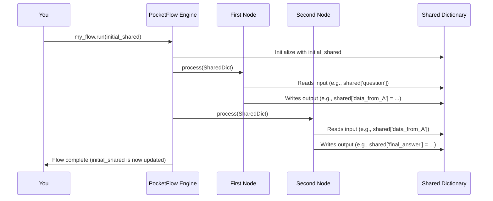

# Chapter 1: Shared State (`shared` dictionary)

Welcome to your first step into the world of PocketFlow! Building powerful AI applications often involves breaking down complex tasks into smaller, manageable steps. But how do these steps communicate with each other? How does one part of your AI know what another part has done or figured out? That's where the **`shared` dictionary** comes into play.

Imagine you're building a simple AI assistant.
1.  First, it needs to get your question (e.g., "What's the weather like in London?").
2.  Then, it might need to search the web for "weather in London."
3.  Finally, it uses your original question and the search results to give you an answer.

For this to work, the "question understanding" step needs to pass the question to the "web searching" step. Then, both the original question and the search results need to be available to the "answering" step. The `shared` dictionary is the magic message board that lets all these steps share information.

## What is the `shared` Dictionary?

At its heart, the `shared` dictionary is a standard Python dictionary (`dict`). Think of it like a **communal backpack** or a **shared whiteboard**.
As your PocketFlow application (which we call a [Flow (`Flow`, `AsyncFlow`)](04_flow___flow____asyncflow___.md)) runs, different components (which we call [Nodes (`BaseNode`, `Node`, `AsyncNode`)](02_node___basenode____node____asyncnode___.md)) can:
*   **Put things into it** (write data).
*   **Look at what's inside** (read data).
*   **Update things** that are already there.

This `shared` dictionary becomes the primary way for different parts of your workflow to pass data, intermediate results, and context to each other. It's available throughout the entire lifecycle of a single execution of a [Flow (`Flow`, `AsyncFlow`)](04_flow___flow____asyncflow___.md).

## How to Use the `shared` Dictionary

Let's see how this works with a few simple examples.

**1. Initializing `shared` with Starting Data**

Before your [Flow (`Flow`, `AsyncFlow`)](04_flow___flow____asyncflow___.md) even starts, you usually prepare some initial data. This data is placed into the `shared` dictionary.

Consider this snippet from one of our example projects (`cookbook/pocketflow-node/main.py`):
```python
# This is how we can start with some data
text_to_summarize = """
PocketFlow is a minimalist LLM framework...
"""
shared = {"data": text_to_summarize}

# Later, this 'shared' dictionary is passed when running the flow:
# flow.run(shared)
```
In this code:
*   We have some `text_to_summarize`.
*   We create a Python dictionary named `shared`.
*   We add an entry to this dictionary: the key is `"data"` and its value is our `text_to_summarize`.
When the [Flow (`Flow`, `AsyncFlow`)](04_flow___flow____asyncflow___.md) starts, this `shared` dictionary will be its starting point.

Here's another example from `cookbook/pocketflow-a2a/main.py` where a question is put into `shared`:
```python
# Default question or one from command line
question = "Who won the Nobel Prize in Physics 2024?"

# Process the question
shared = {"question": question}
# agent_flow.run(shared)
```
Here, the `shared` dictionary is initialized with the `question` under the key `"question"`.

**2. A [Node (`BaseNode`, `Node`, `AsyncNode`)](02_node___basenode____node____asyncnode___.md) Reading from `shared`**

[Nodes (`BaseNode`, `Node`, `AsyncNode`)](02_node___basenode____node____asyncnode___.md) are the workers in your [Flow (`Flow`, `AsyncFlow`)](04_flow___flow____asyncflow___.md). They often need to read data from the `shared` dictionary to know what to do. This usually happens in a Node's `prep` method.

Let's look at the `Summarize` [Node (`BaseNode`, `Node`, `AsyncNode`)](02_node___basenode____node____asyncnode___.md) from `cookbook/pocketflow-node/flow.py`:
```python
# Inside the Summarize Node class
# def prep(self, shared):
#     """Read and preprocess data from shared store."""
#     return shared["data"] # Accesses the 'data' we set earlier
```
When this `Summarize` [Node (`BaseNode`, `Node`, `AsyncNode`)](02_node___basenode____node____asyncnode___.md) is about to run, its `prep` method is called. PocketFlow automatically passes the current `shared` dictionary to this method.
The line `shared["data"]` retrieves the value associated with the key `"data"` – which is the text we want to summarize.

Another example from `cookbook/pocketflow-a2a/nodes.py`, in the `DecideAction` [Node (`BaseNode`, `Node`, `AsyncNode`)](02_node___basenode____node____asyncnode___.md):
```python
# Inside the DecideAction Node's prep method
# def prep(self, shared):
# Get the current context (default if none exists)
context = shared.get("context", "No previous search")
# Get the question from the shared store
question = shared["question"]
return question, context
```
This `prep` method reads two items:
*   `shared.get("context", "No previous search")`: This tries to get the value for the key `"context"`. If `"context"` isn't found (maybe it's the first time this runs), it defaults to `"No previous search"`. Using `.get()` is a safe way to read, as it prevents errors if a key might be missing.
*   `shared["question"]`: This directly retrieves the value for the key `"question"`, assuming it will always be there.

**3. A [Node (`BaseNode`, `Node`, `AsyncNode`)](02_node___basenode____node____asyncnode___.md) Writing Results Back to `shared`**

After a [Node (`BaseNode`, `Node`, `AsyncNode`)](02_node___basenode____node____asyncnode___.md) does its work (e.g., summarizes text, gets search results), it often needs to save its findings back into the `shared` dictionary. This typically happens in a Node's `post` method.

Continuing with our `Summarize` [Node (`BaseNode`, `Node`, `AsyncNode`)](02_node___basenode____node____asyncnode___.md) (`cookbook/pocketflow-node/flow.py`):
```python
# Inside the Summarize Node class
# 'exec_res' below is the result from the Node's main task
# def post(self, shared, prep_res, exec_res):
#     """Store the summary in shared store."""
#     shared["summary"] = exec_res # Stores the result
```
Here, `exec_res` holds the summary generated by the [Node (`BaseNode`, `Node`, `AsyncNode`)](02_node___basenode____node____asyncnode___.md). The line `shared["summary"] = exec_res` creates a new key `"summary"` in the `shared` dictionary (or updates it if it already exists) and stores the summary there. Now, subsequent [Nodes (`BaseNode`, `Node`, `AsyncNode`)](02_node___basenode____node____asyncnode___.md) can access this summary!

Similarly, in `DecideAction`'s `post` method (`cookbook/pocketflow-a2a/nodes.py`):
```python
# Inside DecideAction Node's post method
# def post(self, shared, prep_res, exec_res):
# 'exec_res' contains the decision made by an LLM
if exec_res["action"] == "search":
    shared["search_query"] = exec_res["search_query"]
    # ...
else:
    shared["context"] = exec_res["answer"]
    # ...
# ...
```
Depending on the `action` decided, this `post` method writes either a `"search_query"` or an updated `"context"` (which is the answer) into the `shared` dictionary.

**4. Modifying Existing Data in `shared`**

Sometimes, a [Node (`BaseNode`, `Node`, `AsyncNode`)](02_node___basenode____node____asyncnode___.md) needs to update or add to existing information in `shared`. For example, in a chat application, you maintain a history of messages.

From `cookbook/pocketflow-chat/main.py`, the `ChatNode`'s `prep` method does this:
```python
# Inside ChatNode's prep method
# def prep(self, shared):
# Initialize messages if this is the first run
if "messages" not in shared:
    shared["messages"] = [] # Create an empty list if no history

# ... user_input is obtained ...

# Add user message to history
shared["messages"].append({"role": "user", "content": user_input})
# ...
```
Here:
1.  It checks if `"messages"` (our chat history) exists in `shared`. If not, it initializes `shared["messages"]` as an empty list.
2.  It then appends the new user message to this list. The `shared["messages"]` list grows with each turn of the conversation.

**5. Accessing Final Results from `shared`**

Once your [Flow (`Flow`, `AsyncFlow`)](04_flow___flow____asyncflow___.md) has completed all its steps, the `shared` dictionary will contain the final outputs and any important intermediate data you chose to store. You can then access these results from your main script.

Back to `cookbook/pocketflow-node/main.py`:
```python
# After the flow.run(shared) call:
# The 'shared' dictionary now contains the summary

print("\nSummary:", shared["summary"])
```
This line simply prints the value associated with the key `"summary"` from the `shared` dictionary, which was put there by the `Summarize` [Node (`BaseNode`, `Node`, `AsyncNode`)](02_node___basenode____node____asyncnode___.md).

## Key Characteristics of `shared`

*   **It's a Python Dictionary:** This makes it incredibly flexible and easy to use. If you know how to use dictionaries in Python (e.g., `my_dict['key'] = value`, `value = my_dict['key']`, `my_dict.get('key', default_value)`), you already know how to interact with `shared`.
*   **Scoped to a Single Flow Execution:** Each time you run a [Flow (`Flow`, `AsyncFlow`)](04_flow___flow____asyncflow___.md) (e.g., by calling `flow.run(shared_input)`), it operates on its own instance of the `shared` dictionary. If you run the same [Flow (`Flow`, `AsyncFlow`)](04_flow___flow____asyncflow___.md) twice, even simultaneously for different requests, they will have completely separate `shared` dictionaries. They won't interfere with each other. Think of it like two people filling out their own copies of the same form.
*   **Persistent Throughout One Flow Execution:** The `shared` dictionary is created (or you provide an initial one) when a [Flow (`Flow`, `AsyncFlow`)](04_flow___flow____asyncflow___.md) starts. The *exact same* dictionary object is then passed from one [Node (`BaseNode`, `Node`, `AsyncNode`)](02_node___basenode____node____asyncnode___.md) to the next. Any modifications made by one [Node (`BaseNode`, `Node`, `AsyncNode`)](02_node___basenode____node____asyncnode___.md) are visible to all subsequent [Nodes (`BaseNode`, `Node`, `AsyncNode`)](02_node___basenode____node____asyncnode___.md).

## What Happens Under the Hood? (A Simplified View)

You don't need to manage the passing of the `shared` dictionary yourself; PocketFlow handles it for you. Here's a simplified step-by-step:

1.  **You start a Flow:** You call something like `my_flow.run(initial_shared_data)`. `initial_shared_data` is the dictionary you've prepared.
2.  **PocketFlow takes over:** It takes your `initial_shared_data` and passes it to the first [Node (`BaseNode`, `Node`, `AsyncNode`)](02_node___basenode____node____asyncnode___.md) in your [Flow (`Flow`, `AsyncFlow`)](04_flow___flow____asyncflow___.md).
3.  **Node executes:**
    *   The [Node (`BaseNode`, `Node`, `AsyncNode`)](02_node___basenode____node____asyncnode___.md)'s `prep` method is called with the `shared` dictionary. It can read from it.
    *   The [Node (`BaseNode`, `Node`, `AsyncNode`)](02_node___basenode____node____asyncnode___.md)'s `exec` method (the main workhorse) is called.
    *   The [Node (`BaseNode`, `Node`, `AsyncNode`)](02_node___basenode____node____asyncnode___.md)'s `post` method is called with the `shared` dictionary. It can write results back to it.
4.  **Pass it on:** PocketFlow determines the next [Node (`BaseNode`, `Node`, `AsyncNode`)](02_node___basenode____node____asyncnode___.md) to run and passes the *same, possibly modified*, `shared` dictionary to it.
5.  **Repeat:** Steps 3 and 4 repeat until there are no more [Nodes (`BaseNode`, `Node`, `AsyncNode`)](02_node___basenode____node____asyncnode___.md) to run in the [Flow (`Flow`, `AsyncFlow`)](04_flow___flow____asyncflow___.md).
6.  **Flow ends:** The `run` method finishes, and the `shared` dictionary you originally passed in now contains all the updates made by the [Nodes (`BaseNode`, `Node`, `AsyncNode`)](02_node___basenode____node____asyncnode___.md).

Here's a visual way to think about it:



## Analogy Time!

Think of the `shared` dictionary as:

*   **A Relay Race Baton (but smarter!):** Each runner ([Node (`BaseNode`, `Node`, `AsyncNode`)](02_node___basenode____node____asyncnode___.md)) takes the baton (`shared` dictionary), maybe adds a small note or a sticker to it, and then passes it to the next runner. By the end of the race, the baton has collected contributions from everyone.
*   **A Project's Shared Folder:** Imagine a team working on a project. They have a shared folder (`shared` dictionary) on a server. The first person creates a document (initial data). The next person opens it, adds their part, and saves it. The next person does the same. Everyone works on the same set of files in that folder.

## Conclusion

You've now learned about the `shared` dictionary, the backbone of communication within a PocketFlow [Flow (`Flow`, `AsyncFlow`)](04_flow___flow____asyncflow___.md). It's a simple yet powerful Python dictionary that allows different [Nodes (`BaseNode`, `Node`, `AsyncNode`)](02_node___basenode____node____asyncnode___.md) to share data and context seamlessly. By reading from and writing to `shared`, your [Nodes (`BaseNode`, `Node`, `AsyncNode`)](02_node___basenode____node____asyncnode___.md) can collaborate to achieve complex tasks.

Now that you understand how data is passed around, you're probably wondering about the "workers" themselves – the [Nodes (`BaseNode`, `Node`, `AsyncNode`)](02_node___basenode____node____asyncnode___.md). What are they, and how do you build them? Let's dive into that in the next chapter!

Next up: [Chapter 2: Node (`BaseNode`, `Node`, `AsyncNode`)](02_node___basenode____node____asyncnode___.md)

---

Generated by [AI Codebase Knowledge Builder](https://github.com/The-Pocket/Tutorial-Codebase-Knowledge)