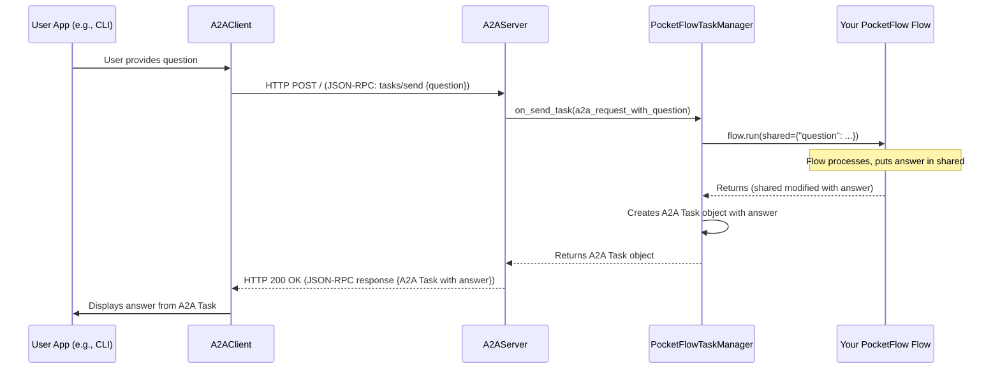

# Chapter 7: A2A (Agent-to-Agent) Communication Framework

Welcome to the final chapter of our PocketFlow journey! In [Chapter 6: Batch Processing (`BatchNode`, `BatchFlow`, `AsyncParallelBatchNode`)](06_batch_processing___batchnode____batchflow____asyncparallelbatchnode___.md), we saw how to process multiple items or run workflows repeatedly. Now, we'll explore how to make your PocketFlow agents available to the wider world, allowing them to communicate with other systems or agents using a standard "language."

## The Challenge: Making Your Agent a Team Player

Imagine you've built a fantastic PocketFlow agent that can research topics and answer questions. It's great for your own use, but what if:
*   Another team in your company wants their AI system to ask questions of your agent?
*   You want to offer your agent's capabilities as a service that other applications can call?
*   You want to build a larger system composed of multiple specialized agents that need to collaborate?

These scenarios require a **standardized way for agents to talk to each other**. Simply sharing Python code or relying on custom integrations isn't scalable or interoperable. This is where the **A2A (Agent-to-Agent) Communication Framework** comes in.

**Our Use Case:** We want to take the PocketFlow-based research agent we've been conceptualizing (which uses [Nodes (`BaseNode`, `Node`, `AsyncNode`)](02_node___basenode____node____asyncnode___.md) and a [Flow (`Flow`, `AsyncFlow`)](04_flow___flow____asyncflow___.md)) and make it accessible via a standard A2A interface. Another program (a client) should be able to send it a question (e.g., "What is PocketFlow?") and receive an answer, all using this A2A standard.

The A2A framework in PocketFlow provides components that wrap your agent, allowing it to understand and speak the A2A JSON-RPC specification. Think of it like giving your agent a universal translator and a public phone line.

## Key Components of the A2A Framework

The A2A framework in `PocketFlow` consists of a few main parts that work together:

1.  **A2A JSON-RPC Specification (The "Language")**: This isn't code, but a standard agreement on how agents communicate. It uses JSON-RPC, a lightweight remote procedure call protocol using JSON. It defines methods like `tasks/send` (to give an agent a job) and `tasks/get` (to check on a job), and the structure of messages. PocketFlow's A2A components adhere to this spec.
    *   **Analogy**: If agents are from different countries, JSON-RPC is the agreed-upon common language (like Esperanto or English as a lingua franca) they'll use to talk.

2.  **Common `types` (The "Vocabulary and Grammar")**: These are pre-defined Python Pydantic models (found in `cookbook/pocketflow-a2a/common/types.py`) that represent the structure of all A2A messages. This includes `Task`, `Message`, `Artifact`, `TextPart`, `JSONRPCRequest`, `JSONRPCResponse`, etc. Using these types ensures that both the client and server understand the format of the data being exchanged.
    *   **Analogy**: These are the specific words and sentence structures within the agreed-upon language.

3.  **`A2AServer` (The "Receptionist")**: This component hosts your PocketFlow agent. It listens for incoming A2A requests over HTTP, understands the A2A JSON-RPC protocol, and passes the work to your agent (via the `TaskManager`).
    *   **Analogy**: The `A2AServer` is like the public-facing receptionist for your PocketFlow agent. It answers the "phone" (HTTP requests) and speaks the standard A2A language.

4.  **`TaskManager` (The "Internal Translator")**: This is the crucial bridge. It receives instructions from the `A2AServer` (which are in the A2A format), translates them into something your PocketFlow [Flow (`Flow`, `AsyncFlow`)](04_flow___flow____asyncflow__.md) can understand (typically by preparing the [shared dictionary](01_shared_state___shared__dictionary__.md)), runs your PocketFlow [Flow (`Flow`, `AsyncFlow`)](04_flow___flow____asyncflow__.md), and then takes the results from the [shared dictionary](01_shared_state___shared__dictionary__.md) and packages them back into the A2A format for the `A2AServer` to send out.
    *   **Analogy**: If your PocketFlow agent only speaks "PocketFlow-ese," the `TaskManager` is the internal assistant who translates A2A language from the receptionist into PocketFlow-ese and vice-versa.

5.  **`A2AClient` (The "Caller")**: This component allows you (or another system) to interact with an agent hosted by an `A2AServer`. It knows how to formulate A2A JSON-RPC requests and understand the responses.
    *   **Analogy**: The `A2AClient` is someone using the public phone line to call your agent's receptionist.

Let's see how to use these to make our PocketFlow research agent accessible.

## Making Your PocketFlow Agent A2A-Compatible

Let's assume you've already built your core PocketFlow agent using [Nodes (`BaseNode`, `Node`, `AsyncNode`)](02_node___basenode____node____asyncnode___.md) and a [Flow (`Flow`, `AsyncFlow`)](04_flow___flow____asyncflow___.md), perhaps similar to the one in `cookbook/pocketflow-a2a/flow.py` that can take a question and produce an answer. The main function in `flow.py` to get this flow is `create_agent_flow()`.

**Step 1: Create Your `TaskManager`**

The `TaskManager` connects the A2A world to your PocketFlow [Flow (`Flow`, `AsyncFlow`)](04_flow___flow____asyncflow___.md). We'll create a `PocketFlowTaskManager` that inherits from a base `InMemoryTaskManager` (which handles storing task states).

Here's a simplified look at `PocketFlowTaskManager` from `cookbook/pocketflow-a2a/task_manager.py`:

```python
# In task_manager.py
from common.server.task_manager import InMemoryTaskManager
from common.types import ( # A2A standard message types
    SendTaskRequest, SendTaskResponse, TaskState, TaskStatus,
    TextPart, Artifact, Message
)
from flow import create_agent_flow # Your PocketFlow agent logic

class PocketFlowTaskManager(InMemoryTaskManager):
    async def on_send_task(self, request: SendTaskRequest) -> SendTaskResponse:
        # 1. Get the question from the A2A request
        query = self._get_user_query(request.params) # Helper to extract text
        if not query:
            # ... handle error: no query found ...

        # 2. Prepare shared data for your PocketFlow agent
        shared_data = {"question": query}
        agent_flow = create_agent_flow() # Get your PocketFlow flow

        # 3. Run your PocketFlow agent
        try:
            agent_flow.run(shared_data) # This modifies shared_data
            # 'shared_data' now contains the answer, e.g., shared_data["answer"]
        except Exception as e:
            # ... handle agent execution error ...

        # 4. Package the result into A2A format
        answer_text = shared_data.get("answer", "No answer.")
        final_status = TaskStatus(state=TaskState.COMPLETED)
        final_artifact = Artifact(parts=[TextPart(text=answer_text)])
        
        # Store final task details (InMemoryTaskManager helps here)
        final_task = await self.update_store(
            request.params.id, final_status, [final_artifact]
        )
        return SendTaskResponse(id=request.id, result=final_task)

    def _get_user_query(self, task_params) -> str | None:
        # Simplified: Extracts text from the A2A message parts
        # (Actual code in common/types.py & task_manager.py is more robust)
        if task_params.message and task_params.message.parts:
            for part in task_params.message.parts:
                if part.type == "text": # Assuming part is a Pydantic model
                    return part.text
        return None
```
**Explanation:**
*   `on_send_task`: This method is called when the `A2AServer` receives a `tasks/send` request.
*   It extracts the user's question from the A2A request's `message.parts` (using `_get_user_query`).
*   It prepares the [shared dictionary](01_shared_state___shared__dictionary__.md) (`shared_data`) for your PocketFlow [Flow (`Flow`, `AsyncFlow`)](04_flow___flow____asyncflow___.md).
*   It runs your `agent_flow` with this `shared_data`. The `agent_flow` does its work and puts the answer back into `shared_data["answer"]`.
*   It retrieves the answer from `shared_data` and packages it into an A2A `Artifact` with a `TextPart`.
*   It updates the task's status to `COMPLETED` and returns an A2A `SendTaskResponse` containing the final `Task` object (which includes the answer artifact).

**Step 2: Set Up the `A2AServer`**

Now, we need to host our `PocketFlowTaskManager` using `A2AServer`. This involves defining an `AgentCard` (metadata about your agent) and starting the server.

A simplified `main` function from `cookbook/pocketflow-a2a/a2a_server.py`:
```python
# In a2a_server.py
from common.server import A2AServer
from common.types import AgentCard, AgentCapabilities, AgentSkill # For metadata
from task_manager import PocketFlowTaskManager # Your task manager
import os

def main(host="localhost", port=10003):
    # (Error checking for API keys like OPENAI_API_KEY happens here)
    
    # 1. Define Agent's "Business Card" (AgentCard)
    capabilities = AgentCapabilities(streaming=False) # Our agent isn't streaming
    skill = AgentSkill(
        id="web_research_qa", name="Web Research and Answering",
        # ... (more skill details: description, examples) ...
        inputModes=["text"], outputModes=["text"]
    )
    agent_card = AgentCard(
        name="PocketFlow Research Agent (A2A)",
        url=f"http://{host}:{port}/", # Where clients connect
        # ... (more card details: description, version, skills) ...
        capabilities=capabilities, skills=[skill]
    )

    # 2. Initialize TaskManager and Server
    task_manager = PocketFlowTaskManager()
    server = A2AServer(
        agent_card=agent_card,
        task_manager=task_manager,
        host=host, port=port,
    )

    print(f"Starting PocketFlow A2A server on http://{host}:{port}")
    server.start() # This starts the HTTP server (e.g., Uvicorn)

if __name__ == "__main__":
    # This would typically call main()
    # For example: main()
    pass
```
**Explanation:**
*   `AgentCard`: This provides metadata about your agent (name, URL, capabilities, skills offered). Other A2A systems can fetch this card (from `/.well-known/agent.json`) to learn about your agent.
*   We instantiate our `PocketFlowTaskManager`.
*   We create an `A2AServer`, giving it the `agent_card`, our `task_manager`, and the `host`/`port` to listen on.
*   `server.start()` launches the web server. Now your PocketFlow agent is listening for A2A requests!

**Step 3: Interact Using an `A2AClient`**

With the server running, other programs can now "call" your agent. The `A2AClient` helps with this.

A simplified CLI client from `cookbook/pocketflow-a2a/a2a_client.py`:
```python
# In a2a_client.py
import asyncio
from common.client import A2AClient # The A2A client utility
from common.types import TextPart # To structure our question

async def run_client(agent_url="http://localhost:10003"):
    client = A2AClient(url=agent_url)
    
    # Get question from user
    question_text = input("Enter your question: ")
    if not question_text: return

    # 1. Prepare the A2A request payload (matches TaskSendParams)
    # This is a simplified representation of the common.types.TaskSendParams
    payload = {
        "id": "some_unique_task_id", # Each task needs an ID
        "message": {
            "role": "user",
            "parts": [{"type": "text", "text": question_text}], # Our question
        },
        "acceptedOutputModes": ["text"], # We want text back
    }

    print("Sending task to agent...")
    try:
        # 2. Send the task to the server
        response = await client.send_task(payload) # This makes the HTTP call

        # 3. Process the response
        if response.error:
            print(f"Error from agent: {response.error.message}")
        elif response.result and response.result.artifacts:
            # Extract answer from the first text part of the first artifact
            answer_part = response.result.artifacts[0].parts[0]
            if isinstance(answer_part, TextPart) or answer_part.type == "text":
                print(f"Agent Answer: {answer_part.text}")
        else:
            print("Agent did not return a clear answer.")
            
    except Exception as e:
        print(f"Client error: {e}")

# To run this:
# if __name__ == "__main__":
# asyncio.run(run_client())
```
**Explanation:**
*   An `A2AClient` is initialized with the server's URL.
*   A `payload` dictionary is created. This structure matches the A2A specification for sending a task (specifically, `TaskSendParams` from `common.types`). Our question is placed in `message.parts` as a `TextPart`.
*   `client.send_task(payload)` sends the JSON-RPC request to the `A2AServer`.
*   The response (an A2A `Task` object) is processed. The answer is typically found in the `artifacts` of the `Task`.

**Example Interaction:**
1.  You run `a2a_server.py`. It starts listening on `http://localhost:10003`.
2.  You run `a2a_client.py`.
3.  Client prompts: `Enter your question:`
4.  You type: `What is PocketFlow?`
5.  Client sends this to the server.
6.  Server (via `PocketFlowTaskManager` and your `agent_flow`) processes it.
7.  Client receives the response and might print: `Agent Answer: PocketFlow is a minimalist LLM framework...`

Your PocketFlow agent is now communicating via a standard A2A interface!

## Under the Hood: The A2A Conversation Flow

Let's trace a request from client to server and back:

1.  **Client Prepares**: The `A2AClient` takes your input (e.g., a question) and constructs a JSON object according to the A2A spec. This is a JSON-RPC request, often for the method `tasks/send`.
    *   `A2AClient._send_request` (from `common/client/client.py`) assembles this. It uses `httpx` to make an HTTP POST request to the server's URL, with the JSON-RPC payload.

2.  **Server Receives**: The `A2AServer` (built with Starlette) receives the HTTP POST request.
    *   `A2AServer._process_request` (from `common/server/server.py`) handles this. It parses the JSON body into an `A2ARequest` Pydantic model (e.g., `SendTaskRequest`).

3.  **Server Routes to TaskManager**: Based on the JSON-RPC method in the request (e.g., `tasks/send`), the `A2AServer` calls the corresponding method on your `TaskManager`.
    *   E.g., for `tasks/send`, it calls `task_manager.on_send_task(request_model)`.

4.  **TaskManager -> PocketFlow**: Your `PocketFlowTaskManager`'s `on_send_task` method:
    *   Extracts relevant data (like the question) from the `request_model`.
    *   Prepares the [shared dictionary](01_shared_state___shared__dictionary__.md) for your PocketFlow [Flow (`Flow`, `AsyncFlow`)](04_flow___flow____asyncflow__.md).
    *   Calls `your_pocketflow_flow.run(shared)`.

5.  **PocketFlow Executes**: Your PocketFlow [Flow (`Flow`, `AsyncFlow`)](04_flow___flow____asyncflow__.md) runs its [Nodes (`BaseNode`, `Node`, `AsyncNode`)](02_node___basenode____node____asyncnode__.md), using and updating the [shared dictionary](01_shared_state___shared__dictionary__.md). The final answer is placed in `shared` (e.g., `shared["answer"]`).

6.  **PocketFlow -> TaskManager**: Control returns to `PocketFlowTaskManager`. It:
    *   Retrieves the result (e.g., `shared["answer"]`).
    *   Constructs an A2A `Task` object (from `common.types`), including `Artifacts` containing the answer.

7.  **TaskManager -> Server**: The `TaskManager` returns the populated `Task` object (wrapped in a `JSONRPCResponse` model) to the `A2AServer`.

8.  **Server Responds**: The `A2AServer` serializes the `JSONRPCResponse` (which contains the `Task` with the answer) back into a JSON string.
    *   It sends this JSON as the body of an HTTP 200 OK response back to the client.

9.  **Client Processes**: The `A2AClient` receives the HTTP response.
    *   It parses the JSON body into its own Pydantic models (e.g., `SendTaskResponse` containing the `Task`).
    *   It extracts the answer from the `Task`'s artifacts for you to see.

Here's a simplified sequence diagram of this interaction:



**Key Code Snippets (Highly Simplified):**

*   **`A2AClient` sending request (from `common/client/client.py`):**
    ```python
    # Inside A2AClient
    async def _send_request(self, request_model: JSONRPCRequest) -> dict:
        # request_model is e.g., SendTaskRequest
        payload = request_model.model_dump(exclude_none=True)
        # self.fetchImpl is an httpx.AsyncClient
        http_response = await self.fetchImpl.post(self.url, json=payload)
        http_response.raise_for_status() # Check for HTTP errors
        return http_response.json() # Return parsed JSON response
    ```
    This shows the client converting a Pydantic model to a dictionary (`payload`) and sending it via HTTP.

*   **`A2AServer` processing request (from `common/server/server.py`):**
    ```python
    # Inside A2AServer
    async def _process_request(self, http_request: Request):
        raw_body = await http_request.body()
        parsed_body = json.loads(raw_body)
        # A2ARequest.validate_python converts dict to Pydantic model
        a2a_request_model = A2ARequest.validate_python(parsed_body)

        if isinstance(a2a_request_model, SendTaskRequest):
            # self.task_manager is your PocketFlowTaskManager
            result_model = await self.task_manager.on_send_task(a2a_request_model)
        # ... (other request types like GetTaskRequest) ...
        
        # result_model is e.g., SendTaskResponse
        return JSONResponse(result_model.model_dump(exclude_none=True))
    ```
    This shows the server parsing the incoming JSON, converting it to a Pydantic model, and calling the appropriate `TaskManager` method.

## Conclusion: Your Agent is Now a Global Citizen!

You've reached the end of our PocketFlow tutorial series! With the **A2A (Agent-to-Agent) Communication Framework**, you've learned how to:
*   Understand the roles of `A2AServer`, `A2AClient`, and `TaskManager`.
*   Wrap your existing PocketFlow [Flows (`Flow`, `AsyncFlow`)](04_flow___flow____asyncflow__.md) with a `TaskManager` to handle A2A requests and responses.
*   Host your agent using `A2AServer`, making it accessible via a standard JSON-RPC interface.
*   Use `A2AClient` to interact with A2A-compatible agents.

This framework transforms your PocketFlow agent from a standalone application into a component that can integrate with larger systems and collaborate with other agents, regardless of how they are built internally, as long as they speak the A2A language.

**Reflecting on Your PocketFlow Journey:**

Throughout this tutorial, you've explored the core concepts of PocketFlow:
*   Managing data with the [Shared State (`shared` dictionary)](01_shared_state___shared__dictionary__.md).
*   Building modular tasks with [Nodes (`BaseNode`, `Node`, `AsyncNode`)](02_node___basenode____node____asyncnode___.md).
*   Creating dynamic workflows with [Actions / Transitions](03_actions___transitions_.md).
*   Orchestrating nodes into powerful [Flows (`Flow`, `AsyncFlow`)](04_flow___flow____asyncflow__.md).
*   Handling I/O-bound tasks efficiently with [Asynchronous Processing (`AsyncNode`, `AsyncFlow`)](05_asynchronous_processing___asyncnode____asyncflow___.md).
*   Processing collections of data using [Batch Processing (`BatchNode`, `BatchFlow`, `AsyncParallelBatchNode`)](06_batch_processing___batchnode____batchflow____asyncparallelbatchnode___.md).
*   And finally, enabling standardized inter-agent communication with the A2A framework.

You now have a solid foundation to build sophisticated, modular, and interoperable AI applications with PocketFlow. The world of intelligent agents awaits your creativity! Happy building!

---

Generated by [AI Codebase Knowledge Builder](https://github.com/The-Pocket/Tutorial-Codebase-Knowledge)