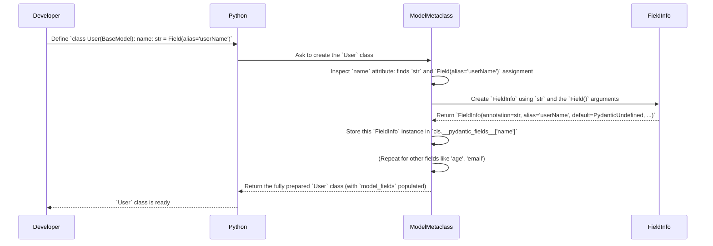

# Chapter 2: Customizing Your Blueprint's Rooms - Fields

In [Chapter 1: BaseModel - Your Data Blueprint](01_basemodel.md), we learned how `BaseModel` acts like a blueprint for our data, defining the expected structure and types using simple Python type hints. We saw how Pydantic uses this blueprint to parse, validate, and serialize data.

But what if we need more specific instructions for certain parts of our blueprint? What if a room needs a specific paint color (a default value)? Or what if the blueprint uses one name for a room ("Lounge"), but the construction crew knows it by another name ("Living Room") (an alias)?

This is where Pydantic's **Fields** come in. They allow us to add these extra details and constraints to the attributes within our models.

## Why Customize Fields?

Let's go back to our `User` model:

```python
from pydantic import BaseModel

class User(BaseModel):
    name: str
    age: int
```

This is great, but real-world data often has quirks:

1.  **Missing Data:** What if `age` isn't always provided? Should it default to something sensible, like `18`?
2.  **Naming Conflicts:** What if the incoming data (e.g., JSON from a JavaScript frontend) uses `userName` instead of `name` (camelCase vs. snake_case)?
3.  **Basic Rules:** What if we know `age` must always be a positive number?

Simply using type hints (`str`, `int`) doesn't cover these cases. We need a way to add more *metadata* (extra information) to our fields.

## Introducing `Field()`: Adding Notes to the Blueprint

Pydantic provides the `Field()` function precisely for this purpose. You use it as the *default value* when defining an attribute on your model, and pass arguments to it to specify the extra details.

Think of it like adding specific notes or requirements to a room on your building blueprint.

```python
# Import Field along with BaseModel
from pydantic import BaseModel, Field

# Our User model, now with customizations using Field()
class User(BaseModel):
    name: str = Field(
        default='Guest',       # Note 1: Default name is 'Guest'
        alias='userName',      # Note 2: Expect 'userName' in input data
        min_length=3           # Note 3: Name must be at least 3 characters
    )
    age: int = Field(
        default=18,            # Note 1: Default age is 18
        gt=0                   # Note 2: Age must be greater than 0
    )
    email: str | None = Field(
        default=None,          # Note 3: Email is optional (defaults to None)
        description='The user email address' # Note 4: Add a description
    )
```

Let's break down how we use `Field()`:

1.  **Import:** You need to import `Field` from `pydantic`.
2.  **Assignment:** Instead of just `name: str`, you write `name: str = Field(...)`. The `Field()` call replaces a simple default value (though `Field()` *can* specify a default).
3.  **Arguments:** You pass keyword arguments to `Field()` to specify the metadata:
    *   `default`: Sets a default value if the field isn't provided in the input data. If you *only* need a default, you can often just write `name: str = 'Guest'` or `age: int = 18`, but `Field(default=...)` is useful when combined with other options. Use `...` (Ellipsis) or omit `default` entirely to mark a field as required.
    *   `alias`: Tells Pydantic to look for this name (`'userName'`) in the input data (like a dictionary or JSON) when parsing, and use this alias when serializing (e.g., in `model_dump(by_alias=True)`).
    *   `gt` (greater than), `ge` (greater than or equal), `lt` (less than), `le` (less than or equal): Basic numeric constraints.
    *   `min_length`, `max_length`: Constraints for strings, lists, etc.
    *   `description`: A human-readable description, often used for generating documentation or schemas.
    *   ...and many more!

## Using Models with `Field()`

Let's see how our customized `User` model behaves:

**1. Using Defaults:**

```python
from pydantic import BaseModel, Field

class User(BaseModel):
    name: str = Field(default='Guest', alias='userName', min_length=3)
    age: int = Field(default=18, gt=0)
    email: str | None = Field(default=None, description='The user email address')

# Input data missing name and age
input_data_1 = {'email': 'new@example.com'}

# Pydantic uses the defaults!
user1 = User(**input_data_1)
print(user1)
# Expected Output: name='Guest' age=18 email='new@example.com'
```

Pydantic automatically filled in `name` and `age` using the `default` values we specified in `Field()`.

**2. Using Aliases:**

```python
# Continuing from above...

# Input data using the alias 'userName'
input_data_2 = {'userName': 'Alice', 'age': 30}

# Pydantic correctly uses the alias to populate 'name'
user2 = User(**input_data_2)
print(user2)
# Expected Output: name='Alice' age=30 email=None

# Dumping the model back, using the alias
print(user2.model_dump(by_alias=True))
# Expected Output: {'userName': 'Alice', 'age': 30, 'email': None}

# Dumping without by_alias uses the actual field names
print(user2.model_dump())
# Expected Output: {'name': 'Alice', 'age': 30, 'email': None}
```

Pydantic successfully read the `userName` key from the input thanks to `alias='userName'`. When dumping *with* `by_alias=True`, it uses the alias again.

**3. Using Validation Constraints:**

```python
# Continuing from above...
from pydantic import ValidationError

# Input data with invalid values
invalid_data_1 = {'userName': 'Bo', 'age': 30} # Name too short
invalid_data_2 = {'userName': 'Charlie', 'age': -5} # Age not > 0

try:
    User(**invalid_data_1)
except ValidationError as e:
    print(f"Error 1:\n{e}")
    """
    Expected Output (simplified):
    Error 1:
    1 validation error for User
    name
      String should have at least 3 characters [type=string_too_short, context={'min_length': 3}, ...]
    """

try:
    User(**invalid_data_2)
except ValidationError as e:
    print(f"Error 2:\n{e}")
    """
    Expected Output (simplified):
    Error 2:
    1 validation error for User
    age
      Input should be greater than 0 [type=greater_than, context={'gt': 0}, ...]
    """
```

Pydantic enforced the `min_length=3` and `gt=0` constraints we added via `Field()`, giving helpful errors when the rules were violated.

## What is `FieldInfo`? The Architect's Specification

So, you use the `Field()` function to add notes to your blueprint. But how does Pydantic *store* and *use* this information internally?

When Pydantic processes your model definition, it takes the information you provided in `Field()` (and the type hint) and bundles it all up into an internal object called `FieldInfo`.

**Analogy:** `Field()` is the sticky note you put on the blueprint ("Living Room - Must have fireplace"). `FieldInfo` is the formal entry in the architect's detailed specification document that captures this requirement along with the room's dimensions (type hint), default paint color (default value), etc.

You don't usually create `FieldInfo` objects directly. You use the convenient `Field()` function, and Pydantic creates the `FieldInfo` for you.

Every Pydantic model has a special attribute called `model_fields` which is a dictionary mapping field names to their corresponding `FieldInfo` objects.

```python
# Continuing from the User model above

# Access the internal FieldInfo objects
print(User.model_fields['name'])
# Expected Output (representation may vary slightly):
# FieldInfo(annotation=str, required=False, default='Guest', alias='userName', alias_priority=2, validation_alias='userName', serialization_alias='userName', metadata=[MinLen(min_length=3)])

print(User.model_fields['age'])
# Expected Output:
# FieldInfo(annotation=int, required=False, default=18, metadata=[Gt(gt=0)])

print(User.model_fields['email'])
# Expected Output:
# FieldInfo(annotation=Union[str, NoneType], required=False, default=None, description='The user email address')
```

You can see how the `FieldInfo` object holds all the details: the `annotation` (type), `default`, `alias`, `description`, and even the constraints like `MinLen(min_length=3)` and `Gt(gt=0)` stored in its `metadata` attribute.

## Under the Hood: From `Field()` to `FieldInfo`

Let's revisit the model creation process from Chapter 1, now including `Field()`.

**High-Level Steps:**

When Python creates your `User` class:

1.  **Inspection:** Pydantic's `ModelMetaclass` inspects the class definition. It finds `name: str = Field(alias='userName', ...)`, `age: int = Field(default=18, ...)`, etc.
2.  **`FieldInfo` Creation:** For each attribute defined with `Field()`, Pydantic calls internal logic (like `FieldInfo.from_annotated_attribute`) using the type hint (`str`, `int`) and the result of the `Field(...)` call. This creates the `FieldInfo` object containing all the configuration (type, default, alias, constraints, etc.).
3.  **Storage:** These `FieldInfo` objects are stored in an internal dictionary, which becomes accessible via `YourModel.model_fields`.
4.  **Schema Generation:** Pydantic uses these comprehensive `FieldInfo` objects (along with model-level [Configuration](03_configuration__configdict___configwrapper_.md)) to generate the internal [Core Schema](05_core_schema___validation_serialization.md). This schema is the detailed instruction set for the fast validation and serialization engine.

**Sequence Diagram:**



**Code Location:**

*   The `Field()` function itself is defined in `pydantic/fields.py`. It's a relatively simple function that just captures its arguments and returns a `FieldInfo` instance.
*   The `FieldInfo` class is also defined in `pydantic/fields.py`. It holds attributes like `annotation`, `default`, `alias`, `metadata`, etc.
*   The logic that finds fields in a class definition, handles the `Field()` assignments, and creates the `FieldInfo` objects primarily happens within the `collect_model_fields` function (in `pydantic._internal._fields.py`), which is called by the `ModelMetaclass` (in `pydantic._internal._model_construction.py`) during class creation.

```python
# Simplified view from pydantic/fields.py

# The user-facing function
def Field(
    default: Any = PydanticUndefined,
    *,
    alias: str | None = _Unset,
    description: str | None = _Unset,
    gt: float | None = _Unset,
    # ... many other arguments
) -> Any: # Returns Any for type checker convenience
    # It captures all arguments and passes them to create a FieldInfo instance
    field_info = FieldInfo.from_field(
        default,
        alias=alias,
        description=description,
        gt=gt,
        # ... passing all arguments through
    )
    return field_info # Actually returns a FieldInfo instance at runtime

# The internal storage class
class FieldInfo:
    # Attributes to store all the configuration
    annotation: type[Any] | None
    default: Any
    alias: str | None
    description: str | None
    metadata: list[Any] # Stores constraints like Gt, MinLen, etc.
    # ... other attributes

    def __init__(self, **kwargs) -> None:
        # Simplified: Assigns kwargs to attributes
        self.annotation = kwargs.get('annotation')
        self.default = kwargs.get('default', PydanticUndefined)
        self.alias = kwargs.get('alias')
        self.description = kwargs.get('description')
        # ... and collects constraints into self.metadata
        self.metadata = self._collect_metadata(kwargs)

    @staticmethod
    def from_field(default: Any = PydanticUndefined, **kwargs) -> 'FieldInfo':
        # Creates an instance, handling the default value logic
        # ... implementation ...
        return FieldInfo(default=default, **kwargs)

    def _collect_metadata(self, kwargs: dict[str, Any]) -> list[Any]:
        # Simplified: Takes kwargs like 'gt=0' and converts them
        # to internal metadata objects like 'annotated_types.Gt(0)'
        metadata = []
        if 'gt' in kwargs:
             # metadata.append(annotated_types.Gt(kwargs.pop('gt'))) # Real code is more complex
             pass # Simplified
        # ... handles other constraint kwargs ...
        return metadata

# --- Simplified view from pydantic._internal._fields.py ---

def collect_model_fields(cls, config_wrapper, ns_resolver, *, typevars_map=None):
    fields: dict[str, FieldInfo] = {}
    type_hints = get_model_type_hints(cls, ns_resolver=ns_resolver) # Get {'name': str, 'age': int, ...}

    for ann_name, (ann_type, evaluated) in type_hints.items():
        if is_valid_field_name(ann_name):
            assigned_value = getattr(cls, ann_name, PydanticUndefined) # Check if Field() was used

            if isinstance(assigned_value, FieldInfo): # If name = Field(...) was used
                # Create FieldInfo using the type hint AND the assigned FieldInfo object
                field_info = FieldInfo.from_annotated_attribute(ann_type, assigned_value)
            elif assigned_value is PydanticUndefined: # If only name: str was used
                # Create FieldInfo just from the type hint
                field_info = FieldInfo.from_annotation(ann_type)
            else: # If name: str = 'some_default' was used
                # Create FieldInfo from type hint and simple default
                field_info = FieldInfo.from_annotated_attribute(ann_type, assigned_value)

            fields[ann_name] = field_info
            # ... more logic for inheritance, docstrings, etc. ...

    return fields, set() # Returns dict of field names to FieldInfo objects

```

This process ensures that all the configuration you provide via `Field()` is captured systematically in `FieldInfo` objects, ready to be used for generating the validation/serialization schema.

## Conclusion

You've now learned how to add detailed configuration to your `BaseModel` fields using the `Field()` function:

*   `Field()` allows you to specify **defaults**, **aliases**, basic **validation constraints** (like `gt`, `max_length`), **descriptions**, and more.
*   It acts like adding specific **notes or requirements** to the rooms in your data blueprint.
*   Internally, Pydantic captures this information in `FieldInfo` objects.
*   `FieldInfo` holds the complete specification for a field (type, default, alias, constraints, etc.) and is stored in the model's `model_fields` attribute.
*   This detailed `FieldInfo` is crucial for Pydantic's powerful validation and serialization capabilities.

You now have more control over individual fields. But what about configuring the overall behavior of the *entire* model? For example, how can we tell Pydantic to *always* use aliases when serializing, or to forbid extra fields not defined in the model? That's where model configuration comes in.

Next: [Chapter 3: Configuration (ConfigDict / ConfigWrapper)](03_configuration__configdict___configwrapper_.md)

---

Generated by [AI Codebase Knowledge Builder](https://github.com/The-Pocket/Tutorial-Codebase-Knowledge)