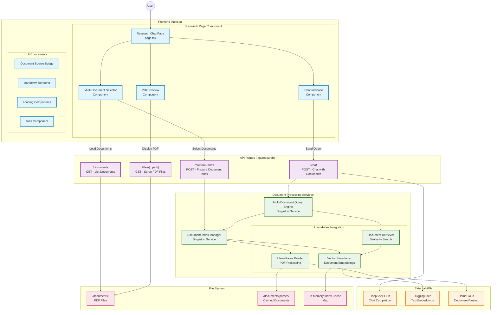

# ResAI Research System Architecture

## System Architecture Diagram

## Data Flow

### Document Selection Flow

1. User opens research page
2. System loads available documents from `/documents/` directory
3. User selects one or more documents
4. System prepares indices for selected documents
5. Documents are parsed using LlamaCloud (if not cached)
6. Vector embeddings are generated using HuggingFace
7. Indices are stored in memory cache

### Chat Query Flow

1. User enters a question
2. System retrieves relevant chunks from combined index
3. Context is organized by source document
4. Enhanced prompt is created with context and query
5. DeepSeek LLM generates streaming response
6. Response is displayed with source attribution
