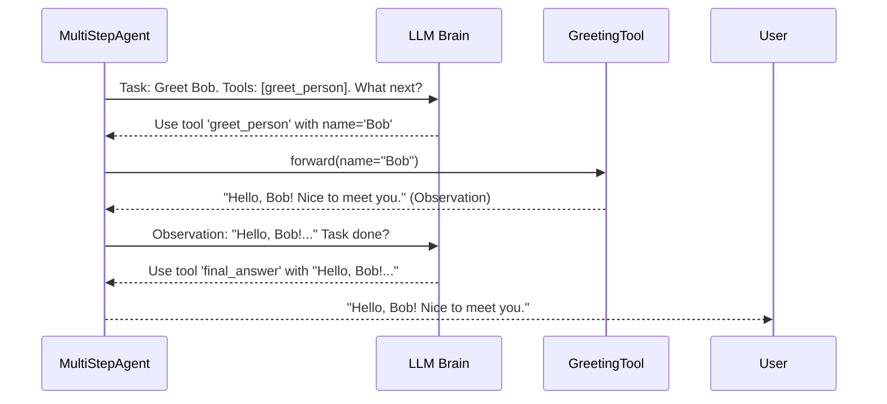

# Chapter 3: Tool - Giving Your Agent Superpowers

Welcome back! In [Chapter 2: Model Interface](02_model_interface.md), we learned how our `MultiStepAgent` uses a "universal remote" (the Model Interface) to talk to its LLM "brain". The LLM thinks and suggests what the agent should do next.

But how does the agent actually *do* things? If the LLM suggests "Search the web for the capital of France," how does the agent perform the search? It can't just magically type into Google!

This is where **Tools** come in. They are the agent's hands and specialized equipment, allowing it to interact with the world beyond just generating text.

## The Problem: An Agent Trapped in its Mind

Imagine a brilliant chef who only knows recipes but is locked in an empty room. They can tell you exactly how to make a perfect soufflé, step-by-step, but they can't actually *do* any of it. They have no ingredients, no oven, no whisk, no bowls. They're stuck!

 🤔 -> 📝 Recipe (Think)

An agent without tools is like that chef. The LLM brain can reason and plan ("I need to search the web"), but the agent itself has no way to execute that plan ("How do I *actually* search?").

## The Solution: The Agent's Toolbox

Tools are specific capabilities we give to our agent. Think of them like the utensils and appliances in a kitchen drawer:

*   **Peeler:** Used for peeling vegetables.
*   **Whisk:** Used for mixing ingredients.
*   **Oven:** Used for baking.
*   **Search Engine Tool:** Used for searching the web.
*   **Calculator Tool:** Used for performing calculations.
*   **Code Execution Tool:** Used for running computer code.

 -> 🔎 Search, 💻 Code Runner, ☁️ Weather API

Each tool is a reusable function that the agent can call upon to perform a specific action. The agent acts like the chef, looking at the next step in the recipe (the LLM's suggestion) and picking the right tool from its toolbox.

## What Makes a Tool?

Every tool in `SmolaAgents` needs a few key pieces of information so the agent (and the LLM helping it) can understand it:

1.  **`name`**: A short, descriptive name for the tool (e.g., `web_search`, `calculator`). This is how the agent identifies which tool to use.
2.  **`description`**: A clear explanation of what the tool does, what it's good for, and what information it needs. This helps the LLM decide *when* to suggest using this tool. Example: *"Performs a web search using DuckDuckGo and returns the top results."*
3.  **`inputs`**: Defines what information the tool needs to do its job. This is like specifying that a peeler needs a vegetable, or a calculator needs numbers and an operation. It's defined as a dictionary where keys are argument names and values describe the type and purpose. Example: `{"query": {"type": "string", "description": "The search query"}}`.
4.  **`output_type`**: Describes the type of result the tool will return (e.g., `string`, `number`, `image`).
5.  **`forward` method**: This is the actual Python code that gets executed when the tool is used. It takes the defined `inputs` as arguments and performs the tool's action, returning the result.

## Creating Your First Tool: The `GreetingTool`

Let's build a very simple tool. Imagine we want our agent to be able to greet someone by name.

We'll create a `GreetingTool` by inheriting from the base `Tool` class provided by `SmolaAgents`.

```python
# --- File: simple_tools.py ---
from smolagents import Tool # Import the base class

class GreetingTool(Tool):
    """A simple tool that generates a greeting."""

    # 1. Give it a unique name
    name: str = "greet_person"

    # 2. Describe what it does clearly
    description: str = "Greets a person by their name."

    # 3. Define the inputs it needs
    # It needs one input: the 'name' of the person, which should be a string.
    inputs: dict = {
        "name": {
            "type": "string",
            "description": "The name of the person to greet."
        }
    }

    # 4. Specify the type of the output
    # It will return the greeting as a string.
    output_type: str = "string"

    # 5. Implement the action in the 'forward' method
    def forward(self, name: str) -> str:
        """The actual code that runs when the tool is called."""
        print(f"--- GreetingTool activated with name: {name} ---")
        greeting = f"Hello, {name}! Nice to meet you."
        return greeting

# Let's test it quickly (outside the agent context)
greeter = GreetingTool()
result = greeter(name="Alice") # Calling the tool instance
print(f"Tool returned: '{result}'")

# Expected Output:
# --- GreetingTool activated with name: Alice ---
# Tool returned: 'Hello, Alice! Nice to meet you.'
```

**Explanation:**

1.  **Import:** We import the base `Tool` class.
2.  **Class Definition:** We define `GreetingTool` inheriting from `Tool`.
3.  **Attributes:** We set the required class attributes: `name`, `description`, `inputs`, and `output_type`. These tell the agent everything it needs to know *about* the tool without running it.
4.  **`forward` Method:** This method contains the core logic. It takes the `name` (defined in `inputs`) as an argument and returns the greeting string. We added a `print` statement just to see when it runs.
5.  **Testing:** We create an instance `greeter` and call it like a function, passing the required argument `name="Alice"`. It executes the `forward` method and returns the result.

This `GreetingTool` is now ready to be added to an agent's toolbox!

## Adding the Tool to Your Agent

Remember how we created our `MultiStepAgent` in [Chapter 1](01_multistepagent.md)? We gave it a model and a list of tools. Let's add our new `GreetingTool`:

```python
# --- File: agent_with_greeting.py ---
# (Assuming GreetingTool is defined as above or imported)
# from simple_tools import GreetingTool
from smolagents import MultiStepAgent
from smolagents.models import LiteLLMModel # From Chapter 2
# Potentially other tools like SearchTool etc.

# 1. Create an instance of our new tool
greeting_tool = GreetingTool()

# 2. Create instances of any other tools the agent might need
# search_tool = SearchTool() # Example from Chapter 1

# 3. Choose a language model (the "brain")
llm = LiteLLMModel(model_id="gpt-3.5-turbo") # Needs API key setup

# 4. Create the MultiStepAgent, passing the tool(s) in a list
agent = MultiStepAgent(
    model=llm,
    tools=[greeting_tool] # Add our tool here! Maybe add search_tool too?
    # tools=[greeting_tool, search_tool]
)

print("Agent created with GreetingTool!")

# 5. Give the agent a task that might use the tool
task = "Greet the user named Bob."
print(f"Running agent with task: '{task}'")

# The agent will now start its Think-Act-Observe cycle...
final_answer = agent.run(task)

print("-" * 20)
print(f"Final Answer received: {final_answer}")

# --- Expected Interaction (Simplified) ---
# Agent (thinks): The task is to greet Bob. I have a 'greet_person' tool.
# Agent (acts): Use tool 'greet_person' with input name="Bob".
# --- GreetingTool activated with name: Bob --- (Our print statement)
# Agent (observes): Tool returned "Hello, Bob! Nice to meet you."
# Agent (thinks): I have the greeting. That completes the task.
# Agent (acts): Use 'final_answer' tool with "Hello, Bob! Nice to meet you."
# --------------------
# Final Answer received: Hello, Bob! Nice to meet you.
```

**Explanation:**

1.  We create an instance of `GreetingTool`.
2.  We put this instance into the `tools` list when initializing `MultiStepAgent`.
3.  The agent now "knows" about the `greet_person` tool, its description, and how to use it (via its `name` and `inputs`).
4.  When we run the `agent` with the task "Greet the user named Bob," the LLM (using the tool descriptions provided in the prompt) will likely recognize that the `greet_person` tool is perfect for this.
5.  The agent will then execute the `greeting_tool.forward(name="Bob")` method during its "Act" phase.

## How the Agent Uses Tools: Under the Hood

Let's revisit the **Think -> Act -> Observe** cycle from [Chapter 1](01_multistepagent.md) and see exactly where tools fit in.

1.  **Think:** The agent gathers its history ([AgentMemory](04_agentmemory.md)) and the available tool descriptions. It sends this to the LLM via the [Model Interface](02_model_interface.md) asking, "What should I do next to accomplish the task 'Greet Bob'?" The LLM, seeing the `greet_person` tool description, might respond with something like:
    ```json
    {
      "thought": "The user wants me to greet Bob. I should use the 'greet_person' tool.",
      "action": "greet_person",
      "action_input": {"name": "Bob"}
    }
    ```
    *(Note: The exact format depends on the agent type and model. Some models use explicit tool-calling formats like the one shown in Chapter 2's `ToolCallingAgent` example output).*

2.  **Act:** The `MultiStepAgent` receives this response.
    *   It parses the response to identify the intended `action` (`greet_person`) and the `action_input` (`{"name": "Bob"}`).
    *   It looks up the tool named `greet_person` in its `self.tools` dictionary.
    *   It calls the `forward` method of that tool instance, passing the arguments from `action_input`. In our case: `greeting_tool.forward(name="Bob")`.
    *   This executes our Python code inside the `forward` method.

3.  **Observe:** The agent captures the return value from the `forward` method (e.g., `"Hello, Bob! Nice to meet you."`). This becomes the "observation" for this step.
    *   This observation is stored in the [AgentMemory](04_agentmemory.md).
    *   The cycle repeats: The agent thinks again, now considering the result of the greeting tool. It likely decides the task is complete and uses the built-in `final_answer` tool.

Here's a simplified diagram:



**Code Glimpse (Simplified `execute_tool_call`):**

Inside the `agents.py` file (specifically within agent types like `ToolCallingAgent`), there's logic similar to this (heavily simplified):

```python
# --- Simplified concept from agents.py ---
class SomeAgentType(MultiStepAgent):
    # ... other methods ...

    def execute_tool_call(self, tool_name: str, arguments: dict) -> Any:
        # Find the tool in the agent's toolbox
        if tool_name in self.tools:
            tool_instance = self.tools[tool_name]
            try:
                # Call the tool's forward method with the arguments!
                # This is where GreetingTool.forward(name="Bob") happens.
                result = tool_instance(**arguments) # Uses ** to unpack the dict
                return result
            except Exception as e:
                # Handle errors if the tool fails
                print(f"Error executing tool {tool_name}: {e}")
                return f"Error: Tool {tool_name} failed."
        # ... handle case where tool_name is not found ...
        elif tool_name == "final_answer":
             # Special handling for the final answer
             return arguments.get("answer", arguments) # Return the final answer content
        else:
            return f"Error: Unknown tool {tool_name}."

    def step(self, memory_step: ActionStep):
        # ... (Agent thinks and gets LLM response) ...
        llm_response = # ... result from self.model(...) ...

        if llm_response suggests a tool call:
             tool_name = # ... parse tool name from response ...
             arguments = # ... parse arguments from response ...

             # === ACT ===
             observation = self.execute_tool_call(tool_name, arguments)
             memory_step.observations = str(observation) # Store observation

             if tool_name == "final_answer":
                 return observation # Signal that this is the final answer
        # ... (handle cases where LLM gives text instead of tool call) ...
        return None # Not the final answer yet
```

This shows the core idea: the agent gets the `tool_name` and `arguments` from the LLM, finds the corresponding `Tool` object, and calls its `forward` method using the arguments.

## Common Built-in Tools

`SmolaAgents` comes with several useful tools ready to use (found in `default_tools.py`):

*   **`DuckDuckGoSearchTool` (`web_search`)**: Searches the web using DuckDuckGo.
*   **`PythonInterpreterTool` (`python_interpreter`)**: Executes Python code snippets safely. Very powerful for calculations, data manipulation, etc. (Used primarily by `CodeAgent`, see [Chapter 6: PythonExecutor](06_pythonexecutor.md)).
*   **`VisitWebpageTool` (`visit_webpage`)**: Fetches the content of a webpage URL.
*   **`FinalAnswerTool` (`final_answer`)**: A special, essential tool. The agent uses this *only* when it believes it has completed the task and has the final result. Calling this tool usually ends the agent's run. It's automatically added to every agent.

You can import and use these just like we used our `GreetingTool`:

```python
from smolagents.tools import DuckDuckGoSearchTool, FinalAnswerTool # FinalAnswerTool is usually added automatically

search_tool = DuckDuckGoSearchTool()
# calculator_tool = PythonInterpreterTool() # Often used internally by CodeAgent

agent = MultiStepAgent(
    model=llm,
    tools=[search_tool] # Agent can now search!
)
```

## Conclusion

Tools are the bridge between an agent's reasoning and the real world (or specific functionalities like code execution). They are reusable capabilities defined by their `name`, `description`, `inputs`, `output_type`, and the core logic in their `forward` method.

You've learned:

*   Why agents need tools (like a chef needs utensils).
*   The essential components of a `Tool` in `SmolaAgents`.
*   How to create a simple custom tool (`GreetingTool`).
*   How to give tools to your `MultiStepAgent`.
*   How the agent uses the LLM's suggestions to select and execute the correct tool during the "Act" phase.
*   About some common built-in tools.

By equipping your agent with the right set of tools, you dramatically expand the range of tasks it can accomplish! But as the agent takes multiple steps, using tools and getting results, how does it keep track of everything that has happened? That's where memory comes in.

**Next Chapter:** [Chapter 4: AgentMemory](04_agentmemory.md) - The Agent's Notepad.

---

Generated by [AI Codebase Knowledge Builder](https://github.com/The-Pocket/Tutorial-Codebase-Knowledge)