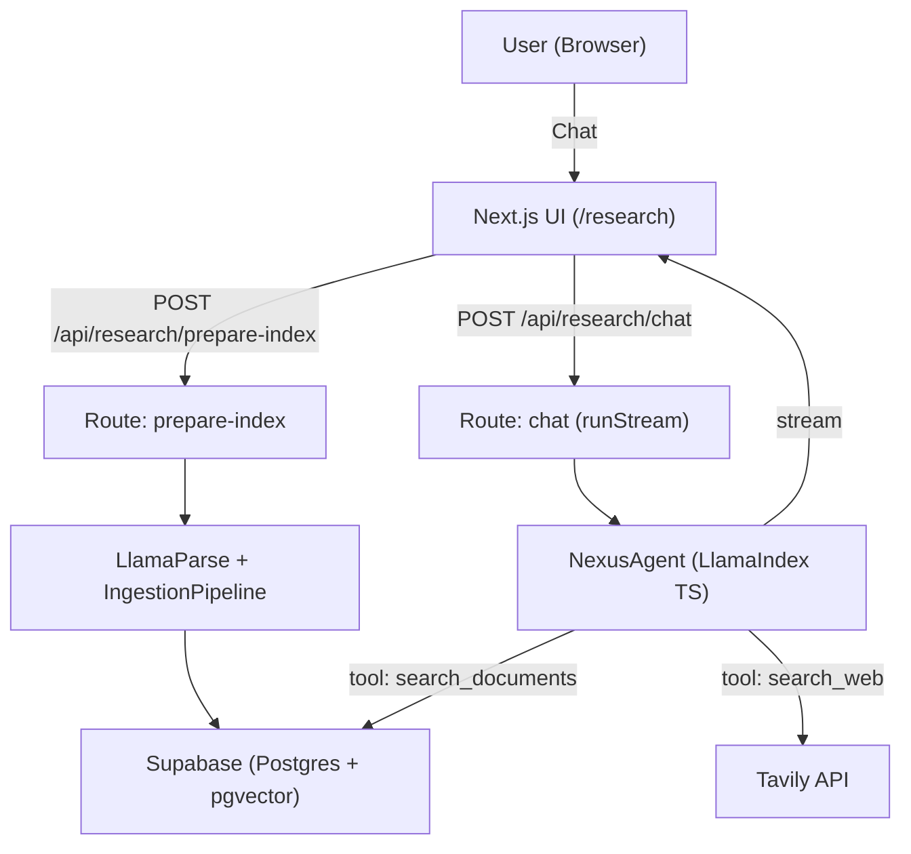
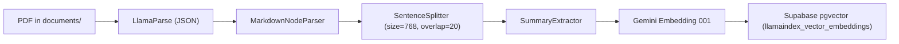
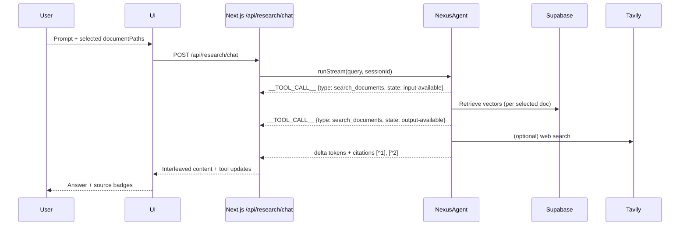

## Nexus: An Agentic RAG Assistant for ResilientDB and Distributed Systems

### Overview
Nexus is a Next.js-based agentic Retrieval-Augmented Generation (RAG) assistant tailored for Apache ResilientDB, blockchain, and distributed systems. It combines LlamaIndex (TypeScript) orchestration, DeepSeek for reasoning, Gemini Embedding 001 for retrieval, and Supabase (Postgres + pgvector) for persistent storage and memory, delivering grounded, cited answers with inline markers.

### Motivation
- The research landscape is dense; answers must be verifiable and source-linked.
- Traditional keyword tools don’t synthesize across documents.
- Researchers need multi-document reasoning, persistent context, and the ability to pull in external updates when needed.

### Key Features
- Research and Code modes:
  - **Research Mode**: Single `NexusAgent` with `search_documents` and `search_web` tools, cites results with [^id], streams tool usage transparently
  - **Code Mode** (experimental): Multi-agent workflow via `CodeAgent` class:
    - `PlannerAgent`: Retrieves document content and analyzes for implementation details
    - `PseudoCodeAgent`: Creates structured pseudocode from research findings  
    - `CodeAgent`: Generates final production-ready code in selected language (TypeScript, Python, C++)
    - Features automatic handoffs between agents and live streaming of each phase
- Document selection:
  - Single-document focus for deep reading.
  - Multi-document selection for synthesis and comparison.
- Tool-aware agent:
  - search_documents: semantic retrieval from Supabase pgvector (scoped to selected docs).
  - search_web: Tavily for up-to-date or out-of-corpus facts.
- Session-scoped memory with short-term and long-term capabilities:
  - **Short-term memory**: FIFO queue of recent messages within token limits (30,000 tokens, 70% ratio for chat history)
  - **Long-term memory**: Implemented via two memory blocks:
    - `robustFactExtractionBlock`: Extracts and stores durable facts using DeepSeek (max 10 facts, priority 1)
    - `vectorBlock`: Stores and retrieves session-scoped memory in Supabase pgvector (priority 2, top-k=3)
- Streaming with tool transparency:
  - The API streams deltas and tool lifecycle events so the UI can interleave “thinking” steps and tool badges.

### System Architecture



### Ingestion Pipeline

Nexus implements a sophisticated document ingestion pipeline using LlamaIndex's `IngestionPipeline` with multiple transformation stages to prepare raw PDFs for efficient retrieval:



**Transformation Pipeline Details:**

1. **Document Parsing**: `LlamaParseReader` converts PDFs to structured JSON with page metadata, handling complex layouts, tables, and figures
2. **Node Parsing**: `MarkdownNodeParser` processes the markdown content from LlamaParse into structured document nodes
3. **Text Chunking**: `SentenceSplitter` with chunk size 768 tokens and 20-token overlap maintains semantic coherence while creating retrievable segments
4. **Metadata Extraction**: `SummaryExtractor` automatically generates summaries and extracts key metadata for each chunk
5. **Embedding Generation**: Gemini Embedding 001 converts text chunks into high-dimensional vectors for semantic similarity search
6. **Vector Storage**: Embeddings and metadata are stored in Supabase pgvector with HNSW indexing for fast retrieval

**Caching Strategy**: The system maintains a `parsed_documents` table in Supabase to track parsing status, avoiding re-processing of already ingested files and enabling incremental updates.

This pipeline ensures that each PDF is transformed into semantically meaningful, searchable chunks with rich metadata and high-quality embeddings for precise retrieval.

### Streaming and Tooling



### Stack
- Frontend: Next.js (React) chat UI + PDF/source preview panel
- API: Next.js Route Handlers under /api/research/*
- Orchestration: LlamaIndex (TypeScript)
- Vector Storage: Supabase (Postgres + pgvector) via @llamaindex/supabase
- LLM: DeepSeek (deepseek-chat) via @llamaindex/deepseek
- Embeddings: Gemini Embedding 001 via @llamaindex/google
- Web Search: Tavily

### How it Works (at a glance)
- Select documents (single or multiple).
- The UI calls /api/research/prepare-index → PDFs parsed with LlamaParse → transformed and embedded → stored in pgvector.
- Ask a question; the UI calls /api/research/chat → the agent chooses tools → streams tokens and events → UI displays content and source attributions.

### Research Agent


### Code Composer Agent


### Run Locally

- Prerequisites:
  - Node.js 18+
  - Supabase project with pgvector enabled
  - Create two tables (or reuse defaults):
    - llamaindex_vector_embeddings
    - llamaindex_memory_embeddings
  - API keys:
    - DEEPSEEK_API_KEY
    - GEMINI_API_KEY
    - LLAMA_CLOUD_API_KEY (for LlamaParse)
    - TAVILY_API_KEY
    - SUPABASE_URL and SUPABASE_ANON_KEY (or SUPABASE_SERVICE_ROLE_KEY)

- Environment
```bash
# .env.local
DEEPSEEK_API_KEY=...
DEEPSEEK_MODEL=deepseek-chat

GEMINI_API_KEY=...
LLAMA_CLOUD_API_KEY=...
TAVILY_API_KEY=...

SUPABASE_URL=...
SUPABASE_ANON_KEY=...         # or SUPABASE_SERVICE_ROLE_KEY=...
SUPABASE_VECTOR_TABLE=llamaindex_vector_embeddings
SUPABASE_MEMORY_TABLE=llamaindex_memory_embeddings
```

- Install and run
```bash
npm install
npm run dev
# open http://localhost:3000/research
```

- Add documents
```bash
# put your PDFs here:
documents/
  resilientdb.pdf
  rcc.pdf
  bchain-transaction-pro.pdf
```

- Use the app
  - Select one or more documents in the sidebar.
  - Wait for “Preparing documents…” to complete (ingestion runs via /api/research/prepare-index).
  - Ask questions. The agent retrieves from your selected docs and cites results with [^id].

### Memory Design (Session-Scoped)
Nexus implements the LlamaIndex Memory framework with both short-term and long-term memory capabilities:

**Short-term Memory:**
- Token-limited FIFO queue (30,000 tokens total, 70% allocated to chat history)
- When chat history exceeds the ratio, oldest messages (3,000 tokens) are flushed to long-term memory
- Maintains recent conversational context within the session

**Long-term Memory (via Memory Blocks):**
- `robustFactExtractionBlock` (priority 1): Extracts durable, reusable facts using DeepSeek LLM, stores up to 10 facts with automatic summarization when limit is exceeded
- `vectorBlock` (priority 2): Stores and retrieves session-scoped memory batches in Supabase pgvector (keyed by sessionId), uses hybrid similarity search with top-k=3 retrieval

**Benefits:** 
- Coherence across turns and sessions without relying on raw chat transcripts
- Scalable across instances via persistent vector storage
- Automatic memory management with priority-based truncation when token limits are exceeded

### Current Limitations
- Code Mode is experimental and best for structured, implementation-focused prompts.
- Corpus is intentionally scoped to ResilientDB and related systems to ensure high-quality retrieval.
- Requires cloud APIs (DeepSeek, LlamaParse, Gemini, Tavily); offline mode is not supported out-of-the-box.

### Future Work
- Citation highlighting in the PDF preview panel
  - Click a [^id] marker to jump and highlight the exact passage/page range.
- Custom selective context
  - Let users include/exclude sections (e.g., Methods only), set per-query filters, or re-rank top-k nodes.
- Advanced reranking
  - Integrate implementation-aware reranking for code-generation workflows (leveraging the CodeComposer pipeline).
- Multimodal parsing
  - Tables, figures, and chart-aware extraction for richer question answering.
- Proactive discovery
  - Recommend relevant new papers based on ongoing sessions and research interests.

### Closing
Nexus brings together a modern TS-first stack, robust retrieval, transparent tool use, and session memory to create a reliable research copilot for distributed systems. If you need verifiable, source-grounded answers—not just plausible ones—Nexus is designed for you.