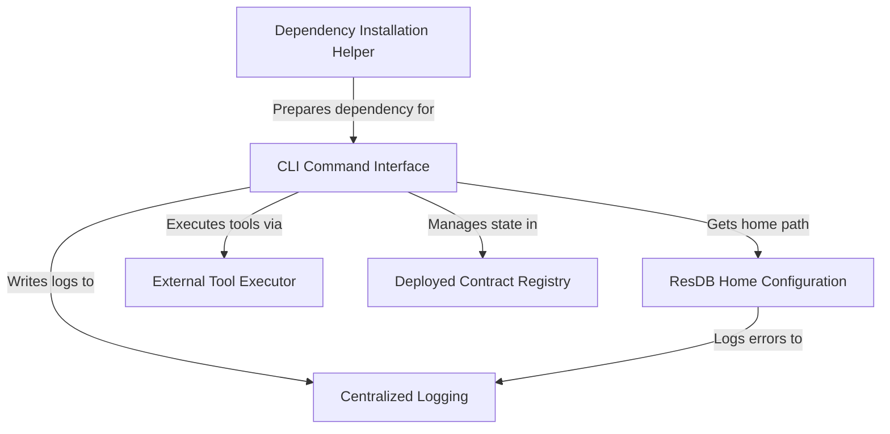

import { CommentSection } from '@/components/CommentSection'
import { Divider, Box, Space, Tabs, TabsList, TabsTab, TabsPanel, Code, Alert } from '@mantine/core'
import { IconInfoCircle } from '@tabler/icons-react'
import { ResContractPlayground } from '@/components/ResContractPlayground'

{/* BEGIN AUTO_DOC: rescontract */}

# rescontract

The `rescontract` project is a **command-line tool** designed to help developers *create, compile, and deploy* smart contracts on the ResilientDB platform. It acts as a user-friendly control panel, simplifying the process of interacting with the blockchain directly from a terminal.




`rescontract` is a command-line interface (CLI) designed to simplify smart contract management within the ResilientDB ecosystem. It provides a straightforward set of commands to create accounts, compile Solidity code, and deploy contracts, abstracting away the underlying complexity of the core ResilientDB tools.

## CLI Command Interface

The `rescontract` CLI is the primary control panel for interacting with the ResilientDB smart contract system. All operations are initiated through simple, text-based commands in your terminal. The basic structure for any command is `rescontract <command> [options]`.

### Creating an Account

Before deploying contracts, you need an account on the network. The `create` command generates a new account and provides its unique address.

```bash
rescontract create --config ./config/service.config
```

-   **`create`**: The command to generate a new account.
-   **`--config <path>`**: Specifies the path to the ResilientDB network configuration file.

### Compiling a Contract

Smart contracts written in Solidity (`.sol`) must be compiled into a machine-readable JSON format. The `compile` command handles this by invoking the Solidity compiler (`solc`).

```bash
rescontract compile --sol contracts/MyToken.sol --output build/MyToken.json
```

-   **`compile`**: The command to compile Solidity source code.
-   **`--sol <path>`**: Path to the input `.sol` file.
-   **`--output <name>`**: The name for the compiled JSON output file.

### Deploying a Contract

Once you have an account and a compiled contract, you can deploy it to the blockchain.

```bash
rescontract deploy --config ./service.config \
--contract build/MyToken.json \
--name MyToken \
--arguments "1000000" \
--owner 0xYourAddress
```

-   **`deploy`**: The command to deploy a contract.
-   **`--contract <path>`**: Path to the compiled `.json` file.
-   **`--name <name>`**: Name of the contract to be deployed.
-   **`--arguments "<...>" `**: Initial values required by the contract's constructor.
-   **`--owner <address>`**: The address of the account that will own the contract.

Successful deployment will output a JSON object containing the new contract's blockchain address.

## Configuration and Setup

For `rescontract` to function correctly, it must be able to locate core ResilientDB tools and external dependencies like the Solidity compiler.

### Locating ResilientDB Tools (ResDB Home)

`rescontract` acts as a wrapper around the core ResilientDB binaries. It needs to know the path to your main ResilientDB installation directory, referred to as "ResDB Home." It finds this path by searching in the following order of priority:

1.  **Environment Variable**: Checks for a `ResDB_Home` environment variable. This is the recommended method.
    ```bash
    export ResDB_Home=/path/to/your/resilientdb
    ```
2.  **Local `config.yaml`**: Looks for a `config.yaml` file in the current working directory.
3.  **User `config.yaml`**: Looks for a `config.yaml` file in your system's user home directory.

If the path cannot be resolved through any of these methods, `rescontract` will exit with an error.

### Managing Dependencies (Solidity Compiler)

The `compile` command requires the Solidity compiler (`solc`) to be installed. To simplify setup, `rescontract` includes a dependency installation helper.

This helper is an `npm` `postinstall` script that runs automatically one time after `rescontract` is installed globally. It checks if `solc` is present on your system. If not, it will prompt you with an offer to install it automatically. This "batteries included" approach ensures a smoother first-time user experience.

## Internal Mechanics

Understanding the internal components of `rescontract` can help with troubleshooting and advanced usage.

### Command Execution Flow

When you run a command, `rescontract` follows a clear internal process:

1.  **Parsing**: The CLI uses the `commander.js` library to parse the command and its options (e.g., `deploy`, `--name MyToken`).
2.  **Execution**: The appropriate action is triggered. This action doesn't perform the core logic itself; instead, it delegates the task to a specialized external tool.
3.  **Delegation**: An **External Tool Executor** module is used to run the required ResilientDB or `solc` binary as a separate system process. This executor, built around Node.js's `spawn` function, captures all output (`stdout` and `stderr`) and reports success or failure based on the process's exit code. This design keeps the main CLI logic clean and focused.

### Deployed Contract Registry

To prevent accidental duplicate deployments and help you track your work, `rescontract` maintains a local registry of deployed contracts.

-   **What it is**: A simple JSON file named `.rescontract_deployed_contracts.json` located in your user home directory.
-   **How it works**:
    -   When you run `deploy`, `rescontract` first checks this registry. If a contract with the same name and owner already exists, the command fails with an error.
    -   After a successful deployment, the new contract's name, owner, and address are recorded in the file.
-   **Listing Deployments**: You can view the contents of this registry at any time using the `list-deployments` command.

```bash
rescontract list-deployments
```

### Centralized Logging

`rescontract` provides robust logging for debugging and auditing, functioning like an application's "black box." It uses the `winston` library to manage two simultaneous output streams:

1.  **Console Output**: Clean, human-readable messages are printed directly to your terminal for immediate feedback.
2.  **File Output**: Detailed, timestamped logs are written to files for persistent record-keeping. These files are stored in the `~/.rescontract-logs/` directory:
    -   `cli.log`: A comprehensive record of all operations.
    -   `exceptions.log`: A dedicated file for critical, unhandled errors.

This dual-logging system ensures that while the user sees a simple interface, a complete technical history is always available for deeper analysis.

---

Generated by [AI Codebase Knowledge Builder](https://github.com/The-Pocket/Tutorial-Codebase-Knowledge)

{/* END AUTO_DOC: rescontract */}

## License

This project is licensed under the Apache License 2.0 - see the [LICENSE](https://github.com/apache/incubator-resilientdb-ResContract/blob/main/LICENSE) file for details.

<Space h="xl" />
<Divider my="xl" label="Community Feedback" labelPosition="center" />

<Box mb="xl">
  <CommentSection
    pageTitle="ResContract CLI Documentation"
    pageUrl={typeof window !== 'undefined' ? window.location.href : ''}
    repoOwner="apache"
    repoName="incubator-resilientdb-ResContract"
    labels={['user-feedback', 'documentation', 'rescontract']}
    title="Questions or Feedback about ResContract?"
  />
</Box> 