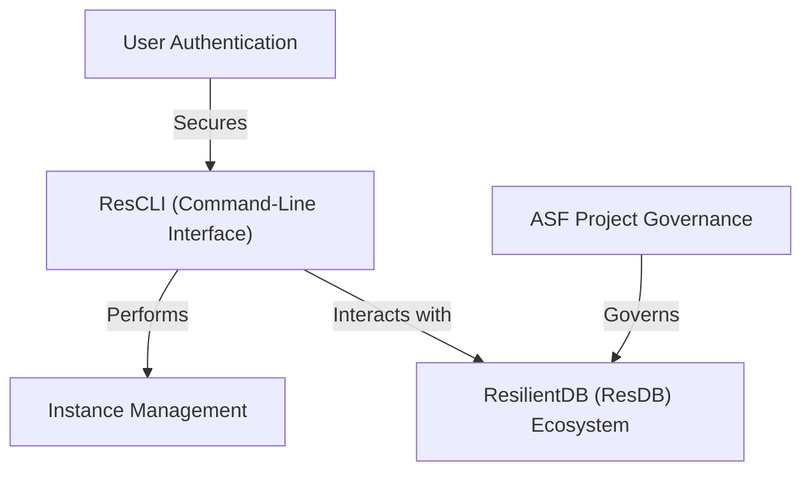
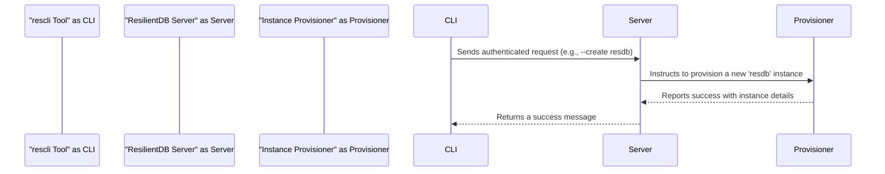

import { CommentSection } from '@/components/CommentSection'
import { Divider, Box, Space, Tabs, TabsList, TabsTab, TabsPanel, Code, Alert } from '@mantine/core'
import { IconInfoCircle } from '@tabler/icons-react'

{/* BEGIN AUTO_DOC: rescli */}

# rescli

ResCLI is a **command-line tool** for managing services within the *ResilientDB blockchain ecosystem*. It provides a simple way for authorized users to **create, view, and delete** running software components, which it calls *instances*. Before performing any actions, users must first use the login command to authenticate themselves, ensuring secure access to their resources.




`rescli` is a command-line interface (CLI) for managing resources on the ResilientDB platform. It provides a simple, secure, and scriptable way to provision, monitor, and terminate services like database instances. This guide covers authentication, core commands, instance management, and the architecture of the ResilientDB ecosystem.

## User Authentication

Secure access is the foundation of `rescli`. The authentication system ensures that only authorized users can manage resources, providing both protection from unauthorized access and accountability for all actions performed.

### Core Authentication Commands

Your session is managed with three primary commands:

*   `--login`: Authenticates your identity and starts a secure session.
*   `--whoami`: Displays the currently logged-in user.
*   `--logout`: Terminates the current session, deleting local credentials.

### Authentication Workflow

A typical session involves logging in, performing tasks, and logging out.

1.  **Check Current Status**
    Before logging in, you can check if a session is already active.
    ```bash
    ./res-cli --whoami
    ```
    **Output:**
    ```
    No user is currently logged in.
    ```

2.  **Log In**
    Initiate the login process. You will be prompted for your credentials.
    ```bash
    ./res-cli --login
    ```
    **Output:**
    ```
    Enter your email: your_email@example.com
    Enter your password: 
    Login successful.
    ```

3.  **Verify Identity**
    Confirm the login was successful.
    ```bash
    ./res-cli --whoami
    ```
    **Output:**
    ```
    Currently logged in as: your_email@example.com
    ```
    You are now authenticated and can manage your instances.

4.  **Log Out**
    When finished, securely end your session.
    ```bash
    ./res-cli --logout
    ```
    **Output:**
    ```
    Logout successful.
    ```

## Core Concepts

Understanding the structure of `rescli` commands and the resources you manage is key to using the tool effectively.

### Command Structure

All `rescli` commands follow a consistent pattern: `executable command [argument]`.

*   **Executable (`./res-cli`)**: The program itself.
*   **Command (`--some-action`)**: The specific action to perform (e.g., `--create`).
*   **Argument (`<some-value>`)**: Optional information required by the command (e.g., an instance ID).

The most useful command for exploration is `--help`, which provides a list of all available commands and their functions.
```bash
./res-cli --help
```

### Understanding Instances

In ResilientDB, an **instance** is a running copy of a service, such as a ResDB blockchain node or a Python SDK environment. `rescli` abstracts away the complex server setup, allowing you to manage the lifecycle of these instances with simple commands.

## Managing Instances

The primary purpose of `rescli` is to manage the lifecycle of your instances: creating, viewing, and deleting them.

### Step 1: Create an Instance

To provision a new service, use the `--create` command followed by the instance type. For example, to create a ResDB node:
```bash
./res-cli --create resdb
```
**Output:**
```
Instance 'resdb-xyz-123' is being created.
```
In the background, the ResilientDB platform automatically provisions and configures the requested resource.

### Step 2: View Instances

To monitor your active instances, use the `--view-instances` command. This acts as your dashboard, showing the status and connection details for all your resources.
```bash
./res-cli --view-instances
```
**Output:**
```
+----------------+--------+-----------+-------------------------+
|  Instance ID   |  Type  |  Status   |       Connection Info   |
+----------------+--------+-----------+-------------------------+
| resdb-xyz-123  | resdb  | Running   | server.example.com:18000|
+----------------+--------+-----------+-------------------------+
```
The **Instance ID** is a unique identifier used to manage a specific instance.

### Step 3: Delete an Instance

When you no longer need an instance, you should delete it to free up resources. Use the `--delete` command with the target **Instance ID**.
```bash
./res-cli --delete resdb-xyz-123
```
**Output:**
```
Instance 'resdb-xyz-123' has been scheduled for deletion.
```
The instance will be terminated and removed from your list.

## Architecture and Governance

While `rescli` is simple to use, it is part of a larger, robust ecosystem governed by trusted open-source principles.

### How `rescli` Works

`rescli` acts as a secure client that communicates with the ResilientDB server API.
1.  **Authentication:** Upon successful login, the server issues a temporary session token, which `rescli` stores locally.
2.  **Command Execution:** For subsequent commands like `--view-instances`, `rescli` sends the request to the server along with the session token for authorization.
3.  **Server Processing:** The server validates the token, performs the requested action (e.g., querying the instance database or instructing the provisioner to create a new instance), and returns the result.
4.  **Display:** `rescli` formats the server's response into human-readable output and displays it in your terminal.

This flow is illustrated below:


### The ResilientDB Ecosystem

`rescli` is your interface to a powerful, multi-layered platform.
*   **`rescli` (The Management Tool):** Your command-line "app store" for installing and managing services.
*   **Instances (The Applications):** Your personal, isolated services (e.g., a `resdb` node) running on the platform.
*   **ResilientDB Fabric (The Platform):** The underlying global-scale blockchain fabric that provides the security, decentralization, and core functionality for all instances.

### Project Governance

ResilientDB is a project of The **Apache Software Foundation (ASF)**, which ensures it is governed in a fair, open, and community-driven manner. This governance model, known as "The Apache Way," guarantees that the project is a stable and trustworthy platform built on three key pillars:
1.  **Apache License 2.0:** A permissive license that grants you the freedom to use, modify, and distribute the software for any purpose, free of charge.
2.  **Community-Driven:** Decisions are made by community consensus, not by a single individual or company. Influence is earned through contribution (meritocracy).
3.  **Vendor Neutrality:** No single company is allowed to control the project's direction, ensuring it serves the public good rather than any one commercial interest.

---

Generated by [AI Codebase Knowledge Builder](https://github.com/The-Pocket/Tutorial-Codebase-Knowledge)

{/* END AUTO_DOC: rescli */}

<Space h="xl" />
<Divider my="xl" label="Community Feedback" labelPosition="center" />

<Box mb="xl">
  <CommentSection
    pageTitle="ResCLI Documentation"
    pageUrl={typeof window !== 'undefined' ? window.location.href : ''}
    repoOwner="apache"
    repoName="incubator-resilientdb-ResCLI"
    labels={['user-feedback', 'documentation', 'rescli']}
    title="Questions or Feedback about ResCLI?"
  />
</Box> 