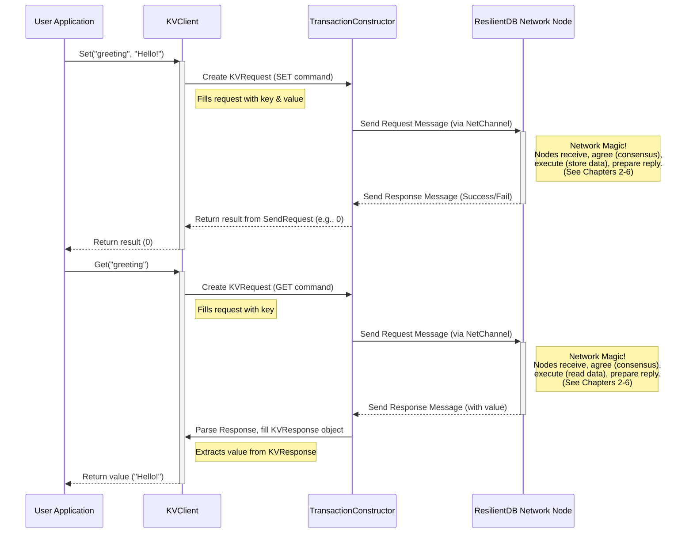

# Chapter 1: Client Interaction

Welcome to your first step in understanding ResilientDB! Imagine ResilientDB is a powerful, secure, and reliable database system run by a team of computers working together. How do you, as a user or an application developer, talk to this system? You can't just shout commands into the void! You need a defined way to communicate, like using a customer service counter at a bank or an API (Application Programming Interface) for a website.

This chapter introduces the **Client Interaction** layer of ResilientDB. It's the set of tools and libraries that act as that "customer service counter" or API, allowing you to:

- Send requests (we call these **transactions**) to the ResilientDB network.
- Receive results back from the network.

Think of it as the official "front door" for interacting with ResilientDB, hiding all the complex machinery working behind the scenes.

## Why Do We Need Special Clients?

ResilientDB isn't just one program running on one computer. It's a _distributed_ system, meaning multiple computers (called replicas or nodes) work together to store data and agree on changes. Sending a simple request like "store this value" involves:

1.  Formatting your request correctly.
2.  Finding the right node(s) in the network to send it to.
3.  Sending the message reliably over the network.
4.  Waiting for enough nodes in the network to agree on your request (this is called consensus).
5.  Getting a confirmation or result back.

Doing all this manually would be complicated and error-prone! The Client Interaction layer provides tools (**Clients**) that handle these steps for you.

## Meet the ResilientDB Clients: Different Counters for Different Tasks

ResilientDB offers different types of clients, each specialized for a particular kind of interaction, just like a bank might have different counters for deposits, loans, or inquiries.

1.  **`KVClient` (Key-Value Client):**

    - **What it does:** Allows you to store and retrieve simple data as key-value pairs, like a dictionary or a basic lookup table. You provide a unique `key` (like a word) and associate a `value` (like its definition) with it.
    - **Analogy:** Think of it as a super-reliable set of digital storage lockers. Each locker has a unique key, and you can put something (a value) inside or check what's inside using the key.
    - **Use Case:** Storing user preferences, configuration settings, simple records.

2.  **`UTXOClient` (Unspent Transaction Output Client):**

    - **What it does:** Designed for managing and transferring digital assets or tokens within ResilientDB, using the UTXO model (common in cryptocurrencies like Bitcoin).
    - **Analogy:** This is like a bank teller specifically for transferring funds. You tell them which "coins" (UTXOs) you want to send and who should receive them.
    - **Use Case:** Building applications involving token transfers or digital asset management.

3.  **`ContractClient` (Smart Contract Client):**
    - **What it does:** Interacts with "smart contracts" deployed on the ResilientDB network. Smart contracts are like small programs stored on the blockchain that automatically execute predefined rules and logic.
    - **Analogy:** Imagine a sophisticated vending machine. You don't just store items; you interact with the machine's programmed logic (select item, insert payment, receive item and change) by calling specific functions.
    - **Use Case:** Running decentralized applications (dApps), automating complex agreements, enforcing business logic on the blockchain.

## The Foundation: `TransactionConstructor`

While we have specialized clients (`KVClient`, `UTXOClient`, `ContractClient`), they all share common tasks: creating the request message in the right format, sending it over the network, and handling the response.

The `TransactionConstructor` is a fundamental building block (a base class in programming terms) that provides this core functionality. Each specific client (`KVClient`, etc.) builds upon `TransactionConstructor` to handle the details of its specific task.

- **Analogy:** Think of `TransactionConstructor` as providing the standard request form and the basic instructions for mailing it. The specific clients (`KVClient`, etc.) know how to fill out the form for their particular request (storing data, transferring assets, calling a contract).

```cpp
// Simplified view from interface/rdbc/transaction_constructor.h
namespace resdb {

// Provides the basic tools to send requests and receive responses.
class TransactionConstructor : public NetChannel { // Inherits network abilities
 public:
  // Constructor needs configuration (where are the ResilientDB nodes?)
  TransactionConstructor(const ResDBConfig& config);

  // Sends a request message (doesn't wait for a detailed reply)
  int SendRequest(const google::protobuf::Message& message,
                  Request::Type type = Request::TYPE_CLIENT_REQUEST);

  // Sends a request message AND waits to receive a response message
  int SendRequest(const google::protobuf::Message& message,
                  google::protobuf::Message* response, // Place to store the response
                  Request::Type type = Request::TYPE_CLIENT_REQUEST);

  // ... other helper functions ...
 private:
  ResDBConfig config_; // Stores network configuration
  // NetChannel handles low-level network sending/receiving details
};

} // namespace resdb
```

This code shows that `TransactionConstructor` takes the ResilientDB network configuration (`ResDBConfig`) and provides `SendRequest` methods. It uses something called `NetChannel` internally, which we'll explore more in the next chapter about [Network Communication (ReplicaCommunicator / ServiceNetwork)](02_network_communication__replicacommunicator___servicenetwork_.md).

## How it Works: A `KVClient` Example (Set & Get)

Let's walk through a simple example: storing and retrieving a greeting using `KVClient`.

**Goal:** Store the key `"greeting"` with the value `"Hello ResilientDB!"` and then retrieve it.

**Step 1: The User Application Code (Conceptual)**

Your application decides it needs to store this data. It will use the `KVClient`.

**Step 2: Using `KVClient::Set`**

Your application calls the `Set` method on a `KVClient` object.

```cpp
// Inside your application (conceptual C++)
#include "interface/kv/kv_client.h"
#include "platform/config/resdb_config.h" // For configuration

// Assume 'config' holds the network details
resdb::ResDBConfig config = ...;
resdb::KVClient kv_client(config); // Create the client

std::string my_key = "greeting";
std::string my_value = "Hello ResilientDB!";

int result = kv_client.Set(my_key, my_value); // Call the client method

if (result == 0) {
  // Success!
} else {
  // Something went wrong
}
```

What happens inside `KVClient::Set`?

```cpp
// Simplified from interface/kv/kv_client.cpp
int KVClient::Set(const std::string& key, const std::string& data) {
  // 1. Create a specific request message for Key-Value operations
  KVRequest request;
  request.set_cmd(KVRequest::SET); // Indicate the command is "SET"
  request.set_key(key);            // Put the key in the message
  request.set_value(data);         // Put the value in the message

  // 2. Use TransactionConstructor's ability to send the request
  //    This sends the 'request' message to the network.
  return SendRequest(request); // This method comes from TransactionConstructor
}
```

The `KVClient` prepares a `KVRequest` message, filling it with the command (`SET`), key, and value. Then, it uses the `SendRequest` method inherited from `TransactionConstructor` to actually send it.

**Step 3: Using `KVClient::Get`**

Now, your application wants to retrieve the value associated with `"greeting"`.

```cpp
// Inside your application (conceptual C++)
std::unique_ptr<std::string> retrieved_value_ptr = kv_client.Get(my_key);

if (retrieved_value_ptr != nullptr) {
  std::string value = *retrieved_value_ptr;
  // Now 'value' should be "Hello ResilientDB!"
} else {
  // Key not found or error occurred
}
```

What happens inside `KVClient::Get`?

```cpp
// Simplified from interface/kv/kv_client.cpp
std::unique_ptr<std::string> KVClient::Get(const std::string& key) {
  // 1. Create a specific request message for Key-Value operations
  KVRequest request;
  request.set_cmd(KVRequest::GET); // Indicate the command is "GET"
  request.set_key(key);            // Put the key we are looking for

  // 2. Prepare a place to receive the response
  KVResponse response;

  // 3. Use TransactionConstructor to send the request AND wait for a response
  int ret = SendRequest(request, &response); // Note the '&response' part

  if (ret != 0) {
    LOG(ERROR) << "send request fail, ret:" << ret;
    return nullptr; // Return null on error
  }

  // 4. Extract the value from the received response message
  return std::make_unique<std::string>(response.value());
}
```

This time, `KVClient` creates a `KVRequest` with the `GET` command and the key. It then calls the `SendRequest` method from `TransactionConstructor` that _waits_ for a response and puts the result into the `response` object. If successful, it extracts the value from the `KVResponse` and returns it.

**Step 4: Under the Hood (Simplified Flow)**

This diagram shows the interaction flow:



The key takeaway is that `KVClient` and `TransactionConstructor` work together to hide the complexities of network communication, consensus ([Consensus Management (ConsensusManager)](03_consensus_management)), transaction execution ([Transaction Execution (TransactionManager / TransactionExecutor)](05_transaction_execution__transactionmanager)), and storage ([Storage Layer (Storage / LevelDB / MemoryDB)](06_storage_layer)).

## Making it Easy: Python Example

ResilientDB also provides Python bindings, making it accessible for Python developers without needing to write C++.

```python
# From api/kv_operation.py (slightly annotated)
import os
# This 'pybind_kv' is the magic link between Python and the C++ KVClient
import pybind_kv
# Get the directory where this script is located for finding the config file
current_dir = os.path.dirname(os.path.abspath(__file__))
# Default config tells the client where the ResilientDB nodes are
# More on config in Chapter 8: [ResilientDB Configuration (ResDBConfig)](08_resilientdb_configuration__resdbconfig_.md)
default_config = os.path.join(current_dir, "ip_address.config")

def set_value(key: str, value: str, config_path: str = default_config) -> bool:
    """Sets a key-value pair."""
    print(f"Python: Calling C++ set(key='{key}', value='{value}')...")
    # This calls the C++ KVClient::Set method via the pybind_kv bridge
    success = pybind_kv.set(str(key), str(value), os.path.abspath(config_path))
    print(f"Python: C++ set operation successful: {success}")
    return success

def get_value(key: str, config_path: str = default_config) -> str:
    """Gets the value for a key."""
    print(f"Python: Calling C++ get(key='{key}')...")
    # This calls the C++ KVClient::Get method via the pybind_kv bridge
    value = pybind_kv.get(str(key), os.path.abspath(config_path))
    print(f"Python: C++ get operation returned: '{value}'")
    return value

# --- Example of using these Python functions ---
if __name__ == "__main__":
    key_to_use = "python_test_key"
    value_to_set = "Hello from Python!"

    if set_value(key_to_use, value_to_set):
        retrieved = get_value(key_to_use)
        assert retrieved == value_to_set # Check if it worked
        print("\nSuccessfully set and got value using Python!")
    else:
        print("\nFailed to set value using Python.")
```

This Python code uses the `pybind_kv` module, which internally calls the C++ `KVClient` functions (`Set` and `Get`) that we discussed earlier. It provides a simple, high-level interface for Python users. Notice the `config_path` - this tells the client how to find the ResilientDB network nodes, a topic covered in [ResilientDB Configuration (ResDBConfig)](08_resilientdb_configuration__resdbconfig_.md).

## Conclusion

You've learned about the crucial Client Interaction layer in ResilientDB. It's the bridge between your application and the powerful distributed network.

- We saw that specialized clients like `KVClient`, `UTXOClient`, and `ContractClient` provide easy-to-use interfaces for different tasks.
- We learned that `TransactionConstructor` is the underlying engine that handles the common work of preparing and sending requests.
- We walked through a simple `KVClient` example (`Set` and `Get`) to see how the client hides the complexity of interacting with the distributed system.
- We saw how Python bindings make these C++ clients accessible to Python developers.

Now that you understand _how_ to formulate a request and initiate communication using clients, you might be wondering: what happens next? How does that request actually travel across the network to the ResilientDB nodes?

That's exactly what we'll cover in the next chapter!

**Next:** [Chapter 2: Network Communication](02_network_communication)

---

Generated by [AI Codebase Knowledge Builder](https://github.com/The-Pocket/Tutorial-Codebase-Knowledge)
