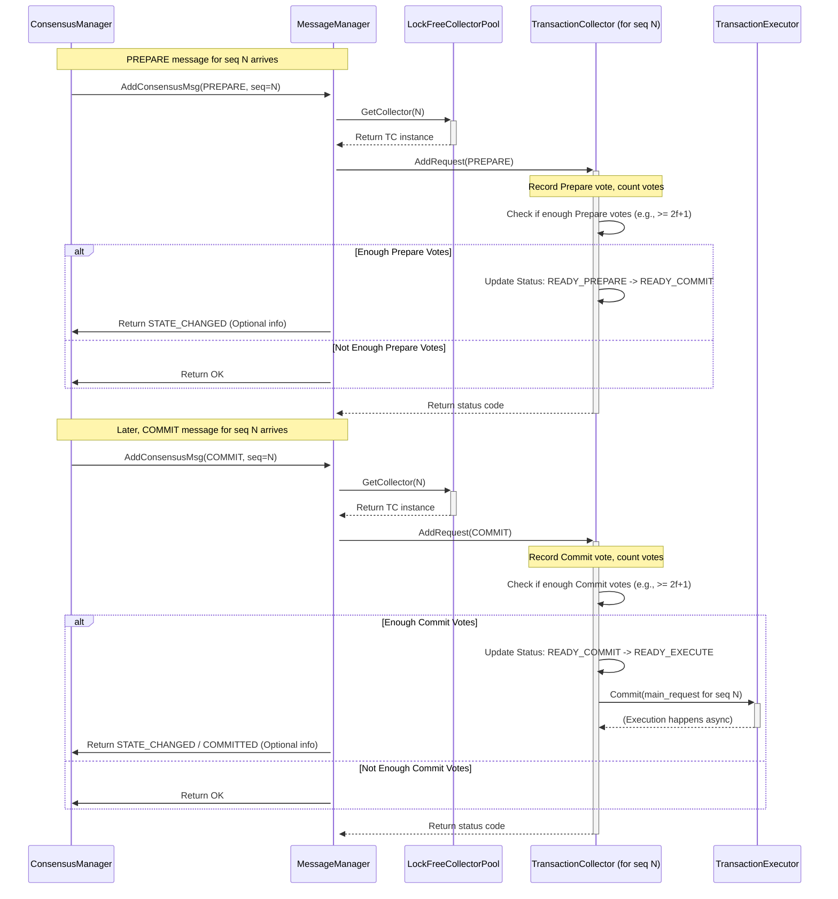

# Chapter 4: Message/Transaction Collection

In [Chapter 3: Consensus Management](03_consensus_management.md), we saw how the replicas in ResilientDB use a process like PBFT (Pre-Prepare, Prepare, Commit) to agree on the order of transactions. This involves a _lot_ of messages flying back and forth between replicas for _each_ transaction!

Imagine dozens of transactions being processed concurrently. For transaction #51, Replica A needs to collect Prepare votes. For transaction #52, it might be collecting Commit votes. For transaction #53, it just received the Pre-Prepare proposal. How does a replica keep track of all these different messages for all these different transactions without getting confused?

Welcome to Chapter 4! We'll explore the components responsible for organizing this potential chaos: **Message/Transaction Collection**, primarily handled by `TransactionCollector` and `MessageManager`.

## The Challenge: Organizing Consensus Messages

Think about the PBFT process from Chapter 3:

1.  A **Pre-Prepare** message arrives for sequence number `N`.
2.  Multiple **Prepare** messages arrive for sequence number `N` (hopefully agreeing on the same proposal).
3.  Multiple **Commit** messages arrive for sequence number `N`.

Each replica needs to:

- Group all messages related to the _same_ sequence number `N`.
- Count how many `Prepare` messages it has received for `N`.
- Count how many `Commit` messages it has received for `N`.
- Determine when _enough_ messages (`2f+1`) of a certain type have arrived to move to the next stage (e.g., from Prepared to Committed).
- Finally, trigger the execution of the transaction for sequence `N` once it's fully confirmed (Committed).

Doing this efficiently for potentially thousands of transactions simultaneously requires a dedicated system.

## Meet the Organizers: `TransactionCollector` and `MessageManager`

ResilientDB uses two main components for this task:

1.  **`TransactionCollector`:** The **Project Manager** for a Single Transaction.

    - **Job:** Manages the lifecycle of _one specific transaction sequence number_.
    - **Analogy:** Imagine a project manager assigned to build _one specific feature_ (e.g., "Add Login Button"). They collect all approvals (Prepare/Commit messages) related _only_ to that feature from different team members (replicas).
    - **Function:** Stores the initial proposal (Pre-Prepare), collects incoming Prepare and Commit messages for its sequence number, counts them, tracks the consensus state (e.g., None -> ReadyPrepare -> ReadyCommit -> ReadyExecute -> Executed), and holds onto the messages as potential proof.

2.  **`MessageManager`:** The **Department Head** Overseeing All Projects.
    - **Job:** Manages the _entire collection_ of `TransactionCollector` instances.
    - **Analogy:** This is like the head of the project management department. When a new approval form (consensus message) comes in, the department head looks at which project (sequence number) it belongs to and forwards it to the correct project manager (`TransactionCollector`). They also coordinate the start of new projects (assigning sequence numbers) and signal when a project is truly finished and ready for launch (triggering execution).
    - **Function:** Receives incoming consensus messages from the [Consensus Manager](03_consensus_management__consensusmanager_.md), finds the appropriate `TransactionCollector` for the message's sequence number (often using a helper like `LockFreeCollectorPool`), passes the message to that collector, and interfaces with the [Transaction Execution](05_transaction_execution__transactionmanager___transactionexecutor_.md) layer to commit finalized transactions. It also assigns new sequence numbers for client requests.

Together, `MessageManager` routes the incoming messages, and `TransactionCollector` does the detailed work of counting and state tracking for each individual transaction sequence.

## How It Works: Following a Transaction's Messages

Let's trace how messages for a specific transaction (say, sequence number `N=100`) are handled:

**Scenario:** Replica A is processing transaction `N=100`.

1.  **Pre-Prepare Arrives:**

    - The `PRE-PREPARE` message for `seq=100` arrives at Replica A via the [Network Communication](02_network_communication__replicacommunicator___servicenetwork_.md) layer.
    - It's passed to the [Consensus Manager](03_consensus_management__consensusmanager_.md).
    - The `ConsensusManager` calls `MessageManager::AddConsensusMsg` with the message.

2.  **MessageManager Finds the Collector:**

    - `MessageManager` needs the `TransactionCollector` responsible for `seq=100`. It likely uses a helper `LockFreeCollectorPool`.
    - `LockFreeCollectorPool::GetCollector(100)` calculates an index (e.g., `100 % pool_size`) and returns a pointer to the correct `TransactionCollector` instance.

    ```cpp
    // Simplified from platform/consensus/ordering/pbft/lock_free_collector_pool.cpp
    TransactionCollector* LockFreeCollectorPool::GetCollector(uint64_t seq) {
      // 'mask_' is related to the pool size (a power of 2)
      // This efficiently calculates 'seq % pool_size'
      uint32_t idx = seq & mask_;
      // 'collector_' is a vector of TransactionCollector unique_ptrs
      return collector_[idx].get();
    }
    ```

    - This code quickly finds the right collector using bitwise math, which is faster than division.

3.  **TransactionCollector Adds Pre-Prepare:**

    - `MessageManager` calls `TransactionCollector::AddRequest` on the collector for `seq=100`, passing the `PRE-PREPARE` message.
    - `TransactionCollector` stores this as the "main request" for `seq=100`.
    - It updates its internal state, potentially moving from `None` to `READY_PREPARE`.

    ```cpp
    // Simplified from platform/consensus/ordering/pbft/transaction_collector.cpp
    int TransactionCollector::AddRequest(
        std::unique_ptr<Request> request, const SignatureInfo& signature,
        bool is_main_request,
        /* ... callback function ... */) {

      if (/* request invalid or already committed */) return -2;
      if (seq_ != request->seq()) return -2; // Check sequence number match

      if (is_main_request) { // This is the PRE-PREPARE
        // Store the main request atomically (simplified here)
        main_request_ = std::move(request);
        main_request_signature_ = signature;
        // Update status via callback or directly
        MaybeUpdateStatus(Request::TYPE_PRE_PREPARE, 1);
        return 0;
      } else {
        // ... Handle PREPARE / COMMIT (see below) ...
      }
      return 0; // Default success
    }
    ```

    - This simplified code checks sequence numbers and stores the main proposal.

4.  **Prepare Messages Arrive:**

    - Several `PREPARE` messages for `seq=100` arrive from other replicas.
    - Each goes through `MessageManager::AddConsensusMsg` -> `LockFreeCollectorPool::GetCollector(100)` -> `TransactionCollector::AddRequest`.
    - Inside `AddRequest` (the `else` branch now):
      - The `TransactionCollector` increments a counter for `PREPARE` messages received for the _specific hash_ of the proposal. It often uses a bitset to track _which_ replicas sent a Prepare.
      - It calls a helper function (or a callback passed by `MessageManager`) to check if the state should change.

    ```cpp
    // Simplified continuation of TransactionCollector::AddRequest
    else { // Handle PREPARE or COMMIT
        std::string hash = request->hash();
        int type = request->type();
        int sender_id = request->sender_id();

        // Record that this sender sent this type of message for this hash
        // (Using a map and bitset, simplified logic here)
        received_messages_[type][hash].insert(sender_id);
        int current_count = received_messages_[type][hash].size();

        // Store the message itself for potential proof
        if (type == Request::TYPE_PREPARE) {
             StorePrepareProof(request, signature); // Simplified function call
        }

        // Check if enough messages arrived to change state
        MaybeUpdateStatus(type, current_count);

        // If status became READY_EXECUTE, trigger commit
        if (status_.load() == TransactionStatue::READY_EXECUTE) {
            Commit();
            return 1; // Indicate commit triggered
        }
        return 0;
    }
    ```

5.  **TransactionCollector Updates State (Prepare -> Commit):**

    - The `MaybeUpdateStatus` function (or callback) checks: "Is the current status `READY_PREPARE` AND have we received enough (`>= 2f+1`) `PREPARE` messages?"
    - If yes, it atomically updates the `status_` from `READY_PREPARE` to `READY_COMMIT`.
    - The `TransactionCollector` is now considered "Prepared" for `seq=100`.

6.  **Commit Messages Arrive:**

    - `COMMIT` messages for `seq=100` arrive and are routed to the same `TransactionCollector`.
    - `AddRequest` counts them similarly.

7.  **TransactionCollector Updates State (Commit -> Execute):**

    - `MaybeUpdateStatus` checks: "Is the current status `READY_COMMIT` AND have we received enough (`>= 2f+1`) `COMMIT` messages?"
    - If yes, it atomically updates the `status_` to `READY_EXECUTE`.

8.  **TransactionCollector Triggers Execution:**

    - Detecting the transition to `READY_EXECUTE`, the `AddRequest` logic calls `TransactionCollector::Commit()`.
    - `Commit()` performs final checks and then calls the `TransactionExecutor` (provided during setup) to actually execute the transaction associated with the main request.

    ```cpp
    // Simplified from platform/consensus/ordering/pbft/transaction_collector.cpp
    int TransactionCollector::Commit() {
      // Atomically change status from READY_EXECUTE to EXECUTED
      TransactionStatue expected = TransactionStatue::READY_EXECUTE;
      if (!status_.compare_exchange_strong(expected, TransactionStatue::EXECUTED)) {
        return -2; // Already executed or wrong state
      }

      // Mark as committed internally
      is_committed_ = true;

      // If an executor was provided and we have the main request...
      if (executor_ && main_request_) {
        // Tell the executor to commit this request
        executor_->Commit(std::move(main_request_));
      }
      return 0; // Success
    }
    ```

    - This function ensures the transaction is executed only once by atomically changing the state and then passes the request to the [Transaction Execution](05_transaction_execution__transactionmanager___transactionexecutor_.md) layer.

**Visualization:**



This diagram shows how `MessageManager` acts as the router, `TransactionCollector` does the counting and state management for a specific sequence number, and finally triggers the `TransactionExecutor`.

## Under the Hood: `MessageManager` and `LockFreeCollectorPool`

The `MessageManager` is initialized with the system configuration, a `TransactionManager` (for execution logic), a `CheckPointManager`, and system info. Crucially, it creates the `TransactionExecutor` and the `LockFreeCollectorPool`.

```cpp
// Simplified from platform/consensus/ordering/pbft/message_manager.cpp
MessageManager::MessageManager(
    const ResDBConfig& config,
    std::unique_ptr<TransactionManager> transaction_manager,
    /* ... other managers ... */)
    : config_(config),
      // ... other initializations ...
      transaction_executor_(std::make_unique<TransactionExecutor>(
          config, /* callback for responses */, /* ... */)),
      collector_pool_(std::make_unique<LockFreeCollectorPool>(
          "txn_collector_pool", config.GetMaxProcessTxn(), // Pool name and size
          transaction_executor_.get(), // Pass executor to collectors
          config.GetConfigData().enable_viewchange())) // Config flag
{
    // ... setup callbacks, like telling pool to update when seq advances ...
    LOG(INFO) << "MessageManager initialized.";
}
```

The `LockFreeCollectorPool` creates a vector of `TransactionCollector` objects. The size is typically a power of two, allowing for efficient indexing using bitwise AND (`& mask_`). It uses a clever trick: the vector size is actually _twice_ the conceptual capacity. When sequence number `seq` is finalized, the pool proactively re-initializes the collector at index `(seq % capacity) + capacity` to be ready for sequence number `seq + capacity`. This avoids needing locks when switching collectors for sequence numbers.

```cpp
// Simplified from platform/consensus/ordering/pbft/lock_free_collector_pool.cpp
LockFreeCollectorPool::LockFreeCollectorPool(const std::string& name,
                                             uint32_t size, // Max concurrent txns
                                             TransactionExecutor* executor,
                                             bool enable_viewchange)
    : capacity_(/* Calculate next power of 2 >= size*2 */),
      mask_(capacity_ - 1), // For efficient modulo
      executor_(executor)
{
  // Create 2 * capacity collectors!
  collector_.resize(capacity_ * 2);
  for (size_t i = 0; i < (capacity_ * 2); ++i) {
    // Initialize each collector for its future sequence number
    collector_[i] = std::make_unique<TransactionCollector>(i, executor, /*...*/);
  }
}

// Called when 'seq' is committed, prepares the slot for 'seq + capacity'
void LockFreeCollectorPool::Update(uint64_t seq) {
  uint32_t current_idx = seq & mask_;
  uint32_t next_idx = current_idx ^ capacity_; // The 'twin' slot
  uint64_t future_seq = seq + capacity_;

  // Re-create the collector in the twin slot for the future sequence number
  collector_[next_idx] = std::make_unique<TransactionCollector>(
      future_seq, executor_, /*...*/);
}
```

This pooling mechanism allows `MessageManager` to quickly find the right `TransactionCollector` for any given sequence number within its processing window.

## Conclusion

You've now explored the vital organizational layer of ResilientDB's consensus process!

- We learned that during consensus, many messages (`PRE-PREPARE`, `PREPARE`, `COMMIT`) are exchanged for each transaction.
- The **`TransactionCollector`** acts like a dedicated **project manager** for a _single transaction sequence number_. It gathers related messages, counts them, tracks the consensus state (ReadyPrepare, ReadyCommit, ReadyExecute), and holds proof.
- The **`MessageManager`** acts as the **department head**, overseeing all `TransactionCollector`s. It routes incoming consensus messages to the correct collector (using `LockFreeCollectorPool`) and triggers the final execution step.
- This system efficiently manages the flow of messages, ensuring that transactions proceed through the consensus stages correctly and are executed only when fully agreed upon.

Now that we understand how transactions are proposed ([Chapter 1](01_client_interaction__kvclient___utxoclient___contractclient___transactionconstructor_.md)), communicated ([Chapter 2](02_network_communication__replicacommunicator___servicenetwork_.md)), agreed upon ([Chapter 3](03_consensus_management__consensusmanager_.md)), and collected ([Chapter 4](04_message_transaction_collection__transactioncollector___messagemanager_.md)), what happens when a transaction is finally marked `READY_EXECUTE`? How is the actual work (like changing data in the database) performed?

That's the focus of our next chapter!

**Next:** [Chapter 5: Transaction Execution](05_transaction_execution.md)

---

Generated by [AI Codebase Knowledge Builder](https://github.com/The-Pocket/Tutorial-Codebase-Knowledge)
