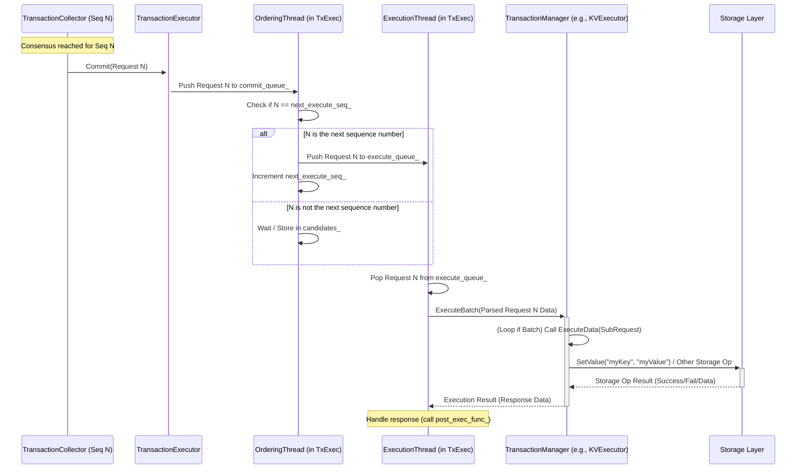

# Chapter 5: Transaction Execution

In the previous chapter, [Chapter 4: Message/Transaction Collection](04_message_transaction_collection.md), we saw how ResilientDB meticulously collects and organizes all the messages related to a specific transaction until consensus is reached and the transaction is declared `READY_EXECUTE`. It's like all the managers have finally approved an important company decision (like purchasing new equipment).

But approval is just one step! Someone actually needs to _act_ on that decision – place the order, update the inventory, and record the purchase in the company's books. Similarly, once ResilientDB replicas agree on a transaction (e.g., "Store the key 'UserScore' with the value '1000'"), something needs to actually _perform_ that change in the database state.

Welcome to Chapter 5! We'll explore the **Transaction Execution** layer. This is where the agreed-upon transactions meet the actual database, making the changes permanent.

## The Need for Execution: Making Changes Happen

Imagine ResilientDB is a shared, super-secure accounting ledger run by a committee (the replicas).

- A user submits an invoice (a transaction request, see [Chapter 1](01_client_interaction__kvclient___utxoclient___contractclient___transactionconstructor_.md)).
- The committee discusses and votes until they agree the invoice is valid and in the correct order (consensus, [Chapter 3](03_consensus_management__consensusmanager_.md)).
- The approved invoice is carefully filed and tracked ([Chapter 4](04_message_transaction_collection__transactioncollector___messagemanager_.md)).

Now what? The ledger hasn't actually been updated yet! We need an **accountant** to take the approved invoice and officially record the transaction in the ledger (the database state). This "accountant" role is played by the Transaction Execution layer.

This layer ensures that:

1.  Transactions are executed in the exact order determined by consensus.
2.  The correct logic is applied based on the _type_ of transaction (e.g., updating a key-value store is different from transferring a digital token).
3.  The database state accurately reflects the history of agreed-upon operations.

## Meet the Execution Team: `TransactionExecutor` and `TransactionManager`

Two key components work together to handle execution:

1.  **`TransactionExecutor`:** The **Execution Coordinator**.

    - **Job:** Receives the finalized, ordered transactions from the consensus/collection layer ([Chapter 4](04_message_transaction_collection__transactioncollector___messagemanager_.md)). It manages the flow, ensuring transactions are executed sequentially (or sometimes out-of-order if configured) and handles sending responses back.
    - **Analogy:** Think of this as the **accounting department head**. They receive the approved invoices from management, ensure they are processed in the right order (by sequence number), and pass them to the right specialist accountant. They also coordinate sending confirmation receipts (responses) back.
    - **Function:** Takes committed `Request` objects, puts them in an internal queue, orders them strictly by sequence number, and calls upon a `TransactionManager` to perform the actual work for each transaction. It also handles notifying other parts of the system about progress.

2.  **`TransactionManager`:** The **Execution Specialist**.
    - **Job:** Defines _how_ to execute a specific _type_ of transaction. ResilientDB supports different data models (Key-Value, UTXO, Smart Contracts), and each needs different execution logic. `TransactionManager` is an _abstract base class_ (like a job description template), and specific implementations handle the details.
    - **Analogy:** This is the **specialist accountant**. One accountant might handle Accounts Payable (like KV Set/Get), another handles Payroll (like UTXO transfers), and another handles complex project budgets (like Smart Contracts). Each knows the specific rules for their domain.
    - **Function:** Provides the concrete `ExecuteBatch` or `ExecuteData` method that the `TransactionExecutor` calls. Implementations like `KVExecutor`, `UTXOExecutor`, and `ContractTransactionManager` inherit from `TransactionManager` and contain the logic to interact with the underlying storage or state for their specific data type.

The `TransactionExecutor` coordinates _when_ to execute, while the specific `TransactionManager` implementation decides _how_ to execute.

## How It Works: Executing a Key-Value Transaction

Let's follow a simple `Set("myKey", "myValue")` transaction after it has been agreed upon by consensus (sequence number `N=101`) and marked `READY_EXECUTE` by the `TransactionCollector` from [Chapter 4](04_message_transaction_collection__transactioncollector___messagemanager_.md).

1.  **Commit Trigger:** The `TransactionCollector` for sequence `101` calls `TransactionExecutor::Commit(request_101)`.

    ```cpp
    // Inside TransactionCollector::Commit() - simplified
    // (from platform/consensus/ordering/pbft/transaction_collector.cpp)
    if (executor_ && main_request_) {
        // Pass the main request (containing the Set command) to the executor
        executor_->Commit(std::move(main_request_));
    }
    ```

    This hands off the approved transaction to the execution coordinator.

2.  **Executor Enqueues:** `TransactionExecutor::Commit` receives `request_101` and pushes it onto an internal queue (`commit_queue_`) waiting to be ordered.

    ```cpp
    // Inside TransactionExecutor::Commit() - simplified
    // (from platform/consensus/execution/transaction_executor.cpp)
    int TransactionExecutor::Commit(std::unique_ptr<Request> message) {
      global_stats_->IncPendingExecute();
      // ... (potential handling for out-of-order execution) ...
      commit_queue_.Push(std::move(message)); // Add to the ordering queue
      return 0;
    }
    ```

3.  **Ordering Thread:** A background thread (`ordering_thread_`) in `TransactionExecutor` monitors `commit_queue_`. It pulls `request_101`. It checks if `101` is the _next expected sequence number_ (`next_execute_seq_`). If `next_execute_seq_` is indeed `101`, the thread moves `request_101` to another queue (`execute_queue_`) and increments `next_execute_seq_` to `102`. (If `101` arrived but `next_execute_seq_` was still `100`, it would wait.)

    ```cpp
    // Inside TransactionExecutor::OrderMessage() - simplified logic
    // (from platform/consensus/execution/transaction_executor.cpp)
    while (!IsStop()) {
        auto message = commit_queue_.Pop(); // Get from commit queue
        if (message != nullptr) {
            if (next_execute_seq_ > message->seq()) continue; // Already done
            AddNewData(std::move(message)); // Add to pending candidates map
        }
        // Check if the next expected message is in candidates
        std::unique_ptr<Request> next_message = GetNextData();
        if (next_message != nullptr) { // Found the next one!
            execute_queue_.Push(std::move(next_message)); // Push to execute queue
            next_execute_seq_++; // Expect the following sequence number now
            // ... (notify others about sequence update) ...
        }
        // ... (loop/wait) ...
    }
    ```

4.  **Execution Thread:** Another background thread (`execute_thread_`) monitors `execute_queue_`. It pulls `request_101`.

5.  **Executor Calls Manager:** The `execute_thread_` calls `TransactionExecutor::Execute(request_101)`. Inside `Execute`, it parses the raw data from the request into a `BatchUserRequest` (which might contain multiple client sub-requests). Crucially, it then calls the `ExecuteBatch` method of the configured `TransactionManager`.

    ```cpp
    // Inside TransactionExecutor::Execute() - simplified
    // (from platform/consensus/execution/transaction_executor.cpp)
    void TransactionExecutor::Execute(std::unique_ptr<Request> request,
                                      bool need_execute /*= true*/) {
      BatchUserRequest batch_request; // Contains one or more client ops
      if (!batch_request.ParseFromString(request->data())) { /* error */ }
      // ... copy seq, hash etc. from request to batch_request ...

      std::unique_ptr<BatchUserResponse> response;
      if (transaction_manager_ && need_execute) {
          // *** Call the configured TransactionManager ***
          response = transaction_manager_->ExecuteBatch(batch_request);
      }
      // ... handle response, call post_exec_func_ ...
      global_stats_->IncExecuteDone();
    }
    ```

6.  **Manager Delegates (KVExecutor):** The `transaction_manager_` pointer in `TransactionExecutor` actually points to a specific implementation, like `KVExecutor`. The base `TransactionManager::ExecuteBatch` often just loops through sub-requests and calls `ExecuteData`. The _derived_ class (`KVExecutor`) provides the real logic for `ExecuteData`.

    ```cpp
    // Base class default implementation
    // (from executor/common/transaction_manager.cpp)
    std::unique_ptr<BatchUserResponse> TransactionManager::ExecuteBatch(
        const BatchUserRequest& request) {
      auto batch_response = std::make_unique<BatchUserResponse>();
      for (auto& sub_request : request.user_requests()) {
          // Call the virtual ExecuteData method for each sub-request
          std::unique_ptr<std::string> response =
              ExecuteData(sub_request.request().data());
          // ... add response to batch_response ...
      }
      return batch_response;
    }
    ```

7.  **KVExecutor Executes:** `KVExecutor::ExecuteData` is called with the data for the `Set("myKey", "myValue")` operation. It parses this data into a `KVRequest`. It checks the command (`KVRequest::SET`) and calls its internal `Set` method.

    ```cpp
    // Inside KVExecutor::ExecuteData() - simplified
    // (from executor/kv/kv_executor.cpp)
    std::unique_ptr<std::string> KVExecutor::ExecuteData(
        const std::string& request_data) {
      KVRequest kv_request;
      KVResponse kv_response;
      if (!kv_request.ParseFromString(request_data)) { /* error */ return nullptr; }

      if (kv_request.cmd() == KVRequest::SET) {
          // Call the internal method to handle SET
          Set(kv_request.key(), kv_request.value());
      } else if (kv_request.cmd() == KVRequest::GET) {
          // ... handle GET ...
      } // ... other commands ...

      // ... package kv_response into string ...
      return resp_str;
    }
    ```

8.  **KVExecutor Interacts with Storage:** The `KVExecutor::Set` method interacts with the underlying `Storage` layer ([Chapter 6](06_storage_layer__storage___leveldb___memorydb_.md)) to actually write the key-value pair.

    ```cpp
    // Inside KVExecutor::Set() - simplified
    // (from executor/kv/kv_executor.cpp)
    void KVExecutor::Set(const std::string& key, const std::string& value) {
      // Call the storage layer to perform the write
      storage_->SetValue(key, value);
    }
    ```

9.  **Response:** The result (success/failure, or data for a `GET`) bubbles back up. `TransactionExecutor` receives the `BatchUserResponse` and uses its `post_exec_func_` callback to potentially send a reply back to the original client proxy or perform other actions.

## Visualizing the Flow

Here's a simplified sequence diagram showing the execution of sequence number `N`:



This diagram shows the handoff from collection (`TC`) to the executor (`TxExec`), the internal ordering and execution threads, the call to the specific manager (`TxMgr`), and the final interaction with the `Storage` layer.

## Different Specialists: `KVExecutor`, `UTXOExecutor`, `ContractExecutor`

ResilientDB uses the `TransactionManager` interface to support different application types. Each inherits from the base `TransactionManager` and provides its own `ExecuteData` or `ExecuteBatch` logic:

- **`KVExecutor` (`executor/kv/kv_executor.h`, `.cpp`):**

  - Handles Key-Value operations (`SET`, `GET`, `GETRANGE`, etc.).
  - Parses `KVRequest`.
  - Interacts with `Storage` using methods like `SetValue`, `GetValue`.

  ```cpp
  // From executor/kv/kv_executor.h
  class KVExecutor : public TransactionManager {
   public:
    KVExecutor(std::unique_ptr<Storage> storage);
    std::unique_ptr<std::string> ExecuteData(const std::string& request) override;
    // ... other methods ...
   private:
    std::unique_ptr<Storage> storage_; // Holds the storage implementation
  };
  ```

- **`UTXOExecutor` (`executor/utxo/executor/utxo_executor.h`, `.cpp`):**

  - Handles transactions based on the Unspent Transaction Output model (like Bitcoin).
  - Parses `UTXORequest`.
  - Interacts with specialized UTXO managers (`Transaction`, `Wallet`) which likely use the `Storage` layer underneath.

  ```cpp
  // From executor/utxo/executor/utxo_executor.h
  class UTXOExecutor : public TransactionManager {
   public:
    UTXOExecutor(const Config& config, Transaction* transaction, Wallet* wallet);
    std::unique_ptr<std::string> ExecuteData(const std::string& request) override;
   private:
    Transaction* transaction_; // Manages UTXO transaction logic
  };
  ```

- **`ContractTransactionManager` (`executor/contract/executor/contract_executor.h`, `.cpp`):**

  - Handles deploying and executing smart contracts.
  - Parses `contract::Request`.
  - Interacts with `ContractManager` and `AddressManager` to manage contract state and execution environments (like WASM).

  ```cpp
  // From executor/contract/executor/contract_executor.h
  class ContractTransactionManager : public TransactionManager {
   public:
    ContractTransactionManager(void);
    std::unique_ptr<std::string> ExecuteData(const std::string& request) override;
    // ... other methods ...
   private:
    std::unique_ptr<ContractManager> contract_manager_; // Manages contract logic
    std::unique_ptr<AddressManager> address_manager_; // Manages addresses
  };
  ```

The beauty of this design is that the `TransactionExecutor` doesn't need to know the specifics of KV, UTXO, or Contracts. It just needs a `TransactionManager` object and calls its standard `ExecuteBatch` method. The specific implementation handles the rest. This is configured when ResilientDB starts, based on the desired mode of operation (see [Chapter 8: ResilientDB Configuration (ResDBConfig)](08_resilientdb_configuration__resdbconfig_.md)).

## Conclusion

You've now seen how ResilientDB takes transactions that have been agreed upon and actually applies their changes to the database state!

- We learned that the **`TransactionExecutor`** acts as the **coordinator**, receiving committed transactions, ensuring they execute in the correct order (using sequence numbers), and managing the overall execution flow.
- We met the **`TransactionManager`** interface and its specific implementations (`KVExecutor`, `UTXOExecutor`, `ContractTransactionManager`) which act as **specialists**, knowing _how_ to execute different types of transactions (Key-Value, UTXO, Smart Contract).
- We traced the journey of a transaction from the `Commit` call in `TransactionCollector` through the internal queues and threads of `TransactionExecutor`, finally reaching the specific `TransactionManager` logic that updates the state.

The `TransactionManager` implementations like `KVExecutor` rely heavily on an underlying mechanism to actually store and retrieve the data persistently. How does ResilientDB handle saving data to disk or memory reliably? That's the topic of our next chapter, where we'll explore the Storage Layer!

**Next:** [Chapter 6: Storage Layer](06_storage_layer.md)

---

Generated by [AI Codebase Knowledge Builder](https://github.com/The-Pocket/Tutorial-Codebase-Knowledge)
