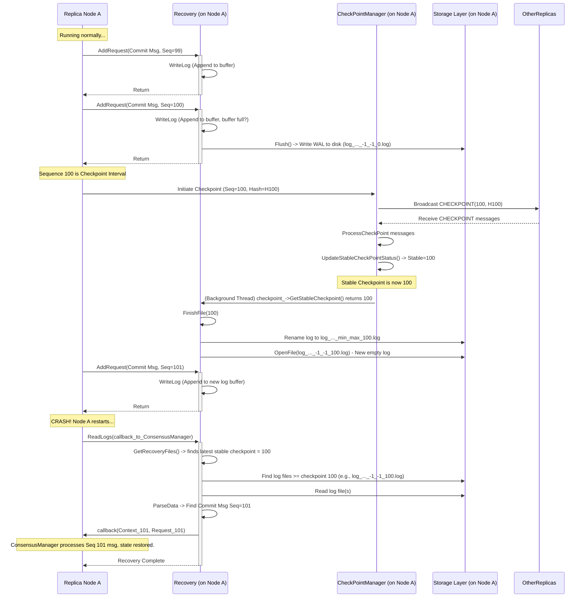

<!--
  ~ Licensed to the Apache Software Foundation (ASF) under one
  ~ or more contributor license agreements.  See the NOTICE file
  ~ distributed with this work for additional information
  ~ regarding copyright ownership.  The ASF licenses this file
  ~ to you under the Apache License, Version 2.0 (the
  ~ "License"); you may not use this file except in compliance
  ~ with the License.  You may obtain a copy of the License at
  ~
  ~   http://www.apache.org/licenses/LICENSE-2.0
  ~
  ~ Unless required by applicable law or agreed to in writing,
  ~ software distributed under the License is distributed on an
  ~ "AS IS" BASIS, WITHOUT WARRANTIES OR CONDITIONS OF ANY
  ~ KIND, either express or implied.  See the License for the
  ~ specific language governing permissions and limitations
  ~ under the License.
-->

---
layout: default
title: 'Chapter 7: Checkpointing & Recovery'
parent: 'ResilientDB'
nav_order: 7
---

# Chapter 7: Checkpointing & Recovery

In the previous chapter, [Chapter 6: Storage Layer)](06_storage_layer.md), we learned how ResilientDB actually saves data using components like `ResLevelDB` (for disk storage) or `MemoryDB` (for memory storage). This ensures that when we execute a transaction like `Set("myKey", "myValue")`, the change is recorded.

But what happens if a replica (one of the computers running ResilientDB) suddenly crashes or needs to be restarted? When it comes back online, how does it catch up with all the transactions it missed? Simply replaying _every single transaction_ from the very beginning could take a very long time, especially if the system has been running for weeks or months! Also, the log of all past messages ([Chapter 4](04_message_transaction_collection__transactioncollector___messagemanager_.md)) would grow forever, eventually filling up the disk.

Welcome to Chapter 7! We'll explore how ResilientDB solves these problems using **Checkpointing and Recovery**.

Think of it like playing a long video game:

- You wouldn't want to restart from the very beginning every time you stop playing. You **save your progress** periodically (this is **Checkpointing**).
- If the game crashes, you can load your last save game and maybe replay just the last few actions you took before the crash (this is **Recovery**).

ResilientDB uses two main components for this:

1.  `CheckPointManager`: Coordinates taking periodic "save points" (checkpoints) of the database state that all replicas agree on.
2.  `Recovery`: Manages writing down important actions (like consensus messages) into a journal (log file) and uses these logs along with checkpoints to restore a node's state after a restart.

## Why Checkpointing and Recovery?

1.  **Prevent Infinite Logs:** The consensus process ([Chapter 3](03_consensus_management__consensusmanager_.md)) generates many messages (Pre-Prepare, Prepare, Commit) for each transaction. Storing all these messages forever would consume huge amounts of disk space. Checkpointing allows replicas to agree that "we all know the state up to transaction #1,000,000 is correct," so they can safely delete older messages and log entries before that point.
2.  **Speed Up Recovery:** If a node crashes and restarts, loading the latest agreed-upon checkpoint is much faster than re-processing every transaction from the beginning. The node only needs to replay the transactions and messages that occurred _after_ the last checkpoint using the recovery logs.

**Analogy:** Imagine taking meeting minutes. Instead of keeping one massive document with every word ever spoken, you periodically summarize the key decisions and outcomes (a checkpoint). If someone joins late, they can read the latest summary and then catch up on the discussion since that summary (recovery log) instead of reading the entire history.

## Meet the Save Game Coordinator: `CheckPointManager`

The `CheckPointManager` is responsible for orchestrating the process of creating these agreed-upon save points, called **stable checkpoints**.

**Key Jobs:**

1.  **Initiate Checkpoints:** At regular intervals (e.g., every `N` transactions, defined by `CheckPointWaterMark` in the configuration), it calculates a "fingerprint" (a hash) of the current database state.
2.  **Exchange Proofs:** It broadcasts this hash in a `CHECKPOINT` message to other replicas. It also collects `CHECKPOINT` messages from others.
3.  **Determine Stability:** It checks if enough replicas (`2f+1`) have sent `CHECKPOINT` messages agreeing on the _same hash_ for the _same sequence number_.
4.  **Announce Stable Checkpoint:** Once agreement is reached, it declares that sequence number as the new `StableCheckpoint`. This is the "save point" everyone agrees on.
5.  **Inform Others:** It provides the latest stable checkpoint number (`GetStableCheckpoint`) to other components like `Recovery` so they know which old logs can be cleaned up.

**Analogy:** The `CheckPointManager` is like the game asking all players, "Everyone agrees we've reached Level 5 with 1000 gold, right? Send proof!" Once enough players send proof confirming the same state, the game declares "Level 5, 1000 gold" as an official save point.

## How Checkpointing Works (Simplified)

Let's say the checkpoint interval (`CheckPointWaterMark`) is 100 sequences.

1.  **Reach Checkpoint Sequence:** Transactions are executed, and the system reaches sequence number 100.
2.  **Calculate Hash:** Each replica's `CheckPointManager` calculates a hash representing the state after executing transaction 100.
3.  **Broadcast Checkpoint Message:** Each replica broadcasts a `CHECKPOINT` message containing `seq=100` and its calculated `hash`.

    ```cpp
    // Simplified from platform/consensus/ordering/pbft/checkpoint_manager.cpp
    void CheckPointManager::BroadcastCheckPoint(uint64_t seq, const std::string& hash, ...) {
      CheckPointData checkpoint_data;
      // Create a Request message of type CHECKPOINT
      std::unique_ptr<Request> checkpoint_request = NewRequest(
          Request::TYPE_CHECKPOINT, Request(), config_.GetSelfInfo().id());

      checkpoint_data.set_seq(seq); // Set the sequence number (e.g., 100)
      checkpoint_data.set_hash(hash); // Set the calculated state hash

      // Add a digital signature to prove it's from this replica
      if (verifier_) {
        // ... sign the hash ...
        *checkpoint_data.mutable_hash_signature() = signature;
      }

      // Put the checkpoint data into the Request message
      checkpoint_data.SerializeToString(checkpoint_request->mutable_data());
      // Send it to all other replicas
      replica_communicator_->BroadCast(*checkpoint_request);
    }
    ```

    This function creates the `CHECKPOINT` message, including the sequence number and hash, signs it, and broadcasts it using the `ReplicaCommunicator` from [Chapter 2](02_network_communication__replicacommunicator___servicenetwork_.md).

4.  **Process Incoming Checkpoints:** Each `CheckPointManager` receives `CHECKPOINT` messages from others via its `ProcessCheckPoint` method.

    ```cpp
    // Simplified from platform/consensus/ordering/pbft/checkpoint_manager.cpp
    int CheckPointManager::ProcessCheckPoint(std::unique_ptr<Context> context,
                                             std::unique_ptr<Request> request) {
      CheckPointData checkpoint_data;
      if (!checkpoint_data.ParseFromString(request->data())) { /* error */ return -2; }

      uint64_t checkpoint_seq = checkpoint_data.seq(); // e.g., 100
      std::string received_hash = checkpoint_data.hash();
      uint32_t sender_id = request->sender_id();

      // Verify the signature on the message
      if (verifier_) {
         if (!verifier_->VerifyMessage(received_hash, checkpoint_data.hash_signature())) {
            LOG(ERROR) << "Invalid signature on checkpoint message";
            return -2;
         }
      }

      // Record that this sender sent this hash for this sequence number
      {
        std::lock_guard<std::mutex> lk(mutex_);
        // sender_ckpt_ is like: map<(seq, hash), set<sender_id>>
        auto key = std::make_pair(checkpoint_seq, received_hash);
        sender_ckpt_[key].insert(sender_id);
        // sign_ckpt_ stores the signatures for potential proof later
        sign_ckpt_[key].push_back(checkpoint_data.hash_signature());
        new_data_++; // Flag that new checkpoint data arrived
      }
      Notify(); // Wake up the stability checking thread
      return 0;
    }
    ```

    This function receives a `CHECKPOINT` message, validates it, and records which replica sent which hash for which sequence number.

5.  **Check for Stability:** A background thread (`UpdateStableCheckPointStatus`) periodically checks if any sequence number has received enough matching proofs.

    ```cpp
    // Simplified from platform/consensus/ordering/pbft/checkpoint_manager.cpp
    void CheckPointManager::UpdateStableCheckPointStatus() {
      while (!stop_) {
        // Wait until new checkpoint data arrives (or timeout)
        if (!Wait()) continue;

        uint64_t new_stable_seq = 0;
        std::string new_stable_hash;

        { // Lock to check the collected checkpoint data
          std::lock_guard<std::mutex> lk(mutex_);
          // Iterate through all (seq, hash) pairs we have seen
          for (auto const& [key, senders] : sender_ckpt_) {
             uint64_t seq = key.first;
             std::string hash = key.second;
             // Check if enough replicas sent this exact (seq, hash) pair
             if (senders.size() >= config_.GetMinDataReceiveNum()) { // MinDataReceiveNum is 2f+1
                 // Found a potentially stable checkpoint!
                 if (seq > new_stable_seq) { // Keep track of the highest one found
                      new_stable_seq = seq;
                      new_stable_hash = hash;
                 }
             }
          }
          new_data_ = 0; // Reset the new data flag
        } // Unlock

        // If we found a new stable checkpoint higher than the current one...
        if (current_stable_seq_ < new_stable_seq) {
          std::lock_guard<std::mutex> lk(mutex_);
          // Store the proof (signatures) for this stable checkpoint
          stable_ckpt_.set_seq(new_stable_seq);
          stable_ckpt_.set_hash(new_stable_hash);
          // ... copy signatures from sign_ckpt_ to stable_ckpt_ ...

          // Update the official stable checkpoint sequence number
          current_stable_seq_ = new_stable_seq;
          LOG(INFO) << "New stable checkpoint reached: " << current_stable_seq_;

          // Clean up old checkpoint data before this sequence number
          // ... remove entries from sender_ckpt_ and sign_ckpt_ ...
        }
        // UpdateStableCheckPointCallback(current_stable_seq_); // Notify others
      }
    }
    ```

    This thread checks the `sender_ckpt_` map. If it finds a `(seq, hash)` pair that has been confirmed by at least `2f+1` replicas, and this `seq` is higher than the current stable checkpoint, it updates `current_stable_seq_`.

6.  **Result:** `current_stable_seq_` now holds the sequence number of the latest agreed-upon save point (e.g., 100).

## Meet the Journal Keeper & Restorer: `Recovery`

The `Recovery` component handles two main jobs:

1.  **Write-Ahead Logging (Journaling):** It writes important consensus messages (`PRE-PREPARE`, `PREPARE`, `COMMIT`, sometimes others) to a log file _before_ they are fully processed. This is called a Write-Ahead Log (WAL). If the system crashes mid-operation, this log ensures we know what was happening.
2.  **State Restoration:** When a replica starts, the `Recovery` component reads the last known stable checkpoint (obtained from `CheckPointManager`) and then reads the WAL files _after_ that checkpoint. It replays the messages found in the WAL to bring the replica's consensus state back up to speed quickly.

**Analogy:** The `Recovery` component is like keeping a detailed diary (WAL) of every important step you take after your last game save (checkpoint). If the game crashes, you load the save, read your diary from that point onwards, and quickly re-do those steps to get back to where you were.

## How Recovery Works (Simplified)

**1. Logging Messages (Write-Ahead Log):**

The `ConsensusManager` passes relevant incoming consensus messages to `Recovery::AddRequest`.

```cpp
// Simplified from platform/consensus/recovery/recovery.cpp
void Recovery::AddRequest(const Context* context, const Request* request) {
  if (!recovery_enabled_) return; // Only log if enabled

  // Decide which message types are important enough to log for recovery
  switch (request->type()) {
    case Request::TYPE_PRE_PREPARE:
    case Request::TYPE_PREPARE:
    case Request::TYPE_COMMIT:
    // case Request::TYPE_CHECKPOINT: // Checkpoint messages might also be logged
      // If it's an important type, write it to the log file
      WriteLog(context, request);
      return;
    default:
      // Ignore other message types for logging purposes
      break;
  }
}

void Recovery::WriteLog(const Context* context, const Request* request) {
  std::string request_data;
  request->SerializeToString(&request_data); // Convert Request to string

  std::string signature_data;
  context->signature.SerializeToString(&signature_data); // Convert Signature to string

  std::unique_lock<std::mutex> lk(mutex_); // Protect buffer access
  // Track min/max sequence numbers seen in this log file (for file naming)
  // ... update min_seq_, max_seq_ ...

  // Append the length-prefixed data to an in-memory buffer first
  AppendData(request_data);
  AppendData(signature_data);

  // Maybe write the buffer to the actual disk file if it's full enough
  MayFlush();
}

void Recovery::AppendData(const std::string& data) {
  size_t len = data.size();
  // Write the length of the data first...
  buffer_.append(reinterpret_cast<const char*>(&len), sizeof(len));
  // ...then write the data itself.
  buffer_.append(data);
}

void Recovery::Flush() {
  // Actually write the buffered data to the log file on disk
  size_t len = buffer_.size();
  if (len == 0) return;

  // Write a marker indicating the size of the chunk being written
  Write(reinterpret_cast<const char*>(&len), sizeof(len));
  // Write the buffered data
  Write(reinterpret_cast<const char*>(buffer_.c_str()), len);
  buffer_.clear(); // Clear the memory buffer
  fsync(fd_); // Ensure data is physically written to disk
}
```

`AddRequest` filters messages. `WriteLog` serializes the message and its context (like the signature) and calls `AppendData`. `AppendData` adds the data (with its length) to a `buffer_`. `Flush` writes the buffer content to the current log file (`fd_`) on disk, prefixed by the total buffer size. This length prefixing helps when reading the log back later.

**2. Log File Management (Triggered by Checkpoints):**

The `Recovery` component has a background thread (`UpdateStableCheckPoint`) that periodically checks the latest stable checkpoint from `CheckPointManager`. When the stable checkpoint advances, it closes the current log file and renames it to include the checkpoint number, then starts a new empty log file. This keeps logs organized by checkpoint periods.

```cpp
// Simplified from platform/consensus/recovery/recovery.cpp
void Recovery::UpdateStableCheckPoint() {
  while (!stop_) {
    // Get the latest stable checkpoint number from CheckPointManager
    int64_t latest_ckpt = checkpoint_->GetStableCheckpoint();

    if (last_ckpt_ == latest_ckpt) {
      // No change, wait a while
      sleep(recovery_ckpt_time_s_);
      continue;
    }

    // Checkpoint advanced! Finish the current log file.
    last_ckpt_ = latest_ckpt;
    FinishFile(latest_ckpt);
  }
}

void Recovery::FinishFile(int64_t seq) {
  std::unique_lock<std::mutex> lk(mutex_);
  Flush(); // Write any remaining buffered data
  close(fd_); // Close the current log file descriptor

  // Generate a new name for the file, including the checkpoint seq
  // Example: log_time_minSeq_maxSeq_ckptSeq.log
  std::string final_file_path = GenerateFile(seq, min_seq_, max_seq_);

  // Rename the old log file to its final name
  std::rename(file_path_.c_str(), final_file_path.c_str());
  LOG(INFO) << "Finalized log file: " << final_file_path;

  // Reset sequence tracking for the new file
  min_seq_ = -1;
  max_seq_ = -1;

  // Generate the name for the *next* log file (doesn't include min/max yet)
  std::string next_file_path = GenerateFile(seq, -1, -1);
  file_path_ = next_file_path;

  // Open the new empty log file
  OpenFile(file_path_);
}
```

This ensures that log files are neatly packaged based on the stable checkpoints. `GenerateFile` creates filenames encoding the checkpoint sequence and the range of sequence numbers contained within.

**3. Replaying Logs on Restart:**

When a node starts up, the main consensus logic calls `Recovery::ReadLogs`.

```cpp
// Simplified from platform/consensus/recovery/recovery.cpp
void Recovery::ReadLogs(
    std::function<void(const SystemInfoData& data)> system_callback, // For system info
    std::function<void(std::unique_ptr<Context> context, // Callback to replay
                       std::unique_ptr<Request> request)> call_back)
{
  if (!recovery_enabled_) return;

  std::unique_lock<std::mutex> lk(mutex_); // Protect file access

  // 1. Find relevant log files (based on the latest stable checkpoint)
  auto recovery_files_pair = GetRecoveryFiles();
  int64_t last_stable_ckpt = recovery_files_pair.second;
  LOG(INFO) << "Starting recovery from stable checkpoint: " << last_stable_ckpt;

  // 2. Iterate through the identified log files (sorted by time)
  int idx = 0;
  for (auto path_pair : recovery_files_pair.first) {
    const std::string& path = path_pair.second;
    // Read messages from this specific file, only processing those AFTER the checkpoint
    ReadLogsFromFiles(path, last_stable_ckpt, idx++, system_callback, call_back);
  }
}

void Recovery::ReadLogsFromFiles(
    const std::string& path, int64_t ckpt, int file_idx, // ckpt = last stable checkpoint
    std::function<void(const SystemInfoData& data)> system_callback,
    std::function<void(std::unique_ptr<Context> context,
                       std::unique_ptr<Request> request)> call_back)
{
  int fd = open(path.c_str(), O_RDONLY); // Open log file for reading
  // ... handle errors ...
  LOG(INFO) << "Reading recovery log: " << path;

  // Read the first chunk (system info)
  // ... read size, read data, parse SystemInfoData ...
  // system_callback(info); // Pass system info back (e.g., view number)

  // Read subsequent chunks (contain pairs of Request + Signature)
  size_t chunk_len = 0;
  while (Read(fd, sizeof(chunk_len), reinterpret_cast<char*>(&chunk_len))) {
      // Read the whole chunk
      std::string chunk_data;
      char* buf = new char[chunk_len];
      if (!Read(fd, chunk_len, buf)) { /* error */ break; }
      chunk_data = std::string(buf, chunk_len);
      delete[] buf;

      // Parse the chunk back into individual (Request, Signature) pairs
      std::vector<std::unique_ptr<RecoveryData>> list = ParseData(chunk_data);

      // Process each recovered message
      for (std::unique_ptr<RecoveryData>& recovery_data : list) {
         // *** IMPORTANT: Only replay messages AFTER the last stable checkpoint ***
         if (ckpt < recovery_data->request->seq()) {
             recovery_data->request->set_is_recovery(true); // Mark as recovered msg
             // Use the callback to send the message back to the ConsensusManager
             // for processing (rebuilding its internal state)
             call_back(std::move(recovery_data->context),
                       std::move(recovery_data->request));
         }
      }
  }
  close(fd);
  LOG(INFO) << "Finished reading recovery log: " << path;
}
```

`ReadLogs` first determines the latest stable checkpoint (`GetRecoveryFiles` finds the checkpoint number from the log filenames). It then iterates through the necessary log files. `ReadLogsFromFiles` reads the log data chunk by chunk, parses the messages, and crucially, uses the provided `call_back` function to send any message with a sequence number _greater than_ the `ckpt` back to the consensus layer ([Chapter 3](03_consensus_management__consensusmanager_.md)) for processing. This rebuilds the node's state efficiently.

## How They Work Together



This diagram shows the interplay: `Recovery` logs messages during normal operation. `CheckPointManager` determines stable checkpoints. `Recovery` uses this information to finalize old log files. On restart, `Recovery` reads logs _after_ the last stable checkpoint and replays them via the callback to quickly catch up.

## Conclusion

Checkpointing and Recovery are essential for the long-term stability and efficiency of ResilientDB.

- **Checkpointing (`CheckPointManager`)** provides periodic, agreed-upon "save points" (stable checkpoints) of the database state. This allows old logs and consensus messages to be safely discarded, preventing infinite growth.
- **Recovery (`Recovery`)** uses Write-Ahead Logging (WAL) to record important consensus messages. After a crash, it uses the latest stable checkpoint and replays the messages from the WAL files since that checkpoint to quickly restore the node's state.
- Together, they ensure that replicas can recover efficiently from failures without replaying the entire history and that log storage remains manageable.

We've now journeyed through the core components of ResilientDB, from client interaction to storage and recovery. But how do we configure all these components? How do we tell ResilientDB which nodes are part of the network, which consensus algorithm to use, or where to store its data? That's the topic of our final chapter!

**Next:** [Chapter 8: ResilientDB Configuration (ResDBConfig)](08_resilientdb_configuration.md)

---

Generated by [AI Codebase Knowledge Builder](https://github.com/The-Pocket/Tutorial-Codebase-Knowledge)
