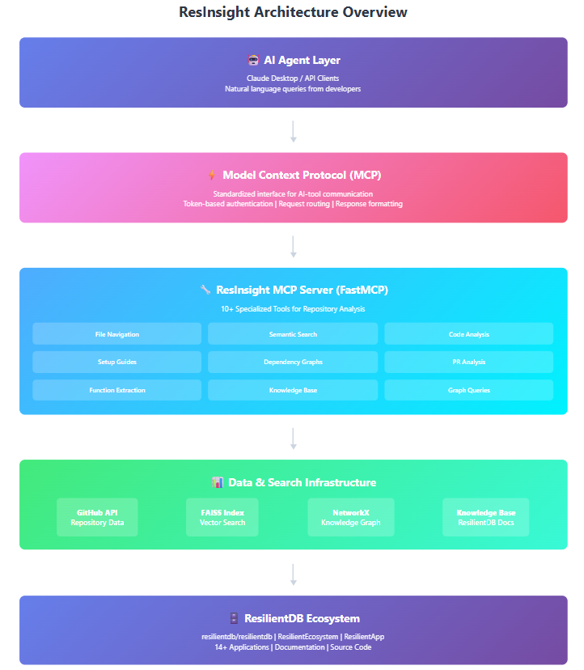
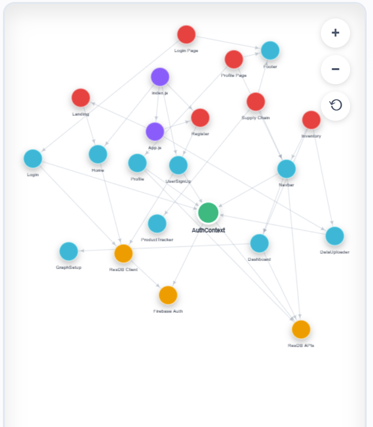

# ResInsight: AI-Driven Developer Onboarding for ResilientDB

**Author:** Kunjal Agrawal  
**Date:** March 2026  

---

## The Problem: 

Today’s business applications are complex in nature with interleaved tech stacks with a mix of libs & frameworks, code bases are evolving rapidly on composable & interoperable stacks. E.g. code delivered 3-months back might look very different depending on the issues resolved or features built or new tech stack inclusion
For an unknown/new repo, there is no choice than to rely on README pages and manual code browsing.
For an existing repo, one must browse through the commit logs to understand changes in each file and the associated impact. Thus, code repositories (repo here onwards) have become increasingly difficult to build understanding on the functional dependencies. But you might be thinking that ChatGPT or Claude can do this so easily so why is this tool required? You are correct. Let us explore it through a story first and then deep dive:


### My First Quarter Experience

During my first quarter at UC Davis, I took ECS 265, a course focused on distributed database systems and blockchain technology using ResilientDB. Like many of my classmates, I came in with limited exposure to distributed systems. We were tasked with understanding ResilientDB's architecture, its consensus protocols, and building projects using the existing applications.

The learning curve was real. ResilientDB is a powerful, well-architected blockchain platform, its sophistication is one of its greatest strengths. But that same sophistication meant there was a lot to understand: from Byzantine fault tolerance theory to the practical aspects of getting a development environment running.

Many of us found ourselves in a cycle: reading through documentation, trying to set things up, hitting errors we didn't understand, and then relying on groupmates who had managed to get their environments working. Some students spent most of the quarter developing on their teammate's setup rather than their own, not because they didn't want to figure it out, but because troubleshooting took time away from actually learning the concepts and building projects.

This wasn't anyone's fault. ResilientDB, as an active research platform, evolves quickly, which is excellent for pushing blockchain innovation forward. But it also means documentation and setup procedures are constantly catching up. The platform's comprehensiveness is a feature, not a bug. However, for newcomers, this creates a genuine challenge.

### Where Existing AI Tools Failed Us

Here's what made this harder: we couldn't just ask ChatGPT or Claude for help.

When you ask ChatGPT about ResilientDB:
- It gives you generic blockchain advice that may or may not apply to our specific implementation
- It hallucinates repository structures that don't exist in ResilientDB
- It can't access actual code from our repositories to verify its suggestions
- It provides outdated setup instructions based on whatever documentation it found during training
- It doesn't know about ResilientDB-specific applications like Debitable, Arrayán, or ResCounty
- It can't distinguish between theoretical PBFT and how ResilientDB actually implements it

**The fundamental gap**: General-purpose AI tools lack context about your specific codebase. They're trained on public data but have no connection to your actual repositories, your project's conventions, or your domain-specific implementations.

This gap becomes especially challenging for research platforms where:
- Code evolves faster than public documentation can keep up
- Internal applications and recent features aren't well-represented in AI training data  
- Setup procedures vary based on specific use cases and environments
- Understanding requires connecting theoretical concepts (like PBFT consensus) with their actual implementation in your codebase

### Why Can't ChatGPT Just Build This?

You might wonder: "Can't I just describe what I need to an AI and have it build the solution?" Here's why that doesn't solve the core problem:

**The Knowledge Problem**: ChatGPT doesn't know about your specific codebase. It can't tell you which files implement consensus in ResilientDB, where transaction processing actually happens, or how different modules connect, because it's never analyzed your repositories.

**The Access Problem**: AI chat tools can't authenticate to your repositories, can't make GitHub API calls on your behalf, and can't maintain persistent indexes of your evolving code.

**The Integration Problem**: Even if you copy-paste code snippets to ChatGPT, it processes them in isolation. It can't build a knowledge graph of your entire repository, maintain vector embeddings for semantic search across your whole codebase, or track dependencies and relationships across files.

**The Consistency Problem**: Every time you ask ChatGPT about your code, you need to provide context again. There's no persistent memory of your codebase structure, previous analyses, or the specific questions you've already explored. ChatGPT has a memory which is limited and once its full you need to clear it. If you have any questions, you will have to give the entire context again and repeat the process.

**The Verification Problem**: When ChatGPT suggests something about ResilientDB's implementation, how do you know if it's accurate? There's no way to trace its answer back to actual code or verify it against current repository state.

What we needed wasn't just an AI tool that could answer questions, we needed a tool that's **connected to our actual codebase** and can retrieve, analyze, and verify information from our specific repositories and applications.

---

## The Solution: ResInsight MCP Server

ResInsight bridges this gap by connecting AI agents directly to your GitHub repositories through the Model Context Protocol (MCP). Instead of asking ChatGPT general questions and getting generic answers, you can now ask questions like:

*"Show me all files related to transaction processing in ResilientDB"*  
*"How does the PBFT consensus implementation connect to the executor layer?"*  
*"What are the dependencies for the Debitable application?"*

And get answers based on your **actual codebase**, not generic blockchain knowledge.

<!--  -->

### What Makes ResInsight Different

**1. Repository-Aware Intelligence**

ResInsight doesn't guess, it knows. When you ask about a feature, it:
- Searches your actual codebase using semantic embeddings
- Analyzes the real file structure from your GitHub repository
- Provides answers based on current code, not outdated documentation

**2. Hybrid Search Architecture**

Traditional code search is limited to exact keyword matching. ResInsight combines:
- **FAISS Vector Search**: Understands code semantically ("find Byzantine fault tolerance logic" finds relevant code even without exact keywords)
- **NetworkX Knowledge Graphs**: Maps structural relationships between files, showing you how modules actually connect

This means you can ask conceptual questions ("where does transaction validation happen?") and get accurate results.

**3. Domain-Specific ResilientDB Knowledge**

ResInsight includes a curated knowledge base covering:
- Setup procedures for all 14+ ResilientDB applications
- Architectural explanations connecting theory to implementation
- PBFT consensus mechanisms specific to ResilientDB
- Performance benchmarks and optimization strategies

When you ask about ResilientDB concepts, you get answers from expert-curated content, not generic blockchain information scraped from the internet.

**4. Private Repository Access**

Unlike public AI tools that only work with open-source code, ResInsight:
- Authenticates with GitHub to access your private repositories
- Works with internal lab projects and course assignments using authentication
- Respects your access permissions, you only see repos you have access to

**5. Tool-First Design**

Every capability is exposed as a discrete tool that can be inspected, tested, and verified. Instead of opaque AI responses, you get:
- Explicit tool calls showing what data was retrieved
- Reproducible results, same query always returns same data
- No hallucination, answers come from actual repository data, not AI imagination


---

## Core Capabilities

### Repository Analysis

ResInsight provides comprehensive repository analysis through specialized tools:

**File Navigation**: Quickly understand repository structure without manually browsing hundreds of files. The system intelligently handles both small and large repositories, automatically switching between API strategies for optimal performance.

**Semantic Code Search**: Find code by *meaning*, not just keywords. Using sentence transformers and FAISS indexing, ResInsight understands that "Byzantine fault tolerance handling" and "BFT consensus logic" refer to similar concepts.

**Function Extraction**: Get instant overview of what a file does by extracting its function definitions, class structures, and key components, without reading hundreds of lines of code.

### Setup Assistance

One of the most time-consuming aspects of working with new codebases is getting your environment configured correctly. ResInsight automates this:

**Dockerfile Analysis**: Instead of manually parsing Docker commands, ResInsight breaks down Dockerfile instructions step-by-step, explaining dependencies and configuration choices.

**Interactive Troubleshooting**: When you hit setup errors, ResInsight can analyze error messages in the context of your specific repository and provide targeted solutions.

**Environment Validation**: Verify that your setup matches repository requirements before you waste time debugging environment issues.

### Dependency Visualization

Understanding how code is organized is crucial for effective development. ResInsight generates visual dependency graphs showing:

- Module import relationships
- Component interconnections
- Architectural patterns

This visual representation helps you quickly grasp code organization that would take hours to piece together manually.

<!--  -->

### ResilientDB Knowledge Base

The integrated knowledge base provides instant answers to common ResilientDB questions:

*"How do I set up Debitable?"* → Step-by-step guide with prerequisites and configuration
*"What is Arrayán?"* → Application overview, use cases, and integration points
*"How does PBFT work in ResilientDB?"* → Consensus mechanism explained with implementation details

This eliminates the frustration of searching through multiple repositories and documentation sources.

---

## Real Impact: Before and After

### Scenario: First-Time Repository Setup

**The Traditional Experience:**

In ECS 265, getting ResilientDB running locally was often the first major hurdle. The process typically went like this:
- Read through README files across multiple repositories
- Try following setup instructions
- Hit environment-specific errors that weren't documented
- Search for error messages online (often finding nothing ResilientDB-specific)
- Ask classmates or wait for TA office hours
- Eventually get it working through trial and error, or develop on a groupmate's setup

This could take 2-3 days of a student's time, not learning distributed systems concepts, but wrestling with configuration issues.

**With ResInsight:**

The same student can now ask: *"How do I set up ResilientDB locally?"*

ResInsight:
- Analyzes the actual Dockerfile from the repository
- Breaks down each installation step with context
- Explains what each dependency does and why it's needed
- Provides troubleshooting guidance for common environment issues
- Answers follow-up questions as they arise during setup

Result: 4-6 hours to a working environment, with the student understanding *why* each step matters, not just following commands blindly.

**The Real Impact:** More time spent learning distributed systems and building projects, less time fighting with Docker and dependency versions.

### Scenario: Understanding Code Architecture

**The Traditional Experience:**

When tasked with understanding how a feature works in ResilientDB (say, transaction processing), students typically:
- Manually browsed through repository files, trying to guess which ones were relevant
- Attempted to piece together module relationships from import statements
- Searched for specific implementations across multiple files
- Asked senior developers or TAs to explain the architecture
- Spent hours building mental models that could have been generated in minutes

For someone new to distributed systems, connecting these pieces, understanding both what the code does and why it's structured that way, was genuinely challenging.

**With ResInsight:**

A student can now ask: *"Show me files related to transaction processing in ResilientDB"*

ResInsight:
- Performs semantic search across the codebase
- Returns relevant files ranked by actual relevance to the concept
- Generates a dependency graph showing how components connect
- Answers follow-ups like *"How does this connect to the consensus layer?"*

Then ask: *"Explain how PBFT is implemented here"*

ResInsight:
- Pulls explanation from the ResilientDB-specific knowledge base
- Shows which actual files implement different PBFT phases
- Connects theoretical concepts to practical implementation

Result: Understanding in minutes instead of hours, with the ability to verify everything against actual code.

**The Real Impact:** Students can explore the codebase independently, at their own pace, building understanding incrementally rather than waiting for explanations.

### Scenario: Exploring ResilientDB Applications

**The Traditional Experience:**

When assigned to work with a ResilientDB application like Debitable or Arrayán:
- Clone the repository and hope the README is current
- Try to understand dependencies by reading package.json or requirements.txt
- Look for example code or tutorials (often finding none)
- Attempt setup following possibly outdated instructions
- Debug environment issues specific to that application
- Eventually piece together understanding through experimentation

This exploration phase could consume significant time that should have been spent on project development.

**With ResInsight:**

A student working on Debitable can ask: *"What is Debitable and how does it integrate with ResilientDB?"*

ResInsight:
- Retrieves curated overview from the ResilientDB knowledge base
- Explains Debitable's purpose, architecture, and key features
- Shows the file structure and identifies key components
- Provides setup guidance specific to Debitable's requirements
- Answers follow-ups about GraphQL integration, data models, or specific features

Then ask: *"Show me how Debitable handles data uploads"*

ResInsight:
- Uses semantic search to find relevant React components
- Identifies files like DataUploader.jsx, InventoryPage.jsx
- Shows how these connect to ResilientDB API calls

Result: From zero understanding to basic comprehension in 15-20 minutes, with confidence to start building.

**The Real Impact:** Students spend their time building features and experimenting with blockchain concepts, not deciphering project structure.

---

## Technical Architecture

### Model Context Protocol (MCP)

ResInsight is built on the Model Context Protocol, which provides a standardized way for AI applications to connect with external data sources. This architecture enables:

- **Persistent Context**: Repository data is indexed once and queried many times
- **Tool Composition**: Multiple specialized tools work together for complex queries
- **Extensibility**: New tools can be added without changing the core system
- **Vendor Agnostic**: Works with Claude, could support other LLMs

### Search and Retrieval System

The hybrid search architecture combines complementary approaches:

**Vector Embeddings (FAISS)**:
- Code chunks converted to 768-dimensional embeddings
- Semantic similarity search enables conceptual queries
- Fast retrieval even with millions of code chunks

**Knowledge Graphs (NetworkX)**:
- File dependencies mapped as directed graphs
- Import relationships explicitly modeled
- Structural queries like "what imports this module?"

**Repository Indexing**:
- Intelligent chunking maintains context
- Metadata tracking preserves file/line information
- Incremental updates for large repositories

### Authentication and Security

Security is built into every layer:

- **MCP Token Authentication**: All client requests require valid tokens
- **GitHub PAT Authorization**: Read-only repository access
- **Environment-Based Secrets**: No credentials in code
- **Request Validation**: All inputs sanitized and validated

---

## How to Use ResInsight

ResInsight can be used in two ways: connect to the hosted ResilientDB deployment, or run your own local copy if you want to self-host or modify the server.

### Option 1: Use the hosted ResilientDB deployment

If you only want to use ResInsight, you do not need to clone the repository. Point your MCP client at the hosted HTTP endpoint:

`http://52.45.172.212:8005/mcp`

Important details:
- Use the `/mcp` endpoint directly.
- The server is running in Docker as `resinsight` with port mapping `8005:8005`.
- Use an MCP client that supports HTTP transport, such as Cursor or Claude Desktop.
- Add the Bearer token issued by the lab to your client configuration.
- Do not rely on `/` or `/mcp/tools`; those paths are not the supported client entry point.

### Option 2: Run it locally

If you want to run your own instance, clone the repository and start the MCP server locally:

1. Clone the repo and move into the ResInsight directory.
2. Create and activate a Python virtual environment.
3. Install dependencies from `requirements.txt`.
4. Create a `.env` file with your `GITHUB_TOKEN` and a locally chosen `MCP_TOKEN`.
5. Start the server with `python server.py`, or build and run the Docker image if you prefer containers.

For local use, your MCP client should send the same `MCP_TOKEN` value that the server reads from `.env`. For cloud use, the client must send the Expo Lab team-issued token for the hosted endpoint.

### MCP client configuration
Now, to configure an MCP client use one of the following two options depending on the option that you chose above to run the application:

1. Use command-based MCP configuration only when you are running ResInsight locally (self-hosted):

    ```json
    {
        "mcpServers": {
            "resinsight": {
                "command": "python",
                "args": ["C:/path/to/incubator-resilientdb/ecosystem/ai-tools/mcp/ResInsight/server.py"],
                "env": {
                    "GITHUB_TOKEN": "ghp_...",
                    "MCP_TOKEN": "your_local_secret_or_team_issued_token"
                }
            }
        }
    }
    ```

In this `python + server.py` setup, do not place the `/mcp` URL inside `args`. The `args` field is only the local script path.

### HTTP transport clients like Claude

2. If your application supports native remote HTTP MCP entries, configure the deployed endpoint like this:

    ```json
    {
        "url": "http://52.45.172.212:8005/mcp",
        "headers": {
            "Authorization": "Bearer MCP_TOKEN"
        }
    }
    ```

    For Claude use:

    ```json
    {
        "mcpServers": {
            "ResInsight: AI-driven developer onboarding ecosystem": {
                "command": "npx",
                "args": [
                    "-y",
                    "mcp-remote",
                    "http://52.45.172.212:8005/mcp",
                    "--header",
                    "Authorization: Bearer MCP_TOKEN"
                ],
                "env": {
                    "MCP_REMOTE_CONFIG_DIR": "C:/Users/your-user/.mcp-auth"
                }
            }
        }
    }
    ```

Important: keep a space after `Bearer` in the header value (`Authorization: Bearer ...`).

The direct Claude local setup (`python + server.py`) remains the preferred self-hosted option. The deployed endpoint should be configured with the `/mcp` URL in the remote HTTP settings (or bridge argument), not in Python script args.

For local self-hosted runs, replace the hosted URL with `http://localhost:8005/mcp` and use the token from your own `.env` file.

---

## Measuring Success

The real measure of ResInsight's impact isn't in technical metrics, it's in changed developer experiences:

**Time Savings**: Tasks that took days now take hours. Questions that required waiting for senior developers get answered immediately.

**Independence**: New developers can explore and learn at their own pace, without constantly interrupting others.

**Confidence**: When setup actually works the first time, when you understand why code is structured a certain way, when you can find what you need, that confidence compounds over time.

**Knowledge Access**: Information that was previously locked in senior developers' experience is now available to everyone.

---

## What's Next

ResInsight represents a first step toward making sophisticated codebases more accessible. Future directions include:

**Automated PR Analysis**: Intelligent code review suggestions based on repository conventions and patterns

**Interactive Learning Paths**: Guided tutorials that adapt based on your questions and progress

**Team Knowledge Sharing**: Capture and share team-specific insights and best practices

**Multi-Repository Understanding**: Answer questions that span multiple related repositories

---

## A Note on Scope

ResInsight is designed for a specific problem: helping developers understand and work with existing codebases. It's not trying to replace developers, automate all coding tasks, or solve every development challenge.

What it does do is eliminate the frustrating parts of onboarding, the hours spent searching for the right file, the days debugging environment setup, the uncertainty about whether you're understanding things correctly.

By handling these mechanical tasks, ResInsight lets developers focus on what matters: understanding concepts, building features, and solving real problems.

---

## Getting Involved

ResInsight is open source and available to the ResilientDB community. If you're a student taking ECS 265, a lab member working on ResilientDB projects, or a researcher exploring the platform, you can start using ResInsight today.

For access, contact kunjalagrawal2002@gmail.com or Prof. Sadoghi at msadoghi@expolab.org.

The code is available at: [ResInsight](https://github.com/apache/incubator-resilientdb/tree/master/ecosystem/ai-tools/mcp/ResInsight)

Contributions are welcome, whether it's improving the knowledge base, adding new tools, or enhancing search capabilities.

---

## Acknowledgments

This project was inspired by the collaborative spirit of the ExpoLab community. Special thanks to:

- Fellow ECS 265 students who helped me clearly understand what issues they faced when they took ECS 265 and when they started working with ResilientDB.
- ExpoLab team for supporting this work
- Professor Mohammad Sadoghi for his guidance througout the project.

---

## Conclusion

ResInsight was born from a genuine need I experienced as a student learning distributed systems and blockchain technology. It's not trying to replace the excellent work being done by the ResilientDB team, the growing documentation efforts, or the collaborative spirit of the ExpoLab community.

Instead, ResInsight addresses a specific gap: the mechanical obstacles that slow down learning. It handles the frustrating parts, finding the right file, understanding repository structure, debugging setup issues, so developers can focus on what matters: grasping distributed systems concepts, understanding consensus mechanisms, and building innovative applications.

### What This Changes

For future ECS 265 students and new ResilientDB developers, ResInsight means:

**Independence**: Learn at your own pace without waiting for office hours or interrupting teammates
**Confidence**: Verify your understanding against actual code, not guesses
**Efficiency**: Spend time on concepts and projects, not configuration struggles  
**Accessibility**: Expert knowledge available 24/7, not locked in senior developers' heads

### The Broader Picture

As ResilientDB continues to grow, more applications, more features, more complexity,tools like ResInsight become increasingly valuable. They ensure that the platform's sophistication enhances rather than hinders its accessibility.

This is especially important for an academic research platform where:
- New students join each quarter with varying backgrounds
- Code evolves rapidly with cutting-edge research
- Learning happens alongside building
- Time spent stuck on setup is time not spent learning


---

**Tags**: #ResilientDB #DeveloperExperience #AI #MCP #Onboarding #ExpoLab

---

*ResInsight is part of the ResilientDB ecosystem. Learn more about ResilientDB at [expolab.resilientdb.com](https://expolab.resilientdb.com/)*