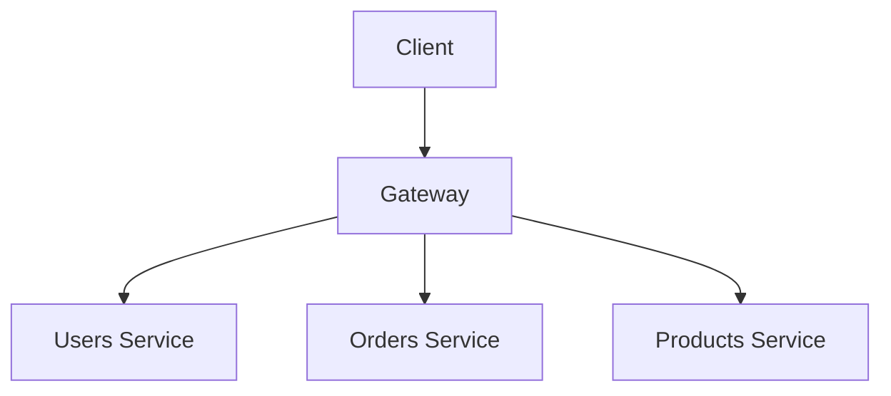

import { Tabs } from 'nextra/components'

# GraphQL federation

An alternative design approach to the classical monolith, often described as microservices, emphasizes breaking down complex systems into smaller, independently managed components. In some ways, GraphQL federation is like microservices for GraphQL - an architectural pattern that has found particular resonance in the GraphQL ecosystem.

GraphQL federation gained widespread adoption after
[Apollo GraphQL introduced Apollo Federation in 2019](https://www.apollographql.com/blog/apollo-federation-f260cf525d21).
Their implementation has become a reference point for the GraphQL community, helping establish
federation as a standard architectural pattern for building a distributed graph in the GraphQL
ecosystem.

With more companies and developers seeing the benefits of building a distributed GraphQL schema with
federation, the GraphQL ecosystem is now moving towards standardization of federation patterns. The
GraphQL Foundation's
[Composite Schema Working Group](https://github.com/graphql/composite-schemas-wg), which includes
engineers from various organizations across the industry including
[Apollo GraphQL](https://apollographql.com), [ChilliCream](https://chillicream.com/),
[Graphile](https://www.graphile.org/), [Hasura](https://hasura.io/),
[Netflix](https://www.netflix.com/) and [The Guild](https://the-guild.dev), is actively working on
creating
[an official specification for GraphQL Federation](https://github.com/graphql/composite-schemas-spec).
This effort aims to standardize how GraphQL services can be composed and executed across distributed
systems, while ensuring room for innovation and different implementations.

## What is federation?

Architecturally, federation is an approach to organizing and managing distributed systems. At its
core, federation allows autonomous components to work together while maintaining their independence.
Think of it like a federal government system: individual states maintain their sovereignty while
cooperating under a central authority for shared concerns.

In software architecture, federation enables organizations to:

- Distribute responsibility across independent teams
- Scale different components independently
- Maintain clear boundaries between different domains
- Enable autonomous development and deployment
- Reduce single points of failure

Think of the "Login with Google" or "Login with Facebook" buttons you see on websites. This is
federation in action: you can use your Google or Facebook account to log into many different
websites, even though each company manages their own login system separately.

## What is federated GraphQL?

GraphQL federation applies those principles to GraphQL APIs. It enables organizations to build a
unified GraphQL schema from multiple independent services (most often called subgraphs), each
responsible for its portion of the application's data graph.

Consider an e-commerce platform: You might have separate teams managing products, user accounts, and
order processing. With GraphQL federation, each team can:

- Define their own GraphQL schema
- Deploy and scale their service independently
- Contribute to a unified GraphQL API without tight coupling
- Maintain ownership of their domain-specific logic

The magic happens through a federated gateway that acts as the central coordinator, composing these
separate schemas into a unified schema that clients can query.

## How federation works in GraphQL

The federation process involves several key components:

- **Subgraphs**: Individual services that define their own GraphQL schemas and resolvers
- **Gateway**: A specialized service that sits between clients and your federated services
- **Schema composition**: The process of merging schemas while resolving references between them,
  often handled by schema registries.

<Tabs items={['Products subgraph', 'Orders subgraph', 'Users subgraph']}> <Tabs.Tab>

```graphql
type Product @key(fields: "id") {
  id: ID!
  title: String!
  price: Float!
  inStock: Boolean!
}
```

</Tabs.Tab> <Tabs.Tab>

```graphql
type Order @key(fields: "id") {
  id: ID!
  products: [Product!]!
  total: Float!
}

type Product {
  id: ID!
}
```

</Tabs.Tab> <Tabs.Tab>

```graphql
type Query {
  user(id: ID!): User
}

type User {
  id: ID!
  name: String!
  email: String
  orders: [Order!]!
}

type Order {
  id: ID!
}
```

</Tabs.Tab> </Tabs>

### Schema composition

Let's break down schema composition in GraphQL federation with more detail and examples. Schema
composition is the process where multiple subgraph schemas are combined into one unified schema.
It's more complex than simply merging schemas together, though, because it needs to handle
relationships, detect incompatibilities, and ensure types are properly connected across services and
subgraphs.

Based on the examples we provided before, here's the unified schema GraphQL clients will see and can
query:

```graphql
type Query {
  user(id: ID!): User
}

type User {
  id: ID!
  name: String!
  email: String
  orders: [Order!]!
}

type Order {
  id: ID!
  products: [Product!]!
  total: Float!
}

type Product {
  id: ID!
  title: String!
  price: Float!
  inStock: Boolean!
}
```

This unified schema combines types and fields from all three subgraphs (Users, Orders, and
Products), allowing clients to seamlessly query across these domains.

### Gateway

The federation gateway is the entry point to your distributed data graph. It presents a unified
GraphQL endpoint to clients and handles the complexity of routing queries to the appropriate
subgraphs and assembling the results, and often provides caching and performance optimizations.



Take the following query as an example:

```graphql
query {
  user(id: "123") {
    # Resolved by Users subgraph
    name
    orders {
      # Resolved by Orders subgraph
      id
      products {
        # Resolved by Products subgraph
        title
        price
      }
    }
  }
}
```

The gateway will route parts of the query to the appropriate subgraphs, collect the results, and
assemble them into a single response that the client can consume.

## Benefits of GraphQL federation

### Domain-driven development

Teams can work independently on their services while contributing to a cohesive API. This autonomy
accelerates development and reduces coordination overhead.

### Service integrity protection

The schema composition step verifies integration between services by ensuring that changes in
individual subgraphs do not conflict with other subgraphs.

### Scalability and performance

Subgraphs and services can be scaled independently based on their specific requirements. The product
catalog might need different scaling characteristics than the order processing system.

### Single, unified API

Thanks to GraphQL, clients get a single endpoint with unified schema spanning multiple subgraphs.
The complexity of distributed systems is hidden. The gateway ensures every query reaches its
destination and returns with the right data.

## Is GraphQL federation right for you?

GraphQL federation aligns naturally with Domain Driven Design (DDD) principles by allowing teams to
maintain clear boundaries around their domains, while maintaining explicit integration points
through the GraphQL schema. It is particularly valuable for organizations where multiple teams need
to work independently on different parts of the GraphQL API, with the flexibility to use different
technologies and programming languages.

However, implementing federation requires substantial infrastructure support, including a dedicated
team to manage the gateway, schema registry, to help connect subgraphs to the federated API and
guide teams on best practices.

Before adopting federation, it's crucial to consider whether your organization truly needs this
level of complexity. You can start with a monolithic setup and transition to federation as your needs
evolve, rather than implementing it prematurely.

Meta (formerly Facebook), [where GraphQL was created](/blog/2015-09-14-graphql/), has continued to
use a monolithic GraphQL API since 2012. However, companies like
[Netflix](https://netflixtechblog.com/how-netflix-scales-its-api-with-graphql-federation-part-1-ae3557c187e2),
[Expedia Group](https://youtu.be/kpeVT7J6Bsw?si=srGWsoxf3kTmneTu&t=79),
[Volvo](https://www.apollographql.com/blog/volvo-cars-drives-into-the-future-of-online-car-shopping-with-the-supergraph),
and [Booking](https://youtu.be/2KsP_x50tGk?si=mu-MOG-xZQSDNDjh&t=478) have adopted federation to
better align with their organizational structures and microservices architecture.

As you see, some of the world's largest industry leaders have successfully federated their GraphQL
APIs, proving that it works reliably for production applications at an extraordinary scale.

## Getting started with GraphQL federation

If you're considering adopting GraphQL federation, here are some steps to get started:

1. **Identify Service Boundaries**: Define clear boundaries between different domains in your
   application
2. [**Design Schemas**](/learn/schema/ 'Learn about the different elements of the GraphQL type system'):
   Create schemas that reflect these boundaries while considering how they'll interact
3. [**Implement Subgraphs**](/community/tools-and-libraries/?tags=server 'Discover a list of GraphQL servers in our Tools and Libraries page'):
   Build individual services that implement their portion of the schema
4. [**Set Up a Gateway**](/community/tools-and-libraries/?tags=gateways-supergraphs 'Discover a list of GraphQL gateways in our Tools and Libraries page'):
   Deploy a federation gateway to compose and serve the unified schema
5. [**Use a Schema Registry**](/community/tools-and-libraries/?tags=schema-registry 'Discover a list of GraphQL schema registries in our Tools and Libraries page'):
   Manage schema composition and validation to ensure integrity across subgraphs

When migrating from a monolithic to federated GraphQL API, the simplest starting point is to treat
your existing schema as your first subgraph. From there, you can follow the steps above to gradually
decompose your schema into smaller pieces.
