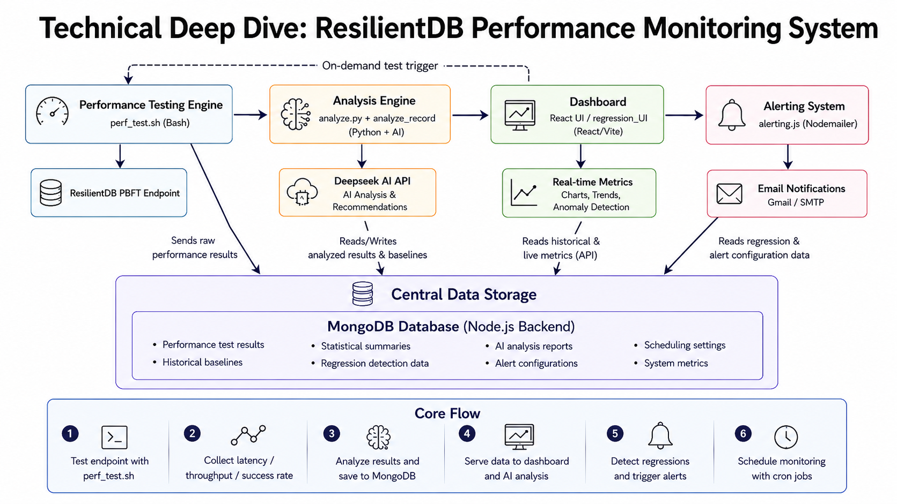
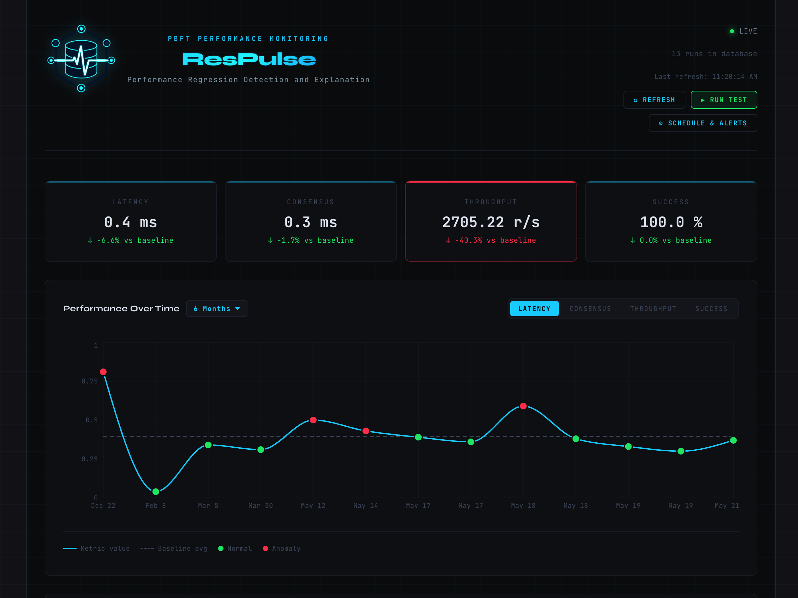
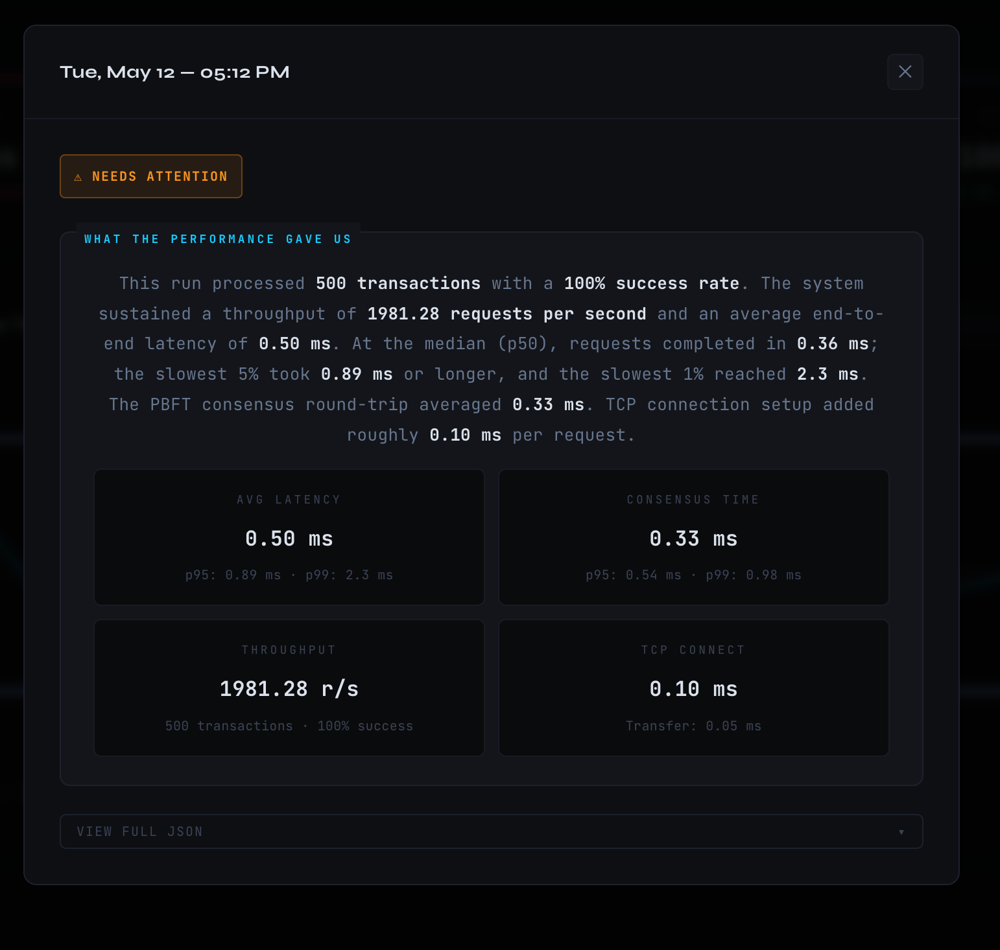
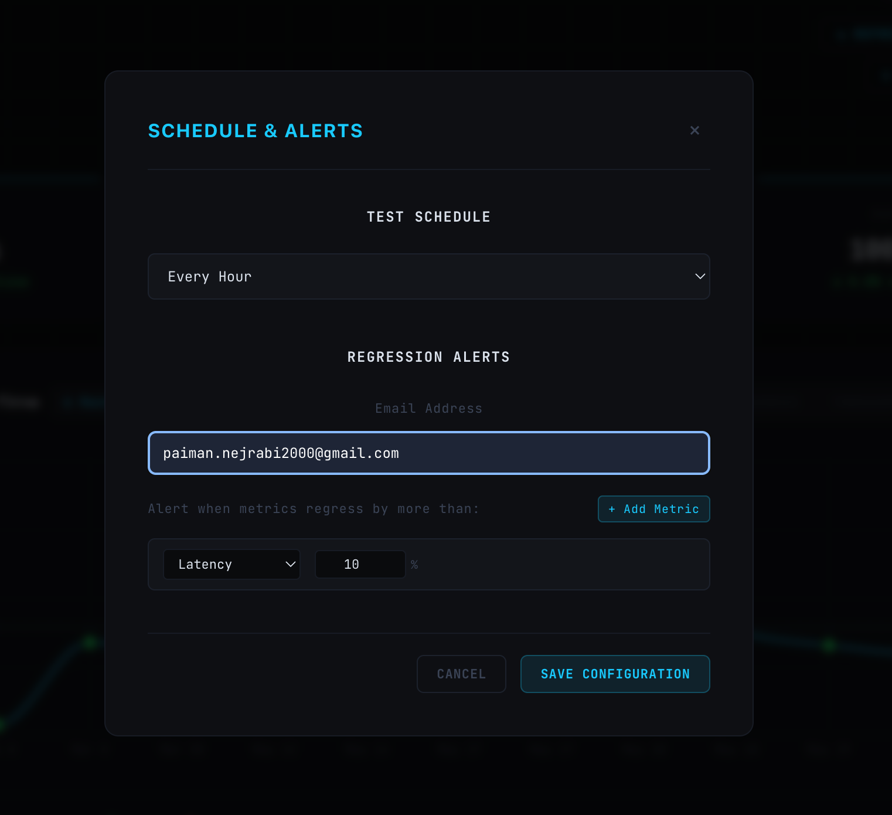
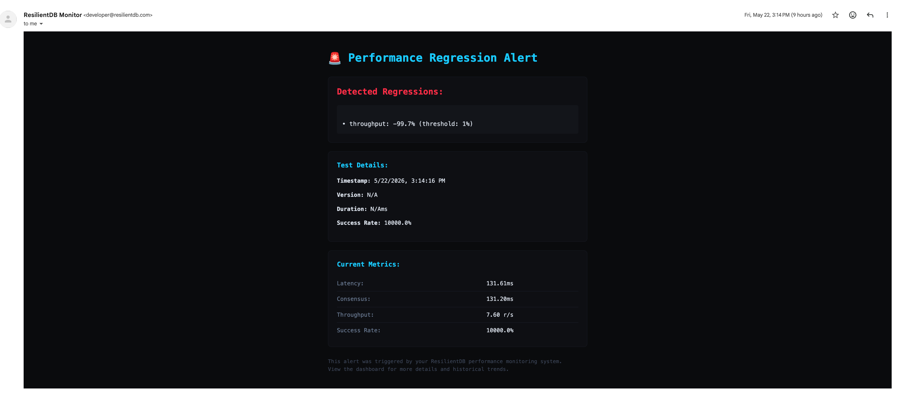
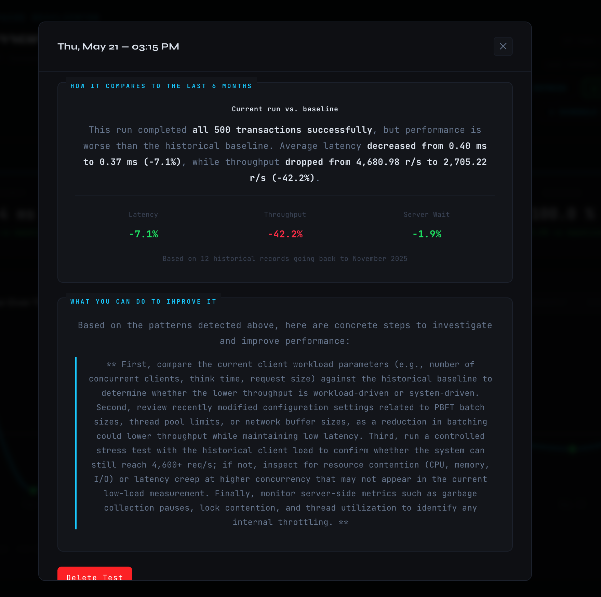

<!-- # Introducing ResilientDB's Advanced Performance Monitoring System: AI-Powered Regression Detection for PBFT Consensus -->
# ResPulse: Performance Regression Detection and Explanation for ResilientDB

In the world of distributed systems and blockchain infrastructure, performance monitoring isn't just helpful, it's essential. Today, we're excited to introduce ResPulse: A comprehensive performance monitoring and regression detection system, a sophisticated tool designed specifically for monitoring PBFT consensus performance in real-world deployments.

## The Challenge: Monitoring PBFT Consensus Performance

Modern blockchain systems like ResilientDB rely on complex consensus protocols that must maintain both security and performance under varying conditions. Traditional monitoring approaches often fall short when it comes to:

- **Understanding consensus-specific metrics** like PBFT phase timing and replica coordination overhead
- **Detecting performance regressions** before they impact production workloads
- **Providing actionable insights** that help developers optimize consensus parameters
- **Correlating performance degradation** with specific code changes or system conditions

ResPulse addresses these challenges head-on with a comprehensive solution built specifically for ResilientDB's PBFT implementation.

## Architecture Overview

ResPulse consists of four main components:


*Figure 1: System architecture showing the main components and data flow*

### 1. Performance Testing Engine (`perf_test.sh`)

At the core of our system is a bash-based performance testing engine that:

- **Executes realistic transaction workloads** against ResilientDB endpoints
- **Captures detailed timing metrics** using curl's built-in timing capabilities
- **Measures end-to-end latency** including TCP connection time, server processing time, and response transfer time
- **Supports configurable test parameters** for different workload patterns

The testing engine generates structured timing data that captures every aspect of request processing:

```bash
# Example: Running 100 performance tests with version tagging
bash perf_test.sh 100 "v2.1.0-optimization-branch"
```


### 2. Advanced Metrics Analysis (`analyze.py` & `analyze_record.py`)

Our analysis engine transforms raw timing data into meaningful performance insights:

#### Core Metrics Calculation
- **Total Latency**: End-to-end request completion time
- **Consensus Time**: Server-side processing time (PBFT phases, queuing, execution)
- **TCP Connect Time**: Network connection establishment overhead
- **Transfer Time**: Response payload transmission time
- **Throughput**: Requests per second under sequential load
- **Success Rate**: Percentage of successfully completed transactions

#### Statistical Analysis
The system computes comprehensive statistical summaries including:
- Mean, median, min, max values
- Standard deviation for variance analysis
- P95 and P99 percentiles for tail latency detection
- Historical baseline comparisons with percentage change calculations

#### AI-Powered Analysis Integration
A breakthrough feature of our system is its integration with **Deepseek AI** for intelligent performance analysis:

```python
# AI analysis replaces traditional pattern recognition
ai_analysis = get_ai_analysis(record, baseline, period_label)
```

The AI system:
- **Analyzes complex performance patterns** that simple thresholds might miss
- **Provides contextualized recommendations** specific to PBFT consensus optimization
- **Generates human-readable reports** explaining performance bottlenecks
- **Adapts analysis based on historical trends** and system behavior patterns

### 3. Real-Time Dashboard (`regression_UI`)

Built with React and Recharts, our dashboard provides:


*Figure 2: Main dashboard showing real-time performance metrics and trends*

#### Interactive Visualizations
- **Time-series charts** showing latency, throughput, and consensus timing trends
- **Configurable time ranges** from 24 hours to all-time historical data
- **Anomaly detection** highlighting unusual performance values
- **Baseline comparison overlays** for regression identification

#### Live Monitoring Features
- **Real-time status cards** displaying current system health
- **Auto-refresh capabilities** with configurable intervals
- **Detailed drill-down views** for individual test runs
- **Performance trend analysis** with statistical summaries

*Figure 3: The system's analysis of a test run*
#### Key Dashboard Components

```jsx
// Main monitoring dashboard with comprehensive metrics
export default function ResilientDBMonitor() {
  // Features include:
  // - Live connection status and performance metrics
  // - Interactive charts with anomaly detection
  // - Historical baseline comparison
  // - Auto-refresh with manual override capability
}
```

### 4. Intelligent Alerting System

Our alerting system provides proactive monitoring with:

#### Automated Regression Detection
The system automatically:
- **Compares current performance** against configurable historical baselines
- **Detects statistical anomalies** using configurable thresholds
- **Identifies performance degradation** across multiple metrics simultaneously
- **Calculates regression severity** based on multiple warning signals

#### Configurable Baseline Periods
A key innovation in our alerting system is **flexible baseline comparison periods** for scheduled tests. Instead of being locked to a fixed timeframe, users can now choose the most appropriate historical baseline:

- **1 Week**: Ideal for detecting short-term performance changes and immediate impact assessment
- **1 Month**: Balances recent trends with sufficient statistical stability
- **3 Months**: Provides robust baseline for quarterly performance evaluation
- **6 Months**: Default option offering comprehensive long-term trend analysis
- **1 Year**: Maximum historical context for annual performance reviews

#### Intelligent Data Validation
The system automatically validates data availability for each baseline period:
- **Minimum threshold enforcement**: Requires at least 3 historical results for meaningful statistical comparison
- **Real-time availability checking**: UI dynamically shows available vs. insufficient data periods
- **Data count indicators**: Displays the exact number of historical results available for each timeframe
- **Smart defaults**: Automatically selects the most appropriate available period if user's choice lacks sufficient data

#### Flexible Notification System
Originally built with Resend, we've recently migrated to **Nodemailer** for greater flexibility:

```javascript
// Multi-provider email support
function createTransporter() {
  const provider = process.env.EMAIL_PROVIDER || "gmail";

  switch (provider.toLowerCase()) {
    case "gmail": return nodemailerGmailTransport();
    case "outlook": return nodemailerOutlookTransport();
    case "smtp": return nodemailerCustomSMTP();
  }
}
```

#### Scheduled Monitoring
- **Configurable test schedules** (hourly, daily, weekly, monthly)
- **Flexible baseline comparison periods** (1 week, 1 month, 3 months, 6 months, 1 year)
- **Intelligent baseline validation** - automatically disables insufficient data periods
- **Automatic regression detection** after each scheduled test
- **Email notifications** with detailed performance analysis
- **Rich HTML reports** showing performance trends and recommendations


*Figure 4: Scheduling Tests and Alert System*

*Figure 5: Automated regression alert with detailed performance metrics*

## Key Features and Innovations

### 1. PBFT-Specific Metrics

Our system is uniquely designed for PBFT consensus monitoring:

- **Consensus Phase Timing**: Distinguishes between network overhead and actual consensus processing
- **Replica Coordination Analysis**: Identifies bottlenecks in multi-replica coordination
- **Batch Processing Metrics**: Analyzes the impact of batching parameters on throughput
- **Tail Latency Detection**: Identifies consensus stalls and synchronization delays

### 2. AI-Powered Analysis

The integration with Deepseek AI represents a significant advancement in performance analysis:

```python
# AI generates contextualized performance insights
prompt = f"""
You are a ResilientDB performance expert. Analyze these PBFT consensus metrics:
- Average Latency: {record.get('avg_latency_ms')}ms
- Throughput: {record.get('throughput_rps')} req/s
- Server Wait Time: {record.get('consensus_time_ms', {}).get('mean')}ms

Provide specific technical recommendations for PBFT optimization.
"""
```

The AI system provides:
- **Context-aware recommendations** based on PBFT consensus theory
- **Root cause analysis** for performance bottlenecks
- **Optimization suggestions** for consensus parameters
- **Performance trend interpretation** with actionable insights


*Figure 6: AI-generated performance analysis with actionable recommendations*

### 3. Comprehensive Regression Detection

Our regression detection algorithm analyzes multiple dimensions:

```javascript
const METRICS = [
  { id: "latency",    field: "avg_latency_ms",    lowerBetter: true  },
  { id: "consensus",  field: "consensus_ms_mean", lowerBetter: true  },
  { id: "throughput", field: "throughput_rps",    lowerBetter: false },
  { id: "success",    field: "success_rate",      lowerBetter: false },
];
```

The system:
- **Calculates dynamic baselines** from configurable historical periods
- **Applies configurable thresholds** for each metric type
- **Considers metric interdependencies** for holistic analysis
- **Generates severity scores** based on multiple regression signals

### 4. Developer-Friendly Integration

The system is designed for seamless integration into development workflows:

#### Easy Setup and Configuration
```bash
# Simple environment-based configuration
EMAIL_PROVIDER=gmail
EMAIL_USER=your-email@gmail.com
DEEPSEEK_API_KEY=your-deepseek-key

# Run performance tests
bash perf_test.sh 1000 "feature-branch-testing"
```

#### MongoDB Integration
- **Persistent storage** of all performance data
- **Efficient querying** for historical analysis
- **Scalable data architecture** supporting long-term trend analysis

#### RESTful API
```javascript
// Express.js backend with comprehensive API endpoints
app.get('/api/results', getResults);           // Historical data
app.post('/api/results/:id/analyze', analyzeResult); // AI analysis
app.get('/api/schedule', getScheduleConfig);   // Monitoring configuration
```

## Technical Architecture Decisions

### Choice of Technologies

Our technology stack reflects careful consideration of performance monitoring requirements:

- **Python for analysis**: Leverages scientific computing libraries for statistical analysis
- **Node.js for backend**: Provides excellent performance for real-time data processing
- **React for frontend**: Enables responsive, interactive data visualization
- **MongoDB for storage**: Offers flexible schema for evolving metrics collection

### Performance Considerations

The monitoring system itself is optimized for minimal overhead:

- **Efficient data collection** using curl's native timing capabilities
- **Asynchronous processing** to avoid blocking performance tests
- **Intelligent caching** for dashboard responsiveness
- **Configurable refresh intervals** balancing freshness with resource usage

### Scalability Design

The system architecture supports growing monitoring needs:

- **Horizontal scaling** of backend services
- **Database sharding** for high-volume data storage
- **Modular component design** enabling feature expansion
- **API-first architecture** supporting multiple frontend clients

## Getting Started

Setting up ResPulse is straightforward:

### Prerequisites
- A ResilientDB GraphQL instance running locally. For setup instructions, see the [ResilientDB GraphQL README](https://github.com/apache/incubator-resilientdb-graphql/blob/main/README.md).
- Python 3.x with required packages
- Node.js 18+ for backend services
- MongoDB instance for data persistence

### Installation Steps

1. **Clone the repository**:
   ```bash
   git clone https://github.com/resilientdb/incubator-resilientdb
   cd ecosystem/monitoring/resPulse
   ```

2. **Configure environment variables**:
   ```bash
   # Backend configuration
   cp backend/.env.example backend/.env
   # Edit with your MongoDB URI, email settings, AI API keys
   ```

3. **Start the services**:
   ```bash
   # Backend API
   cd backend && npm install && npm start

   # Frontend dashboard
   cd resPulse_UI && npm install && npm run dev
   ```

4. **Run your first performance test**:
   Open the dashboard in your browser and click the "Run Test" button to execute your first performance benchmark.

### Configuration Options

The system supports extensive configuration:

- **Test parameters**: Request count, endpoint URLs, payload customization
- **Analysis settings**: AI API configuration, statistical thresholds
- **Alerting setup**: Email providers, notification schedules, regression thresholds
- **Dashboard preferences**: Time ranges, metrics display, refresh intervals

## Future Developments

We're continuously expanding the monitoring system's capabilities:


#### Automated Pull Request Testing

One of the most exciting planned features is automated performance testing triggered by code changes. This system will:

**Monitor Repository Changes**: Using GitHub webhooks or CI/CD pipeline integration, automatically detect when Pull Requests are created or updated that modify ResilientDB core components.

**Triggered Testing**: Automatically execute performance benchmarks against the proposed changes, comparing results with baseline performance metrics from the main branch.

**Performance Impact Analysis**: Generate detailed reports showing whether code changes improve, degrade, or maintain performance across key metrics like consensus latency, throughput, and resource utilization.

**Implementation Approach**: This can be implemented by integrating with GitHub Actions or similar CI/CD platforms, where the performance testing suite runs as part of the PR validation process. The system would deploy the proposed changes in a controlled environment, run the existing performance test suite, and automatically post results as PR comments.

This automated approach ensures that performance regressions are caught early in the development cycle, maintaining ResilientDB's performance standards while enabling rapid development iteration.

## Future Developments

- **Custom metrics integration** for application-specific monitoring
- **Enhanced AI analysis** with multi-model comparison capabilities
- **Multi-Configuration Scheduled Testing** schedule multiple independent test runs simultaneously, each with its own parameters, different request counts, different endpoints, different workload profiles, or different alert thresholds.

## Contributing and Community

ResPulse is part of the Apache ResilientDB project and welcomes community contributions:

- **Feature requests** and bug reports via GitHub Issues
- **Code contributions** through pull requests with performance validation
- **Documentation improvements** to support broader adoption
- **Performance testing** across different deployment scenarios

## Conclusion

ResPulse represents a significant advancement in blockchain infrastructure monitoring. By combining PBFT-specific metrics collection, AI-powered analysis, and comprehensive regression detection, it provides developers and operators with the tools they need to maintain optimal performance in distributed consensus systems.

Whether you're developing new features for ResilientDB, operating a production deployment, or researching consensus protocol optimizations, this monitoring system provides the insights and automation needed to ensure peak performance.

The system's modular architecture, comprehensive documentation, and active community support make it an ideal choice for organizations looking to implement robust performance monitoring for their ResilientDB infrastructure.

---

*Ready to get started? Visit our [GitHub repository](https://github.com/resilientdb/incubator-resilientdb/tree/master/ecosystem/monitoring/resPulse) for installation instructions and documentation. Join our community and help us build the future of blockchain performance monitoring.*

## About ResilientDB

ResilientDB is a high-performance permissioned blockchain fabric designed for modern distributed applications. With its focus on PBFT consensus and optimal performance, ResilientDB provides the foundation for secure, scalable blockchain solutions. Learn more at [resilientdb.com](https://resilientdb.com).
