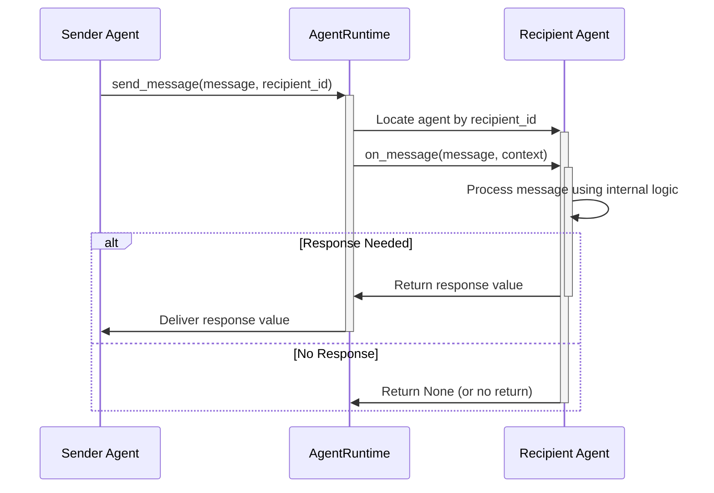

# Chapter 1: Agent - The Workers of AutoGen

Welcome to the AutoGen Core tutorial! We're excited to guide you through building powerful applications with autonomous agents.

## Motivation: Why Do We Need Agents?

Imagine you want to build an automated system to write blog posts. You might need one part of the system to research a topic and another part to write the actual post based on the research. How do you represent these different "workers" and make them talk to each other?

This is where the concept of an **Agent** comes in. In AutoGen Core, an `Agent` is the fundamental building block representing an actor or worker in your system. Think of it like an employee in an office.

## Key Concepts: Understanding Agents

Let's break down what makes an Agent:

1.  **It's a Worker:** An Agent is designed to *do* things. This could be running calculations, calling a Large Language Model (LLM) like ChatGPT, using a tool (like a search engine), or managing a piece of data.
2.  **It Has an Identity (`AgentId`):** Just like every employee has a name and a job title, every Agent needs a unique identity. This identity, called `AgentId`, has two parts:
    *   `type`: What kind of role does the agent have? (e.g., "researcher", "writer", "coder"). This helps organize agents.
    *   `key`: A unique name for this specific agent instance (e.g., "researcher-01", "amy-the-writer").

    ```python
    # From: _agent_id.py
    class AgentId:
        def __init__(self, type: str, key: str) -> None:
            # ... (validation checks omitted for brevity)
            self._type = type
            self._key = key

        @property
        def type(self) -> str:
            return self._type

        @property
        def key(self) -> str:
            return self._key

        def __str__(self) -> str:
            # Creates an id like "researcher/amy-the-writer"
            return f"{self._type}/{self._key}"
    ```
    This `AgentId` acts like the agent's address, allowing other agents (or the system) to send messages specifically to it.

3.  **It Has Metadata (`AgentMetadata`):** Besides its core identity, an agent often has descriptive information.
    *   `type`: Same as in `AgentId`.
    *   `key`: Same as in `AgentId`.
    *   `description`: A human-readable explanation of what the agent does (e.g., "Researches topics using web search").

    ```python
    # From: _agent_metadata.py
    from typing import TypedDict

    class AgentMetadata(TypedDict):
        type: str
        key: str
        description: str
    ```
    This metadata helps understand the agent's purpose within the system.

4.  **It Communicates via Messages:** Agents don't work in isolation. They collaborate by sending and receiving messages. The primary way an agent receives work is through its `on_message` method. Think of this like the agent's inbox.

    ```python
    # From: _agent.py (Simplified Agent Protocol)
    from typing import Any, Mapping, Protocol
    # ... other imports

    class Agent(Protocol):
        @property
        def id(self) -> AgentId: ... # The agent's unique ID

        async def on_message(self, message: Any, ctx: MessageContext) -> Any:
            """Handles an incoming message."""
            # Agent's logic to process the message goes here
            ...
    ```
    When an agent receives a message, `on_message` is called. The `message` contains the data or task, and `ctx` (MessageContext) provides extra information about the message (like who sent it). We'll cover `MessageContext` more later.

5.  **It Can Remember Things (State):** Sometimes, an agent needs to remember information between tasks, like keeping notes on research progress. Agents can optionally implement `save_state` and `load_state` methods to store and retrieve their internal memory.

    ```python
    # From: _agent.py (Simplified Agent Protocol)
    class Agent(Protocol):
        # ... other methods

        async def save_state(self) -> Mapping[str, Any]:
            """Save the agent's internal memory."""
            # Return a dictionary representing the state
            ...

        async def load_state(self, state: Mapping[str, Any]) -> None:
            """Load the agent's internal memory."""
            # Restore state from the dictionary
            ...
    ```
    We'll explore state and memory in more detail in [Chapter 7: Memory](07_memory.md).

6.  **Different Agent Types:** AutoGen Core provides base classes to make creating agents easier:
    *   `BaseAgent`: The fundamental class most agents inherit from. It provides common setup.
    *   `ClosureAgent`: A very quick way to create simple agents using just a function (like hiring a temp worker for a specific task defined on the spot).
    *   `RoutedAgent`: An agent that can automatically direct different types of messages to different internal handler methods (like a smart receptionist).

## Use Case Example: Researcher and Writer

Let's revisit our blog post example. We want a `Researcher` agent and a `Writer` agent.

**Goal:**
1.  Tell the `Researcher` a topic (e.g., "AutoGen Agents").
2.  The `Researcher` finds some facts (we'll keep it simple and just make them up for now).
3.  The `Researcher` sends these facts to the `Writer`.
4.  The `Writer` receives the facts and drafts a short post.

**Simplified Implementation Idea (using `ClosureAgent` for brevity):**

First, let's define the messages they might exchange:

```python
from dataclasses import dataclass

@dataclass
class ResearchTopic:
    topic: str

@dataclass
class ResearchFacts:
    topic: str
    facts: list[str]

@dataclass
class DraftPost:
    topic: str
    draft: str
```
These are simple Python classes to hold the data being passed around.

Now, let's imagine defining the `Researcher` using a `ClosureAgent`. This agent will listen for `ResearchTopic` messages.

```python
# Simplified concept - requires AgentRuntime (Chapter 3) to actually run

async def researcher_logic(agent_context, message: ResearchTopic, msg_context):
    print(f"Researcher received topic: {message.topic}")
    # In a real scenario, this would involve searching, calling an LLM, etc.
    # For now, we just make up facts.
    facts = [f"Fact 1 about {message.topic}", f"Fact 2 about {message.topic}"]
    print(f"Researcher found facts: {facts}")

    # Find the Writer agent's ID (we assume we know it)
    writer_id = AgentId(type="writer", key="blog_writer_1")

    # Send the facts to the Writer
    await agent_context.send_message(
        message=ResearchFacts(topic=message.topic, facts=facts),
        recipient=writer_id,
    )
    print("Researcher sent facts to Writer.")
    # This agent doesn't return a direct reply
    return None
```
This `researcher_logic` function defines *what* the researcher does when it gets a `ResearchTopic` message. It processes the topic, creates `ResearchFacts`, and uses `agent_context.send_message` to send them to the `writer` agent.

Similarly, the `Writer` agent would have its own logic:

```python
# Simplified concept - requires AgentRuntime (Chapter 3) to actually run

async def writer_logic(agent_context, message: ResearchFacts, msg_context):
    print(f"Writer received facts for topic: {message.topic}")
    # In a real scenario, this would involve LLM prompting
    draft = f"Blog Post about {message.topic}:\n"
    for fact in message.facts:
        draft += f"- {fact}\n"
    print(f"Writer drafted post:\n{draft}")

    # Perhaps save the draft or send it somewhere else
    # For now, we just print it. We don't send another message.
    return None # Or maybe return a confirmation/result
```
This `writer_logic` function defines how the writer reacts to receiving `ResearchFacts`.

**Important:** To actually *run* these agents and make them communicate, we need the `AgentRuntime` (covered in [Chapter 3: AgentRuntime](03_agentruntime.md)) and the `Messaging System` (covered in [Chapter 2: Messaging System](02_messaging_system__topic___subscription_.md)). For now, focus on the *idea* that Agents are distinct workers defined by their logic (`on_message`) and identified by their `AgentId`.

## Under the Hood: How an Agent Gets a Message

While the full message delivery involves the `Messaging System` and `AgentRuntime`, let's look at the agent's role when it receives a message.

**Conceptual Flow:**



1.  Some other agent (Sender) or the system decides to send a message to our agent (Recipient).
2.  It tells the `AgentRuntime` (the manager): "Deliver this `message` to the agent with `recipient_id`".
3.  The `AgentRuntime` finds the correct `Recipient` agent instance.
4.  The `AgentRuntime` calls the `Recipient.on_message(message, context)` method.
5.  The agent's internal logic inside `on_message` (or methods called by it, like in `RoutedAgent`) runs to process the message.
6.  If the message requires a direct response (like an RPC call), the agent returns a value from `on_message`. If not (like a general notification or event), it might return `None`.

**Code Glimpse:**

The core definition is the `Agent` Protocol (`_agent.py`). It's like an interface or a contract – any class wanting to be an Agent *must* provide these methods.

```python
# From: _agent.py - The Agent blueprint (Protocol)

@runtime_checkable
class Agent(Protocol):
    @property
    def metadata(self) -> AgentMetadata: ...

    @property
    def id(self) -> AgentId: ...

    async def on_message(self, message: Any, ctx: MessageContext) -> Any: ...

    async def save_state(self) -> Mapping[str, Any]: ...

    async def load_state(self, state: Mapping[str, Any]) -> None: ...

    async def close(self) -> None: ...
```

Most agents you create will inherit from `BaseAgent` (`_base_agent.py`). It provides some standard setup:

```python
# From: _base_agent.py (Simplified)
class BaseAgent(ABC, Agent):
    def __init__(self, description: str) -> None:
        # Gets runtime & id from a special context when created by the runtime
        # Raises error if you try to create it directly!
        self._runtime: AgentRuntime = AgentInstantiationContext.current_runtime()
        self._id: AgentId = AgentInstantiationContext.current_agent_id()
        self._description = description
        # ...

    # This is the final version called by the runtime
    @final
    async def on_message(self, message: Any, ctx: MessageContext) -> Any:
        # It calls the implementation method you need to write
        return await self.on_message_impl(message, ctx)

    # You MUST implement this in your subclass
    @abstractmethod
    async def on_message_impl(self, message: Any, ctx: MessageContext) -> Any: ...

    # Helper to send messages easily
    async def send_message(self, message: Any, recipient: AgentId, ...) -> Any:
        # It just asks the runtime to do the actual sending
        return await self._runtime.send_message(
            message, sender=self.id, recipient=recipient, ...
        )
    # ... other methods like publish_message, save_state, load_state
```
Notice how `BaseAgent` handles getting its `id` and `runtime` during creation and provides a convenient `send_message` method that uses the runtime. When inheriting from `BaseAgent`, you primarily focus on implementing the `on_message_impl` method to define your agent's unique behavior.

## Next Steps

You now understand the core concept of an `Agent` in AutoGen Core! It's the fundamental worker unit with an identity, the ability to process messages, and optionally maintain state.

In the next chapters, we'll explore:

*   [Chapter 2: Messaging System](02_messaging_system__topic___subscription_.md): How messages actually travel between agents.
*   [Chapter 3: AgentRuntime](03_agentruntime.md): The manager responsible for creating, running, and connecting agents.

Let's continue building your understanding!

---

Generated by [AI Codebase Knowledge Builder](https://github.com/The-Pocket/Tutorial-Codebase-Knowledge)
