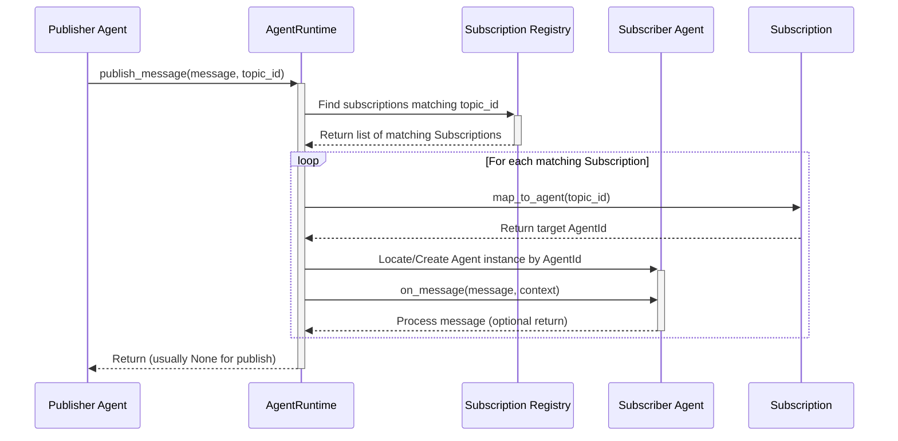

# Chapter 2: Messaging System (Topic & Subscription)

In [Chapter 1: Agent](01_agent.md), we learned about Agents as individual workers. But how do they coordinate when one agent doesn't know exactly *who* needs the information it produces? Imagine our Researcher finds some facts. Maybe the Writer needs them, but maybe a Fact-Checker agent or a Summary agent also needs them later. How can the Researcher just announce "Here are the facts!" without needing a specific mailing list?

This is where the **Messaging System**, specifically **Topics** and **Subscriptions**, comes in. It allows agents to broadcast messages to anyone interested, like posting on a company announcement board.

## Motivation: Broadcasting Information

Let's refine our blog post example:

1.  The `Researcher` agent finds facts about "AutoGen Agents".
2.  Instead of sending *directly* to the `Writer`, the `Researcher` **publishes** these facts to a general "research-results" **Topic**.
3.  The `Writer` agent has previously told the system it's **subscribed** to the "research-results" Topic.
4.  The system sees the new message on the Topic and delivers it to the `Writer` (and any other subscribers).

This way, the `Researcher` doesn't need to know who the `Writer` is, or even if a `Writer` exists! It just broadcasts the results. If we later add a `FactChecker` agent that also needs the results, it simply subscribes to the same Topic.

## Key Concepts: Topics and Subscriptions

Let's break down the components of this broadcasting system:

1.  **Topic (`TopicId`): The Announcement Board**
    *   A `TopicId` represents a specific channel or category for messages. Think of it like the name of an announcement board (e.g., "Project Updates", "General Announcements").
    *   It has two main parts:
        *   `type`: What *kind* of event or information is this? (e.g., "research.completed", "user.request"). This helps categorize messages.
        *   `source`: *Where* or *why* did this event originate? Often, this relates to the specific task or context (e.g., the specific blog post being researched like "autogen-agents-blog-post", or the team generating the event like "research-team").

    ```python
    # From: _topic.py (Simplified)
    from dataclasses import dataclass

    @dataclass(frozen=True) # Immutable: can't change after creation
    class TopicId:
        type: str
        source: str

        def __str__(self) -> str:
            # Creates an id like "research.completed/autogen-agents-blog-post"
            return f"{self.type}/{self.source}"
    ```
    This structure allows for flexible filtering. Agents might subscribe to all topics of a certain `type`, regardless of the `source`, or only to topics with a specific `source`.

2.  **Publishing: Posting the Announcement**
    *   When an agent has information to share broadly, it *publishes* a message to a specific `TopicId`.
    *   This is like pinning a note to the designated announcement board. The agent doesn't need to know who will read it.

3.  **Subscription (`Subscription`): Signing Up for Updates**
    *   A `Subscription` is how an agent declares its interest in certain `TopicId`s.
    *   It acts like a rule: "If a message is published to a Topic that matches *this pattern*, please deliver it to *this kind of agent*".
    *   The `Subscription` links a `TopicId` pattern (e.g., "all topics with type `research.completed`") to an `AgentId` (or a way to determine the `AgentId`).

4.  **Routing: Delivering the Mail**
    *   The `AgentRuntime` (the system manager we'll meet in [Chapter 3: AgentRuntime](03_agentruntime.md)) keeps track of all active `Subscription`s.
    *   When a message is published to a `TopicId`, the `AgentRuntime` checks which `Subscription`s match that `TopicId`.
    *   For each match, it uses the `Subscription`'s rule to figure out which specific `AgentId` should receive the message and delivers it.

## Use Case Example: Researcher Publishes, Writer Subscribes

Let's see how our Researcher and Writer can use this system.

**Goal:** Researcher publishes facts to a topic, Writer receives them via subscription.

**1. Define the Topic:**
We need a `TopicId` for research results. Let's say the `type` is "research.facts.available" and the `source` identifies the specific research task (e.g., "blog-post-autogen").

```python
# From: _topic.py
from autogen_core import TopicId

# Define the topic for this specific research task
research_topic_id = TopicId(type="research.facts.available", source="blog-post-autogen")

print(f"Topic ID: {research_topic_id}")
# Output: Topic ID: research.facts.available/blog-post-autogen
```
This defines the "announcement board" we'll use.

**2. Researcher Publishes:**
The `Researcher` agent, after finding facts, will use its `agent_context` (provided by the runtime) to publish the `ResearchFacts` message to this topic.

```python
# Simplified concept - Researcher agent logic
# Assume 'agent_context' and 'message' (ResearchTopic) are provided

# Define the facts message (from Chapter 1)
@dataclass
class ResearchFacts:
    topic: str
    facts: list[str]

async def researcher_publish_logic(agent_context, message: ResearchTopic, msg_context):
    print(f"Researcher working on: {message.topic}")
    facts_data = ResearchFacts(
        topic=message.topic,
        facts=[f"Fact A about {message.topic}", f"Fact B about {message.topic}"]
    )

    # Define the specific topic for this task's results
    results_topic = TopicId(type="research.facts.available", source=message.topic) # Use message topic as source

    # Publish the facts to the topic
    await agent_context.publish_message(message=facts_data, topic_id=results_topic)
    print(f"Researcher published facts to topic: {results_topic}")
    # No direct reply needed
    return None
```
Notice the `agent_context.publish_message` call. The Researcher doesn't specify a recipient, only the topic.

**3. Writer Subscribes:**
The `Writer` agent needs to tell the system it's interested in messages on topics like "research.facts.available". We can use a predefined `Subscription` type called `TypeSubscription`. This subscription typically means: "I am interested in all topics with this *exact type*. When a message arrives, create/use an agent of *my type* whose `key` matches the topic's `source`."

```python
# From: _type_subscription.py (Simplified Concept)
from autogen_core import TypeSubscription, BaseAgent

class WriterAgent(BaseAgent):
    # ... agent implementation ...
    async def on_message_impl(self, message: ResearchFacts, ctx):
        # This method gets called when a subscribed message arrives
        print(f"Writer ({self.id}) received facts via subscription: {message.facts}")
        # ... process facts and write draft ...

# How the Writer subscribes (usually done during runtime setup - Chapter 3)
# This tells the runtime: "Messages on topics with type 'research.facts.available'
# should go to a 'writer' agent whose key matches the topic source."
writer_subscription = TypeSubscription(
    topic_type="research.facts.available",
    agent_type="writer" # The type of agent that should handle this
)

print(f"Writer subscription created for topic type: {writer_subscription.topic_type}")
# Output: Writer subscription created for topic type: research.facts.available
```
When the `Researcher` publishes to `TopicId(type="research.facts.available", source="blog-post-autogen")`, the `AgentRuntime` will see that `writer_subscription` matches the `topic_type`. It will then use the rule: "Find (or create) an agent with `AgentId(type='writer', key='blog-post-autogen')` and deliver the message."

**Benefit:** Decoupling! The Researcher just broadcasts. The Writer just listens for relevant broadcasts. We can add more listeners (like a `FactChecker` subscribing to the same `topic_type`) without changing the `Researcher` at all.

## Under the Hood: How Publishing Works

Let's trace the journey of a published message.

**Conceptual Flow:**



1.  **Publish:** An agent calls `agent_context.publish_message(message, topic_id)`. This internally calls the `AgentRuntime`'s publish method.
2.  **Lookup:** The `AgentRuntime` takes the `topic_id` and consults its internal `Subscription Registry`.
3.  **Match:** The Registry checks all registered `Subscription` objects. Each `Subscription` has an `is_match(topic_id)` method. The registry finds all subscriptions where `is_match` returns `True`.
4.  **Map:** For each matching `Subscription`, the Runtime calls its `map_to_agent(topic_id)` method. This method returns the specific `AgentId` that should handle this message based on the subscription rule and the topic details.
5.  **Deliver:** The `AgentRuntime` finds the agent instance corresponding to the returned `AgentId` (potentially creating it if it doesn't exist yet, especially with `TypeSubscription`). It then calls that agent's `on_message` method, delivering the original published `message`.

**Code Glimpse:**

*   **`TopicId` (`_topic.py`):** As shown before, a simple dataclass holding `type` and `source`. It includes validation to ensure the `type` follows certain naming conventions.

    ```python
    # From: _topic.py
    @dataclass(eq=True, frozen=True)
    class TopicId:
        type: str
        source: str
        # ... validation and __str__ ...

        @classmethod
        def from_str(cls, topic_id: str) -> Self:
            # Helper to parse "type/source" string
            # ... implementation ...
    ```

*   **`Subscription` Protocol (`_subscription.py`):** This defines the *contract* for any subscription rule.

    ```python
    # From: _subscription.py (Simplified Protocol)
    from typing import Protocol
    # ... other imports

    class Subscription(Protocol):
        @property
        def id(self) -> str: ... # Unique ID for this subscription instance

        def is_match(self, topic_id: TopicId) -> bool:
            """Check if a topic matches this subscription's rule."""
            ...

        def map_to_agent(self, topic_id: TopicId) -> AgentId:
            """Determine the target AgentId if is_match was True."""
            ...
    ```
    Any class implementing these methods can act as a subscription rule.

*   **`TypeSubscription` (`_type_subscription.py`):** A common implementation of the `Subscription` protocol.

    ```python
    # From: _type_subscription.py (Simplified)
    class TypeSubscription(Subscription):
        def __init__(self, topic_type: str, agent_type: str, ...):
            self._topic_type = topic_type
            self._agent_type = agent_type
            # ... generates a unique self._id ...

        def is_match(self, topic_id: TopicId) -> bool:
            # Matches if the topic's type is exactly the one we want
            return topic_id.type == self._topic_type

        def map_to_agent(self, topic_id: TopicId) -> AgentId:
            # Maps to an agent of the specified type, using the
            # topic's source as the agent's unique key.
            if not self.is_match(topic_id):
                 raise CantHandleException(...) # Should not happen if used correctly
            return AgentId(type=self._agent_type, key=topic_id.source)
        # ... id property ...
    ```
    This implementation provides the "one agent instance per source" behavior for a specific topic type.

*   **`DefaultSubscription` (`_default_subscription.py`):** This is often used via a decorator (`@default_subscription`) and provides a convenient way to create a `TypeSubscription` where the `agent_type` is automatically inferred from the agent class being defined, and the `topic_type` defaults to "default" (but can be overridden). It simplifies common use cases.

    ```python
    # From: _default_subscription.py (Conceptual Usage)
    from autogen_core import BaseAgent, default_subscription, ResearchFacts

    @default_subscription # Uses 'default' topic type, infers agent type 'writer'
    class WriterAgent(BaseAgent):
        # Agent logic here...
        async def on_message_impl(self, message: ResearchFacts, ctx): ...

    # Or specify the topic type
    @default_subscription(topic_type="research.facts.available")
    class SpecificWriterAgent(BaseAgent):
         # Agent logic here...
         async def on_message_impl(self, message: ResearchFacts, ctx): ...
    ```

The actual sending (`publish_message`) and routing logic reside within the `AgentRuntime`, which we'll explore next.

## Next Steps

You've learned how AutoGen Core uses a publish/subscribe system (`TopicId`, `Subscription`) to allow agents to communicate without direct coupling. This is crucial for building flexible and scalable multi-agent applications.

*   **Topic (`TopicId`):** Named channels (`type`/`source`) for broadcasting messages.
*   **Publish:** Sending a message to a Topic.
*   **Subscription:** An agent's declared interest in messages on certain Topics, defining a routing rule.

Now, let's dive into the orchestrator that manages agents and makes this messaging system work:

*   [Chapter 3: AgentRuntime](03_agentruntime.md): The manager responsible for creating, running, and connecting agents, including handling message publishing and subscription routing.

---

Generated by [AI Codebase Knowledge Builder](https://github.com/The-Pocket/Tutorial-Codebase-Knowledge)