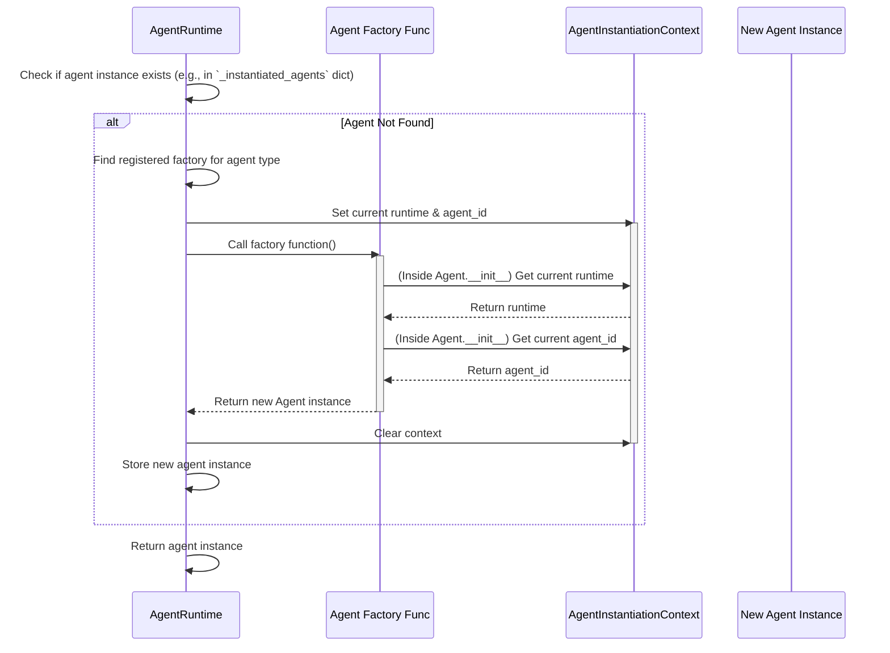
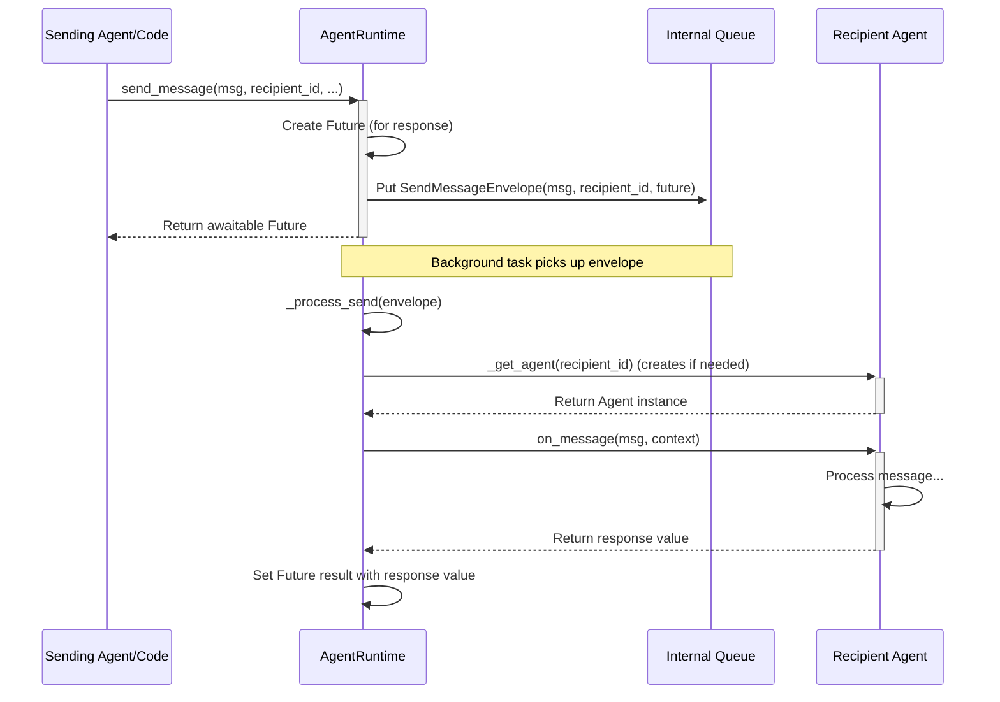
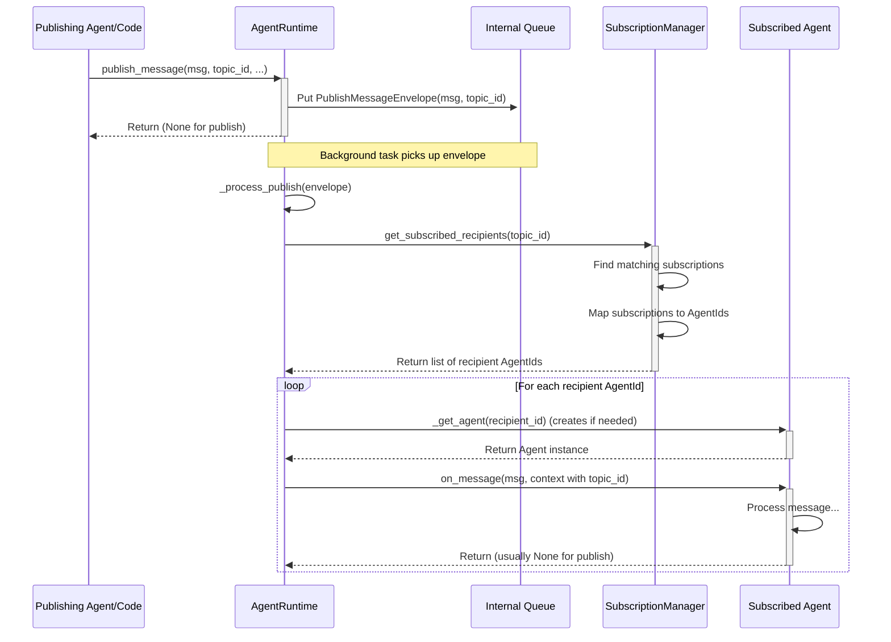

# Chapter 3: AgentRuntime - The Office Manager

In [Chapter 1: Agent](01_agent.md), we met the workers (`Agent`) of our system. In [Chapter 2: Messaging System](02_messaging_system__topic___subscription_.md), we saw how they can communicate broadly using topics and subscriptions. But who hires these agents? Who actually delivers the messages, whether direct or published? And who keeps the whole system running smoothly?

This is where the **`AgentRuntime`** comes in. It's the central nervous system, the operating system, or perhaps the most fitting analogy: **the office manager** for all your agents.

## Motivation: Why Do We Need an Office Manager?

Imagine an office full of employees (Agents). You have researchers, writers, maybe coders.
*   How does a new employee get hired and set up?
*   When one employee wants to send a memo directly to another, who makes sure it gets to the right desk?
*   When someone posts an announcement on the company bulletin board (publishes to a topic), who ensures everyone who signed up for that type of announcement sees it?
*   Who starts the workday and ensures everything keeps running?

Without an office manager, it would be chaos! The `AgentRuntime` serves this crucial role in AutoGen Core. It handles:

1.  **Agent Creation:** "Onboarding" new agents when they are needed.
2.  **Message Routing:** Delivering direct messages (`send_message`) and published messages (`publish_message`).
3.  **Lifecycle Management:** Starting, running, and stopping the whole system.
4.  **State Management:** Keeping track of the overall system state (optional).

## Key Concepts: Understanding the Manager's Job

Let's break down the main responsibilities of the `AgentRuntime`:

1.  **Agent Instantiation (Hiring):**
    *   You don't usually create agent objects directly (like `my_agent = ResearcherAgent()`). Why? Because the agent needs to know *about* the runtime (the office it works in) to send messages, publish announcements, etc.
    *   Instead, you tell the `AgentRuntime`: "I need an agent of type 'researcher'. Here's a recipe (a **factory function**) for how to create one." This is done using `runtime.register_factory(...)`.
    *   When a message needs to go to a 'researcher' agent with a specific key (e.g., 'researcher-01'), the runtime checks if it already exists. If not, it uses the registered factory function to create (instantiate) the agent.
    *   **Crucially**, while creating the agent, the runtime provides special context (`AgentInstantiationContext`) so the new agent automatically gets its unique `AgentId` and a reference to the `AgentRuntime` itself. This is like giving a new employee their ID badge and telling them who the office manager is.

    ```python
    # Simplified Concept - How a BaseAgent gets its ID and runtime access
    # From: _agent_instantiation.py and _base_agent.py

    # Inside the agent's __init__ method (when inheriting from BaseAgent):
    class MyAgent(BaseAgent):
        def __init__(self, description: str):
            # This magic happens *because* the AgentRuntime is creating the agent
            # inside a special context.
            self._runtime = AgentInstantiationContext.current_runtime() # Gets the manager
            self._id = AgentInstantiationContext.current_agent_id()     # Gets its own ID
            self._description = description
            # ... rest of initialization ...
    ```
    This ensures agents are properly integrated into the system from the moment they are created.

2.  **Message Delivery (Mail Room):**
    *   **Direct Send (`send_message`):** When an agent calls `await agent_context.send_message(message, recipient_id)`, it's actually telling the `AgentRuntime`, "Please deliver this `message` directly to the agent identified by `recipient_id`." The runtime finds the recipient agent (creating it if necessary) and calls its `on_message` method. It's like putting a specific name on an envelope and handing it to the mail room.
    *   **Publish (`publish_message`):** When an agent calls `await agent_context.publish_message(message, topic_id)`, it tells the runtime, "Post this `message` to the announcement board named `topic_id`." The runtime then checks its list of **subscriptions** (who signed up for which boards). For every matching subscription, it figures out the correct recipient agent(s) (based on the subscription rule) and delivers the message to their `on_message` method.

3.  **Lifecycle Management (Opening/Closing the Office):**
    *   The runtime needs to be started to begin processing messages. Typically, you call `runtime.start()`. This usually kicks off a background process or loop that watches for incoming messages.
    *   When work is done, you need to stop the runtime gracefully. `runtime.stop_when_idle()` is common – it waits until all messages currently in the queue have been processed, then stops. `runtime.stop()` stops more abruptly.

4.  **State Management (Office Records):**
    *   The runtime can save the state of *all* the agents it manages (`runtime.save_state()`) and load it back later (`runtime.load_state()`). This is useful for pausing and resuming complex multi-agent interactions. It can also save/load state for individual agents (`runtime.agent_save_state()` / `runtime.agent_load_state()`). We'll touch more on state in [Chapter 7: Memory](07_memory.md).

## Use Case Example: Running Our Researcher and Writer

Let's finally run the Researcher/Writer scenario from Chapters 1 and 2. We need the `AgentRuntime` to make it happen.

**Goal:**
1. Create a runtime.
2. Register factories for a 'researcher' and a 'writer' agent.
3. Tell the runtime that 'writer' agents are interested in "research.facts.available" topics (add subscription).
4. Start the runtime.
5. Send an initial `ResearchTopic` message to a 'researcher' agent.
6. Let the system run (Researcher publishes facts, Runtime delivers to Writer via subscription, Writer processes).
7. Stop the runtime when idle.

**Code Snippets (Simplified):**

```python
# 0. Imports and Message Definitions (from previous chapters)
import asyncio
from dataclasses import dataclass
from autogen_core import (
    AgentId, BaseAgent, SingleThreadedAgentRuntime, TopicId,
    MessageContext, TypeSubscription, AgentInstantiationContext
)

@dataclass
class ResearchTopic: topic: str
@dataclass
class ResearchFacts: topic: str; facts: list[str]
```
These are the messages our agents will exchange.

```python
# 1. Define Agent Logic (using BaseAgent)

class ResearcherAgent(BaseAgent):
    async def on_message_impl(self, message: ResearchTopic, ctx: MessageContext):
        print(f"Researcher ({self.id}) got topic: {message.topic}")
        facts = [f"Fact 1 about {message.topic}", f"Fact 2"]
        results_topic = TopicId("research.facts.available", message.topic)
        # Use the runtime (via self.publish_message helper) to publish
        await self.publish_message(
            ResearchFacts(topic=message.topic, facts=facts), results_topic
        )
        print(f"Researcher ({self.id}) published facts to {results_topic}")

class WriterAgent(BaseAgent):
    async def on_message_impl(self, message: ResearchFacts, ctx: MessageContext):
        print(f"Writer ({self.id}) received facts via topic '{ctx.topic_id}': {message.facts}")
        draft = f"Draft for {message.topic}: {'; '.join(message.facts)}"
        print(f"Writer ({self.id}) created draft: '{draft}'")
        # This agent doesn't send further messages in this example
```
Here we define the behavior of our two agent types, inheriting from `BaseAgent` which gives us `self.id`, `self.publish_message`, etc.

```python
# 2. Define Agent Factories

def researcher_factory():
    # Gets runtime/id via AgentInstantiationContext inside BaseAgent.__init__
    print("Runtime is creating a ResearcherAgent...")
    return ResearcherAgent(description="I research topics.")

def writer_factory():
    print("Runtime is creating a WriterAgent...")
    return WriterAgent(description="I write drafts from facts.")
```
These simple functions tell the runtime *how* to create instances of our agents when needed.

```python
# 3. Setup and Run the Runtime

async def main():
    # Create the runtime (the office manager)
    runtime = SingleThreadedAgentRuntime()

    # Register the factories (tell the manager how to hire)
    await runtime.register_factory("researcher", researcher_factory)
    await runtime.register_factory("writer", writer_factory)
    print("Registered agent factories.")

    # Add the subscription (tell manager who listens to which announcements)
    # Rule: Messages to topics of type "research.facts.available"
    # should go to a "writer" agent whose key matches the topic source.
    writer_sub = TypeSubscription(topic_type="research.facts.available", agent_type="writer")
    await runtime.add_subscription(writer_sub)
    print(f"Added subscription: {writer_sub.id}")

    # Start the runtime (open the office)
    runtime.start()
    print("Runtime started.")

    # Send the initial message to kick things off
    research_task_topic = "AutoGen Agents"
    researcher_instance_id = AgentId(type="researcher", key=research_task_topic)
    print(f"Sending initial topic '{research_task_topic}' to {researcher_instance_id}")
    await runtime.send_message(
        message=ResearchTopic(topic=research_task_topic),
        recipient=researcher_instance_id,
    )

    # Wait until all messages are processed (wait for work day to end)
    print("Waiting for runtime to become idle...")
    await runtime.stop_when_idle()
    print("Runtime stopped.")

# Run the main function
asyncio.run(main())
```
This script sets up the `SingleThreadedAgentRuntime`, registers the blueprints (factories) and communication rules (subscription), starts the process, and then shuts down cleanly.

**Expected Output (Conceptual Order):**

```
Registered agent factories.
Added subscription: type=research.facts.available=>agent=writer
Runtime started.
Sending initial topic 'AutoGen Agents' to researcher/AutoGen Agents
Waiting for runtime to become idle...
Runtime is creating a ResearcherAgent...  # First time researcher/AutoGen Agents is needed
Researcher (researcher/AutoGen Agents) got topic: AutoGen Agents
Researcher (researcher/AutoGen Agents) published facts to research.facts.available/AutoGen Agents
Runtime is creating a WriterAgent...      # First time writer/AutoGen Agents is needed (due to subscription)
Writer (writer/AutoGen Agents) received facts via topic 'research.facts.available/AutoGen Agents': ['Fact 1 about AutoGen Agents', 'Fact 2']
Writer (writer/AutoGen Agents) created draft: 'Draft for AutoGen Agents: Fact 1 about AutoGen Agents; Fact 2'
Runtime stopped.
```
You can see the runtime orchestrating the creation of agents and the flow of messages based on the initial request and the subscription rule.

## Under the Hood: How the Manager Works

Let's peek inside the `SingleThreadedAgentRuntime` (a common implementation provided by AutoGen Core) to understand the flow.

**Core Idea:** It uses an internal queue (`_message_queue`) to hold incoming requests (`send_message`, `publish_message`). A background task continuously takes items from the queue and processes them one by one (though the *handling* of a message might involve `await` and allow other tasks to run).

**1. Agent Creation (`_get_agent`, `_invoke_agent_factory`)**

When the runtime needs an agent instance (e.g., to deliver a message) that hasn't been created yet:



*   The runtime looks up the factory function registered for the required `AgentId.type`.
*   It uses `AgentInstantiationContext.populate_context` to temporarily store its own reference and the target `AgentId`.
*   It calls the factory function.
*   Inside the agent's `__init__` (usually via `BaseAgent`), `AgentInstantiationContext.current_runtime()` and `AgentInstantiationContext.current_agent_id()` are called to retrieve the context set by the runtime.
*   The factory returns the fully initialized agent instance.
*   The runtime stores this instance for future use.

```python
# From: _agent_instantiation.py (Simplified)
class AgentInstantiationContext:
    _CONTEXT_VAR = ContextVar("agent_context") # Stores (runtime, agent_id)

    @classmethod
    @contextmanager
    def populate_context(cls, ctx: tuple[AgentRuntime, AgentId]):
        token = cls._CONTEXT_VAR.set(ctx) # Store context for this block
        try:
            yield # Code inside the 'with' block runs here
        finally:
            cls._CONTEXT_VAR.reset(token) # Clean up context

    @classmethod
    def current_runtime(cls) -> AgentRuntime:
        return cls._CONTEXT_VAR.get()[0] # Retrieve runtime from context

    @classmethod
    def current_agent_id(cls) -> AgentId:
        return cls._CONTEXT_VAR.get()[1] # Retrieve agent_id from context
```
This context manager pattern ensures the correct runtime and ID are available *only* during the agent's creation by the runtime.

**2. Direct Messaging (`send_message` -> `_process_send`)**



*   `send_message` creates a `Future` object (a placeholder for the eventual result) and wraps the message details in a `SendMessageEnvelope`.
*   This envelope is put onto the internal `_message_queue`.
*   The background task picks up the envelope.
*   `_process_send` gets the recipient agent instance (using `_get_agent`).
*   It calls the recipient's `on_message` method.
*   When `on_message` returns a result, `_process_send` sets the result on the `Future` object, which makes the original `await runtime.send_message(...)` call return the value.

**3. Publish/Subscribe (`publish_message` -> `_process_publish`)**



*   `publish_message` wraps the message in a `PublishMessageEnvelope` and puts it on the queue.
*   The background task picks it up.
*   `_process_publish` asks the `SubscriptionManager` (`_subscription_manager`) for all `AgentId`s that are subscribed to the given `topic_id`.
*   The `SubscriptionManager` checks its registered `Subscription` objects (`_subscriptions` list, added via `add_subscription`). For each `Subscription` where `is_match(topic_id)` is true, it calls `map_to_agent(topic_id)` to get the target `AgentId`.
*   For each resulting `AgentId`, the runtime gets the agent instance and calls its `on_message` method, providing the `topic_id` in the `MessageContext`.

```python
# From: _runtime_impl_helpers.py (SubscriptionManager simplified)
class SubscriptionManager:
    def __init__(self):
        self._subscriptions: List[Subscription] = []
        # Optimization cache can be added here

    async def add_subscription(self, subscription: Subscription):
        self._subscriptions.append(subscription)
        # Clear cache if any

    async def get_subscribed_recipients(self, topic: TopicId) -> List[AgentId]:
        recipients = []
        for sub in self._subscriptions:
            if sub.is_match(topic):
                recipients.append(sub.map_to_agent(topic))
        return recipients
```
The `SubscriptionManager` simply iterates through registered subscriptions to find matches when a message is published.

## Next Steps

You now understand the `AgentRuntime` - the essential coordinator that brings Agents to life, manages their communication, and runs the entire show. It handles agent creation via factories, routes direct and published messages, and manages the system's lifecycle.

With the core concepts of `Agent`, `Messaging`, and `AgentRuntime` covered, we can start looking at more specialized building blocks. Next, we'll explore how agents can use external capabilities:

*   [Chapter 4: Tool](04_tool.md): How to give agents tools (like functions or APIs) to perform specific actions beyond just processing messages.

---

Generated by [AI Codebase Knowledge Builder](https://github.com/The-Pocket/Tutorial-Codebase-Knowledge)
