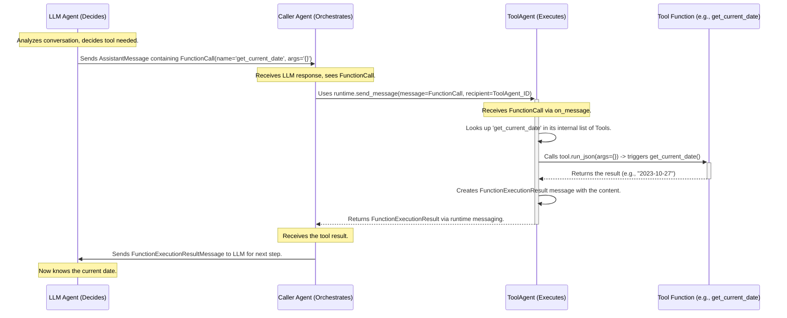

# Chapter 4: Tool - Giving Agents Specific Capabilities

In the previous chapters, we learned about Agents as workers ([Chapter 1](01_agent.md)), how they can communicate directly or using announcements ([Chapter 2](02_messaging_system__topic___subscription_.md)), and the `AgentRuntime` that manages them ([Chapter 3](03_agentruntime.md)).

Agents can process messages and coordinate, but what if an agent needs to perform a very specific action, like looking up information online, running a piece of code, accessing a database, or even just finding out the current date? They need specialized *capabilities*.

This is where the concept of a **Tool** comes in.

## Motivation: Agents Need Skills!

Imagine our `Writer` agent from before. It receives facts and writes a draft. Now, let's say we want the `Writer` (or perhaps a smarter `Assistant` agent helping it) to always include the current date in the blog post title.

How does the agent get the current date? It doesn't inherently know it. It needs a specific *skill* or *tool* for that.

A `Tool` in AutoGen Core represents exactly this: a specific, well-defined capability that an Agent can use. Think of it like giving an employee (Agent) a specialized piece of equipment (Tool), like a calculator, a web browser, or a calendar lookup program.

## Key Concepts: Understanding Tools

Let's break down what defines a Tool:

1.  **It's a Specific Capability:** A Tool performs one well-defined task. Examples:
    *   `search_web(query: str)`
    *   `run_python_code(code: str)`
    *   `get_stock_price(ticker: str)`
    *   `get_current_date()`

2.  **It Has a Schema (The Manual):** This is crucial! For an Agent (especially one powered by a Large Language Model - LLM) to know *when* and *how* to use a tool, the tool needs a clear description or "manual". This is called the `ToolSchema`. It typically includes:
    *   **`name`**: A unique identifier for the tool (e.g., `get_current_date`).
    *   **`description`**: A clear explanation of what the tool does, which helps the LLM decide if this tool is appropriate for the current task (e.g., "Fetches the current date in YYYY-MM-DD format").
    *   **`parameters`**: Defines what inputs the tool needs. This is itself a schema (`ParametersSchema`) describing the input fields, their types, and which ones are required. For our `get_current_date` example, it might need no parameters. For `get_stock_price`, it would need a `ticker` parameter of type string.

    ```python
    # From: tools/_base.py (Simplified Concept)
    from typing import TypedDict, Dict, Any, Sequence, NotRequired

    class ParametersSchema(TypedDict):
        type: str # Usually "object"
        properties: Dict[str, Any] # Defines input fields and their types
        required: NotRequired[Sequence[str]] # List of required field names

    class ToolSchema(TypedDict):
        name: str
        description: NotRequired[str]
        parameters: NotRequired[ParametersSchema]
        # 'strict' flag also possible (Chapter 5 related)
    ```
    This schema allows an LLM to understand: "Ah, there's a tool called `get_current_date` that takes no inputs and gives me the current date. I should use that now!"

3.  **It Can Be Executed:** Once an agent decides to use a tool (often based on the schema), there needs to be a mechanism to actually *run* the tool's underlying function and get the result.

## Use Case Example: Adding a `get_current_date` Tool

Let's equip an agent with the ability to find the current date.

**Goal:** Define a tool that gets the current date and show how it could be executed by a specialized agent.

**Step 1: Define the Python Function**

First, we need the actual Python code that performs the action.

```python
# File: get_date_function.py
import datetime

def get_current_date() -> str:
    """Fetches the current date as a string."""
    today = datetime.date.today()
    return today.isoformat() # Returns date like "2023-10-27"

# Test the function
print(f"Function output: {get_current_date()}")
```
This is a standard Python function. It takes no arguments and returns the date as a string.

**Step 2: Wrap it as a `FunctionTool`**

AutoGen Core provides a convenient way to turn a Python function like this into a `Tool` object using `FunctionTool`. It automatically inspects the function's signature (arguments and return type) and docstring to help build the `ToolSchema`.

```python
# File: create_date_tool.py
from autogen_core.tools import FunctionTool
from get_date_function import get_current_date # Import our function

# Create the Tool instance
# We provide the function and a clear description for the LLM
date_tool = FunctionTool(
    func=get_current_date,
    description="Use this tool to get the current date in YYYY-MM-DD format."
    # Name defaults to function name 'get_current_date'
)

# Let's see what FunctionTool generated
print(f"Tool Name: {date_tool.name}")
print(f"Tool Description: {date_tool.description}")

# The schema defines inputs (none in this case)
# print(f"Tool Schema Parameters: {date_tool.schema['parameters']}")
# Output (simplified): {'type': 'object', 'properties': {}, 'required': []}
```
`FunctionTool` wraps our `get_current_date` function. It uses the function name as the tool name and the description we provided. It also correctly determines from the function signature that there are no input parameters (`properties: {}`).

**Step 3: How an Agent Might Request Tool Use**

Now we have a `date_tool`. How is it used? Typically, an LLM-powered agent (which we'll see more of in [Chapter 5: ChatCompletionClient](05_chatcompletionclient.md)) analyzes a request and decides a tool is needed. It then generates a request to *call* that tool, often using a specific message type like `FunctionCall`.

```python
# File: tool_call_request.py
from autogen_core import FunctionCall # Represents a request to call a tool

# Imagine an LLM agent decided to use the date tool.
# It constructs this message, providing the tool name and arguments (as JSON string).
date_call_request = FunctionCall(
    id="call_date_001", # A unique ID for this specific call attempt
    name="get_current_date", # Matches the Tool's name
    arguments="{}" # An empty JSON object because no arguments are needed
)

print("FunctionCall message:", date_call_request)
# Output: FunctionCall(id='call_date_001', name='get_current_date', arguments='{}')
```
This `FunctionCall` message is like a work order: "Please execute the tool named `get_current_date` with these arguments."

**Step 4: The `ToolAgent` Executes the Tool**

Who receives this `FunctionCall` message? Usually, a specialized agent called `ToolAgent`. You create a `ToolAgent` and give it the list of tools it knows how to execute. When it receives a `FunctionCall`, it finds the matching tool and runs it.

```python
# File: tool_agent_example.py
import asyncio
from autogen_core.tool_agent import ToolAgent
from autogen_core.models import FunctionExecutionResult
from create_date_tool import date_tool # Import the tool we created
from tool_call_request import date_call_request # Import the request message

# Create an agent specifically designed to execute tools
tool_executor = ToolAgent(
    description="I can execute tools like getting the date.",
    tools=[date_tool] # Give it the list of tools it manages
)

# --- Simulation of Runtime delivering the message ---
# In a real app, the AgentRuntime (Chapter 3) would route the
# date_call_request message to this tool_executor agent.
# We simulate the call to its message handler here:

async def simulate_execution():
    # Fake context (normally provided by runtime)
    class MockContext: cancellation_token = None
    ctx = MockContext()

    print(f"ToolAgent received request: {date_call_request.name}")
    result: FunctionExecutionResult = await tool_executor.handle_function_call(
        message=date_call_request,
        ctx=ctx
    )
    print(f"ToolAgent produced result: {result}")

asyncio.run(simulate_execution())
```

**Expected Output:**

```
ToolAgent received request: get_current_date
ToolAgent produced result: FunctionExecutionResult(content='2023-10-27', call_id='call_date_001', is_error=False, name='get_current_date') # Date will be current date
```
The `ToolAgent` received the `FunctionCall`, found the `date_tool` in its list, executed the underlying `get_current_date` function, and packaged the result (the date string) into a `FunctionExecutionResult` message. This result message can then be sent back to the agent that originally requested the tool use.

## Under the Hood: How Tool Execution Works

Let's visualize the typical flow when an LLM agent decides to use a tool managed by a `ToolAgent`.

**Conceptual Flow:**



1.  **Decision:** An LLM-powered agent decides a tool is needed based on the conversation and the available tools' descriptions. It generates a `FunctionCall`.
2.  **Request:** A "Caller" agent (often the same LLM agent or a managing agent) sends this `FunctionCall` message to the dedicated `ToolAgent` using the `AgentRuntime`.
3.  **Lookup:** The `ToolAgent` receives the message, extracts the tool `name` (`get_current_date`), and finds the corresponding `Tool` object (our `date_tool`) in the list it was configured with.
4.  **Execution:** The `ToolAgent` calls the `run_json` method on the `Tool` object, passing the arguments from the `FunctionCall`. For a `FunctionTool`, `run_json` validates the arguments against the generated schema and then executes the original Python function (`get_current_date`).
5.  **Result:** The Python function returns its result (the date string).
6.  **Response:** The `ToolAgent` wraps this result string in a `FunctionExecutionResult` message, including the original `call_id`, and sends it back to the Caller agent.
7.  **Continuation:** The Caller agent typically sends this result back to the LLM agent, allowing the conversation or task to continue with the new information.

**Code Glimpse:**

*   **`Tool` Protocol (`tools/_base.py`):** Defines the basic contract any tool must fulfill. Key methods are `schema` (property returning the `ToolSchema`) and `run_json` (method to execute the tool with JSON-like arguments).
*   **`BaseTool` (`tools/_base.py`):** An abstract class that helps implement the `Tool` protocol, especially using Pydantic models for defining arguments (`args_type`) and return values (`return_type`). It automatically generates the `parameters` part of the schema from the `args_type` model.
*   **`FunctionTool` (`tools/_function_tool.py`):** Inherits from `BaseTool`. Its magic lies in automatically creating the `args_type` Pydantic model by inspecting the wrapped Python function's signature (`args_base_model_from_signature`). Its `run` method handles calling the original sync or async Python function.
    ```python
    # Inside FunctionTool (Simplified Concept)
    class FunctionTool(BaseTool[BaseModel, BaseModel]):
        def __init__(self, func, description, ...):
            self._func = func
            self._signature = get_typed_signature(func)
            # Automatically create Pydantic model for arguments
            args_model = args_base_model_from_signature(...)
            # Get return type from signature
            return_type = self._signature.return_annotation
            super().__init__(args_model, return_type, ...)

        async def run(self, args: BaseModel, ...):
            # Extract arguments from the 'args' model
            kwargs = args.model_dump()
            # Call the original Python function (sync or async)
            result = await self._call_underlying_func(**kwargs)
            return result # Must match the expected return_type
    ```
*   **`ToolAgent` (`tool_agent/_tool_agent.py`):** A specialized `RoutedAgent`. It registers a handler specifically for `FunctionCall` messages.
    ```python
    # Inside ToolAgent (Simplified Concept)
    class ToolAgent(RoutedAgent):
        def __init__(self, ..., tools: List[Tool]):
            super().__init__(...)
            self._tools = {tool.name: tool for tool in tools} # Store tools by name

        @message_handler # Registers this for FunctionCall messages
        async def handle_function_call(self, message: FunctionCall, ctx: MessageContext):
            # Find the tool by name
            tool = self._tools.get(message.name)
            if tool is None:
                # Handle error: Tool not found
                raise ToolNotFoundException(...)
            try:
                # Parse arguments string into a dictionary
                arguments = json.loads(message.arguments)
                # Execute the tool's run_json method
                result_obj = await tool.run_json(args=arguments, ...)
                # Convert result object back to string if needed
                result_str = tool.return_value_as_string(result_obj)
                # Create the success result message
                return FunctionExecutionResult(content=result_str, ...)
            except Exception as e:
                # Handle execution errors
                return FunctionExecutionResult(content=f"Error: {e}", is_error=True, ...)
    ```
    Its core logic is: find tool -> parse args -> run tool -> return result/error.

## Next Steps

You've learned how **Tools** provide specific capabilities to Agents, defined by a **Schema** that LLMs can understand. We saw how `FunctionTool` makes it easy to wrap existing Python functions and how `ToolAgent` acts as the executor for these tools.

This ability for agents to use tools is fundamental to building powerful and versatile AI systems that can interact with the real world or perform complex calculations.

Now that agents can use tools, we need to understand more about the agents that *decide* which tools to use, which often involves interacting with Large Language Models:

*   [Chapter 5: ChatCompletionClient](05_chatcompletionclient.md): How agents interact with LLMs like GPT to generate responses or decide on actions (like calling a tool).
*   [Chapter 6: ChatCompletionContext](06_chatcompletioncontext.md): How the history of the conversation, including tool calls and results, is managed when talking to an LLM.

---

Generated by [AI Codebase Knowledge Builder](https://github.com/The-Pocket/Tutorial-Codebase-Knowledge)