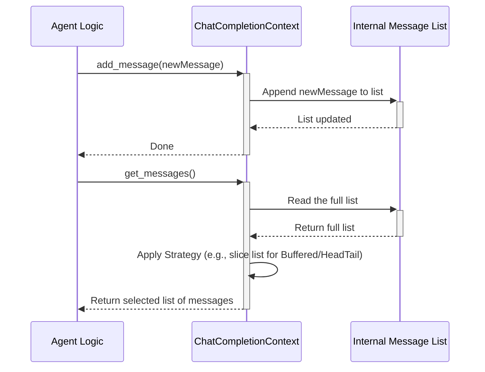

# Chapter 6: ChatCompletionContext - Remembering the Conversation

In [Chapter 5: ChatCompletionClient](05_chatcompletionclient.md), we learned how agents talk to Large Language Models (LLMs) using a `ChatCompletionClient`. We saw that we need to send a list of `messages` (the conversation history) to the LLM so it knows the context.

But conversations can get very long! Imagine talking on the phone for an hour. Can you remember *every single word* that was said? Probably not. You remember the main points, the beginning, and what was said most recently. LLMs have a similar limitation – they can only pay attention to a certain amount of text at once (called the "context window").

If we send the *entire* history of a very long chat, it might be too much for the LLM, lead to errors, be slow, or cost more money (since many LLMs charge based on the amount of text).

So, how do we smartly choose *which* parts of the conversation history to send? This is the problem that **`ChatCompletionContext`** solves.

## Motivation: Keeping LLM Conversations Focused

Let's say we have a helpful assistant agent chatting with a user:

1.  **User:** "Hi! Can you tell me about AutoGen?"
2.  **Assistant:** "Sure! AutoGen is a framework..." (provides details)
3.  **User:** "Thanks! Now, can you draft an email to my team about our upcoming meeting?"
4.  **Assistant:** "Okay, what's the meeting about?"
5.  **User:** "It's about the project planning for Q3."
6.  **Assistant:** (Needs to draft the email)

When the Assistant needs to draft the email (step 6), does it need the *exact* text from step 2 about what AutoGen is? Probably not. It definitely needs the instructions from step 3 and the topic from step 5. Maybe the initial greeting isn't super important either.

`ChatCompletionContext` acts like a **smart transcript editor**. Before sending the history to the LLM via the `ChatCompletionClient`, it reviews the full conversation log and prepares a shorter, focused version containing only the messages it thinks are most relevant for the LLM's next response.

## Key Concepts: Managing the Chat History

1.  **The Full Transcript Holder:** A `ChatCompletionContext` object holds the *complete* list of messages (`LLMMessage` objects like `SystemMessage`, `UserMessage`, `AssistantMessage` from Chapter 5) that have occurred in a specific conversation thread. You add new messages using its `add_message` method.

2.  **The Smart View Generator (`get_messages`):** The core job of `ChatCompletionContext` is done by its `get_messages` method. When called, it looks at the *full* transcript it holds, but returns only a *subset* of those messages based on its specific strategy. This subset is what you'll actually send to the `ChatCompletionClient`.

3.  **Different Strategies for Remembering:** Because different situations require different focus, AutoGen Core provides several `ChatCompletionContext` implementations (strategies):
    *   **`UnboundedChatCompletionContext`:** The simplest (and sometimes riskiest!). It doesn't edit anything; `get_messages` just returns the *entire* history. Good for short chats, but can break with long ones.
    *   **`BufferedChatCompletionContext`:** Like remembering only the last few things someone said. It keeps the most recent `N` messages (where `N` is the `buffer_size` you set). Good for focusing on recent interactions.
    *   **`HeadAndTailChatCompletionContext`:** Tries to get the best of both worlds. It keeps the first few messages (the "head", maybe containing initial instructions) and the last few messages (the "tail", the recent context). It skips the messages in the middle.

## Use Case Example: Chatting with Different Memory Strategies

Let's simulate adding messages to different context managers and see what `get_messages` returns.

**Step 1: Define some messages**

```python
# File: define_chat_messages.py
from autogen_core.models import (
    SystemMessage, UserMessage, AssistantMessage, LLMMessage
)
from typing import List

# The initial instruction for the assistant
system_msg = SystemMessage(content="You are a helpful assistant.")

# A sequence of user/assistant turns
chat_sequence: List[LLMMessage] = [
    UserMessage(content="What is AutoGen?", source="User"),
    AssistantMessage(content="AutoGen is a multi-agent framework...", source="Agent"),
    UserMessage(content="What can it do?", source="User"),
    AssistantMessage(content="It can build complex LLM apps.", source="Agent"),
    UserMessage(content="Thanks!", source="User")
]

# Combine system message and the chat sequence
full_history: List[LLMMessage] = [system_msg] + chat_sequence

print(f"Total messages in full history: {len(full_history)}")
# Output: Total messages in full history: 6
```
We have a full history of 6 messages (1 system + 5 chat turns).

**Step 2: Use `UnboundedChatCompletionContext`**

This context keeps everything.

```python
# File: use_unbounded_context.py
import asyncio
from define_chat_messages import full_history
from autogen_core.model_context import UnboundedChatCompletionContext

async def main():
    # Create context and add all messages
    context = UnboundedChatCompletionContext()
    for msg in full_history:
        await context.add_message(msg)

    # Get the messages to send to the LLM
    messages_for_llm = await context.get_messages()

    print(f"--- Unbounded Context ({len(messages_for_llm)} messages) ---")
    for i, msg in enumerate(messages_for_llm):
        print(f"{i+1}. [{msg.type}]: {msg.content[:30]}...")

# asyncio.run(main()) # If run
```

**Expected Output (Unbounded):**
```
--- Unbounded Context (6 messages) ---
1. [SystemMessage]: You are a helpful assistant....
2. [UserMessage]: What is AutoGen?...
3. [AssistantMessage]: AutoGen is a multi-agent fram...
4. [UserMessage]: What can it do?...
5. [AssistantMessage]: It can build complex LLM apps...
6. [UserMessage]: Thanks!...
```
It returns all 6 messages, exactly as added.

**Step 3: Use `BufferedChatCompletionContext`**

Let's keep only the last 3 messages.

```python
# File: use_buffered_context.py
import asyncio
from define_chat_messages import full_history
from autogen_core.model_context import BufferedChatCompletionContext

async def main():
    # Keep only the last 3 messages
    context = BufferedChatCompletionContext(buffer_size=3)
    for msg in full_history:
        await context.add_message(msg)

    messages_for_llm = await context.get_messages()

    print(f"--- Buffered Context (buffer=3, {len(messages_for_llm)} messages) ---")
    for i, msg in enumerate(messages_for_llm):
        print(f"{i+1}. [{msg.type}]: {msg.content[:30]}...")

# asyncio.run(main()) # If run
```

**Expected Output (Buffered):**
```
--- Buffered Context (buffer=3, 3 messages) ---
1. [UserMessage]: What can it do?...
2. [AssistantMessage]: It can build complex LLM apps...
3. [UserMessage]: Thanks!...
```
It only returns the last 3 messages from the full history. The system message and the first chat turn are omitted.

**Step 4: Use `HeadAndTailChatCompletionContext`**

Let's keep the first message (head=1) and the last two messages (tail=2).

```python
# File: use_head_tail_context.py
import asyncio
from define_chat_messages import full_history
from autogen_core.model_context import HeadAndTailChatCompletionContext

async def main():
    # Keep first 1 and last 2 messages
    context = HeadAndTailChatCompletionContext(head_size=1, tail_size=2)
    for msg in full_history:
        await context.add_message(msg)

    messages_for_llm = await context.get_messages()

    print(f"--- Head & Tail Context (h=1, t=2, {len(messages_for_llm)} messages) ---")
    for i, msg in enumerate(messages_for_llm):
        print(f"{i+1}. [{msg.type}]: {msg.content[:30]}...")

# asyncio.run(main()) # If run
```

**Expected Output (Head & Tail):**
```
--- Head & Tail Context (h=1, t=2, 4 messages) ---
1. [SystemMessage]: You are a helpful assistant....
2. [UserMessage]: Skipped 3 messages....
3. [AssistantMessage]: It can build complex LLM apps...
4. [UserMessage]: Thanks!...
```
It keeps the very first message (`SystemMessage`), then inserts a placeholder telling the LLM that some messages were skipped, and finally includes the last two messages. This preserves the initial instruction and the most recent context.

**Which one to choose?** It depends on your agent's task!
*   Simple Q&A? `Buffered` might be fine.
*   Following complex initial instructions? `HeadAndTail` or even `Unbounded` (if short) might be better.

## Under the Hood: How Context is Managed

The core idea is defined by the `ChatCompletionContext` abstract base class.

**Conceptual Flow:**



1.  **Adding:** When `add_message(message)` is called, the context simply appends the `message` to its internal list (`self._messages`).
2.  **Getting:** When `get_messages()` is called:
    *   The context accesses its internal `self._messages` list.
    *   The specific implementation (`Unbounded`, `Buffered`, `HeadAndTail`) applies its logic to select which messages to return.
    *   It returns the selected list.

**Code Glimpse:**

*   **Base Class (`_chat_completion_context.py`):** Defines the structure and common methods.

    ```python
    # From: model_context/_chat_completion_context.py (Simplified)
    from abc import ABC, abstractmethod
    from typing import List
    from ..models import LLMMessage

    class ChatCompletionContext(ABC):
        component_type = "chat_completion_context" # Identifies this as a component type

        def __init__(self, initial_messages: List[LLMMessage] | None = None) -> None:
            # Holds the COMPLETE history
            self._messages: List[LLMMessage] = initial_messages or []

        async def add_message(self, message: LLMMessage) -> None:
            """Add a message to the full context."""
            self._messages.append(message)

        @abstractmethod
        async def get_messages(self) -> List[LLMMessage]:
            """Get the subset of messages based on the strategy."""
            # Each subclass MUST implement this logic
            ...

        # Other methods like clear(), save_state(), load_state() exist too
    ```
    The base class handles storing messages; subclasses define *how* to retrieve them.

*   **Unbounded (`_unbounded_chat_completion_context.py`):** The simplest implementation.

    ```python
    # From: model_context/_unbounded_chat_completion_context.py (Simplified)
    from typing import List
    from ._chat_completion_context import ChatCompletionContext
    from ..models import LLMMessage

    class UnboundedChatCompletionContext(ChatCompletionContext):
        async def get_messages(self) -> List[LLMMessage]:
            """Returns all messages."""
            return self._messages # Just return the whole internal list
    ```

*   **Buffered (`_buffered_chat_completion_context.py`):** Uses slicing to get the end of the list.

    ```python
    # From: model_context/_buffered_chat_completion_context.py (Simplified)
    from typing import List
    from ._chat_completion_context import ChatCompletionContext
    from ..models import LLMMessage, FunctionExecutionResultMessage

    class BufferedChatCompletionContext(ChatCompletionContext):
        def __init__(self, buffer_size: int, ...):
            super().__init__(...)
            self._buffer_size = buffer_size

        async def get_messages(self) -> List[LLMMessage]:
            """Get at most `buffer_size` recent messages."""
            # Slice the list to get the last 'buffer_size' items
            messages = self._messages[-self._buffer_size :]
            # Special case: Avoid starting with a function result message
            if messages and isinstance(messages[0], FunctionExecutionResultMessage):
                messages = messages[1:]
            return messages
    ```

*   **Head and Tail (`_head_and_tail_chat_completion_context.py`):** Combines slices from the beginning and end.

    ```python
    # From: model_context/_head_and_tail_chat_completion_context.py (Simplified)
    from typing import List
    from ._chat_completion_context import ChatCompletionContext
    from ..models import LLMMessage, UserMessage

    class HeadAndTailChatCompletionContext(ChatCompletionContext):
        def __init__(self, head_size: int, tail_size: int, ...):
            super().__init__(...)
            self._head_size = head_size
            self._tail_size = tail_size

        async def get_messages(self) -> List[LLMMessage]:
            head = self._messages[: self._head_size] # First 'head_size' items
            tail = self._messages[-self._tail_size :] # Last 'tail_size' items
            num_skipped = len(self._messages) - len(head) - len(tail)

            if num_skipped <= 0: # If no overlap or gap
                return self._messages
            else: # If messages were skipped
                placeholder = [UserMessage(content=f"Skipped {num_skipped} messages.", source="System")]
                # Combine head + placeholder + tail
                return head + placeholder + tail
    ```
    These implementations provide different ways to manage the context window effectively.

## Putting it Together with ChatCompletionClient

How does an agent use `ChatCompletionContext` with the `ChatCompletionClient` from Chapter 5?

1.  An agent has an instance of a `ChatCompletionContext` (e.g., `BufferedChatCompletionContext`) to store its conversation history.
2.  When the agent receives a new message (e.g., a `UserMessage`), it calls `await context.add_message(new_user_message)`.
3.  To prepare for calling the LLM, the agent calls `messages_to_send = await context.get_messages()`. This gets the strategically selected subset of the history.
4.  The agent then passes this list to the `ChatCompletionClient`: `response = await llm_client.create(messages=messages_to_send, ...)`.
5.  When the LLM replies (e.g., with an `AssistantMessage`), the agent adds it back to the context: `await context.add_message(llm_response_message)`.

This loop ensures that the history is continuously updated and intelligently trimmed before each call to the LLM.

## Next Steps

You've learned how `ChatCompletionContext` helps manage the conversation history sent to LLMs, preventing context window overflows and keeping the interaction focused using different strategies (`Unbounded`, `Buffered`, `HeadAndTail`).

This context management is a specific form of **memory**. Agents might need to remember things beyond just the chat history. How do they store general information, state, or knowledge over time?

*   [Chapter 7: Memory](07_memory.md): Explore the broader concept of Memory in AutoGen Core, which provides more general ways for agents to store and retrieve information.
*   [Chapter 8: Component](08_component.md): Understand how `ChatCompletionContext` fits into the general `Component` model, allowing configuration and integration within the AutoGen system.

---

Generated by [AI Codebase Knowledge Builder](https://github.com/The-Pocket/Tutorial-Codebase-Knowledge)