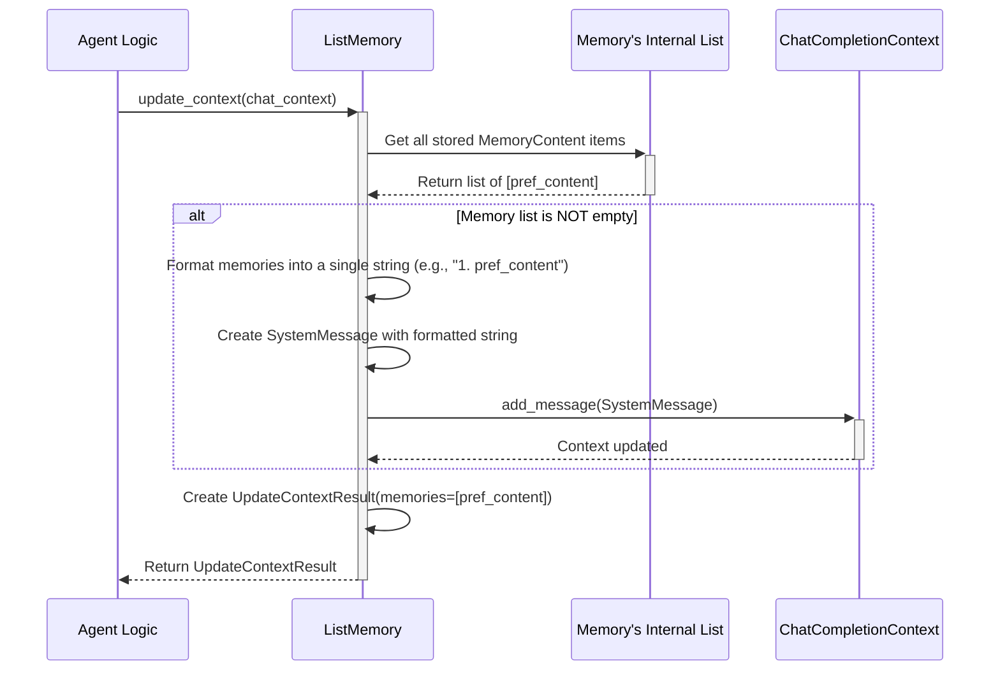

# Chapter 7: Memory - The Agent's Notebook

In [Chapter 6: ChatCompletionContext](06_chatcompletioncontext.md), we saw how agents manage the *short-term* history of a single conversation before talking to an LLM. It's like remembering what was just said in the last few minutes.

But what if an agent needs to remember things for much longer, across *multiple* conversations or tasks? For example, imagine an assistant agent that learns your preferences:
*   You tell it: "Please always write emails in a formal style for me."
*   Weeks later, you ask it to draft a new email.

How does it remember that preference? The short-term `ChatCompletionContext` might have forgotten the earlier instruction, especially if using a strategy like `BufferedChatCompletionContext`. The agent needs a **long-term memory**.

This is where the **`Memory`** abstraction comes in. Think of it as the agent's **long-term notebook or database**. While `ChatCompletionContext` is the scratchpad for the current chat, `Memory` holds persistent information the agent can add to or look up later.

## Motivation: Remembering Across Conversations

Our goal is to give an agent the ability to store a piece of information (like a user preference) and retrieve it later to influence its behavior, even in a completely new conversation. `Memory` provides the mechanism for this long-term storage and retrieval.

## Key Concepts: How the Notebook Works

1.  **What it Stores (`MemoryContent`):** Agents can store various types of information in their memory. This could be:
    *   Plain text notes (`text/plain`)
    *   Structured data like JSON (`application/json`)
    *   Even images (`image/*`)
    Each piece of information is wrapped in a `MemoryContent` object, which includes the data itself, its type (`mime_type`), and optional descriptive `metadata`.

    ```python
    # From: memory/_base_memory.py (Simplified Concept)
    from pydantic import BaseModel
    from typing import Any, Dict, Union

    # Represents one entry in the memory notebook
    class MemoryContent(BaseModel):
        content: Union[str, bytes, Dict[str, Any]] # The actual data
        mime_type: str # What kind of data (e.g., "text/plain")
        metadata: Dict[str, Any] | None = None # Extra info (optional)
    ```
    This standard format helps manage different kinds of memories.

2.  **Adding to Memory (`add`):** When an agent learns something important it wants to remember long-term (like the user's preferred style), it uses the `memory.add(content)` method. This is like writing a new entry in the notebook.

3.  **Querying Memory (`query`):** When an agent needs to recall information, it can use `memory.query(query_text)`. This is like searching the notebook for relevant entries. How the search works depends on the specific memory implementation (it could be a simple text match, or a sophisticated vector search in more advanced memories).

4.  **Updating Chat Context (`update_context`):** This is a crucial link! Before an agent talks to the LLM (using the `ChatCompletionClient` from [Chapter 5](05_chatcompletionclient.md)), it can use `memory.update_context(chat_context)` method. This method:
    *   Looks at the current conversation (`chat_context`).
    *   Queries the long-term memory (`Memory`) for relevant information.
    *   Injects the retrieved memories *into* the `chat_context`, often as a `SystemMessage`.
    This way, the LLM gets the benefit of the long-term memory *in addition* to the short-term conversation history, right before generating its response.

5.  **Different Memory Implementations:** Just like there are different `ChatCompletionContext` strategies, there can be different `Memory` implementations:
    *   `ListMemory`: A very simple memory that stores everything in a Python list (like a simple chronological notebook).
    *   *Future Possibilities*: More advanced implementations could use databases or vector stores for more efficient storage and retrieval of vast amounts of information.

## Use Case Example: Remembering User Preferences with `ListMemory`

Let's implement our user preference use case using the simple `ListMemory`.

**Goal:**
1. Create a `ListMemory`.
2. Add a user preference ("formal style") to it.
3. Start a *new* chat context.
4. Use `update_context` to inject the preference into the new chat context.
5. Show how the chat context looks *before* being sent to the LLM.

**Step 1: Create the Memory**

We'll use `ListMemory`, the simplest implementation provided by AutoGen Core.

```python
# File: create_list_memory.py
from autogen_core.memory import ListMemory

# Create a simple list-based memory instance
user_prefs_memory = ListMemory(name="user_preferences")

print(f"Created memory: {user_prefs_memory.name}")
print(f"Initial content: {user_prefs_memory.content}")
# Output:
# Created memory: user_preferences
# Initial content: []
```
We have an empty memory notebook named "user_preferences".

**Step 2: Add the Preference**

Let's add the user's preference as a piece of text memory.

```python
# File: add_preference.py
import asyncio
from autogen_core.memory import MemoryContent
# Assume user_prefs_memory exists from the previous step

# Define the preference as MemoryContent
preference = MemoryContent(
    content="User prefers all communication to be written in a formal style.",
    mime_type="text/plain", # It's just text
    metadata={"source": "user_instruction_conversation_1"} # Optional info
)

async def add_to_memory():
    # Add the content to our memory instance
    await user_prefs_memory.add(preference)
    print(f"Memory content after adding: {user_prefs_memory.content}")

asyncio.run(add_to_memory())
# Output (will show the MemoryContent object):
# Memory content after adding: [MemoryContent(content='User prefers...', mime_type='text/plain', metadata={'source': '...'})]
```
We've successfully written the preference into our `ListMemory` notebook.

**Step 3: Start a New Chat Context**

Imagine time passes, and the user starts a new conversation asking for an email draft. We create a fresh `ChatCompletionContext`.

```python
# File: start_new_chat.py
from autogen_core.model_context import UnboundedChatCompletionContext
from autogen_core.models import UserMessage

# Start a new, empty chat context for a new task
new_chat_context = UnboundedChatCompletionContext()

# Add the user's new request
new_request = UserMessage(content="Draft an email to the team about the Q3 results.", source="User")
# await new_chat_context.add_message(new_request) # In a real app, add the request

print("Created a new, empty chat context.")
# Output: Created a new, empty chat context.
```
This context currently *doesn't* know about the "formal style" preference stored in our long-term memory.

**Step 4: Inject Memory into Chat Context**

Before sending the `new_chat_context` to the LLM, we use `update_context` to bring in relevant long-term memories.

```python
# File: update_chat_with_memory.py
import asyncio
# Assume user_prefs_memory exists (with the preference added)
# Assume new_chat_context exists (empty or with just the new request)
# Assume new_request exists

async def main():
    # --- This is where Memory connects to Chat Context ---
    print("Updating chat context with memory...")
    update_result = await user_prefs_memory.update_context(new_chat_context)
    print(f"Memories injected: {len(update_result.memories.results)}")

    # Now let's add the actual user request for this task
    await new_chat_context.add_message(new_request)

    # See what messages are now in the context
    messages_for_llm = await new_chat_context.get_messages()
    print("\nMessages to be sent to LLM:")
    for msg in messages_for_llm:
        print(f"- [{msg.type}]: {msg.content}")

asyncio.run(main())
```

**Expected Output:**
```
Updating chat context with memory...
Memories injected: 1

Messages to be sent to LLM:
- [SystemMessage]:
Relevant memory content (in chronological order):
1. User prefers all communication to be written in a formal style.

- [UserMessage]: Draft an email to the team about the Q3 results.
```
Look! The `ListMemory.update_context` method automatically queried the memory (in this simple case, it just takes *all* entries) and added a `SystemMessage` to the `new_chat_context`. This message explicitly tells the LLM about the stored preference *before* it sees the user's request to draft the email.

**Step 5: (Conceptual) Sending to LLM**

Now, if we were to send `messages_for_llm` to the `ChatCompletionClient` (Chapter 5):

```python
# Conceptual code - Requires a configured client
# response = await llm_client.create(messages=messages_for_llm)
```
The LLM would receive both the instruction about the formal style preference (from Memory) and the request to draft the email. It's much more likely to follow the preference now!

**Step 6: Direct Query (Optional)**

We can also directly query the memory if needed, without involving a chat context.

```python
# File: query_memory.py
import asyncio
# Assume user_prefs_memory exists

async def main():
    # Query the memory (ListMemory returns all items regardless of query text)
    query_result = await user_prefs_memory.query("style preference")
    print("\nDirect query result:")
    for item in query_result.results:
        print(f"- Content: {item.content}, Type: {item.mime_type}")

asyncio.run(main())
# Output:
# Direct query result:
# - Content: User prefers all communication to be written in a formal style., Type: text/plain
```
This shows how an agent could specifically look things up in its notebook.

## Under the Hood: How `ListMemory` Injects Context

Let's trace the `update_context` call for `ListMemory`.

**Conceptual Flow:**



1.  The agent calls `user_prefs_memory.update_context(new_chat_context)`.
2.  The `ListMemory` instance accesses its internal `_contents` list.
3.  It checks if the list is empty. If not:
4.  It iterates through the `MemoryContent` items in the list.
5.  It formats them into a numbered string (like "Relevant memory content...\n1. Item 1\n2. Item 2...").
6.  It creates a single `SystemMessage` containing this formatted string.
7.  It calls `new_chat_context.add_message()` to add this `SystemMessage` to the chat history that will be sent to the LLM.
8.  It returns an `UpdateContextResult` containing the list of memories it just processed.

**Code Glimpse:**

*   **`Memory` Protocol (`memory/_base_memory.py`):** Defines the required methods for any memory implementation.

    ```python
    # From: memory/_base_memory.py (Simplified ABC)
    from abc import ABC, abstractmethod
    # ... other imports: MemoryContent, MemoryQueryResult, UpdateContextResult, ChatCompletionContext

    class Memory(ABC):
        component_type = "memory"

        @abstractmethod
        async def update_context(self, model_context: ChatCompletionContext) -> UpdateContextResult: ...

        @abstractmethod
        async def query(self, query: str | MemoryContent, ...) -> MemoryQueryResult: ...

        @abstractmethod
        async def add(self, content: MemoryContent, ...) -> None: ...

        @abstractmethod
        async def clear(self) -> None: ...

        @abstractmethod
        async def close(self) -> None: ...
    ```
    Any class wanting to act as Memory must provide these methods.

*   **`ListMemory` Implementation (`memory/_list_memory.py`):**

    ```python
    # From: memory/_list_memory.py (Simplified)
    from typing import List
    # ... other imports: Memory, MemoryContent, ..., SystemMessage, ChatCompletionContext

    class ListMemory(Memory):
        def __init__(self, ..., memory_contents: List[MemoryContent] | None = None):
            # Stores memory items in a simple list
            self._contents: List[MemoryContent] = memory_contents or []

        async def add(self, content: MemoryContent, ...) -> None:
            """Add new content to the internal list."""
            self._contents.append(content)

        async def query(self, query: str | MemoryContent = "", ...) -> MemoryQueryResult:
            """Return all memories, ignoring the query."""
            # Simple implementation: just return everything
            return MemoryQueryResult(results=self._contents)

        async def update_context(self, model_context: ChatCompletionContext) -> UpdateContextResult:
            """Add all memories as a SystemMessage to the chat context."""
            if not self._contents: # Do nothing if memory is empty
                return UpdateContextResult(memories=MemoryQueryResult(results=[]))

            # Format all memories into a numbered list string
            memory_strings = [f"{i}. {str(mem.content)}" for i, mem in enumerate(self._contents, 1)]
            memory_context_str = "Relevant memory content...\n" + "\n".join(memory_strings) + "\n"

            # Add this string as a SystemMessage to the provided chat context
            await model_context.add_message(SystemMessage(content=memory_context_str))

            # Return info about which memories were added
            return UpdateContextResult(memories=MemoryQueryResult(results=self._contents))

        # ... clear(), close(), config methods ...
    ```
    This shows the straightforward logic of `ListMemory`: store in a list, retrieve the whole list, and inject the whole list as a single system message into the chat context. More complex memories might use smarter retrieval (e.g., based on the `query` in `query()` or the last message in `update_context`) and inject memories differently.

## Next Steps

You've learned about `Memory`, AutoGen Core's mechanism for giving agents long-term recall beyond the immediate conversation (`ChatCompletionContext`). We saw how `MemoryContent` holds information, `add` stores it, `query` retrieves it, and `update_context` injects relevant memories into the LLM's working context. We explored the simple `ListMemory` as a basic example.

Memory systems are crucial for agents that learn, adapt, or need to maintain state across interactions.

This concludes our deep dive into the core abstractions of AutoGen Core! We've covered Agents, Messaging, Runtime, Tools, LLM Clients, Chat Context, and now Memory. There's one final concept that ties many of these together from a configuration perspective:

*   [Chapter 8: Component](08_component.md): Understand the general `Component` model in AutoGen Core, how it allows pieces like `Memory`, `ChatCompletionContext`, and `ChatCompletionClient` to be configured and managed consistently.

---

Generated by [AI Codebase Knowledge Builder](https://github.com/The-Pocket/Tutorial-Codebase-Knowledge)