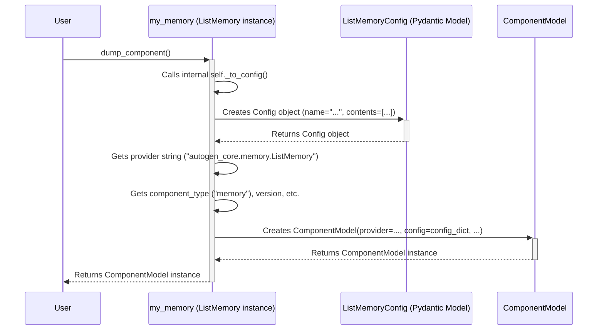
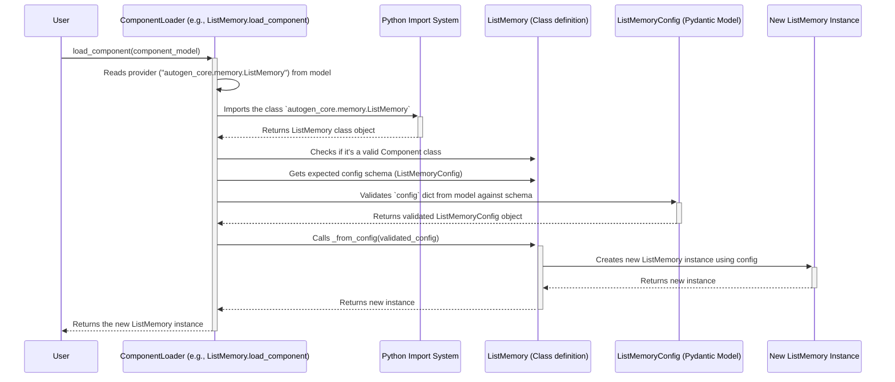

# Chapter 8: Component - The Standardized Building Blocks

Welcome to Chapter 8! In our journey so far, we've met several key players in AutoGen Core:
*   [Agents](01_agent.md): The workers.
*   [Messaging System](02_messaging_system__topic___subscription_.md): How they communicate.
*   [AgentRuntime](03_agentruntime.md): The manager.
*   [Tools](04_tool.md): Their special skills.
*   [ChatCompletionClient](05_chatcompletionclient.md): How they talk to LLMs.
*   [ChatCompletionContext](06_chatcompletioncontext.md): How they remember recent chat history.
*   [Memory](07_memory.md): How they remember things long-term.

Now, imagine you've built a fantastic agent system using these parts. You've configured a specific `ChatCompletionClient` to use OpenAI's `gpt-4o` model, and you've set up a `ListMemory` (from Chapter 7) to store user preferences. How do you save this exact setup so you can easily recreate it later, or share it with a friend? And what if you later want to swap out the `gpt-4o` client for a different one, like Anthropic's Claude, without rewriting your agent's core logic?

This is where the **`Component`** concept comes in. It provides a standard way to define, configure, save, and load these reusable building blocks.

## Motivation: Making Setups Portable and Swappable

Think of the parts we've used so far – `ChatCompletionClient`, `Memory`, `Tool` – like specialized **Lego bricks**. Each brick has a specific function (connecting to an LLM, remembering things, performing an action).

Wouldn't it be great if:
1.  Each Lego brick had a standard way to describe its properties (like "Red 2x4 Brick")?
2.  You could easily save the description of all the bricks used in your creation (your agent system)?
3.  Someone else could take that description and automatically rebuild your exact creation?
4.  You could easily swap a "Red 2x4 Brick" for a "Blue 2x4 Brick" without having to rebuild everything around it?

The `Component` abstraction in AutoGen Core provides exactly this! It makes your building blocks **configurable**, **savable**, **loadable**, and **swappable**.

## Key Concepts: Understanding Components

Let's break down what makes the Component system work:

1.  **Component:** A class (like `ListMemory` or `OpenAIChatCompletionClient`) that is designed to be a standard, reusable building block. It performs a specific role within the AutoGen ecosystem. Many core classes inherit from `Component` or related base classes.

2.  **Configuration (`Config`):** Every Component has specific settings. For example, an `OpenAIChatCompletionClient` needs an API key and a model name. A `ListMemory` might have a name. These settings are defined in a standard way, usually using a Pydantic `BaseModel` specific to that component type. This `Config` acts like the "specification sheet" for the component instance.

3.  **Saving Settings (`_to_config` method):** A Component instance knows how to generate its *current* configuration. It has an internal method, `_to_config()`, that returns a `Config` object representing its settings. This is like asking a configured Lego brick, "What color and size are you?"

4.  **Loading Settings (`_from_config` class method):** A Component *class* knows how to create a *new* instance of itself from a given configuration. It has a class method, `_from_config(config)`, that takes a `Config` object and builds a new, configured component instance. This is like having instructions: "Build a brick with this color and size."

5.  **`ComponentModel` (The Box):** This is the standard package format used to save and load components. It's like the label and instructions on the Lego box. A `ComponentModel` contains:
    *   `provider`: A string telling AutoGen *which* Python class to use (e.g., `"autogen_core.memory.ListMemory"`).
    *   `config`: A dictionary holding the specific settings for this instance (the output of `_to_config()`).
    *   `component_type`: The general role of the component (e.g., `"memory"`, `"model"`, `"tool"`).
    *   Other metadata like `version`, `description`, `label`.

    ```python
    # From: _component_config.py (Conceptual Structure)
    from pydantic import BaseModel
    from typing import Dict, Any

    class ComponentModel(BaseModel):
        provider: str # Path to the class (e.g., "autogen_core.memory.ListMemory")
        config: Dict[str, Any] # The specific settings for this instance
        component_type: str | None = None # Role (e.g., "memory")
        # ... other fields like version, description, label ...
    ```
    This `ComponentModel` is what you typically save to a file (often as JSON or YAML).

## Use Case Example: Saving and Loading `ListMemory`

Let's see how this works with the `ListMemory` we used in [Chapter 7: Memory](07_memory.md).

**Goal:**
1. Create a `ListMemory` instance.
2. Save its configuration using the Component system (`dump_component`).
3. Load that configuration to create a *new*, identical `ListMemory` instance (`load_component`).

**Step 1: Create and Configure a `ListMemory`**

First, let's make a memory component. `ListMemory` is already designed as a Component.

```python
# File: create_memory_component.py
import asyncio
from autogen_core.memory import ListMemory, MemoryContent

# Create an instance of ListMemory
my_memory = ListMemory(name="user_prefs_v1")

# Add some content (from Chapter 7 example)
async def add_content():
    pref = MemoryContent(content="Use formal style", mime_type="text/plain")
    await my_memory.add(pref)
    print(f"Created memory '{my_memory.name}' with content: {my_memory.content}")

asyncio.run(add_content())
# Output: Created memory 'user_prefs_v1' with content: [MemoryContent(content='Use formal style', mime_type='text/plain', metadata=None)]
```
We have our configured `my_memory` instance.

**Step 2: Save the Configuration (`dump_component`)**

Now, let's ask this component instance to describe itself by creating a `ComponentModel`.

```python
# File: save_memory_config.py
# Assume 'my_memory' exists from the previous step

# Dump the component's configuration into a ComponentModel
memory_model = my_memory.dump_component()

# Let's print it (converting to dict for readability)
print("Saved ComponentModel:")
print(memory_model.model_dump_json(indent=2))
```

**Expected Output:**
```json
Saved ComponentModel:
{
  "provider": "autogen_core.memory.ListMemory",
  "component_type": "memory",
  "version": 1,
  "component_version": 1,
  "description": "ListMemory stores memory content in a simple list.",
  "label": "ListMemory",
  "config": {
    "name": "user_prefs_v1",
    "memory_contents": [
      {
        "content": "Use formal style",
        "mime_type": "text/plain",
        "metadata": null
      }
    ]
  }
}
```
Look at the output! `dump_component` created a `ComponentModel` that contains:
*   `provider`: Exactly which class to use (`autogen_core.memory.ListMemory`).
*   `config`: The specific settings, including the `name` and even the `memory_contents` we added!
*   `component_type`: Its role is `"memory"`.
*   Other useful info like description and version.

You could save this JSON structure to a file (`my_memory_config.json`).

**Step 3: Load the Configuration (`load_component`)**

Now, imagine you're starting a new script or sharing the config file. You can load this `ComponentModel` to recreate the memory instance.

```python
# File: load_memory_config.py
from autogen_core import ComponentModel
from autogen_core.memory import ListMemory # Need the class for type hint/loading

# Assume 'memory_model' is the ComponentModel we just created
# (or loaded from a file)

print(f"Loading component from ComponentModel (Provider: {memory_model.provider})...")

# Use the ComponentLoader mechanism (available on Component classes)
# to load the model. We specify the expected type (ListMemory).
loaded_memory: ListMemory = ListMemory.load_component(memory_model)

print(f"Successfully loaded memory!")
print(f"- Name: {loaded_memory.name}")
print(f"- Content: {loaded_memory.content}")
```

**Expected Output:**
```
Loading component from ComponentModel (Provider: autogen_core.memory.ListMemory)...
Successfully loaded memory!
- Name: user_prefs_v1
- Content: [MemoryContent(content='Use formal style', mime_type='text/plain', metadata=None)]
```
Success! `load_component` read the `ComponentModel`, found the right class (`ListMemory`), used its `_from_config` method with the saved `config` data, and created a brand new `loaded_memory` instance that is identical to our original `my_memory`.

**Benefits Shown:**
*   **Reproducibility:** We saved the exact state (including content!) and loaded it perfectly.
*   **Configuration:** We could easily save this to a JSON/YAML file and manage it outside our Python code.
*   **Modularity (Conceptual):** If `ListMemory` and `VectorDBMemory` were both Components of type "memory", we could potentially load either one from a configuration file just by changing the `provider` and `config` in the file, without altering the agent code that *uses* the memory component (assuming the agent interacts via the standard `Memory` interface from Chapter 7).

## Under the Hood: How Saving and Loading Work

Let's peek behind the curtain.

**Saving (`dump_component`) Flow:**



1.  You call `my_memory.dump_component()`.
2.  It calls its own `_to_config()` method. For `ListMemory`, this gathers the `name` and current `_contents`.
3.  `_to_config()` returns a `ListMemoryConfig` object (a Pydantic model) holding these values.
4.  `dump_component()` takes this `ListMemoryConfig` object, converts its data into a dictionary (`config` field).
5.  It figures out its own class path (`provider`) and other metadata (`component_type`, `version`, etc.).
6.  It packages all this into a `ComponentModel` object and returns it.

**Loading (`load_component`) Flow:**



1.  You call `ListMemory.load_component(memory_model)`.
2.  The loader reads the `provider` string from `memory_model`.
3.  It dynamically imports the class specified by `provider`.
4.  It verifies this class is a proper `Component` subclass.
5.  It finds the configuration schema defined by the class (e.g., `ListMemoryConfig`).
6.  It validates the `config` dictionary from `memory_model` using this schema.
7.  It calls the class's `_from_config()` method, passing the validated configuration object.
8.  `_from_config()` uses the configuration data to initialize and return a new instance of the class (e.g., a new `ListMemory` with the loaded name and content).
9.  The loader returns this newly created instance.

**Code Glimpse:**

The core logic lives in `_component_config.py`.

*   **`Component` Base Class:** Classes like `ListMemory` inherit from `Component`. This requires them to define `component_type`, `component_config_schema`, and implement `_to_config()` and `_from_config()`.

    ```python
    # From: _component_config.py (Simplified Concept)
    from pydantic import BaseModel
    from typing import Type, TypeVar, Generic, ClassVar
    # ... other imports

    ConfigT = TypeVar("ConfigT", bound=BaseModel)

    class Component(Generic[ConfigT]): # Generic over its config type
        # Required Class Variables for Concrete Components
        component_type: ClassVar[str]
        component_config_schema: Type[ConfigT]

        # Required Instance Method for Saving
        def _to_config(self) -> ConfigT:
            raise NotImplementedError

        # Required Class Method for Loading
        @classmethod
        def _from_config(cls, config: ConfigT) -> Self:
             raise NotImplementedError

        # dump_component and load_component are also part of the system
        # (often inherited from base classes like ComponentBase)
        def dump_component(self) -> ComponentModel: ...
        @classmethod
        def load_component(cls, model: ComponentModel | Dict[str, Any]) -> Self: ...
    ```

*   **`ComponentModel`:** As shown before, a Pydantic model to hold the `provider`, `config`, `type`, etc.

*   **`dump_component` Implementation (Conceptual):**
    ```python
    # Inside ComponentBase or similar
    def dump_component(self) -> ComponentModel:
        # 1. Get the specific config from the instance
        obj_config: BaseModel = self._to_config()
        config_dict = obj_config.model_dump() # Convert to dictionary

        # 2. Determine the provider string (class path)
        provider_str = _type_to_provider_str(self.__class__)
        # (Handle overrides like self.component_provider_override)

        # 3. Get other metadata
        comp_type = self.component_type
        comp_version = self.component_version
        # ... description, label ...

        # 4. Create and return the ComponentModel
        model = ComponentModel(
            provider=provider_str,
            config=config_dict,
            component_type=comp_type,
            version=comp_version,
            # ... other metadata ...
        )
        return model
    ```

*   **`load_component` Implementation (Conceptual):**
    ```python
    # Inside ComponentLoader or similar
    @classmethod
    def load_component(cls, model: ComponentModel | Dict[str, Any]) -> Self:
        # 1. Ensure we have a ComponentModel object
        if isinstance(model, dict):
            loaded_model = ComponentModel(**model)
        else:
            loaded_model = model

        # 2. Import the class based on the provider string
        provider_str = loaded_model.provider
        # ... (handle WELL_KNOWN_PROVIDERS mapping) ...
        module_path, class_name = provider_str.rsplit(".", 1)
        module = importlib.import_module(module_path)
        component_class = getattr(module, class_name)

        # 3. Validate the class and config
        if not is_component_class(component_class): # Check it's a valid Component
            raise TypeError(...)
        schema = component_class.component_config_schema
        validated_config = schema.model_validate(loaded_model.config)

        # 4. Call the class's factory method to create instance
        instance = component_class._from_config(validated_config)

        # 5. Return the instance (after type checks)
        return instance
    ```

This system provides a powerful and consistent way to manage the building blocks of your AutoGen applications.

## Wrapping Up

Congratulations! You've reached the end of our core concepts tour. You now understand the `Component` model – AutoGen Core's standard way to define configurable, savable, and loadable building blocks like `Memory`, `ChatCompletionClient`, `Tool`, and even aspects of `Agents` themselves.

*   **Components** are like standardized Lego bricks.
*   They use **`_to_config`** to describe their settings.
*   They use **`_from_config`** to be built from settings.
*   **`ComponentModel`** is the standard "box" storing the provider and config, enabling saving/loading (often via JSON/YAML).

This promotes:
*   **Modularity:** Easily swap implementations (e.g., different LLM clients).
*   **Reproducibility:** Save and load exact agent system configurations.
*   **Configuration:** Manage settings in external files.

With these eight core concepts (`Agent`, `Messaging`, `AgentRuntime`, `Tool`, `ChatCompletionClient`, `ChatCompletionContext`, `Memory`, and `Component`), you have a solid foundation for understanding and building powerful multi-agent applications with AutoGen Core!

Happy building!

---

Generated by [AI Codebase Knowledge Builder](https://github.com/The-Pocket/Tutorial-Codebase-Knowledge)