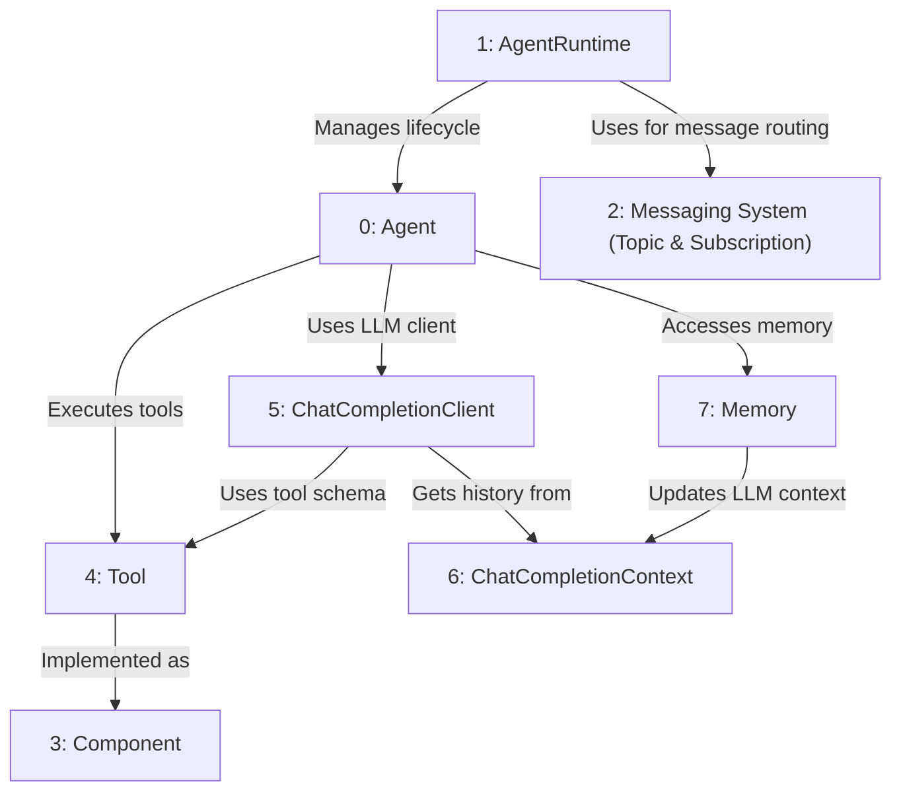

# Tutorial: AutoGen Core 

> This tutorial is AI-generated! To learn more, check out [AI Codebase Knowledge Builder](https://github.com/The-Pocket/Tutorial-Codebase-Knowledge)

AutoGen Core[View Repo](https://github.com/microsoft/autogen/tree/e45a15766746d95f8cfaaa705b0371267bec812e/python/packages/autogen-core/src/autogen_core) helps you build applications with multiple **_Agents_** that can work together.
Think of it like creating a team of specialized workers (*Agents*) who can communicate and use tools to solve problems.
The **_AgentRuntime_** acts as the manager, handling messages and agent lifecycles.
Agents communicate using a **_Messaging System_** (Topics and Subscriptions), can use **_Tools_** for specific tasks, interact with language models via a **_ChatCompletionClient_** while managing conversation history with **_ChatCompletionContext_**, and remember information using **_Memory_**.
**_Components_** provide a standard way to define and configure these building blocks.

